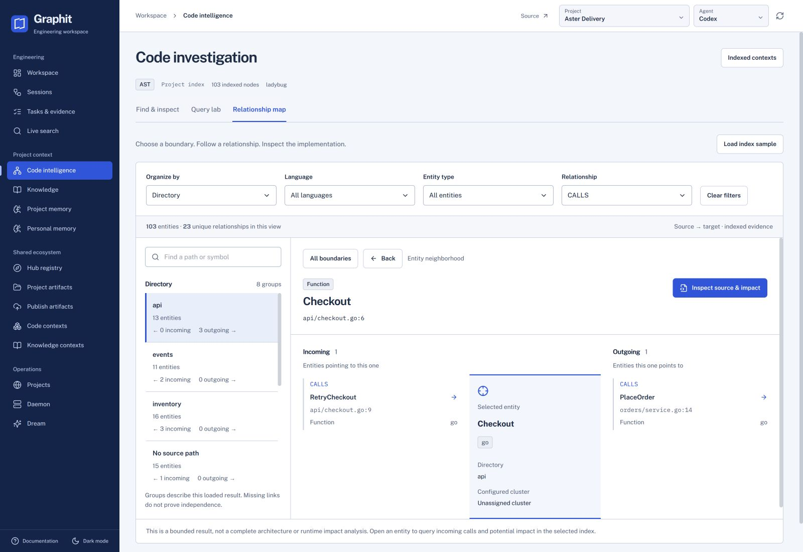
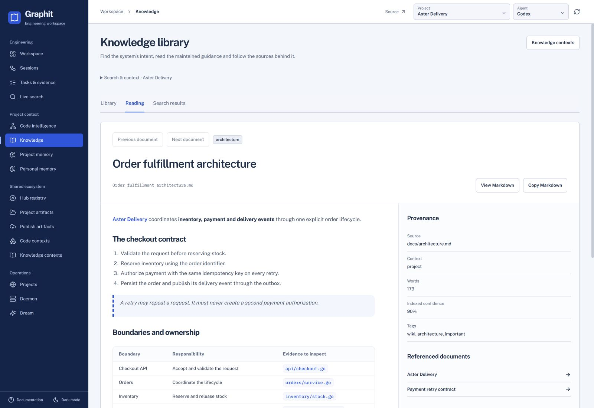
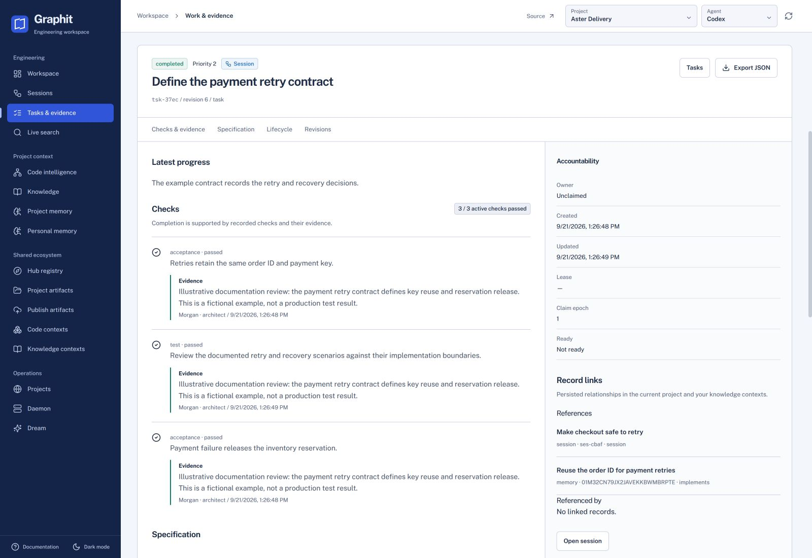

<p align="center">
  
</p>

<h1 align="center">Graphit Code</h1>

<p align="center"><strong>The context and control plane for AI software engineering.</strong></p>

<p align="center">
  <a href="https://github.com/graphit-labs/graphit-code/releases/latest"></a>
  <a href="https://github.com/graphit-labs/graphit-code/actions"></a>
  <a href="LICENSE"></a>
  <a href="https://github.com/sponsors/lainosantos"></a>
</p>

<p align="center">
  <a href="https://graphit-labs.github.io/graphit-code">Website</a> ·
  <a href="#install">Install</a> ·
  <a href="#first-run">First run</a> ·
  <a href="docs/guides/configuration.md">Configure</a> ·
  <a href="docs/README.md">Documentation</a> ·
  <a href="CONTRIBUTING.md">Contributing</a>
</p>



*From a code boundary to a directed relationship and its indexed source. Aster Delivery is a fictional demonstration project.*

## AI agents need more than a prompt

Models are probabilistic. Engineering needs explicit state, evidence and continuity.

Coding agents usually enter a repository with four blind spots:

- source text does not tell them the exact structural relationships in the code;
- a new session does not remember yesterday's correction or architectural decision;
- concurrent agents can duplicate work, overwrite ownership, or stop without a resumable checkpoint;
- documentation, sibling projects, and reusable agent tooling live in disconnected places.

Graphit closes those gaps with one local-first system that works across agents, IDEs, repositories,
machines, and model providers:

| Signal | What Graphit provides | What the agent can do |
|---|---|---|
| **AST** | Language-aware entities, source, and exact graph relationships | Find candidates with FTS + vectors, then prove callers, imports, inheritance, dependencies, and impact with Cypher |
| **Knowledge** | A compiled wiki built from maintained project documentation | Search pages, read only the relevant source, follow cross-references, and verify provenance |
| **Memory** | Durable project and user scopes with revision history | Carry corrections, conventions, decisions, and learned procedures across sessions and repositories |
| **Task** | A shared LanceDB scheduler with fenced claims, dependencies, checks, comments, immutable audit history, and complete JSON export | Coordinate parallel agents, make takeover safe, inspect work in the Task Explorer, and make incomplete work impossible to close |
| **Hub** | A versioned registry for reusable agent capabilities and contexts | Share rules, skills, agents, commands, MCP servers, languages, ASTs, and knowledge across systems |
| **Observatory** | One operational workspace over the same stores agents use | Explore code, docs, memory, live runs, daemon state, Dream, and ecosystem projects without a second data model |

Graphit does not make a language model deterministic. It adds reproducible queries, explicit
ownership, durable state and deterministic lifecycle gates around whichever coding agent you choose.

Graphit's goal is software engineering, not optimizing token counts. Preserve the system knowledge
you have already paid AI to acquire: record decisions, maintain source-backed documentation and carry
verified work forward. Individuals, teams and enterprises can build progressively on that foundation
instead of reconstructing it in every session.

## Built for teams, agents, and software ecosystems

- **One project, many agents.** Atomic claims and fencing tokens prevent stale writers; checkpoints,
  typed decisions, and `next_step` let another agent resume without reconstructing the work.
- **One engineer, many systems.** Project memory stays repository-specific while user memory follows
  personal conventions across projects. Registered sibling projects retain independent stores.
- **One team, many machines.** S3-backed providers share versioned Hub artifacts and authoritative
  Memory/Task LanceDB tables. S3-enabled Broker providers receive restricted in-memory temporary
  credentials per project/user/Hub scope and physical module while
  deny-by-default ACLs and IAM policy govern the remote prefixes.
- **One framework, many assistants.** Native adapters support Codex, Claude Code, Cursor, Gemini CLI,
  Kiro, OpenCode, Antigravity, Qwen Code, and Kimi Code; any MCP client can use the server endpoint.
- **One query, several retrieval modes.** BM25 full-text search, semantic vectors, hybrid reciprocal
  rank fusion, exact graph traversal, and source slicing serve different evidence needs.

## The Graphit Observatory

The web UI is an operational view over the same project context exposed to agents. On a local
desktop with a supported system tray, choose **Open UI** from the Graphit icon to open the
daemon's UI in your browser.

### Retain intent with its sources



Read maintained guidance beside its provenance and linked documents. The example describes Aster
Delivery's checkout boundaries and payment retry contract.

### Review the contract and the evidence



Inspect checks, evidence, specification, lifecycle and persisted record relationships. The displayed
review evidence is illustrative; it does not represent a production test run.

All screenshots use an isolated, fictional English project. No customer or maintainer workspace is
shown. See the [code investigation guide](docs/guides/code_investigation.md) and
[screenshot maintenance guide](docs/guides/product_screenshots.md).

## Install

Prebuilt releases support Linux, macOS, and Windows.

### Linux or macOS

```bash
curl -fsSL https://raw.githubusercontent.com/graphit-labs/graphit-code/main/install.sh | sh
```

### Windows PowerShell

```powershell
irm https://raw.githubusercontent.com/graphit-labs/graphit-code/main/install.ps1 | iex
```

The installers detect the platform, download the latest archive, verify its SHA-256 checksum, and install the launcher in a user directory. On the next invocation, the launcher extracts a changed Core, the daemon replaces itself, and the stdio MCP proxy asks connected clients to refresh their tool catalog through the protocol's list-change notification. Pin a release with `--version <tag>`. See the [getting started guide](docs/guides/getting_started.md) for manual downloads, custom paths, and source builds.

## First run

For the usual local workflow, run Graphit from the repository it should understand:

```bash
cd your-project
graphit setup
graphit init --agent codex
graphit sync
graphit ui
```

`graphit setup` prepares installation/runtime defaults and persists a real provider named `local`
with local embedding/rerank and ONNX `cpu`/`0`. It does not create a profile. With no active
profile, AI resolution uses that provider, recreating it if it was removed, while identity remains
anonymous and remote Hub remains unavailable. `init`, AST, Knowledge, Memory, and Task still work.
Inspect the default provider and log in only when a named identity is needed:

```bash
graphit provider show local
graphit login --profile personal --provider local --username "$USER"
```

Where a system tray is available, the Graphit icon shows the active login provider and profile.
If you configured a Broker provider and are signed out, choose **Sign in with Broker** from its
menu to open the browser login flow. The same menu offers **Open UI**, **Start daemon**,
**Restart daemon**, and **Quit**. On Linux, the icon requires StatusNotifier/AppIndicator support
from the desktop; the daemon still runs when the icon is unavailable.

Use `graphit provider update local` to select CPU, CUDA, CoreML, or remote AI services. Local models
download lazily on first use.

`graphit init`
ensures the project identity, preserving an ULID already created by an earlier stateful operation,
installs the selected agent's native MCP/hooks, and performs the first synchronization. `graphit sync`
is the explicit all-system checkpoint; the daemon keeps incremental indexes current afterwards.

Use the exact agent identifier supported by your environment; `graphit init --help` lists the available values.
Eligible local commands start the daemon through the current user's OS service. On Linux without
`systemd --user`, they start it directly instead; that fallback has no automatic crash restart or
login startup. See [daemon operations](docs/guides/daemon_operations.md) for service, login startup,
tray controls, and fallback behavior.

## Optional deployment: server for teams and enterprise

The local workflow above does not require a server deployment. When external agents (including
web-based agents) need to connect over MCP, you can run Graphit as a shared service instead.
Release tags publish a Linux amd64 server image to GHCR. A Git release `v0.1.2` publishes the Docker
tags `0.1.2`, `0.1`, `0`, and `latest`—Docker tags do not include the `v` prefix. The image runs the
daemon as PID 1 and publishes an **MCP endpoint** and the optional UI.

Any MCP-capable AI agent can connect to it — Claude Code, Codex, Gemini, Cursor, OpenCode, Copilot,
Kiro, Qwen Code, Kimi Code, or your own client. The agent runs wherever the developer is
and brings its own model; the server supplies published code graphs, documentation wikis, and memory
it reasons over. One container can serve a team without requiring each remote client to index
anything locally.

```bash
VERSION=0.1.1
docker pull "ghcr.io/graphit-labs/graphit-code:${VERSION}"

docker run -d --name graphit \
  -p 127.0.0.1:8080:8080 \
  -p 127.0.0.1:8081:8081 \
  -v graphit-global:/home/graphit/.graphit \
  "ghcr.io/graphit-labs/graphit-code:${VERSION}"
```

To build the image locally, first run `make build-linux VERSION=dev`, then
`docker build -t graphit-code:dev .`; the Dockerfile copies that CI-compatible binary and performs
no release download.

On the first container start, the entrypoint runs setup in non-interactive mode in the mounted
global directory before starting the daemon. Later starts reuse `config.json` from the volume.
The image uses fixed internal ports `8080` for the UI and `8081` for MCP. To publish a different
port, change only the host side of the mapping, for example `-p 127.0.0.1:9090:8080`; no Graphit
port setting is required. The entrypoint keeps those internal listener ports fixed, including when
same-named environment variables are supplied. Other runtime defaults, including
`GRAPHIT_HUB_EVENTS_ANONYMIZE`, can be
overridden with `docker run -e ...` without rebuilding the image. Any other supported Graphit
configuration key can be passed by its canonical `GRAPHIT_*` name even when the Dockerfile does not
declare it; the declarations in the image provide defaults, not an allowlist. The image declares
the fixed non-root user `graphit` (UID/GID `10001`), including
for the entrypoint, setup, daemon, and explicit commands. A bind mount or custom global directory
must therefore already be writable by UID/GID `10001`; the container does not elevate privileges
to repair ownership. First-start setup uses the canonical configuration
environment variables `GRAPHIT_AGENT`, `GRAPHIT_CLI`, and `GRAPHIT_HUB_EVENTS_ANONYMIZE`; empty
Agent/CLI values keep the documented defaults.

The published base image intentionally installs no coding-agent CLI and sets
`GRAPHIT_MODULES_AGENT=false`. A derived image may install and authenticate a supported CLI in
`PATH`, then set `GRAPHIT_MODULES_AGENT=true`, `GRAPHIT_AGENT`, and `GRAPHIT_CLI` either in the
image or at runtime. These are normal configuration overrides, not Docker-only settings. See the
[container guide](docs/guides/container.md#extend-the-image-with-an-agent-cli) for an example.

Point a client at `http://your-server:8081/mcp` with `Authorization: Bearer <key>`. In the UI, open **System → Daemon** to copy the full active key from **MCP bearer key** and confirm the endpoint. The server holds no source checkouts and needs none—it answers about Hub artifacts addressed reproducibly as `id@version`.

Remote agents can load the server's current routing contract with `graphit_mandates` and fetch the
complete source of any core module skill with `graphit_module_skill`. Start from the copy-ready
[remote agent skill](docs/examples/skills/graphit-remote/SKILL.md).

For a broader enterprise or team ecosystem, the optional, separately deployed
[Graphit Broker](https://github.com/graphit-labs/graphit-broker) complements the MCP server with
centralized identity, access control, shared storage, and embedding/rerank services. It is not
required for the local workflow or for a basic MCP server.

The MCP endpoint accepts the fresh runtime key shown in **System → Daemon**. A local provider may
also define a static MCP key. With a direct OIDC or Broker-managed provider, each remote caller
sends its own access token; Graphit verifies its JWT signature, issuer, audience, expiry, client,
scope, and identity claims through the configured or Broker-discovered JWKS and
preserves that identity through broker Hub ACL, S3, embedding and rerank calls. Direct OIDC may use
bearer relay or explicit RFC 8693 exchange; Broker-managed login uses the Broker-issued token.
`graphit mcp --stdio` always bridges to this daemon listener and resolves the active profile before
each HTTP request, so OIDC/Broker token refresh is picked up automatically; without such a session,
it uses the local profile key or current daemon runtime key.
For a `broker` provider, Graphit is always a standard native OIDC client: the Broker owns the login
page and may offer local password/MFA, upstream OIDC, or both without exposing those credentials or
upstream tokens to Graphit.
Provider/profile secrets live in the
mode-`0600` global authentication store, while the generated runtime key remains in its restricted
runtime file. The UI has no built-in authentication, and CORS is not authorization,
so keep both ports on a trusted
network or put an authenticated proxy in front. Read
[Running Graphit Code as a server in a container](docs/guides/container.md) before exposing them.

## What agents gain

### Find broadly, then prove structurally

Graphit indexes declarations and relationships from Tree-sitter and ANTLR grammars into an
Icebug/LadybugDB graph. A separate Lance sidecar combines BM25 full-text and semantic vector results
with reciprocal rank fusion. Agents use ranked search to find the likely entity, exact Cypher to
establish relationships, and a source call to read only the relevant lines.

```cypher
MATCH (caller)-[:CALLS]->(target:Function {name: 'RunSync'})
RETURN caller.name, caller.path
```

The graph opens on the fly from Icebug files into an in-memory catalog, so published contexts remain
portable without running a separate graph server. Optional local, direct, or broker-based
second-stage reranking is active in AST and Knowledge searches when `search.rerank=true`. See the
[AI Engine specification](docs/specs/ai_engine.md).

### AST language support

The AST ships **45 profiles covering 44 language and format entries**, plus embedded PL/pgSQL. The default discovery profiles cover:

| Area | Languages and formats |
| --- | --- |
| Application and systems code | C, C++, C#, Clojure, Dart, Elixir, Go, Groovy, Haskell, Java, Julia, Kotlin, Lua, Objective-C, PHP, Python, R, Ruby, Rust, Scala, Swift, Zig |
| Web | JavaScript (including JSX), TypeScript, TSX, HTML, CSS, Svelte, Vue |
| Data, interfaces and configuration | SQL, GraphQL, Protocol Buffers, JSON, XML, YAML, TOML, HCL, Dockerfile, Bash |
| Legacy systems | COBOL 85 |

**Explicit SQL dialects:** Oracle PL/SQL, PostgreSQL, DB2 and T-SQL use ANTLR profiles selected through `ast.grammar`; `.sql` otherwise uses Tree-sitter SQL. HTML, Vue and Svelte can also index supported embedded script/style languages. PostgreSQL supports embedded PL/pgSQL bodies.

Support is profile-specific: entities, relationships and resolution depth differ by language. Registered extensions are routing rules, not a promise to support every dialect or variant. See the [complete language and extension matrix](docs/specs/ast_module.md#supported-languages), [embedded parsing](docs/specs/embedded_language_parsing.md) and [grammar configuration and extensibility](docs/guides/ast_extensibility.md). Markdown documentation is handled by Knowledge rather than the default AST profiles.

### Source-backed knowledge

The knowledge module compiles `docs/` and the root README into a searchable wiki. Pages retain their source, confidence, links, and update history; agents read the selected page after search instead of treating a ranked title as the answer.

### Memory that survives the session

Project memory captures repository-specific decisions and corrections. User memory captures portable personal conventions. Both are stored outside the checkout and exposed through the same search-and-read workflow.

### Deterministic control that survives the agent

Graphit Task replaces host-native TODO lists and repository Markdown task logs with one local project task database. Agents search prior work, atomically claim a ready task, checkpoint progress and decisions, revise scope through expected-revision fencing, supersede obsolete checks without erasing history, verify active acceptance/test checks with evidence, and release or complete through fenced transitions. Dependencies and nested subtasks gate readiness and completion; flags carry a reason and block completion until resolved. Task IDs are compact hashes that lengthen only on a detected collision, while conditional writes prevent one task from overwriting another. Direction changes deterministically cancel useful history or remove certainly erroneous, unreferenced tasks so no obsolete work is left open. The Observatory discovers work through a lightweight paginated catalogue and loads the same versioned complete JSON export as CLI and MCP only for exact detail or an explicit project download.

### Reusable context across systems

Registered sibling projects keep their own AST, wiki, and memory. Hub artifacts package reusable capabilities when a project or team intentionally publishes them. An optional broker exposes shared catalogs and published contexts through short-lived per-operation URLs; everyday local operation does not require a hosted database.

### Ephemeral synthesis across several sources

Live Search prepares a throwaway project from selected Hub artifacts, installs the requested agent
environment, streams a bounded agent session, and removes the project data when the session is
deleted. It is the on-the-fly path for questions that genuinely span several codebases or knowledge
bundles; direct AST, Wiki, Memory, and Task tools remain the cheaper path for focused questions.

## Configure the operating model

| Goal | Setting |
|---|---|
| Keep everything local | configure no broker and use local embedding/rerank modes |
| Share Hub artifacts | configure S3 on a local provider, configure STS on a direct OIDC provider, or use a Broker provider that advertises `graphit-s3-credentials-v3` |
| Use enterprise SSO | configure an OIDC provider with claim mappings, an MCP audience, and either shared-audience broker relay or RFC 8693 exchange |
| Run without an installed coding-agent CLI | `modules.agent=false` |
| Keep autonomous Dream work off/on | `modules.dream=false` (default) or `true` |
| Serve the Observatory from the daemon | `modules.daemon_ui=true` |
| Disable the daemon filesystem watcher | `modules.sync=false` (manual `graphit sync` still works) |
| Disable background embedding work | `modules.embedding=false` |
| Select a remote embedding backend | use a brokerless provider with `--embedding-mode direct`, or configure a broker with both embedding and rerank modes set to `broker`; then supply account secrets through `graphit login` |
| Select a remote rerank backend | use native Cohere/Voyage/Jina or embedding-simulated OpenAI/OpenAI-compatible/Google with `--rerank-mode direct`; simulated modes also require `--rerank-dimensions` |
| Restrict indexed languages | `ast.grammars_whitelist` / `ast.grammars_blacklist` |
| Move or narrow the documentation tree | `knowledge.docs_dir`, `knowledge.extensions`, `knowledge.include_readme` |

Every normal key can be set per command, environment, project, global installation, or private-build
default. The [complete configuration reference](docs/guides/configuration.md) documents every key,
default, switch, provider, network boundary, and runtime resource control.

## Security boundary

- Mutable project sources and compiled local stores remain on the machine by default.
- Hub publication is optional. When enabled, Graphit mounts S3 directly. Local providers use the
  configured AWS identity; direct OIDC and Broker providers receive short-lived, scope-specific STS
  credentials only in process memory when storage is configured or the Broker advertises
  storage. Without that capability, the authenticated Broker profile uses local storage.
- S3 is authoritative for Hub artifact data; broker SQL or standalone `projects.json` is selected
  as the provider's one ACL authority. `~/.<brand>/hub` is only a bounded, subject-isolated metadata
  cache; it never grants access or replaces remote validation.
- A project name is mutable discovery metadata. Its immutable ULID owns remote paths, locks, and exact grants.
- The UI binds according to `ui.host` and has no built-in authentication layer.
- Remote UI access requires an appropriate firewall, VPN, or authenticated reverse proxy; CORS is not authorization.
- Local work uses its active profile. HTTP MCP verifies each caller's OIDC token and carries that
  request identity to the broker by relay or RFC 8693 exchange; local providers may use a static
  broker key. The Broker maps its current ACL to a short-lived STS session policy; S3 bucket/IAM
  policy remains the final data-plane boundary and object bodies travel directly between Graphit and S3.

See [S3 STS storage and UI network configuration](docs/guides/s3-and-ui-network.md) before exposing the UI or configuring shared storage.
The normative contracts are [Project identity](docs/specs/project_identity.md),
[Hub access control](docs/specs/hub_access_control.md), and
[Hub S3 object layout](docs/specs/hub-s3-object-layout.md).

## Documentation

Start with the document that matches your intent:

- [Getting started](docs/guides/getting_started.md) — install and initialize a project.
- [OIDC integration](docs/guides/oidc-integration.md) — register native consumer and confidential broker-admin clients, map claims, propagate HTTP MCP identity, configure web-identity STS, and troubleshoot Keycloak, Entra ID, or Auth0.
- [Graphit Broker](docs/guides/auth-broker.md) — operate the SQL/OIDC/RBAC control plane, centralize transactional consumer ACLs, issue restricted STS sessions, and own embedding/rerank credentials, routes and caches.
- [User manual](docs/guides/user_manual.md) — daily workflows and operational concepts.
- [Configuration reference](docs/guides/configuration.md) — every setting, default, feature switch, provider, and environment override.
- [AI models, providers, and agent CLIs](docs/guides/ai_models.md) — completion delegation, every CLI protocol, embedding models, credentials, dimensions, rerank, and local/remote boundaries.
- [Daemon operations and monitoring](docs/guides/daemon_operations.md) — user service, Linux fallback, system tray, watched signals, MCP, logs, parking, and recovery.
- [Capability and surface matrix](docs/guides/capability_matrix.md) — every module, CLI/MCP/UI exposure, gate, and current limitation.
- [Filesystem, state, and watchers](docs/guides/filesystem_contract.md) — special files, generated state, adapter layouts, and change detection.
- [AST grammars and parser extensibility](docs/guides/ast_extensibility.md) — every YAML field, selector, parser extension path, precedence rule, and validation workflow.
- [CLI reference](docs/guides/cli_reference.md) — commands and flags.
- [MCP tools reference](docs/guides/mcp_tools_reference.md) — agent-facing tool contracts.
- [Architecture overview](docs/architecture/architecture_overview.md) — system boundaries and data flow.
- [Storage layout](docs/architecture/storage_layout.md) — what lives in a project and what lives globally.
- [Task module](docs/specs/task_module.md) — shared lifecycle, ordered batches, durable claims, checks, hooks, and takeover guarantees.
- [UI specification](docs/specs/ui_dashboard.md) — Observatory behavior and backend contract.
- [Design system](docs/specs/design_system.md) — shared principles, tokens, interaction patterns and evolution rules for Code, Broker and the site.
- [Documentation hub](docs/README.md) — the complete maintained documentation map.

Task history lives in the authoritative LanceDB tables; changelogs and accepted decisions remain documentation evidence. The documentation hub separates historical records from current operational guidance.

## Build from source

Source builds require Go 1.26.6+, Node.js 22+, Make, and a C/C++ toolchain. The normal build downloads an immutable, checksum-verified native dependency bundle from [`graphit-labs/graphit-libs`](https://github.com/graphit-labs/graphit-libs). That companion repository owns the LanceDB patch and its explicit Rust source-build target.

```bash
git clone https://github.com/graphit-labs/graphit-code.git
cd graphit-code
make install
graphit setup
```

Platform-specific targets and development checks are documented in [Getting Started](docs/guides/getting_started.md) and [Contributing](https://github.com/graphit-labs/graphit-code/blob/main/CONTRIBUTING.md).

## Project status

Graphit Code is under active development. Interfaces, storage formats, and supported integrations may evolve between releases. Prefer the documentation on the same branch or release as the binary you are using.

## License

Licensed under the [MIT License](https://github.com/graphit-labs/graphit-code/blob/main/LICENSE).

If Graphit improves your agent workflow, consider [sponsoring its development](https://github.com/sponsors/lainosantos).
