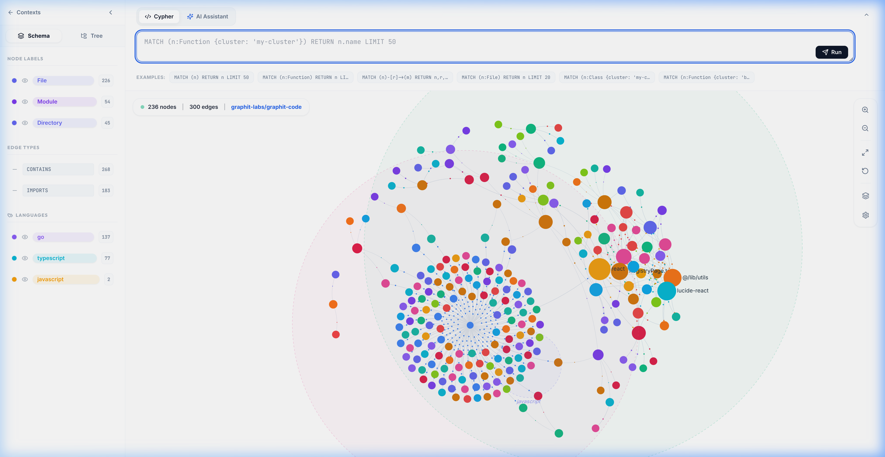
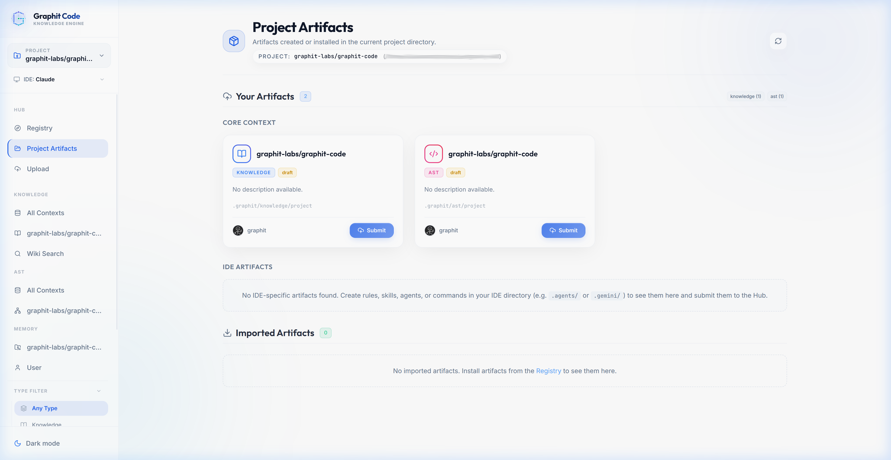
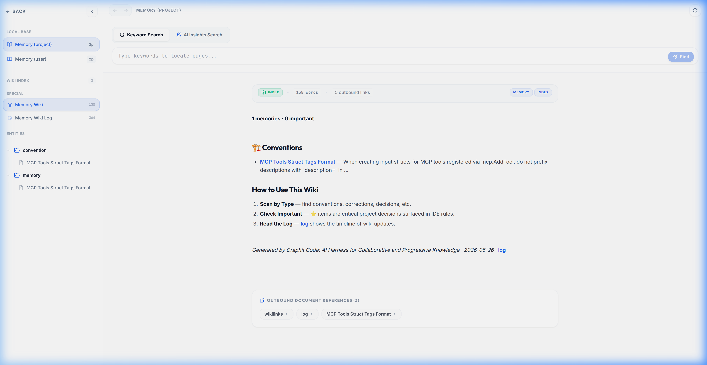

<h1 align="center">Graphit Code</h1>

<p align="center">
  <strong>A Powerful Agent Harness for Enterprise Software Ecosystems</strong>
</p>

<p align="center">
  <a href="https://github.com/graphit-labs/graphit-code/releases/latest"></a>
  <a href="https://github.com/graphit-labs/graphit-code/actions"></a>
  <a href="LICENSE"></a>
  <a href="https://github.com/sponsors/lainosantos"></a>
  
  
</p>

<p align="center">
  <a href="https://graphit-labs.github.io/graphit-code">Website</a> ·
  <a href="#installation">Installation</a> ·
  <a href="#key-features">Features</a> ·
  <a href="#quick-start">Quick Start</a> ·
  <a href="#documentation">Documentation</a>
</p>

<p align="center">
  
</p>

---

## From Solo Engineer to Enterprise Ecosystem

You've been here before. New session, same ritual — **explain everything again**:

> *"Our API uses this pattern..."*  
> *"No, we don't use that library anymore..."*  
> *"I already told you — error responses follow this format..."*  

Every session starts from zero. **You are the memory.** You repeat, re-explain, re-correct — and the agent forgets it all when the conversation ends. But this is just the surface. The deeper problem is that your AI agent has **no real understanding** of where it's working. It doesn't know your architecture. It doesn't know the sibling services. It greps and guesses code structure instead of querying it. It hallucinates APIs from other projects because it can't see them.

**Graphit Code changes the paradigm.** 

Stop being an engineer who works *with* an AI assistant. Start working inside a **real collaborative flow of a complete enterprise ecosystem**. Graphit Code transforms your local development environment into a collaborative hub where knowledge is progressive, understanding is deterministic, and your agent comprehends the entire system.

---

## The Core Pillars

**1. Deterministic Precision (AST) & Go Performance**  
No more "grep and guess". Built in Go for blazing-fast performance, Graphit Code features a full AST graph database (LadybugDB + Tree-sitter + ANTLR v4). Your agent queries code structure deterministically with Cypher. The indexing is instant and auto-incremental.

**2. Ecosystem Over Individual**  
The agent doesn't just see the current folder. It automatically discovers all managed projects within the ecosystem. It can query sibling codebases, read their shared knowledge, and generate cross-service integrations using real routes and DTOs. Zero hallucinations.

**3. Enterprise Collaboration Hub**  
Share knowledge, personal and shared memories, skills, rules, and MCP servers across your entire team. Fosters **progressive knowledge** across the entire enterprise ecosystem, ensuring that every project benefits from shared intelligence. Hub artifacts, events, and shared memories live in your S3-compatible object store.

**4. 100% Private, Zero Cost, No API Keys**  
Everything stays in your possession. Data is 100% private and anonymous. Git provides persistence for all memories and knowledge. There is **zero additional cost** and no LLM API key required, because Graphit operates via your existing local IDE and CLI agents.

**5. Progressive, Continuous Improvement**  
Memory is persistent and automatic. The system includes an autonomous **Dream Module** that works during idle time — mining conversation history, crystallizing recurring patterns into reusable skills, evaluating and improving existing skills, and generating memories from undocumented knowledge.

---

## Installation

**Zero dependencies required.** Supports Windows, Linux, and macOS out of the box.

### Option 1: One-liner Install (Recommended)

**Linux / macOS:**
```bash
curl -fsSL https://raw.githubusercontent.com/graphit-labs/graphit-code/main/install.sh | bash
```

**Windows (PowerShell):**
```powershell
irm https://raw.githubusercontent.com/graphit-labs/graphit-code/main/install.ps1 | iex
```

The installer auto-detects your OS and architecture, downloads the correct `.tar.gz` archive from the [latest release](https://github.com/graphit-labs/graphit-code/releases/latest), verifies the SHA-256 checksum, and installs the binary to `~/.local/bin/graphit` (Linux/macOS) or `%LOCALAPPDATA%\Programs\graphit\graphit.exe` (Windows). A custom directory can be specified with `--dir` (shell) or `-Dir` (PowerShell).

### Option 2: Manual Download

#### Linux (amd64)

```bash
# Download and extract, then move to your preferred bin directory
curl -fsSL https://github.com/graphit-labs/graphit-code/releases/latest/download/graphit-linux-amd64.tar.gz | tar -xz
mkdir -p ~/.local/bin && mv graphit-linux-amd64 ~/.local/bin/graphit
# Or system-wide (requires sudo):
# sudo mv graphit-linux-amd64 /usr/local/bin/graphit
```

#### macOS (Apple Silicon)

```bash
# Download and extract, then move to your preferred bin directory
curl -fsSL https://github.com/graphit-labs/graphit-code/releases/latest/download/graphit-darwin-arm64.tar.gz | tar -xz
mkdir -p ~/.local/bin && mv graphit-darwin-arm64 ~/.local/bin/graphit
# Or system-wide (requires sudo):
# sudo mv graphit-darwin-arm64 /usr/local/bin/graphit
```

#### Windows (amd64)

```powershell
# Download, extract and install to %LOCALAPPDATA%\Programs\graphit\
$InstallDir = "$env:LOCALAPPDATA\Programs\graphit"
New-Item -ItemType Directory -Force -Path $InstallDir | Out-Null
Invoke-WebRequest -Uri "https://github.com/graphit-labs/graphit-code/releases/latest/download/graphit-windows-amd64.tar.gz" -OutFile "$env:TEMP\graphit.tar.gz"
tar -xzf "$env:TEMP\graphit.tar.gz" -C "$env:TEMP"
Move-Item -Force "$env:TEMP\graphit-windows-amd64.exe" "$InstallDir\graphit.exe"

# Add to PATH (current session + permanent user PATH)
$env:PATH = "$env:PATH;$InstallDir"
[System.Environment]::SetEnvironmentVariable("PATH", "$([System.Environment]::GetEnvironmentVariable('PATH','User'));$InstallDir", "User")
```

### Option 3: Build from Source

Requires: Go 1.23+, Node.js 22+, Make, gcc/g++

```bash
git clone https://github.com/graphit-labs/graphit-code.git
cd graphit-code
```

**Linux:**
```bash
make install # installs to /usr/local/bin/ (sudo if not writable)
# user-space, no sudo
# make install PREFIX=$HOME/.local/bin
```

**macOS:**
```bash
make install-darwin # installs to /usr/local/bin/ (sudo if not writable)
# user-space, no sudo
# make install-darwin PREFIX=$HOME/.local/bin
```

**Windows (MSYS2 / MinGW):**
```bash
make install-windows # installs to C:\Program Files\graphit\ (may need admin)
# custom directory
# make install-windows PREFIX_WIN='C:\Tools\graphit'
```

---

## Quick Start

```bash
# 1. Configure the global Hub bucket. Setup optionally accepts a complete S3 access/secret
# pair; leave either blank to use the AWS credential-provider chain already available on
# the machine. Explicit secrets are stored in the owner-only global config as plain text.
# This also downloads the local embedding model (~132 MB), once per machine.
graphit setup

# 2. Initialize your project (Auto-configures IDE rules, indexes AST + Wiki)
cd your-project
graphit init --ide <antigravity|gemini|claude|cursor|kiro|codex|opencode>

# 3. For exploring the Graphit Code ecosystem, open the collaborative dashboard (optional)
graphit ui
```

---

## 🏆 The Ultimate Advantage: Private Knowledge Ecosystems

> **This is the game-changer.** Whether you're a solo developer managing multiple projects or an enterprise team scaling across dozens of engineers — Graphit Code turns your private object storage into a **persistent knowledge backbone** that grows smarter over time.

For **individual developers**, it means your agent knows every project you work on, remembers past decisions, and carries context across your entire ecosystem. For **teams**, knowledge compounds: corrections, conventions, and skills propagate automatically to every member. Either way, context is never lost.

### 🔗 Private Hub Registry — Your Team's Artifact Center

During interactive `graphit setup`, point the **Hub** to an AWS S3 or S3-compatible bucket (including private MinIO-style endpoints). The bucket becomes the centralized artifact registry for your ecosystem:

- **Shared Coding Rules** — Enforce company-wide standards automatically across every developer's IDE.
- **Team Skills** — Codify complex workflows (k8s debugging, internal API patterns, deployment checklists) so every agent on the team knows the procedures.
- **Knowledge Artifacts** — Publish documentation about frameworks, APIs, and integration specs that every developer's agent can discover and install.
- **Language Queries** — Share Tree-sitter and ANTLR extraction `.yaml` query files for customizing how entities are extracted from the built-in languages. Drop-in AST query customization without recompilation.
- **MCP Servers, Commands, Agent Profiles** — Share reusable automation across the entire organization.

Every artifact has a versioned object prefix and registry entry and is distributed through your bucket policy and AWS-compatible authentication.

### 🧠 Shared Memory Prefix — Collective Team Intelligence

The same bucket carries project and user memory scopes under the `memory/` prefix, so your ecosystem gains **shared persistent memory** without a second repository setting:

- **Corrections compound across the team** — When one developer corrects their agent ("we don't use that library anymore"), the correction propagates to everyone.
- **Conventions are learned once** — Architecture decisions, API patterns, and coding standards are stored as team-wide memories that every agent follows automatically.
- **Institutional knowledge persists** — New team members' agents immediately benefit from the collective learning of the entire team. No more onboarding friction.
- **Per-memory history** — Revision metadata and archived predecessors preserve the audit trail without relying on Git commits.

### 🚀 The Result: A Private, Self-Hosted Collaboration Loop

```
┌─────────────────────────────────────────────────────────────┐
│              Your Private S3-Compatible Bucket              │
│       (AWS S3 / MinIO / private object-store service)       │
│                                                             │
│   ┌───────────────────┐      ┌──────────────────────────┐   │
│   │  Hub Prefixes     │      │  Memory Prefixes         │   │
│   │  (Team Artifacts) │      │  (Shared Learning)       │   │
│   │                   │      │                          │   │
│   │  • Rules          │      │  • Corrections           │   │
│   │  • Skills         │      │  • Conventions           │   │
│   │  • Knowledge      │      │  • Decisions             │   │
│   │  • MCP Servers    │      │  • Institutional Memory  │   │
│   └────────┬──────────┘      └────────────┬─────────────┘   │
│            │                              │                 │
└────────────┼──────────────────────────────┼─────────────────┘
             │      object publish/sync     │
     ┌───────┴──────────────────────────────┴───────┐
     │   Solo Developer or Entire Team              │
     │                                              │
     │   graphit setup  →  configure bucket/auth    │
     │   graphit sync   →  publish/sync knowledge   │
     │   graphit init   →  inject rules into IDE    │
     └──────────────────────────────────────────────┘
```

Use a self-hosted S3-compatible service when data must remain entirely inside your network.
Privacy is enforced by your endpoint, bucket policy, network boundary, and credential strategy.

---

## Key Features

### 1. Unified Graphical UI
Manage the entire Hub and search knowledge across your own code or multiple projects simultaneously. The dashboard facilitates interactions and lets you chat about the total knowledge of your project.
```bash
graphit ui  # Opens the automatically selected free port
```
- **Network:** binds to `127.0.0.1` by default; remote exposure and CORS are explicit configuration.
- **Security:** the UI has no authentication, so restrict the bind address or use a firewall/VPN/authenticated proxy.
- **AST Explorer:** 3D interactive graph with Cypher queries.
- **Wiki Explorer:** FTS, semantic search, and documentation routing.
- **Hub Manager:** Decentralized registry interface.
- **Ecosystem Explorer:** Cluster discovery and navigation.

<p align="center">
  
</p>

### 2. AST Graph Explorer — Instant & Deterministic
Query the AST across the ecosystem instantly. Auto-incremental indexing ensures your agent always knows exactly where a function is defined or called. **Eliminates hallucinations** by grounding answers in exact structural truths, and drastically **reduces LLM token usage** by passing only precise nodes instead of massive files.

Two parser backends: **Tree-sitter** and **ANTLR v4**, covering 44 languages out of the box.

**Tree-sitter (39):** Go · TypeScript · TSX · JavaScript · Python · Java · Rust · C · C++ · C# · Kotlin · Swift · Dart · PHP · Ruby · SQL · XML · HTML · CSS · Vue · Svelte · Bash · Clojure · Dockerfile · Elixir · GraphQL · Groovy · Haskell · HCL · JSON · Julia · Lua · Objective-C · Protocol Buffers · R · Scala · TOML · YAML · Zig

**ANTLR v4 (5):** PL/SQL · PostgreSQL · DB2 · T-SQL · COBOL 85

The four SQL dialects are **exclusive** grammars: `.sql` is parsed by the tree-sitter SQL grammar by default and a dialect is used only where you name it — `graphit config ast.grammar ".sql=antlr-plsql"`. Which dialect a repository speaks is a fact about the repository, not something the indexer guesses.

Every source file is parsed into a graph stored in **LadybugDB** (embedded graph database) with support to **full** and **incremental** parsing modes. The entire pipeline is **pure YAML-driven**, allowing you to customize the AST parsing pipeline without recompiling the source code. See the [User Manual](docs/guides/user_manual.md#customizing-ast-tree-sitter-queries) and the [AST Module Spec](docs/specs/ast_module.md#-external-query-customization) for details.

### 3. LLM Wiki & Knowledge Discovery
Documentation designed for agents. Replaces opaque vector embeddings with deterministic **self-discovery** and explicit **back-referencing**. The agent organically explores the wiki graph to find exact context, guaranteeing precise retrieval without hallucinated semantic matches.
- **Auto Sync:** Runs smoothly in the background to automatically keep your knowledge and code graphs perfectly aligned in real-time.

<p align="center">
  
</p>

### 4. Continuous Collaborative Memory
Supports both **shared project memory** for the entire team and **personal memory** tailored to the individual user. The system automatically self-refines its memories over time, guaranteeing extreme assertiveness in the agent's actions by recalling conventions, corrections, and past decisions across all sessions.

### 5. Standard Skills & Router Strategy
Graphit Code ships with default explicit standard skills. To prevent LLM context exhaustion and loss of attention, it employs a **router strategy** that loads only the relevant context when needed. All rules are fully customizable globally or per project.

### 6. IDE Agnostic Auto-Configuration
Supports and synchronizes across multiple IDEs working together (Claude Code, Cursor, Gemini, Kiro, Codex, OpenCode).

```bash
# Auto-configure for your environment
graphit init --ide <antigravity|gemini|claude|cursor|kiro|codex|opencode>
```

### 7. Cluster Discovery — Cross-Project Ecosystem

Group related projects with **cluster labels** and let your agent discover, navigate, and query the entire ecosystem. Projects sharing at least one label are automatically linked as cluster members.

```bash
# Assign labels to group projects
graphit cluster domain backend
graphit cluster team payments

# View your labels
graphit cluster --list

# Discover all projects in your cluster
graphit cluster projects

# Filter by a specific label
graphit cluster projects domain
```

Your AI agent uses the same discovery via MCP (`graphit_cluster_projects`) to:
- **Find sibling projects** and read their source or documentation
- **Query code across projects** using AST with the sibling's `project_dir`
- **Read another project's wiki** to understand APIs and contracts
- **Make cross-project changes** using the discovered paths

This prevents **integration hallucinations** — the agent sees real routes, DTOs, and interfaces from the actual sibling codebases instead of guessing.

> See the [Cluster Discovery Spec](docs/specs/cluster_microservices.md) for the full technical reference.

---

## Documentation

Visit the **[Documentation Hub](docs/README.md)** for a complete index of all guides and manuals.

### User Guides
- **[Getting Started](docs/guides/getting_started.md)**: Install, requirements, setup, and verification.
- **[CLI Command Reference](docs/guides/cli_reference.md)**: Manual detailing every command and flag.
- **[User Manual](docs/guides/user_manual.md)**: Interactive canvas, memories, and autonomous skill generation.
- **[Private Branding & Customization](docs/guides/private_brand_customization.md)**: White-labeling build parameters, private hubs, and secure networks.
- **[S3 Credentials & UI Network](docs/guides/s3-and-ui-network.md)**: Authentication fallback, credential storage, bind address, CORS, and deployment security.

### Technical Specifications
- **[System Architecture](docs/architecture/architecture_overview.md)**: Layer design and process wrapper.
- **[AST Module Spec](docs/specs/ast_module.md)**: Graph database LadybugDB, Cypher builder, and parser.
- **[Wiki Module Spec](docs/specs/wiki_module.md)**: Obsidian wiki, LPA, fuzzy match, and search engine.
- **[Memory Module Spec](docs/specs/memory_module.md)**: Scope partitioning, local raw storage, S3 publication, and consolidation.
- **[Hub Collaboration Spec](docs/specs/hub_collaboration.md)**: S3-backed registry, artifact operations, and lockfiles.
- **[Daemon Module Spec](docs/specs/daemon_module.md)**: Supervisors, schedulers, and servers.
- **[Dream Module Spec](docs/specs/dream_module.md)**: Autonomous skill generation, conversation mining, and knowledge extraction.
- **[Task Backlog Spec](docs/specs/backlog.md)**: Future work versioned in the docs tree and managed independently of Dream.
- **[UI Dashboard Spec](docs/specs/ui_dashboard.md)**: React force-directed canvas and uiserver handlers.
- **[AI Engine Spec](docs/specs/ai_engine.md)**: the local ONNX embedding stack, the model manager, and prompt completions.
- **[Cluster Discovery Spec](docs/specs/cluster_microservices.md)**: Projects registry and cross-project delegated queries.

---

## Sponsors

Graphit Code is an open-source project. If you find this project useful, please consider sponsoring the maintainer to support active development:

- **GitHub Sponsors:** [Sponsor @lainosantos](https://github.com/sponsors/lainosantos)

Thank you for your support!

---

## License

[MIT](LICENSE) — Graphit Labs

<p align="center">
  <strong>Graphit Code</strong> — A Powerful Agent Harness for Enterprise Software Ecosystems<br>
  <em>Tell your agent once. It remembers forever.</em>
</p>
