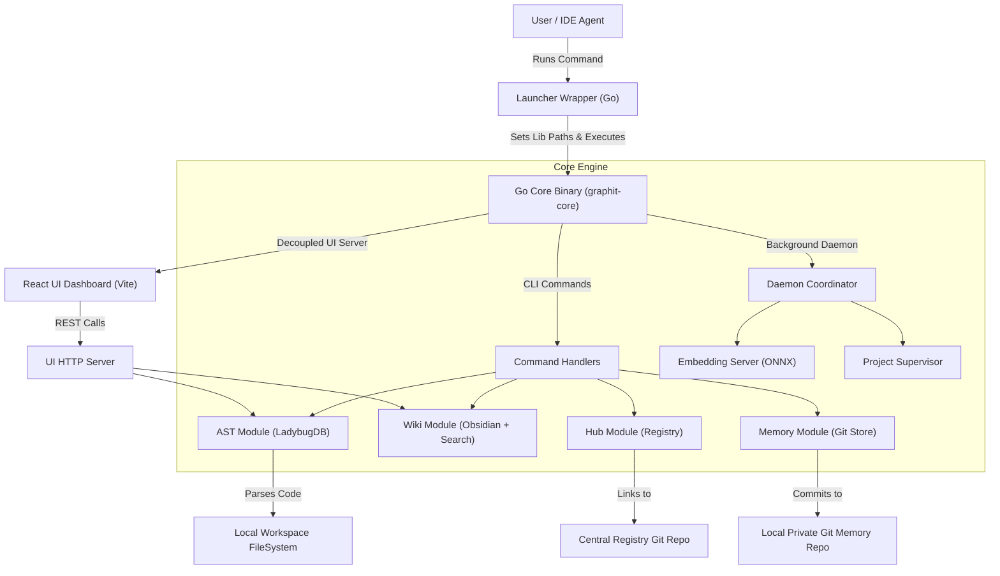

# System Architecture Overview

Graphit Code is designed as a modular, stateless, and high-performance developer tool written in Go.
This document describes the high-level layers and design principles that govern the system.

---

## 🏗️ System Topology

The following diagram illustrates how the launcher wrapper, core engine, persistent storage repositories, and IDE integrations interact:

---

## 📦 System Layers

Graphit Code decomposes operations into separate, decoupled boundaries:

### 1. Launcher Wrapper (`cmd/launcher/`)
To simplify setup across systems (macOS, Windows, Linux) without requiring external dependencies, the compiled `graphit` command is actually a lightweight **Launcher Wrapper**:
- **Asset Extraction**: On start, the launcher checks if the embedded runtime files (like Tree-sitter shared libraries and dependencies) match the binary version. If not, it self-extracts them to `~/.graphit/runtime/<version>/`.
- **Dynamic Link Resolution**: It appends the runtime directory path to the system's dynamic linker search path (e.g. `LD_LIBRARY_PATH` on Linux, `DYLD_LIBRARY_PATH` on macOS) before booting the core process.
- **Handoff Execution**: It spawns the heavy `graphit-core` binary and forwards CLI arguments, piping input/output streams.

### 2. Go Core Engine (`cmd/graphit/`)
The core engine contains the CLI command handlers and package orchestrations.
It is compiled as a self-contained, statically/dynamically linked executable (`graphit-core`) that communicates with workspace files and repositories.

### 3. Decoupled View Layer (`internal/output/`)
The domain layer (AST queries, Hub syncs, Memory GC) is completely decoupled from standard I/O writers.
It must never write directly to `os.Stdout` or `os.Stderr`.
Instead, it interacts with the view layer via `output.Printer` handlers:
- **Presentation Isolation**: All console layout outputs (headers, lists, tables, warnings, and loaders) are processed by the printer.
- **Interactive Spinners**: The printer manages terminal escape sequences to render animations for active background tasks, falling back to clean line-by-line dumps when running outside of interactive TTY terminals.

### 4. Git-Backed Persistence
Graphit Code avoids running proprietary database servers (like PostgreSQL or Neo4j).
Instead, metadata is stored locally using standard, transparent data formats:
- **Memory Wikis**: Stored as standard Markdown files. Changes are committed to a user-local Git repository.
- **Central Registries**: Git servers serve as registry catalogs. Adding or updating rule definitions is managed through standard Git operations (push/pull/fetch).

### 5. IDE Adapters
The CLI acts as a bridge that injects rules and tools into your coding assistants (e.g., Claude Code, Cursor, Gemini, Kiro).
It parses your project files and appends customized rules blocks inside configuration templates (like `.cursorrules` or `.codeagent`), wrapping instructions within managed comment boundaries.
