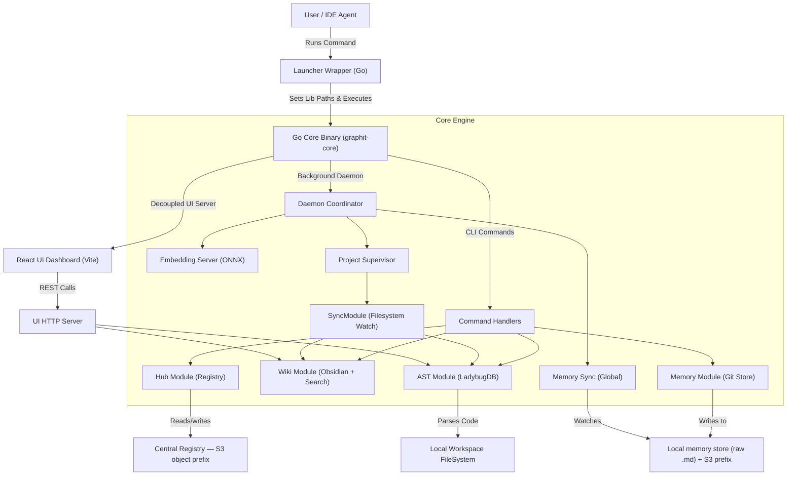

# System Architecture Overview

Graphit Code is designed as a modular, stateless, and high-performance developer tool written in Go.
This document describes the high-level layers and design principles that govern the system.

---

## 🏗️ System Topology

The following diagram illustrates how the launcher wrapper, core engine, persistent storage repositories, and IDE integrations interact:

---

## 📦 System Layers

Graphit Code decomposes operations into separate, decoupled boundaries:

### 1. Launcher Wrapper (`cmd/launcher/`)
To simplify setup across systems (macOS, Windows, Linux) without requiring external dependencies, the compiled `graphit` command is actually a lightweight **Launcher Wrapper**:
- **Asset Extraction**: On start, the launcher checks whether the embedded runtime files match the binary version. If not, it self-extracts them to `~/.graphit/runtime/<version>/`. The payload is the core binary, the MCP proxy binary, the LadybugDB native library, ONNX Runtime, ICU, and the AST query YAMLs.
- **What is *not* embedded**:
  - **The embedding model.** At ~132 MB it would be larger than everything above put together, and it versions independently of the code, so `graphit setup` downloads it once into `~/.graphit/models/coderankembed/`. See [AI Engine](../specs/ai_engine.md#-model-manager-downloaded-once-shared-by-everything).
  - **Grammars.** Tree-sitter and ANTLR libraries are not in the binary either; they are Hub `language` artifacts, resolved per project. Only the query YAMLs that drive them travel in the payload.
- **Stripped core**: the core is linked with `-s -w`, which drops DWARF and the external symbol table for a 25% size cut on the biggest item in the payload. Runtime behaviour is unaffected — panic stack traces keep their function names and line numbers — but source-level debugging of a released binary is not available. `make build-linux STRIP_LDFLAGS=` produces a debuggable build. See [Strip the core binary](../tasks/strip-the-core-binary.md).
- **Dynamic Link Resolution**: It appends the runtime directory path to the system's dynamic linker search path (e.g. `LD_LIBRARY_PATH` on Linux, `DYLD_LIBRARY_PATH` on macOS) before booting the core process.
- **Handoff Execution**: It spawns the heavy `graphit-core` binary and forwards CLI arguments, piping input/output streams.

### 2. Go Core Engine (`cmd/graphit/`)
The core engine contains the CLI command handlers and package orchestrations.
It is compiled as a self-contained, statically/dynamically linked executable (`graphit-core`) that communicates with workspace files and repositories.

### 3. Decoupled View Layer (`internal/output/`)
The domain layer (AST queries, Hub syncs, Memory GC) is completely decoupled from standard I/O writers.
It must never write directly to `os.Stdout` or `os.Stderr`.
Instead, it interacts with the view layer via `output.Printer` handlers:
- **Presentation Isolation**: All console layout outputs (headers, lists, tables, warnings, and loaders) are processed by the printer.
- **Interactive Spinners**: The printer manages terminal escape sequences to render animations for active background tasks, falling back to clean line-by-line dumps when running outside of interactive TTY terminals.

### 4. Local and S3-Backed Persistence
Graphit Code avoids running proprietary database servers (like PostgreSQL or Neo4j).
Instead, mutable sources stay local and shareable data is published as S3-compatible objects:
- **Memory Wikis**: Raw Markdown is the local source of truth. Project/user scopes merge from and publish to `memory/<scope>/<id>/` prefixes when a Hub bucket is configured.
- **Central Registry**: Catalog entries, versioned artifacts, events, rules, contexts, and memory prefixes share the configured Hub bucket.
- **Authentication**: A complete explicit credential pair may come from global Graphit config; otherwise AWS SDK consumers use the standard provider chain.

Every one of these artifacts — code graphs, documentation wikis, memory wikis, their
search indexes and their caches — lives **once**, in the global brand directory, keyed
by an identifier. A project directory carries no compiled data at all: only its source,
its lockfile, and a few small per-project records. See
[Storage Layout](storage_layout.md) for the full picture and the reasoning.

The unified UI is a separate network boundary. It binds to `ui.host` (`127.0.0.1` by
default) and applies one exact-origin CORS policy from `ui.allowed_origins`. It has no
authentication, so remote deployments require network controls or an authenticated proxy;
CORS alone is not authorization. See
[S3 Credentials and UI Network Configuration](../guides/s3-and-ui-network.md).

### 5. IDE Adapters
The CLI acts as a bridge that injects rules and tools into your coding assistants (e.g., Claude Code, Cursor, Gemini, Kiro).
It parses your project files and appends customized rules blocks inside configuration templates (like `.cursorrules` or `.codeagent`), wrapping instructions within managed comment boundaries.
