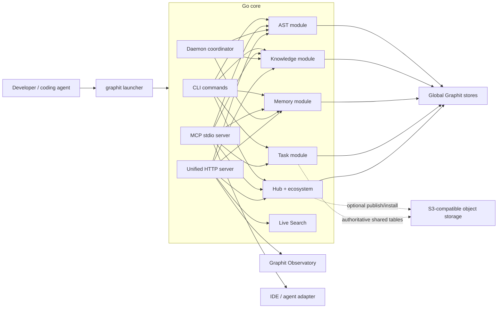

# System Architecture Overview

Graphit Code is a local-first agent harness written primarily in Go. It combines structural code intelligence, compiled documentation, durable memory, deterministic shared tasks, reusable ecosystem artifacts, and one embedded visual workspace.

## Topology

## Runtime layers

### Launcher

The distributed `graphit` executable is a lightweight wrapper. It extracts the versioned core runtime and native libraries into the global Graphit directory, configures the host linker path, starts `graphit-core`, and forwards arguments and standard streams.

The local embedding model and language grammar libraries are not baked into the launcher. `graphit setup` downloads the model once per machine; language support is resolved through installed language artifacts and query definitions.

### Go core

`cmd/graphit/` contains CLI entry points and orchestration. Domain packages implement AST, wiki, memory, Hub, daemon, Dream, live search, configuration, project registry, and output behavior.

Presentation is separated from domain logic through the output layer so CLI commands can render interactive terminal feedback without making lower-level packages write directly to standard output.

### MCP interface

The MCP stdio server exposes the same project capabilities to coding agents. Tools accept an explicit project directory or imported context where required. The interface separates candidate retrieval from content reads and structural traversal:

- search returns names or titles;
- source and wiki tools return selected content;
- AST queries traverse exact graph relationships;
- memory tools persist structured context.
- task tools atomically claim, checkpoint, validate, and transfer shared work.

Each concrete IDE adapter installs and removes its own project-local native lifecycle hook whenever that IDE supports project hooks. Hook paths live in each adapter's `FolderConfig` beside its other native paths, while event names, configuration shapes, and hook lifecycle remain in the concrete adapter; the folder-based adapter has no hook routing or IDE identity. Only the semantic protocol and format-neutral payload reconciliation helpers are shared. Generated commands contain no checkout path: hook execution resolves the nearest Graphit project from native `cwd`/workspace-root input or process cwd (OpenCode starts the subprocess with its runtime `directory` as cwd), then reads that project's current module configuration, mandatory memories, and installed Hub `rule` artifacts. Enabled module mandates and rule bodies are composed dynamically; skills remain physical, discoverable artifacts whose full content is loaded only when needed. Graphit does not manage `AGENTS.md`, `CLAUDE.md`, or IDE rule copies for this context.

Claude, Codex, Cursor, Gemini, and Kiro use their native session-start event. Claude and Codex also use `SubagentStart`; Cursor rewrites the `Task` input because its `subagentStart` output cannot add context. Antigravity uses `PreInvocation`, Gemini reasserts resident context through `BeforeAgent`, Kiro adds the CLI `AgentSpawn` boundary, and OpenCode combines the first system-prompt transform per session with its compaction hook. Adapter removal removes only the Graphit-owned hook entry or file.

The same scope rule applies to MCP installation, including MCP artifacts installed from the Hub. Antigravity writes `.agents/mcp_config.json`; Claude writes `.mcp.json`; Cursor writes `.cursor/mcp.json`; Kiro writes `.kiro/settings/mcp.json`; Codex writes `.codex/config.toml`; OpenCode writes only its native `mcp` object in `opencode.json`; and Gemini shares `.gemini/settings.json` with its hook configuration. All targets are project-local and are reconciled by the owning adapter. Native IDE files contain no cross-project ownership metadata. A project-local runtime manifest records only the server names written by Graphit so later sync/removal can preserve user-owned entries; no compatibility reader exists for older configuration shapes.

### Daemon

One machine-wide daemon supervises registered projects, receives file events, schedules incremental AST and wiki maintenance, coordinates local embedding work, and runs configured Dream activity. It reduces repeated cold starts but does not remove the need for explicit checkpoints after bulk external changes.

### Unified UI

The Go server embeds the production React bundle from `internal/ui/dist/` and serves both the SPA and its JSON endpoints. The Graphit Observatory visualizes project, context, registry, daemon, Dream, and live-search state without maintaining a second data model.

The UI binds to the configured `ui.host`, with the IPv4 loopback address as the safe default. Exact-origin CORS is a browser policy, not authorization. Reachable deployments require network controls or an authenticated proxy.

## Data planes

### AST

Source files are parsed through Tree-sitter and ANTLR language grammars. Declarations and relationships are stored in an Icebug/LadybugDB property graph; keyword and semantic retrieval use a separate search sidecar.

The graph answers structural questions through Cypher. Source text is retrieved through the source interface after the graph identifies a relevant file or entity.

### Knowledge

The knowledge source is the maintained documentation tree plus the root README. Graphit compiles it into a searchable wiki with page metadata, confidence, provenance, cross-references, and update history.

### Memory

Project and user memory are independent scopes backed by authoritative LanceDB tables and compiled memory wikis. Project memory belongs to one registered repository identity. User memory follows the user across projects.

### Task

Task is the authoritative project work scheduler. LanceDB tables hold task snapshots, claims,
dependencies, subtasks, acceptance/test checks, comments, and audit events. Lifecycle hooks
reconcile projections and release or expire ownership so another agent can resume. With S3
configured, all agents use the same tables directly; no task Markdown is stored in the checkout.

### Hub and ecosystem

The ecosystem registry resolves sibling projects already present on the machine. Each sibling retains its own stores and documentation.

The Hub packages reusable artifacts and imported contexts. Local operation does not require remote storage; an optional S3-compatible bucket can publish and install shared catalogs, artifact versions, and memory prefixes.

### Live Search

Live Search prepares a throwaway workspace from selected artifacts, installs the requested agent environment, runs a bounded agent session, and removes the ephemeral project data afterwards. It is for questions requiring several sources, not for replacing direct module queries.

## Storage principles

Compiled stores live once in the global brand directory and are keyed by project, user, or context identity. Project checkouts retain source, documentation, lockfiles, and small local records rather than copies of graphs and wikis.

This model:

- avoids duplicating large stores across repositories;
- lets several projects reference the same published context;
- keeps user memory globally available without copying it into each checkout;
- gives concurrent agents one fenced, resumable project work queue;
- gives the daemon one canonical store per identity.

See [Storage Layout](storage_layout.md) for concrete paths and lifecycle rules.

## Trust boundaries

- Source and mutable indexes remain local unless an explicit publish or remote configuration is used. With S3 configured, authoritative Memory and Task LanceDB tables live directly at their remote URIs.
- S3-compatible storage is an optional shared boundary with its own credential and access controls.
- The UI server is a network boundary and has no built-in authentication.
- Coding-agent CLIs and IDE adapters are external processes; Graphit prepares their workspace and tool configuration but does not replace their own permission model.

## Related specifications

- [AST Module](../specs/ast_module.md)
- [Wiki Module](../specs/wiki_module.md)
- [Memory Module](../specs/memory_module.md)
- [Task Module](../specs/task_module.md)
- [Hub Collaboration](../specs/hub_collaboration.md)
- [Daemon Module](../specs/daemon_module.md)
- [Dream Module](../specs/dream_module.md)
- [UI Dashboard](../specs/ui_dashboard.md)
- [AI Engine](../specs/ai_engine.md)
- [S3 and UI Network](../guides/s3-and-ui-network.md)
