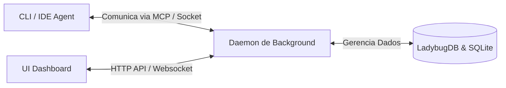

# Visão Geral da Arquitetura do Graphit Code

Este documento detalha o modelo arquitetural do **Graphit Code**, seu modelo de execução e a relação entre os componentes do sistema.

---

## 🏗️ Modelo de Execução: Cliente-Daemon-UI

O ecossistema do Graphit Code é dividido em três camadas operacionais principais que trabalham juntas de forma assíncrona:

### 1. O Cliente (CLI / Agente de IDE)
A interface de comando que o desenvolvedor e os agentes de IA interagem diariamente.
* Executa comandos interativos rápidos como busca, consultas de grafo e setup.
* Carrega ferramentas em sessões de IDE via conexão stdio do protocolo **MCP** (Model Context Protocol).

### 2. O Daemon de Background (`graphit daemon`)
Um processo de sistema persistente executado em segundo plano. Suas atribuições incluem:
* **Escuta de Mudanças (Watcher):** Monitora alterações no sistema de arquivos do projeto para disparar a re-indexação incremental da AST e reconstrução da Wiki.
* **Warm Model Loading:** Mantém os modelos de embeddings de IA carregados na RAM física para reduzir a latência de buscas semânticas instantâneas.
* **Agendador de Tarefas (Scheduler):** Gerencia gatilhos de inatividade (idle triggers) para acionar o módulo **Dream** de forma autônoma.

### 3. A Interface Gráfica (`graphit ui`)
Um servidor web local unificado (`uiserver`) e uma interface web Single Page Application (SPA) construída em React e TypeScript.
* Fornece telas ricas de visualização de grafos de dependência tridimensionais (3D D3 force directed graph), painel de busca multi-wiki, histórico de chat e administração de artefatos do Hub.

---

## 💾 Persistência de Dados Embarcada

O Graphit Code não requer a configuração de serviços de banco de dados pesados externos (como Postgres ou Neo4j dedicados) para projetos locais. O armazenamento é embarcado:

### LadybugDB (Grafo AST)
* O banco de dados principal de relacionamentos de código é o **LadybugDB**, um banco de grafos local implementado em Go que executa consultas escritas na linguagem Cypher.
* Armazena entidades de código (arquivos, funções, classes, variáveis) e suas dependências sem latência de rede.

### SQLite (Busca Lexical e Vetores Semânticos)
* Cada projeto possui um arquivo de índice de busca SQLite na pasta `.graphit/ast/project/ladybugdb.search.sqlite`.
* O SQLite roda com o modo **WAL** (Write-Ahead Logging) ativo, garantindo escritas concorrentes rápidas.
* Utiliza a extensão nativa CGO **sqlite-vec** para realizar buscas semânticas com vetores KNN em tabelas virtuais SQLite, integradas a índices FTS5 para busca textual tradicional baseada em BM25.

---

## 🔌 Camada de Comunicação MCP (Model Context Protocol)

O Graphit Code funciona como um **Provedor de Contexto MCP**.
Ao plugar o Graphit em uma IDE compatível (como Claude Code, Cursor ou VS Code), a IA ganha superpoderes para:
1. Buscar definições de código por similaridade semântica em toda a base histórica.
2. Descobrir e mapear dependências e cadeias de chamadas (call-chains) dinamicamente.
3. Ler regras arquiteturais do Hub que moldam a resposta antes de implementar alterações no código.

---
*Próximo passo recomendado:* Conheça as ferramentas disponíveis no [[mcp_server]].
