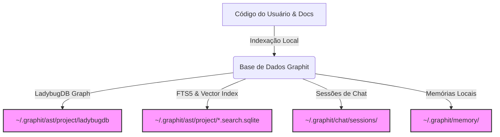

# Segurança, Privacidade e Arquitetura Local-First

O **Graphit Code** foi concebido sob a filosofia **Local-First** e **Privacy-by-Design**. Ele opera integralmente dentro do domínio seguro do próprio desenvolvedor, garantindo que o código-fonte proprietário, informações do projeto, dados históricos de chat e memórias geradas por IA nunca sejam expostos a serviços externos de terceiros sem consentimento.

---

## 🔒 Fluxo de Dados: Sem Tráfego Externo por Padrão

Diferente de ferramentas de IA baseadas em nuvem que realizam a ingestão, processamento e indexação de dados em servidores externos, o Graphit Code realiza 100% de sua inteligência localmente.

Todas as operações de escrita e leitura de bancos de dados são feitas em processos locais:
* **Indexação AST:** Os parsers Tree-sitter rodam em sua máquina, alimentando o banco de dados local **LadybugDB**.
* **Pesquisa Textual e Vetorial:** O arquivo `.search.sqlite` gerado na pasta do seu projeto armazena tabelas virtuais SQLite FTS5 e vetores KNN locais usando a extensão embarcada `sqlite-vec`.
* **Histórico do Chat:** As conversas com a IA são escritas em arquivos JSON Lines (`.jsonl`) locais em seu diretório de perfil de usuário.

---

## 🌐 Como a Rede é Utilizada (Apenas se Configurada)

O tráfego de dados para fora do seu ambiente local é nulo, com exceção de duas integrações baseadas em Git que você controla ativamente:

### 1. Conexão com o Hub Git (`hub.repo`)
Ao executar o comando `graphit hub install` ou `graphit hub submit`, o sistema utiliza o executável de sistema do `git` instalado em sua máquina para transferir dados via SSH/HTTPS com a URL configurada por você em `hub.repo`.
* **Segurança:** O transporte herda as credenciais de segurança e chaves SSH configuradas em sua sessão de sistema operacional.
* **Upload:** O comando `hub submit` compartilha apenas o artefato específico selecionado por você (ex: uma skill ou regra), sem expor o restante da sua codebase.

### 2. Sincronização de Memória Remota (`memory.repo`)
Se você configurar um repositório remoto para suas memórias do projeto ou usuário, a sincronização é executada em background usando comandos Git encapsulados (`git push` e `git pull`).
* Se nenhuma URL de repositório for preenchida, o sistema cria um repositório git local em `~/.graphit/memory/` sem qualquer upstream configurado, operando de forma 100% offline.

---

## 🛠️ Segurança no Contexto do Servidor MCP

O servidor MCP (`graphit mcp`) roda em `localhost` (IP `127.0.0.1`) e atende conexões locais em canais stdio ou porta HTTP segura (`localhost:8282/mcp`). 
* As ferramentas disponíveis por este protocolo herdam as permissões de acesso do usuário local que inicializou a ferramenta, sem expor portas para conexões da internet.

---
*Próximo passo recomendado:* Conheça a [[overview]] de arquitetura de software do Graphit Code.
