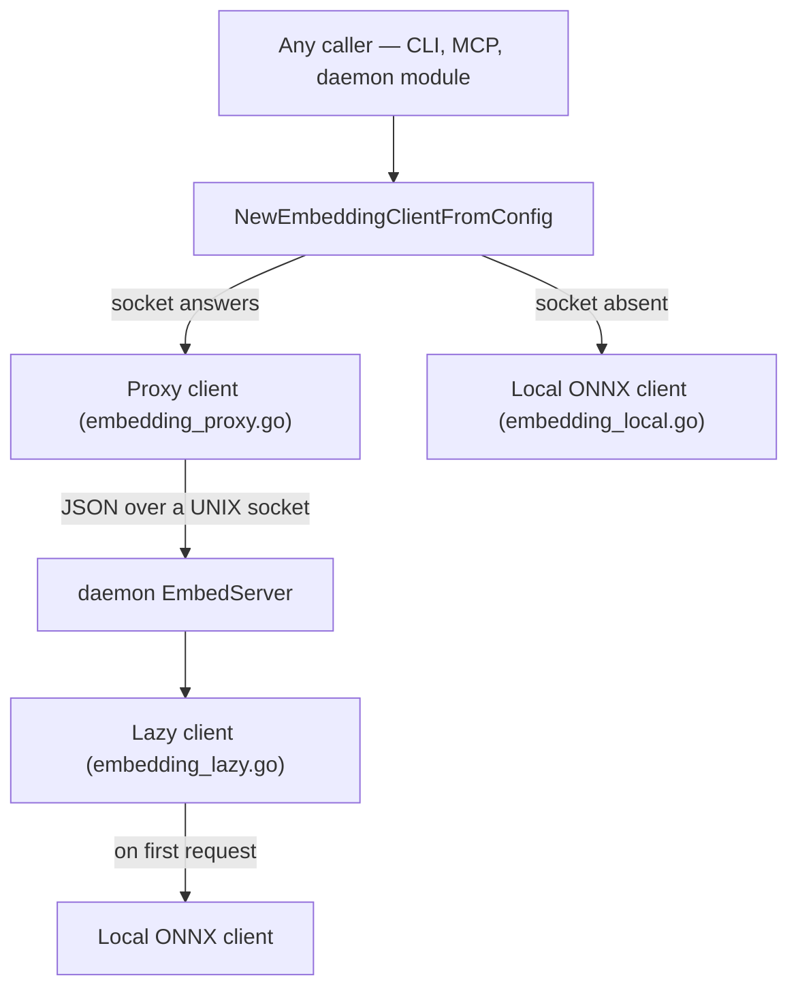

# AI Engine Specification

The AI Engine module coordinates local model resolution, text vector embedding
generation, and text completions.

Embedding is **entirely local**: the vectors are computed on this machine by an ONNX
session, and the only thing that crosses the network is the one-time download of the
model weights. Completions are the separate half, and they delegate to a locally
installed agent CLI.

---

## 📦 Model Manager: Downloaded Once, Shared By Everything

The `ModelManager` (`internal/ai/model_manager.go`) resolves the embedding model
and its tokenizer, downloading them when they are not already on the machine.

| | |
|---|---|
| **Model** | `CodeRankEmbed-137M-INT8`, ONNX, 768 dimensions (`ai.EmbeddingDimensions`) |
| **Files** | `model.onnx` (~132 MB) and `tokenizer.json` (~700 KB) |
| **Cache** | `~/.graphit/models/coderankembed/` (`modelCacheSubdir`) |
| **Origin** | `huggingface.co/mrsladoje/CodeRankEmbed-onnx-int8` |

### The model is not in the binary

It used to be. The build downloaded it, gzipped it, and `go:embed`-ed it into the
launcher, which extracted it on first run and then replaced it with a symlink into
the shared cache to avoid keeping a second copy per version. That put **103 MB of
compressed weights into every released binary** — more than everything else the
launcher carries — to ship a file that changes on a completely different schedule
from the code, and it made every CI build and every release pull it again.

Now `graphit setup` downloads it, once, straight into the cache. See
[The model arrives at setup, not inside the binary](../tasks/model-downloaded-at-setup-not-embedded.md).

### Resolution order

`EnsureModel` returns the first of these that holds files of at least the minimum
accepted size, and only downloads when none does:

1. **`models/` next to the core binary** — `findBundledModels`. The released
   binaries do not ship one. It exists for a private or air-gapped build that
   prefers to place the weights itself; see
   [Private Deployment](../guides/private_brand_customization.md).
2. **The shared cache** — `~/.graphit/models/coderankembed/`, where setup puts it.
3. **Download** — into the cache, via a temporary file renamed into place, so an
   interrupted transfer never leaves a half file that later passes the size check.

A file is accepted on size alone (`modelONNXMinSize`, `tokenizerJSONMinSize`);
there is no checksum, so a truncated download is caught but a corrupted one that
happens to be large enough is not — it surfaces later as an ONNX load failure.

### The download is required, not best-effort

`graphit setup` **fails** when it cannot obtain the model, with a non-zero exit. The
reasoning is that an installation without the model cannot embed anything, so it
cannot answer a semantic query at all, and a setup that reported success would
defer the discovery to some later search that quietly returned keyword hits.

It is the last step of setup for that reason: the hub URL, the memory URL, the IDE
and the CLI are all written before it, so re-running setup after fixing the network
costs one pass through the prompts and loses nothing. It is deliberately stricter
than the hub and memory clones in the same command, which only warn — those retry
on the next command against a remote that may be momentarily unreachable, whereas
this is a fixed asset with a fixed URL that the tool needs in order to work.

`ModelCacheDir` is exported for this path: the failure message names the directory,
and a failed `EnsureModel` returns no path to derive it from.

### Progress reporting

`ModelManager.OnProgress` is an optional `ProgressFunc`. It fires once with zero
bytes before the transfer starts — so a caller can announce a 132 MB download
before there is anything to report — and then once per read, which is every 32 KB.
Nil means the download is silent, which is what every non-interactive caller wants.

**Throttling is the caller's job**, because how often a line may be repainted is a
property of where it is going, not of the download. `cmd/graphit/commands/model_setup.go`
holds that policy: a rewritten line refreshes ten times a second on a terminal,
while a log file gets one line per ten percent. `internal/output` renders it
(`DownloadLine`, `ProgressBar`, `HumanBytes`).

---

## 🔌 Embedding Backends

`NewEmbeddingClientFromConfig` (`internal/ai/embedding.go`) picks the backend.
**Despite the name it reads no configuration**: it tries the daemon socket, then
falls back to loading the model in-process.

> **There is no external embedding provider.** No OpenAI, no Gemini, no Ollama, no
> HTTP client, and no config key that would select one. Every route below ends at
> the same local ONNX session. The only network access in the whole stack is the
> one-time model download described above. Adding a provider would be a feature,
> not a setting: it needs an `EmbeddingClient` implementation, a config key, and a
> migration for the vector index, which is fixed at 768 dimensions.

### 1. Local Embedding Client (`embedding_local.go`)
- **Engine**: ONNX Runtime in-process, through the `onnxruntime_go` binding. The
  shared library is found next to the executable or on the platform's library path
  (`findORTLibrary`).
- **Tokenization**: `sugarme/tokenizer`, loaded from `tokenizer.json`. Inputs are
  capped at `maxSeqLen` 512 tokens; queries are prefixed with
  `Represent this query for searching relevant code: `.
- **Threads**: intra-op is bounded by the shared CPU budget (`sysutil.CPUBudget`)
  so background embedding does not take the machine; `GRAPHIT_EMBED_THREADS`
  overrides.
- **Containment**: `encodeSingle` recovers from panics raised inside the
  tokenizer, marks that one text as unembeddable and keeps the batch aligned. See
  [the crash-loop task log](../tasks/embedding-crash-loop-por-panic-do-tokenizador.md).

### 2. Proxy Embedding Client (`embedding_proxy.go`)
- **Backend**: the **daemon's own `EmbedServer`** (`internal/daemon/embedserver.go`),
  reached over a UNIX socket at `~/.graphit/daemon/embed.sock`. Newline-delimited
  JSON: `{"texts":[…]}` or `{"query":"…"}` in, `{"vectors":[[…]]}` out.
- **Why**: loading the model costs ~132 MB of resident memory and seconds of
  startup. One process holds it and every short-lived CLI and MCP invocation
  borrows it instead of paying that cost again.
- **Selection**: chosen when the dial succeeds, which means the daemon is running.
  There is nothing to configure.

### 3. Lazy Embedding Client (`embedding_lazy.go`)
- **Problem**: the daemon builds its embedding client at startup, but a daemon
  that never embeds anything should not pay for the session.
- **Solution**: it holds the construction until the first request, then memoises
  the result — including the failure, so a broken ONNX install is not retried on
  every call.

---

## 💬 AI Completions API

The completion dispatcher (`internal/ai/ai.go`) routes text synthesis prompts. This
is a **separate stack from embedding**, and the one place where work does leave the
machine: `NewClientFromConfig` resolves a locally installed **agent CLI** — the
`ai.cli` key, defaulting through `config.DefaultCLI()`, with `claude`, `gemini`,
`codex` and `cursor-agent` among the known binaries — and shells out to it. There
is no HTTP API client and no API key handling here either; whatever the chosen CLI
sends upstream is that CLI's business.

- **Client Configuration**: Leverages client settings configured globally in `~/.graphit/config.json`.
- **System Prompts**: Guides AI behaviors for key background tasks, including the wiki discovery synthesis loop, memory consolidation analyses, and autonomous skill generation.
- **Decoupling**: All chat completions are stateless, preserving the user's private data locally.
