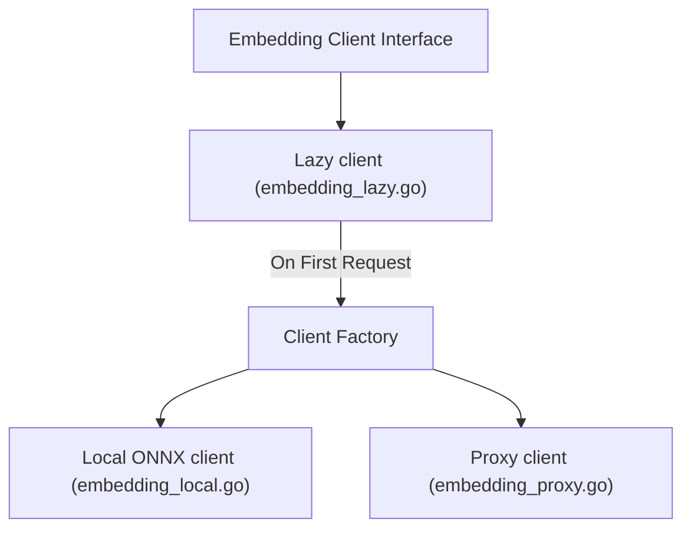

# AI Engine Specification

The AI Engine module coordinates local model initialization, text vector embedding generation, and LLM API completions.
It keeps embedding client startup times low and ensures private, local-first performance.

---

## 📦 Model Manager: Local-First Models

The `ModelManager` (`internal/ai/model_manager.go`) manages model downloads and checks local filesystem files:

- **Primary Model**: CodeRankEmbed-137M (packaged as an ONNX model file).
- **Storage Path**: `~/.graphit/models/coderank-embed-137m/`.
- **Download Automation**:
  On startup, the manager checks if the ONNX model and tokenizer config files exist.
  If missing, it downloads them from the Graphit Labs repository.

---

## 🔌 Embedding Backends

The module implements the `EmbeddingClient` interface through three decorators:

### 1. Local Embedding Client (`embedding_local.go`)
- **Engine**: Runs model inference locally using CGO bindings or ONNX Runtime.
- **Tokenization**: Parses input strings using a local byte-pair encoding (BPE) tokenizer.
- **Performance**: Generates vector representations of source files, classes, and methods, enabling private semantic search.

### 2. Proxy Embedding Client (`embedding_proxy.go`)
- **Backend**: Connects to external services (like Google Gemini API or OpenAI Embeddings) if configured by the user.
- **Fallbacks**: Delegates requests over HTTPS when local hardware is constrained (e.g. low-ram environments).

### 3. Lazy Embedding Client (`embedding_lazy.go`)
- **Problem**: Loading ONNX models into memory adds a startup penalty (several seconds), which slows down brief CLI commands.
- **Solution**: The lazy client intercepts initialization.
  It boots in a lightweight stub state, allocating resources and parsing files only when the first `CreateEmbeddings()` query is executed.

---

## 💬 AI Completions API

The completion dispatcher (`internal/ai/ai.go`) routes text synthesis prompts:

- **Client Configuration**: Leverages client settings configured globally in `~/.graphit/config.json`.
- **System Prompts**: Guides AI behaviors for key background tasks, including the wiki discovery synthesis loop, memory consolidation analyses, and code improvement suggestions.
- **Decoupling**: All chat completions are stateless, preserving the user's private data locally.
