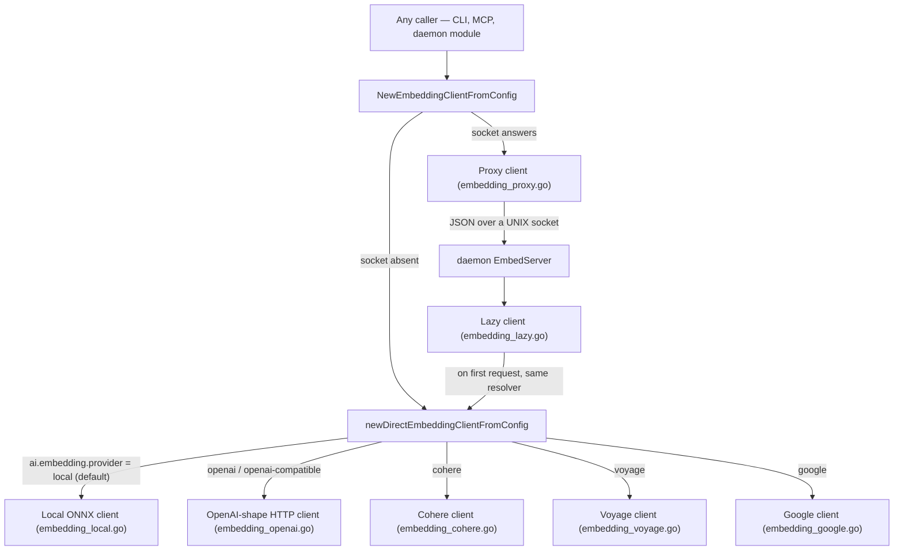

# AI Engine Specification

The AI Engine module coordinates local model resolution, text vector embedding
generation, reranking, and text completions.

Embedding and reranking are **local by default** — `ai.embedding.provider` and
`ai.rerank.provider` are `local` unless set otherwise, so an installation with no
configuration behaves exactly as before: vectors are computed on this machine by an
ONNX session, and the only network access is the one-time download of the model
weights, which happens only for whichever of the two is actually set to `local` (see
[the download-is-required section](#the-download-is-required-not-best-effort) below —
it now applies per backend, not unconditionally). Setting either to a remote provider
sends text to that provider's API instead and downloads nothing.

Completions are the separate stack that always leaves the machine, and they delegate
to a locally installed agent CLI rather than to an HTTP API — see
[AI Completions API](#-ai-completions-api) below.

---

## 📦 Model Manager: Downloaded Once, Shared By Everything

The `ModelManager` (`internal/ai/model_manager.go`) resolves the embedding model
and its tokenizer, downloading them when they are not already on the machine.

| | |
|---|---|
| **Model** | `CodeRankEmbed-137M-INT8`, ONNX, 768 dimensions (`ai.EmbeddingDimensions`) |
| **Files** | `model.onnx` (~132 MB) and `tokenizer.json` (~700 KB) |
| **Cache** | `~/.graphit/models/coderankembed/` (`modelCacheSubdir`) |
| **Origin** | `huggingface.co/mrsladoje/CodeRankEmbed-onnx-int8` |

### The model is not in the binary

It used to be. The build downloaded it, gzipped it, and `go:embed`-ed it into the
launcher, which extracted it on first run and then replaced it with a symlink into
the shared cache to avoid keeping a second copy per version. That put **103 MB of
compressed weights into every released binary** — more than everything else the
launcher carries — to ship a file that changes on a completely different schedule
from the code, and it made every CI build and every release pull it again.

Now `graphit setup` downloads it, once, straight into the cache. See
[The model arrives at setup, not inside the binary](../tasks/model-downloaded-at-setup-not-embedded.md).

### Resolution order

`EnsureModel` returns the first of these that holds files of at least the minimum
accepted size, and only downloads when none does:

1. **`models/` next to the core binary** — `findBundledModels`. The released
   binaries do not ship one. It exists for a private or air-gapped build that
   prefers to place the weights itself; see
   [Private Deployment](../guides/private_brand_customization.md).
2. **The shared cache** — `~/.graphit/models/coderankembed/`, where setup puts it.
3. **Download** — into the cache, via a temporary file renamed into place, so an
   interrupted transfer never leaves a half file that later passes the size check.

A file is accepted on size alone (`modelONNXMinSize`, `tokenizerJSONMinSize`);
there is no checksum, so a truncated download is caught but a corrupted one that
happens to be large enough is not — it surfaces later as an ONNX load failure.

### The download is required, not best-effort — for the local provider

`graphit setup` prompts for `ai.embedding.provider` and `ai.rerank.provider` before
this step (see [Configuring a provider at setup](#configuring-a-provider-at-setup)
below). Only when embedding is (still) `local` does this download run at all, and
when it does, it **fails** setup with a non-zero exit if it cannot obtain the model.
The reasoning is that an installation without the model cannot embed anything, so it
cannot answer a semantic query at all, and a setup that reported success would
defer the discovery to some later search that quietly returned keyword hits. A
remote embedding provider skips this step entirely — nothing local is needed to
call an HTTP API — and setup says so explicitly instead of silently doing nothing.

It is the last step of setup for that reason: the hub URL, the memory URL, the IDE
and the CLI are all written before it, so re-running setup after fixing the network
costs one pass through the prompts and loses nothing. It is deliberately stricter
than the hub and memory clones in the same command, which only warn — those retry
on the next command against a remote that may be momentarily unreachable, whereas
this is a fixed asset with a fixed URL that the tool needs in order to work.

`ModelCacheDir` is exported for this path: the failure message names the directory,
and a failed `EnsureModel` returns no path to derive it from.

### Progress reporting

`ModelManager.OnProgress` is an optional `ProgressFunc`. It fires once with zero
bytes before the transfer starts — so a caller can announce a 132 MB download
before there is anything to report — and then once per read, which is every 32 KB.
Nil means the download is silent, which is what every non-interactive caller wants.

**Throttling is the caller's job**, because how often a line may be repainted is a
property of where it is going, not of the download. `cmd/graphit/commands/model_setup.go`
holds that policy: a rewritten line refreshes ten times a second on a terminal,
while a log file gets one line per ten percent. `internal/output` renders it
(`DownloadLine`, `ProgressBar`, `HumanBytes`).

---

## 🔌 Embedding Backends

`NewEmbeddingClientFromConfig` (`internal/ai/embedding.go`) picks the backend. It
tries the daemon socket first, then resolves `ai.embedding.provider` directly
(`newDirectEmbeddingClientFromConfig`) — `local` by default, or one of `openai`,
`openai-compatible`, `cohere`, `voyage`, `google`.

The daemon's `EmbedServer` is provider-aware too: it wraps a `LazyEmbeddingClient`,
which now resolves through the same `newDirectEmbeddingClientFromConfig` the direct
path uses — never `NewEmbeddingClientFromConfig`, which would have the daemon try
to dial its own socket. So the proxy's process-sharing benefit (below) applies to
whichever provider is configured, not only to the local model.

Every backend implements the same `EmbeddingClient` interface
(`internal/ai/embedding.go`), including `Dimensions() int` — the width of the
vectors it produces. The vector store schema (AST search index and wiki store) is
built from `ai.ResolveConfiguredEmbeddingDimensions()` rather than from a hardcoded
constant, because that width is no longer always 768.

### 0. Local Embedding Client (`embedding_local.go`) — the default
- **Engine**: ONNX Runtime in-process, through the `onnxruntime_go` binding. The
  shared library is found next to the executable or on the platform's library path
  (`findORTLibrary`).
- **Tokenization**: `sugarme/tokenizer`, loaded from `tokenizer.json`. Inputs are
  capped at `maxSeqLen` 512 tokens; queries are prefixed with
  `Represent this query for searching relevant code: `.
- **Threads**: intra-op is bounded by the shared CPU budget (`sysutil.CPUBudget`)
  so background embedding does not take the machine; `GRAPHIT_EMBED_THREADS`
  overrides.
- **Containment**: `encodeSingle` recovers from panics raised inside the
  tokenizer, marks that one text as unembeddable and keeps the batch aligned. See
  [the crash-loop task log](../tasks/embedding-crash-loop-por-panic-do-tokenizador.md).
- **Dimensions**: fixed at 768 (`ai.EmbeddingDimensions`).

### Remote providers

Every remote client requires either `ai.embedding.api_key` or one of the
provider's own native environment variables (checked as a convenience fallback:
`OPENAI_API_KEY`, `COHERE_API_KEY`, `VOYAGE_API_KEY`, `GOOGLE_API_KEY` /
`GEMINI_API_KEY`). A missing key is a **construction-time error**, not a deferred
failure on the first query.

| Provider | Config value | Wire format | File | Default model |
|---|---|---|---|---|
| OpenAI | `openai` | OpenAI `/v1/embeddings` | `embedding_openai.go` | `text-embedding-3-small` (1536-dim) |
| OpenAI-compatible | `openai-compatible` | same shape, `ai.embedding.base_url` required | `embedding_openai.go` | none — set `ai.embedding.model` |
| Cohere | `cohere` | Cohere v2 `/embed` | `embedding_cohere.go` | `embed-english-v3.0` (1024-dim) |
| Voyage AI | `voyage` | Voyage `/v1/embeddings` | `embedding_voyage.go` | `voyage-3` (1024-dim) |
| Google | `google` | Generative Language API `embedContent`/`batchEmbedContents` | `embedding_google.go` | `text-embedding-004` (768-dim) |

- **`openai-compatible` is the vendor-agnostic protocol.** It is not a separate
  provider — it is the identical OpenAI wire-format client, pointed at a
  `ai.embedding.base_url` the operator supplies and with the API key optional
  (self-hosted servers frequently need none). This is what lets a self-hosted
  Ollama, vLLM, LM Studio, or Hugging Face TEI deployment work with no
  provider-specific code: any server speaking `/v1/embeddings` is reachable this
  way.
- **Dimensions come from a known-model table** (`internal/ai/embedding_dims.go`),
  consulted at construction time. An explicit `ai.embedding.dimensions` override
  always wins over the table — this is mandatory for `openai-compatible` (a
  self-hosted model has no canonical entry) and is how a caller truncates one of
  OpenAI's `text-embedding-3-*` models below its native width: when the override
  differs from that model's table width, the client sends the request-time
  `dimensions` field so OpenAI truncates server-side (Matryoshka representation
  learning) rather than the vector being truncated client-side afterward.
  A width that cannot be determined — an unknown model on a named provider, or
  `openai-compatible` with no override — is a **construction-time error**, never a
  guess.
- **Query vs. document asymmetry**: Cohere and Voyage both implement
  `QueryEmbedder.EmbedQuery`, sending `input_type: search_query` /
  `input_type: query` instead of the document variant — the same distinction the
  local client makes by prefixing the query text.

### Switching providers means reindexing

A vector column is fixed-width in Lance. A table built while `ai.embedding.provider`
was `local` (768-dim) and later written to under a different provider (a different
width) fails the write with a Lance/Arrow type error — a clear, fail-fast signal,
not silent corruption. After changing `ai.embedding.provider` or
`ai.embedding.model`, re-run the embedding step (`graphit ast embed`, and the
equivalent wiki/memory embed) to rebuild the index under the new width. The
per-shard embedding cache (`internal/ast/shard_emb_cache.go`) is self-invalidating
on a provider switch: each shard stores the dimension it was written with, and a
shard whose stored width no longer matches the active provider is dropped and
recomputed automatically, the same way a shard in an old file format is dropped.

### 2. Proxy Embedding Client (`embedding_proxy.go`)
- **Backend**: the **daemon's own `EmbedServer`** (`internal/daemon/embedserver.go`),
  reached over a UNIX socket at `~/.graphit/daemon/embed.sock`. Newline-delimited
  JSON: `{"texts":[…]}` or `{"query":"…"}` in, `{"vectors":[[…]]}` out.
- **Why**: loading the model, or paying for a remote provider's connection setup,
  costs something at process start. One process holds it and every short-lived CLI
  and MCP invocation borrows it instead of paying that cost again.
- **Selection**: chosen when the dial succeeds, which means the daemon is running.
  There is nothing to configure — it always serves whatever `ai.embedding.provider`
  currently resolves to, because it answers `ModelName()`/`Dimensions()` by reading
  the same config file the daemon reads, not by asking the daemon over the wire.

### 3. Lazy Embedding Client (`embedding_lazy.go`)
- **Problem**: the daemon builds its embedding client at startup, but a daemon
  that never embeds anything should not pay for the session.
- **Solution**: it holds the construction until the first request, then memoises
  the result — including the failure, so a broken install or a missing API key is
  not retried on every call. `Dimensions()` answers from config before the client
  is constructed, so a caller sizing a vector schema does not force a model load
  or a network round trip just to ask the question.

### Configuring a provider at setup

`graphit setup` prompts for `ai.embedding.provider` (and separately,
`ai.rerank.provider` — see below) right after the CLI prompt. Anything other than
`local` also prompts for a model, an API key (masked input), and — for
`openai-compatible` — a base URL. The same settings can be changed later without
re-running setup: `graphit config ai.embedding.provider <value>`, etc. — setup is a
convenience wrapper over the same config keys, nothing more.

---

## 🎯 Rerank Backends

Reranking is a **second, optional stage**, gated by `search.rerank` (default
`false`) independent of which rerank provider is configured — see
`config.ResolveSearchRerank`. `ai.rerank.provider` decides WHICH backend answers
when it is turned on; it does not turn reranking on by itself.

`ai.NewRerankerFromConfig` (`internal/ai/rerank_config.go`) resolves
`ai.rerank.provider` (default `local`) into a ready `*ai.RerankAdapter`:

| Provider | Config value | File | Default model |
|---|---|---|---|
| Local cross-encoder | `local` | `rerank_local.go` | `bge-reranker-base`, downloaded on first use (~1.04 GiB) |
| Cohere | `cohere` | `rerank_cohere.go` | `rerank-english-v3.0` |
| Voyage AI | `voyage` | `rerank_voyage.go` | `rerank-2` |
| Jina | `jina` | `rerank_jina.go` | `jina-reranker-v2-base-multilingual` |

- **`local` is unchanged.** `NewRerankerFromConfig` calls the existing
  `NewCrossEncoderReranker` (`internal/ai/rerank_local.go`), download-if-absent
  semantics and all — a cross-encoder scoring (query, candidate) pairs directly,
  distinct from the bi-encoder embedder used for the first retrieval stage.
  `NewCrossEncoderRerankerIfPresent` remains for a caller that wants reranking only
  when the model happens to already be on disk, without triggering a download.
- **Remote providers never download anything.** Each is an HTTP client against the
  provider's dedicated rerank endpoint (not the embeddings endpoint — the JSON
  shapes are provider-specific, unlike the embedding side's shared
  `openai-compatible` protocol; there is no vendor-agnostic rerank protocol here
  by design). A missing API key is a construction-time error.
- **Response reordering**: Cohere, Voyage, and Jina may return results in a
  different order than the candidates were sent (ranked by relevance, with an
  `index` field back to the input position). Each client maps `results[i].index`
  back onto the original candidate order before returning — `ai.Scorer.Score` is
  defined to return scores in the SAME order as its input, which `ai.RerankAdapter`
  relies on to reorder correctly.
- **No production call site yet.** `search.rerank`, `ai.CrossEncoderReranker`, and
  `lancestore.RerankConfig.Reranker` all exist and work end to end when wired
  together, but nothing under `cmd/`, `internal/mcpstdio`, or `internal/uiserver`
  currently constructs a reranker and passes it into a search call — this is a
  pre-existing gap, independent of provider selection, not something this work
  changed.

---

## 💬 AI Completions API

The completion dispatcher (`internal/ai/ai.go`) routes text synthesis prompts. This
is a **separate stack from embedding**, and the one place where work does leave the
machine: `NewClientFromConfig` resolves a locally installed **agent CLI** — the
`ai.cli` key, defaulting through `config.DefaultCLI()`, with `claude`, `gemini`,
`codex` and `cursor-agent` among the known binaries — and shells out to it. There
is no HTTP API client and no API key handling here either; whatever the chosen CLI
sends upstream is that CLI's business.

- **Client Configuration**: Leverages client settings configured globally in `~/.graphit/config.json`.
- **System Prompts**: Guides AI behaviors for key background tasks, including the wiki discovery synthesis loop, memory consolidation analyses, and autonomous skill generation.
- **Decoupling**: All chat completions are stateless, preserving the user's private data locally.
