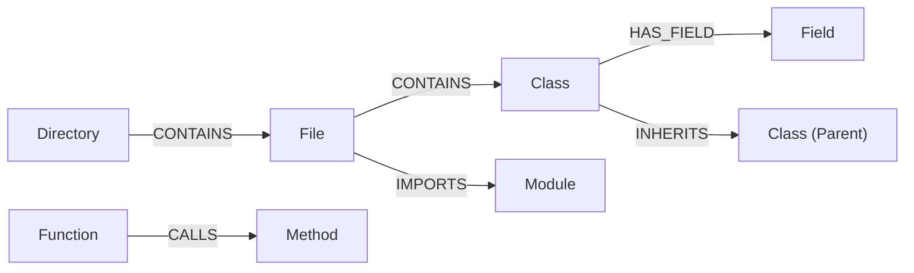

# AST Module Specification

The AST (Abstract Syntax Tree) module provides the structural foundation of Graphit Code.
It parses source files into an in-memory graph database, enabling AI agents to trace call graphs, locate definitions, and assess modification impacts using Cypher queries.

---

## 🌐 Supported Languages

Graphit Code supports **42 programming languages via 37 Tree-sitter grammars and 5 ANTLR v4 parsers**. Each language is fully defined by an **external YAML file** — queries, export detection, self-keywords, context types, entry point scoring, and comment handling are all configurable without recompilation. Adding support for a new language requires installing its grammar shared library via Hub; see [External YAML Configuration](#-external-yaml-configuration) for the full schema.

| # | Language | Parser | Extensions | Key Extracted Entities |
|---|---|---|---|---|
| 1 | **Go** | Tree-sitter | `.go` | Function, Method, Struct, Interface, Type, Constant, Variable, Field, Parameter |
| 2 | **TypeScript** | Tree-sitter | `.ts` | Function, Method, Class, Interface, Type, Enum, Variable, Field, Parameter, Decorator |
| 3 | **TypeScript (TSX)** | Tree-sitter | `.tsx` | Function, Method, Class, Interface, Type, Enum, Variable, Field, Parameter, Decorator |
| 4 | **JavaScript** | Tree-sitter | `.js`, `.jsx`, `.mjs` | Function, Method, Class, Variable, Field, Parameter, Export |
| 5 | **Python** | Tree-sitter | `.py` | Function, Class, Variable, Parameter, Decorator |
| 6 | **Java** | Tree-sitter | `.java` | Function, Constructor, Class, Record, Annotation, Interface, Enum, Variable, Field, Parameter, Package |
| 7 | **Rust** | Tree-sitter | `.rs` | Function, Struct, Enum, Trait, Type, Constant, Variable, Field, Parameter |
| 8 | **C** | Tree-sitter | `.c`, `.h` | Function, Struct, Enum, Type, Variable, Field, Parameter |
| 9 | **C++** | Tree-sitter | `.cpp`, `.hpp`, `.cc`, `.cxx` | Function, Class, Struct, Enum, Namespace, Type, Field, Parameter |
| 10 | **C#** | Tree-sitter | `.cs` | Function, Class, Interface, Enum, Struct, Property, Namespace, Field, Parameter |
| 11 | **Kotlin** | Tree-sitter | `.kt`, `.kts` | Function, Class, Object, Variable, Field, Parameter, Package |
| 12 | **Swift** | Tree-sitter | `.swift` | Function, Class, Struct, Enum, Protocol, Variable, Field, Parameter |
| 13 | **Dart** | Tree-sitter | `.dart` | Function, Method, Class, Enum, Mixin, Extension, Field, Parameter |
| 14 | **PHP** | Tree-sitter | `.php` | Function, Method, Class, Interface, Trait, Enum, Constant, Package, Field, Parameter |
| 15 | **Ruby** | Tree-sitter | `.rb` | Function, Class, Module, Variable, Field, Parameter |
| 16 | **SQL** | Tree-sitter | `.sql` | Function, Table, View |
| 17 | **XML** | Tree-sitter | `.xml`, `.xsl`, `.xslt`, `.xsd`, `.svg`, `.wsdl`, `.plist`, `.xhtml` | Element |
| 18 | **PL/SQL** | ANTLR v4 | `.sql`, `.pks`, `.pkb`, `.pls`, `.plb`, `.prc`, `.fnc`, `.trg`, `.typ`, `.bdy`, `.spc`, `.vw` | Function, Procedure, Package, Table, View, MaterializedView, Trigger, Type, Index, Sequence, Synonym, DBLink, Column, Parameter, Variable, Constant, Cursor, Exception, Constraint, Savepoint |
| 19 | **PostgreSQL** | ANTLR v4 | `.sql`, `.pgsql`, `.plpgsql`, `.pg` | Function, Procedure, Table, View, MaterializedView, Schema, Trigger, Sequence, Index, Extension, Type (domain/composite/enum/range), Column, Parameter, Constraint, Variable |
| 20 | **DB2** | ANTLR v4 | `.sql`, `.db2` | Function, StoredProcedure, Table, View, Trigger, Index, Sequence, Type, Schema, Alias, Tablespace, Column, Parameter, Variable |
| 21 | **T-SQL** | ANTLR v4 | `.sql`, `.tsql` | StoredProcedure, Function, Table, View, Trigger, Index, Sequence, Type, Schema, Column, Parameter, Variable |
| 22 | **COBOL 85** | ANTLR v4 | `.cob`, `.cbl`, `.cpy`, `.cobol` | Program, Section, Paragraph, DataItem, FileDescription, ConditionName |
| 23 | **HTML** | Tree-sitter | `.html`, `.htm` | Element |
| 24 | **Bash** | Tree-sitter | `.sh`, `.bash` | Function, Variable |
| 25 | **Clojure** | Tree-sitter | `.clj`, `.cljs`, `.cljc`, `.edn` | Function, Variable, Namespace |
| 26 | **Dockerfile** | Tree-sitter | `Dockerfile`, `.dockerfile` | Stage, Instruction |
| 27 | **Elixir** | Tree-sitter | `.ex`, `.exs` | Function, Module, Variable |
| 28 | **GraphQL** | Tree-sitter | `.graphql`, `.gql` | Type, Field, Query, Mutation, Subscription |
| 29 | **Groovy** | Tree-sitter | `.groovy`, `.gradle` | Function, Class, Variable |
| 30 | **Haskell** | Tree-sitter | `.hs` | Function, Type, Class, Module |
| 31 | **HCL** | Tree-sitter | `.tf`, `.hcl` | Block, Variable |
| 32 | **JSON** | Tree-sitter | `.json`, `.jsonc` | Object, Array |
| 33 | **Julia** | Tree-sitter | `.jl` | Function, Struct, Module, Variable |
| 34 | **Lua** | Tree-sitter | `.lua` | Function, Variable |
| 35 | **Markdown** | Tree-sitter | `.md`, `.markdown` | Heading, Link |
| 36 | **Objective-C** | Tree-sitter | `.m`, `.mm` | Function, Class, Method, Protocol, Property |
| 37 | **Protocol Buffers** | Tree-sitter | `.proto` | Message, Enum, Service, RPC |
| 38 | **R** | Tree-sitter | `.r`, `.R` | Function, Variable |
| 39 | **Scala** | Tree-sitter | `.scala`, `.sc` | Function, Class, Object, Trait, Variable |
| 40 | **TOML** | Tree-sitter | `.toml` | Table, Key |
| 41 | **YAML** | Tree-sitter | `.yaml`, `.yml` | Mapping, Sequence |
| 42 | **Zig** | Tree-sitter | `.zig` | Function, Struct, Enum, Variable |

### Cross-Language Extraction Capabilities

For every supported language, the parser extracts the following relationship data (when applicable to the language):

| Capability | Description | Languages |
|---|---|---|
| **Function Calls** | Traces which functions/methods call which others | All 42 |
| **Import Resolution** | Maps module dependencies and import chains | All except SQL dialects |
| **Class Inheritance** | `extends` / superclass relationships | JS, TS, Python, Java, C#, C++, Kotlin, Swift, Dart, PHP, Ruby |
| **Interface Implementation** | `implements` / protocol conformance | TS, Java, C#, Kotlin, PHP, Rust |
| **Field Access Tracking** | Reads and writes to class/struct fields | Go, JS, TS, Java, C#, C, C++, Kotlin, Swift, Python, Rust, PHP, Ruby |
| **Decorator / Annotation** | Attribute / annotation extraction | TS, Python, Java, C#, Kotlin, Swift, Rust, PHP |
| **Object Instantiation** | `new` expression tracking | JS, TS, Java, C#, C++, PHP |
| **Cyclomatic Complexity** | Computed for every function/method | All 42 |
| **Export Visibility** | `is_exported` flag per entity — detection strategy is configurable via the `exports` field in language YAML (see [Export Strategies](#export-strategies)) | All 42 (strategy varies by language) |
| **DML Tracking** | `SELECTS`, `INSERTS`, `UPDATES`, `DELETES`, `ALTERS`, `DROPS`, `REFERENCES` edges for SQL statements | SQL, PL/SQL, PostgreSQL, T-SQL, DB2, COBOL 85 |

---

## 🗄️ Database Architecture: LadybugDB

The AST database is backed by **LadybugDB**, an embedded graph database from the `github.com/LadybugDB/go-ladybug` library.
It stores files, folders, and language entities as graph nodes, and import/calls/parent-child relations as edges.

### Node Schemas

The database initializes node tables with the following attributes:

| Node Label | Key Properties | Purpose |
|------------|----------------|---------|
| `File` | `path` (PK), `name`, `relative_path`, `is_dependency`, `lang`, `cluster`, `source` | Source file metadata and full raw source. |
| `Directory` | `path` (PK), `name`, `cluster` | File system directories. |
| `Module` | `uid` (PK), `name`, `lang`, `full_import_name`, `path`, `line_number`, `end_line` | Importable library modules. |
| `Class` / `Struct` / `Record` | `uid` (PK), `name`, `path`, `line_number`, `end_line`, `cyclomatic_complexity`, `is_exported` | Complex data structures and object types. `Record` = Java records. |
| `Function` / `Method` / `Constructor` | `uid` (PK), `name`, `path`, `line_number`, `end_line`, `cyclomatic_complexity`, `is_exported`, `entry_point_score` | Executable code blocks, member functions, and constructors. |
| `Procedure` / `StoredProcedure` | `uid` (PK), `name`, `path`, `line_number`, `end_line`, `is_exported` | SQL stored procedures (PL/SQL, PostgreSQL, T-SQL, DB2). |
| `Interface` / `Protocol` | `uid` (PK), `name`, `path`, `line_number`, `end_line`, `is_exported` | Abstract contracts. `Protocol` = Swift protocols. |
| `Trait` / `Mixin` | `uid` (PK), `name`, `path`, `line_number`, `end_line`, `is_exported` | Behavioral mixins. `Trait` = Rust/PHP. `Mixin` = Dart. |
| `Object` / `Annotation` | `uid` (PK), `name`, `path`, `line_number`, `end_line`, `is_exported` | `Object` = Kotlin singletons. `Annotation` = Java annotation types. |
| `Extension` | `uid` (PK), `name`, `path`, `line_number`, `end_line` | Dart extensions, PostgreSQL extensions. |
| `Field` / `Parameter` / `Variable` / `Property` | `uid` (PK), `name`, `lang`, `is_stub` | Variables, parameters, struct/class fields, and C# properties. |
| `Package` | `uid` (PK), `name`, `path`, `line_number`, `end_line` | PL/SQL packages, Java/Kotlin package declarations. |
| `Table` / `View` / `MaterializedView` | `uid` (PK), `name`, `path`, `line_number`, `end_line` | SQL database objects. |
| `Trigger` | `uid` (PK), `name`, `path`, `line_number`, `end_line` | SQL triggers. |
| `Index` / `Sequence` / `Constraint` | `uid` (PK), `name`, `path`, `line_number`, `end_line` | SQL schema objects. |
| `Column` | `uid` (PK), `name`, `path`, `line_number`, `end_line` | Table column definitions. |
| `Schema` / `Tablespace` | `uid` (PK), `name`, `path`, `line_number`, `end_line` | Database-level objects (PostgreSQL, DB2). |
| `Synonym` / `DBLink` / `Alias` | `uid` (PK), `name`, `path`, `line_number`, `end_line` | Object references and aliases (PL/SQL, DB2). |
| `Cursor` / `Exception` / `Constant` / `Savepoint` | `uid` (PK), `name`, `path`, `line_number`, `end_line` | PL/SQL declaration entities. |

### Relationship Schemas

Nodes are connected through typed relationships:



- **`CONTAINS`**: Hierarchical ownership (e.g. `Directory -> Directory`, `Directory -> File`, or `File -> Function`).
- **`IMPORTS`**: Dependency resolution. Attributes: `alias`, `full_import_name`, `imported_name`, `line_number`, `source_file`.
- **`CALLS`**: Direct function/method invocations. Attributes: `source_file`, `line_number`, `full_call_name`, `receiver_type`.
- **`HAS_PARAMETER`**: Function signatures. Connects caller entities to `Parameter` nodes.
- **`HAS_FIELD`**: Class/Struct fields. Connects definitions to `Field` nodes.
- **`READS_FIELD` / `WRITES_FIELD`**: Data access tracing. Tells which methods read or write to which fields.
- **`INHERITS` / `IMPLEMENTS`**: Class inheritance and interface implementations.
- **`SELECTS` / `INSERTS` / `UPDATES` / `DELETES`**: DML statement tracking for SQL and PL/SQL. Connects functions/procedures to the tables they operate on.
- **`ALTERS` / `DROPS`**: DDL statement tracking. Connects entities to the database objects they modify or remove.
- **`REFERENCES`**: Generic dependency reference (e.g., foreign key constraints, type references in PL/SQL).

---

## 🔀 Cypher Translation Layer

LadybugDB uses standard graph database constraints, but does not support all complex Cypher filter formats.
`internal/ast/ladybug.go` intercepts and translates Cypher queries:

1. **Label Filtering**:
   Converts standard Neo4j-style syntax `MATCH (n:File)` or `WHERE n:File` to explicitly match against the `label(n)` function:
   ```diff
   - MATCH (n:File)
   + MATCH (n) WHERE label(n) = 'File'
   ```
2. **Keyword Escaping**:
   Because labels like `File`, `Directory`, and `Module` are reserved words in LadybugDB's parser, the translator wraps them in backticks automatically:
   ```diff
   - MATCH (f:File)-[r:CONTAINS]->(fn:Function)
   + MATCH (f:`File`)-[r:CONTAINS]->(fn:`Function`)
   ```
3. **Transaction batching**:
   Applies `ON CREATE SET` translation to normal `SET` query updates.

---

## 🔍 Parser Adapters & Native CGO Runtime

The engine uses a **dual-parser architecture** — Tree-sitter and ANTLR v4. The YAML `parser:` field in each language configuration determines which backend is used; Tree-sitter is the default when the field is omitted.

- **Tree-sitter**: Incremental, fast, and the default parser. Grammars are dynamically loaded as platform-native shared libraries (`.so`/`.dylib`/`.dll`) via CGO `dlopen`/`dlsym`. The `DynGrammarLoader` resolves grammar binaries using a cascading search path: **project → user global → runtime**. No static compilation required — new grammars can be installed via `graphit hub install`.
- **ANTLR v4**: Full grammar parsing for complex languages. Uses per-grammar **sidecar binaries** with IPC (stdin/stdout, length-prefixed protocol buffers). Each sidecar includes exactly one grammar, selected by Go build tags. Sidecar processes are pooled and reused across parse calls for maximum performance.

Both parsers are loaded **lazily** on first use — no eager loading at startup. This means startup time is constant regardless of the number of supported languages or installed grammars.

### Tree-sitter Dynamic Loading Architecture

Tree-sitter grammars are loaded dynamically at runtime:
- **`DynGrammarLoader`** (`internal/ast/treesitter_dynload.go`) resolves and loads shared libraries via CGO `dlopen`/`dlsym`.
- **Search path hierarchy**: project (`.graphit/grammars/treesitter/`) → user global (`~/.graphit/grammars/treesitter/`) → runtime (`~/.graphit/runtime/<version>/grammars/treesitter/`).
- **16 default grammars** (Go, Python, JS, TS, TSX, Java, Kotlin, Rust, C#, C++, C, Ruby, PHP, Swift, Dart, SQL) are embedded in the launcher and extracted to the runtime directory on first run.
- **Additional grammars** are installed via `graphit hub install <language>`, which extracts the platform-specific binary from a `.grammar` fat archive.
- **Cache**: Loaded `sitter.Language` handles are cached in a `sync.Map` — zero allocations after first load.
- **Thread safety**: `sitter.Language` instances are read-only and shared across all worker goroutines.

### ANTLR v4 Sidecar Architecture

ANTLR grammars (PL/SQL, PostgreSQL, T-SQL, DB2, COBOL 85) are compiled as standalone **sidecar binaries** — one per grammar. The adapter (`internal/ast/antlr_adapter.go`) communicates with sidecars via stdin/stdout IPC using length-prefixed protocol buffers:
- **`SidecarDriver`** (`internal/ast/antlr_sidecar.go`) manages a pool of reusable sidecar processes.
- **Search path hierarchy**: project (`.graphit/grammars/antlr/`) → user global (`~/.graphit/grammars/antlr/`) → runtime (`~/.graphit/runtime/<version>/grammars/antlr/`).
- **Installation**: ANTLR grammars are NOT default — they are installed via `graphit hub install <language>`, which extracts the sidecar binary for the current platform.
- **Build tags**: Each grammar is isolated behind a Go build tag (`grammar_plsql`, `grammar_postgresql`, etc.), compiled via `make grammars-antlr`.
- **Performance**: Pooled sidecar IPC is ~6x faster than in-process parsing with 89% fewer allocations on the client side.

### Grammar Resolution Chain

The AST module resolves grammar binaries and language configurations using a cascading chain:

**YAML query files** (extensions, parser type, query definitions):

| Priority | Path | Managed By |
|----------|------|------------|
| 1 | `.graphit/ast/queries/` | Project |
| 2 | `~/.graphit/ast/queries/` | User |
| 3 | `~/.graphit/runtime/<version>/ast/queries/` | Framework |

**Grammar binaries** (shared libraries and sidecar binaries):

| Priority | Path | Managed By |
|----------|------|------------|
| 1 | `.graphit/grammars/treesitter/` or `.graphit/grammars/antlr/` | Project (Hub install) |
| 2 | `~/.graphit/grammars/treesitter/` or `~/.graphit/grammars/antlr/` | User |
| 3 | `~/.graphit/runtime/<version>/grammars/treesitter/` or `grammars/antlr/` | Framework (Launcher defaults) |

**Key types:**

| Type | Package | Role |
|------|---------|------|
| `sitter.Language` | `sitter` | Native grammar compiled via CGO used to instantiate parsers and queries |
| `TreeSitterParser` | `ast` | Adapter that handles Tree-sitter AST queries, extraction, and context resolution |

### Concurrency Model

Under CGO, individual `sitter.Parser` instances are not thread-safe and must not be used concurrently. The engine resolves this by allocating isolated parser instances inside each concurrent worker goroutine:
- Parser instances are created dynamically when a worker processes a file.
- The underlying `sitter.Language` structures are read-only and thread-safe, so they are safely shared across all workers.
- Zero mutexes or locks are used during parsing, resulting in full parallel performance across all CPU cores.

### Tree-sitter Adapter (`internal/ast/treesitter_adapter.go`)

Bridges the Tree-sitter native CGO runtime with the indexing pipeline. For each file:
1. Resolves the static `sitter.Language` instance from the global map.
2. Creates a thread-local parser and parses the source into a syntax tree.
3. Runs all YAML-defined queries to extract entities and relationships.
4. Returns a `ParsedFile` with structured data for graph insertion.

### ANTLR Adapter (`internal/ast/antlr_adapter.go`)

Bridges the native Go ANTLR runtime with the indexing pipeline. Uses a `GrammarDriver` registry pattern to dispatch to the correct grammar. For each file:
1. Resolves the matching grammar driver(s) from the registry.
2. Invokes the driver's `Parse()` method which runs two-stage SLL→LL parsing.
3. Converts the ANTLR parse tree to the shared `TreeNode` representation.
4. Runs XPath pattern matching and extracts entities.
5. Returns a `ParsedFile` with structured data for graph insertion.

When multiple ANTLR grammars support the same extension (e.g., `.sql`), the adapter tries each in sequence (PL/SQL → PostgreSQL → DB2 → T-SQL → COBOL 85) and returns the first result that successfully extracts entities.

### `--grammar` CLI Flag

When both Tree-sitter and ANTLR grammars exist for the same file extension (e.g., `.sql`), Tree-sitter is used by default. The `--grammar` flag overrides this, selecting a specific grammar per extension:

```bash
graphit sync --grammar .sql=antlr-plsql
graphit init --grammar .sql=antlr-plsql,.pks=antlr-plsql
```

The grammar name determines the backend automatically: `antlr-*` uses ANTLR v4, all others use tree-sitter. This is propagated as `GrammarOverrides map[string]string` through `PipelineOptions` → `CompositeParser`.

---

## 🎯 External YAML Configuration

All query patterns and language behavior settings are defined as **external YAML files** rather than hardcoded in the binary. This allows users to customize which AST entities are extracted from each language — adding new patterns, removing defaults, or completely replacing the query set — without recompiling. The language YAML also controls parser selection, export detection, self-reference keywords, context type mapping, anonymous function resolution, docstring attachment, and comment recognition.

### YAML Query Schema

Each language has a dedicated YAML file defining the query patterns used during parsing. Tree-sitter languages use S-expression patterns; ANTLR languages use XPath expressions:

```yaml
# --- Tree-sitter example (default parser) ---
language: go                    # Language name (required)
extensions: [".go"]             # File extensions to match (optional — if omitted, applies to all extensions of the language)
replace: false                  # false = append to lower-priority queries; true = completely replace them
queries:
  - data_key: functions         # Internal category (functions, classes, imports, calls, etc.)
    graph_label: Function       # LadybugDB node label (empty = relational data like calls/heritage)
    pattern: '(function_declaration name: (identifier) @name)'
    name_capture: name          # Capture group for the entity name (defaults to "name")

  - data_key: calls             # Relation example — edges, not nodes
    type: relation              # "entity" (default) or "relation"
    relation_type: CALLS        # How the relation is routed (see Relation Routing)
    graph_label: ""             # Empty — relational data only
    pattern: '(call_expression function: (identifier) @name)'

  - data_key: goroutines        # Custom category example
    graph_label: Function
    pattern: '(go_statement (call_expression function: (identifier) @fn))'
    name_capture: fn
```

```yaml
# --- ANTLR v4 example ---
language: plsql
parser: antlr4                  # Selects ANTLR backend (default: tree-sitter when omitted)
grammar: antlr-plsql            # Maps to the native grammar identifier
start_rule: sql_script           # ANTLR start rule
extensions: [".sql", ".pks", ".pkb", ".pls", ".plb", ".prc", ".fnc", ".trg", ".typ", ".bdy", ".spc", ".vw"]
queries:
  - data_key: functions
    graph_label: Function
    pattern: '//create_function_body'             # XPath syntax instead of S-expressions
    name_capture: '//create_function_body/function_name'  # XPath expression for entity name

  - data_key: dml_selects
    type: relation
    relation_type: SELECTS
    graph_label: ""
    pattern: '//select_statement//table_ref_aux'
```

**Query Fields:**

| Field | Required | Description |
|---|---|---|
| `language` | ✅ | Language identifier (e.g., `go`, `python`, `plsql`) |
| `parser` | ❌ | Parser backend: `"tree-sitter"` (default) or `"antlr4"`. Determines pattern syntax and runtime |
| `grammar` | ⚠️ | Required for ANTLR. Maps to the native grammar identifier (e.g., `antlr-plsql`) |
| `start_rule` | ⚠️ | Required for ANTLR. The grammar's start rule (e.g., `sql_script`) |
| `extensions` | ❌ | File extensions filter. If omitted, applies to all extensions registered for the language |
| `replace` | ❌ | When `true`, replaces all lower-priority queries for this language. Default: `false` (append) |
| `queries[].data_key` | ✅ | Internal entity category. Standard keys: `functions`, `methods`, `classes`, `structs`, `interfaces`, `enums`, `types`, `traits`, `imports`, `exports`, `variables`, `constants`, `calls`, `instantiations`, `parameters`, `fields`, `field_reads`, `field_writes`, `heritage`, `implements`, `decorators`, `namespaces`, `packages`, `modules`, `tables`, `views`, `dml_selects`, `dml_inserts`, `dml_updates`, `dml_deletes` |
| `queries[].type` | ❌ | `"entity"` (default) or `"relation"`. Determines how the engine processes the extracted data. Entities become graph nodes; relations become edges (CallSites or References) |
| `queries[].relation_type` | ⚠️ | Required when `type: "relation"`. Defines how the relation is routed: `CALLS` and `INSTANTIATES` → CallSites, `DECORATOR` and `EXPORT` → special internal processing, `SELECTS` / `INSERTS` / `UPDATES` / `DELETES` / `ALTERS` / `DROPS` / `REFERENCES` → DML/DDL edges, all others (e.g. `INHERITS`, `IMPLEMENTS`, `READS_FIELD`, `WRITES_FIELD`) → References. See [Relation Routing](#relation-routing) |
| `queries[].graph_label` | ❌ | LadybugDB node label. If empty, the data is used for relationship extraction only (e.g., calls, heritage) |
| `queries[].pattern` | ✅ | Tree-sitter S-expression pattern or ANTLR XPath expression, depending on the `parser` field |
| `queries[].name_capture` | ❌ | For Tree-sitter: name of the capture group (defaults to `name`). For ANTLR: XPath expression to extract the entity name from the parse tree |

### Relation Routing

When a query has `type: relation`, the `relation_type` field determines how the extracted data is routed through the engine:

| `relation_type` | Destination | Description |
|---|---|---|
| `CALLS` | `result.CallSites` | Standard function/method call edges |
| `INSTANTIATES` | `result.CallSites` | Constructor invocations — stored with a `new:` prefix on the call name |
| `DECORATOR` | Internal: `attachDecorators` | Consumed by the decorator attachment pipeline |
| `EXPORT` | Internal: `detectExports` | Consumed by the export detection pipeline |
| `SELECTS` | `result.DMLEdges` | SELECT statement → table edges (SQL/PL/SQL) |
| `INSERTS` | `result.DMLEdges` | INSERT statement → table edges |
| `UPDATES` | `result.DMLEdges` | UPDATE statement → table edges |
| `DELETES` | `result.DMLEdges` | DELETE statement → table edges |
| `ALTERS` | `result.DMLEdges` | ALTER statement → database object edges |
| `DROPS` | `result.DMLEdges` | DROP statement → database object edges |
| `REFERENCES` | `result.DMLEdges` | Generic dependency references (e.g., foreign keys, type references) |
| Any other string | `result.References` | Generic references — used for `INHERITS`, `IMPLEMENTS`, `READS_FIELD`, `WRITES_FIELD`, and any custom relation type |

> **Extensibility:** New relation types can be added via YAML without recompilation. Any `relation_type` string that doesn't match one of the special cases above is automatically routed to `result.References`. For field-access relations (e.g., `READS_FIELD`, `WRITES_FIELD`), the engine uses the entity's context to resolve the target field. DML relation types (`SELECTS` through `REFERENCES`) are available for both Tree-sitter and ANTLR-based languages, enabling full data-flow tracking in SQL-centric codebases.

### Language Configuration Fields

Beyond queries, each language YAML file can define additional fields that control how the engine processes entities for that language. All fields are optional — the engine uses sensible defaults when they are omitted. A YAML file is valid if it has either `queries` entries **or** at least one language configuration field.

```yaml
language: python
extensions: [".py"]
queries: [...]                   # Tree-sitter query patterns (see above)

# --- Language Configuration Fields (all optional) ---
exports:
  strategy: no_prefix
  config:
    prefix: "_"

self_keywords: ["self."]

context_types:
  class_definition: Class
  function_definition: Function

anon_func_types:
  - arrow_function
  - function_expression

declaration_types:
  - function_definition
  - class_definition

comment_types:
  - comment
  - block_comment
```

**Language Configuration Fields:**

| Field | Type | Description |
|---|---|---|
| `exports` | Object | Export detection strategy configuration. Controls how the engine sets `is_exported` on each entity. See [Export Strategies](#export-strategies) |
| `self_keywords` | `string[]` | Array of self-reference keywords used for receiver type resolution during call tracking. Examples: `["this."]` for Java/JS/TS, `["self."]` for Python/Rust/Swift. Empty array for languages without self-references (Go, C) |
| `context_types` | `map[string]string` | Maps Tree-sitter node type names to graph labels for parent context resolution. Determines which AST containers provide the `context` and `context_type` properties for nested entities. Example: `class_definition: Class` causes functions inside a `class_definition` node to receive `context_type: Class` |
| `anon_func_types` | `string[]` | Array of Tree-sitter node types that represent anonymous functions. Used to resolve `variable_declarator` assignments to function entities (e.g., `const fn = () => {}` becomes a Function node). Example: `["arrow_function", "function_expression"]` for JavaScript |
| `declaration_types` | `string[]` | Array of Tree-sitter node types that can have docstrings attached. The engine looks for comment nodes immediately before these declaration types and extracts the text as the entity's `docstring` property |
| `comment_types` | `string[]` | Array of Tree-sitter node types recognized as comments. Used by the docstring extraction engine. Common values: `["comment", "block_comment", "line_comment"]` |

#### Export Strategies

The `exports` field defines how the engine determines the `is_exported` flag on each entity. Seven strategies are supported:

| Strategy | Languages | Logic | Config Fields |
|---|---|---|---|
| `capitalized_name` | Go | Entity is exported if its name starts with an uppercase letter | None |
| `export_statement` | JavaScript, TypeScript | Entity is exported if it appears inside an `export` statement (matched via a `data_key: exports` query) | None |
| `modifier` | Java, C#, Rust, PHP | Entity is exported if its parent declaration contains a specific modifier keyword | `config.keyword` — the modifier to check for (e.g., `"public"`) |
| `no_prefix` | Python, Ruby, Dart | Entity is exported if its name does NOT start with a specific prefix | `config.prefix` — the private prefix (e.g., `"_"`) |
| `no_modifier` | Swift | Entity is exported if its parent declaration does NOT contain any of the specified access-control keywords | `config_list.keywords` — array of private keywords (e.g., `["private", "fileprivate"]`) |
| `no_static` | C, C++ | Entity is exported if its declaration does NOT have the `static` modifier (file-scope linkage) | None |
| `none` | SQL | No export detection — `is_exported` is always `false` | None |

**`exports` Sub-Fields:**

| Field | Type | Required | Description |
|---|---|---|---|
| `strategy` | `string` | ✅ | One of the 7 strategy names listed above |
| `config` | `map[string]string` | ❌ | Key-value pairs for strategies that need a single config value. Used by `modifier` (`keyword`) and `no_prefix` (`prefix`) |
| `config_list` | `map[string][]string` | ❌ | Key-to-list pairs for strategies that need multiple values. Used by `no_modifier` (`keywords`) |

**Examples:**

```yaml
# Go — capitalized names are exported
exports:
  strategy: capitalized_name

# Java — entities with "public" modifier are exported
exports:
  strategy: modifier
  config:
    keyword: "public"

# Python — names NOT starting with "_" are exported
exports:
  strategy: no_prefix
  config:
    prefix: "_"

# Swift — entities WITHOUT "private" or "fileprivate" are exported
exports:
  strategy: no_modifier
  config_list:
    keywords: ["private", "fileprivate"]

# C — non-static functions are exported
exports:
  strategy: no_static

# SQL — no export concept
exports:
  strategy: none
```

### Resolution Chain (3 Levels)

Query files are resolved using a cascading priority system. For each language, the **highest-priority source** that provides queries wins — lower sources are not merged in. The resolution order is **project → user global → runtime** — all levels are YAML-only. Everything — parser selection, extensions, queries, exports, context types — is externalized and customizable without recompilation.

```
┌─────────────────────────────────────────────────────────────────────────────┐
│  Priority 1 — Project Override                                             │
│  .graphit/ast/queries/<language>.yaml                                      │
│  Applies only to this project. Highest priority.                           │
├─────────────────────────────────────────────────────────────────────────────┤
│  Priority 2 — User Global                                                  │
│  ~/.graphit/ast/queries/<language>.yaml                                    │
│  User-editable. Applies to all projects. NEVER written by the framework.   │
├─────────────────────────────────────────────────────────────────────────────┤
│  Priority 3 — Runtime Defaults                                             │
│  ~/.graphit/runtime/<version>/ast/queries/<language>.yaml                  │
│  Managed by the framework. Extracted by the launcher during binary setup.  │
│  Overwritten on each version upgrade.                                      │
└─────────────────────────────────────────────────────────────────────────────┘
```

**Key behaviors:**
- The launcher automatically extracts all 42 default YAML files during binary setup to `~/.graphit/runtime/<version>/ast/queries/`.
- The **runtime directory is version-scoped** — each binary version gets its own clean set of defaults, so upgrades never conflict with previous versions.
- The **user global directory** (`~/.graphit/ast/queries/`) is never touched by the framework. Only the user creates/edits files there.
- If a **project** has a `go.yaml`, only Go queries come from the project level; other languages still resolve normally through user → runtime.

### Directory Structure

```
~/.graphit/
├── ast/
│   ├── queries/                    ← User Global (Priority 2) — user-editable
│   │   └── go.yaml                 ← Custom Go queries for all projects
│   ├── frameworks/                 ← User Global frameworks (see Framework YAML section)
│   └── ecosystems.yaml             ← User Global ecosystem overrides
│
└── runtime/
    └── v1.2.3/
        └── ast/
            ├── queries/            ← Runtime Defaults (Priority 3) — framework-managed
            │   ├── c.yaml
            │   ├── cpp.yaml
            │   ├── csharp.yaml
            │   ├── dart.yaml
            │   ├── go.yaml
            │   ├── java.yaml
            │   ├── javascript.yaml
            │   ├── kotlin.yaml
            │   ├── php.yaml
            │   ├── python.yaml
            │   ├── ruby.yaml
            │   ├── plsql.yaml
            │   ├── postgresql.yaml
            │   ├── tsql.yaml
            │   ├── db2.yaml
            │   ├── cobol85.yaml
            │   ├── html.yaml
            │   ├── rust.yaml
            │   ├── sql.yaml
            │   ├── swift.yaml
            │   ├── tsx.yaml
            │   ├── typescript.yaml
            │   └── xml.yaml
            ├── frameworks/         ← Runtime Default frameworks
            │   ├── _go_lang.yaml
            │   ├── _python_lang.yaml
            │   ├── spring.yaml
            │   ├── django.yaml
            │   └── ... (59 framework files)
            └── ecosystems.yaml     ← Runtime Default ecosystem mappings

your-project/
└── .graphit/
    └── ast/
        ├── queries/                ← Project Override (Priority 1)
        │   └── go.yaml             ← Custom Go queries for this project only
        ├── frameworks/             ← Project-level framework rules
        │   └── my_framework.yaml
        └── ecosystems.yaml         ← Project-level ecosystem entries
```

### Implementation Details

- **Loader:** `internal/ast/query_loader.go` — handles loading, parsing, validation, and caching.
- **Launcher Extraction:** YAML files are extracted by the launcher to `~/.graphit/runtime/<version>/ast/` during binary setup — no embedded FS in the binary.
- **Thread Safety:** All caches use `sync.Map` and `sync.Once` for safe concurrent access during parallel file parsing.
- **Runtime Dir:** `brand.RuntimeDir(version)` returns `~/.graphit/runtime/<version>/` — version-scoped to avoid conflicts across upgrades.

---

## 🏗️ Framework YAML Configuration

Framework YAML files provide **YAML-driven framework and library detection** — recognizing frameworks through decorators, class inheritance, and import paths — and define **entry point scoring rules** that assign importance scores to functions based on their names, decorators, and export status.

### Purpose

When the engine indexes a project, framework YAML files allow it to:
- **Detect frameworks** by matching decorator names (e.g., `@RestController` → Spring), parent class/interface names (e.g., `JpaRepository` → Spring Data), and import paths (e.g., `github.com/gin-gonic/gin` → Gin)
- **Score entry points** by assigning importance scores to functions based on name patterns (glob-style), decorator presence, and export visibility — used by the `entry_point_score` property on Function/Method nodes

### Framework YAML Schema

```yaml
framework: spring                # Framework identifier (required)
languages: [java, kotlin]        # Languages this framework applies to (optional — all if omitted)

decorator_detection:             # Detect framework via decorator/annotation names
  - name: RestController
    category: web
  - name: Service
    category: di
    framework_name: spring_di    # Override parent framework name (optional)

heritage_detection:              # Detect framework via class inheritance / interface implementation
  - parent: JpaRepository
    category: orm
    framework_name: spring_data  # Override parent framework name (optional)

import_detection:                # Detect framework via import paths
  - pattern: "org.springframework"
    match: prefix                # "prefix" (default), "exact", "contains", "suffix", or "regex"
    category: web
    framework_name: spring       # Override parent framework name (optional)

entry_points:                    # Entry point scoring rules
  names:                         # Score by function name (glob patterns)
    - pattern: main
      score: 80
    - pattern: "Test*"
      score: 60
    - pattern: "*Handler"
      score: 30

  decorators:                    # Score by decorator presence
    - name: GetMapping
      score: 70
    - name: Controller
      score: 50

  exported_bonus: 10             # Bonus score for exported functions
  max_score: 100                 # Score cap (prevents runaway accumulation)
```

**Top-Level Fields:**

| Field | Required | Type | Description |
|---|---|---|---|
| `framework` | ✅ | `string` | Framework identifier (e.g., `spring`, `django`, `react`). Used as the default framework name in detection results |
| `languages` | ❌ | `string[]` | Languages this framework applies to. If omitted, applies to all languages. Language names match those in query YAML files |
| `decorator_detection` | ❌ | `DecoratorRule[]` | Rules to detect framework usage via decorator/annotation names |
| `heritage_detection` | ❌ | `HeritageRule[]` | Rules to detect framework usage via parent class or interface names |
| `import_detection` | ❌ | `ImportRule[]` | Rules to detect framework usage via import path patterns |
| `entry_points` | ❌ | `EntryPointConfig` | Entry point scoring configuration |

**Detection Rule Sub-Schemas:**

| Field | Type | Description |
|---|---|---|
| `decorator_detection[].name` | `string` | Decorator/annotation name to match (e.g., `RestController`, `pytest.fixture`) |
| `decorator_detection[].category` | `string` | Framework category (e.g., `web`, `di`, `orm`, `test`, `config`) |
| `decorator_detection[].framework_name` | `string` | Optional override for the parent `framework` name |
| `heritage_detection[].parent` | `string` | Parent class or interface name to match |
| `heritage_detection[].category` | `string` | Framework category |
| `heritage_detection[].framework_name` | `string` | Optional override for the parent `framework` name |
| `import_detection[].pattern` | `string` | Import path pattern to match against |
| `import_detection[].match` | `string` | Match mode: `"prefix"` (default, path starts with pattern), `"exact"` (full match), `"contains"` (pattern appears anywhere in the path), `"suffix"` (path ends with pattern), or `"regex"` (pattern is a Go regexp) |
| `import_detection[].category` | `string` | Framework category |
| `import_detection[].framework_name` | `string` | Optional override for the parent `framework` name |

**Entry Point Sub-Schema:**

| Field | Type | Description |
|---|---|---|
| `entry_points.names[]` | `NameScoreRule[]` | Name-based scoring rules. `pattern` supports glob syntax: `*` matches any characters, `?` matches a single character. Examples: `"main"` (exact), `"Test*"` (prefix), `"*Handler"` (suffix), `"cmd*"` (prefix) |
| `entry_points.names[].pattern` | `string` | Glob pattern to match against the function/method name |
| `entry_points.names[].score` | `int` | Score to assign when the pattern matches |
| `entry_points.decorators[]` | `DecoratorScoreRule[]` | Decorator-based scoring rules |
| `entry_points.decorators[].name` | `string` | Decorator name to match |
| `entry_points.decorators[].score` | `int` | Score to assign when the decorator is present |
| `entry_points.exported_bonus` | `int` | Bonus score added for exported functions (combines with name/decorator scores) |
| `entry_points.max_score` | `int` | Maximum score cap — final score is clamped to this value |

### Resolution: Additive Merge (3 Levels)

Unlike query files (which use **precedence override** — highest-priority source wins per language), framework files use **additive merging** — frameworks from all 3 levels are combined:

```
┌─────────────────────────────────────────────────────────────────────────────┐
│  Level 3 — Project Level (highest priority, extends all below)             │
│  .graphit/ast/frameworks/*.yaml                                            │
├─────────────────────────────────────────────────────────────────────────────┤
│  Level 2 — User Global (extends runtime)                                    │
│  ~/.graphit/ast/frameworks/*.yaml                                          │
├─────────────────────────────────────────────────────────────────────────────┤
│  Level 1 — Runtime Defaults (base)                                         │
│  ~/.graphit/runtime/<version>/ast/frameworks/*.yaml                        │
└─────────────────────────────────────────────────────────────────────────────┘
```

This means a project can add custom framework rules **without losing** any of the 59 built-in framework definitions (Spring, Django, FastAPI, React, NestJS, Rails, Flutter, SwiftUI, etc.). Language-specific base rules (entry point defaults, import detection) are also included as `_<lang>_lang.yaml` framework files.

### Example: Creating a Custom Framework YAML

To add detection for a custom internal framework, create a YAML file at the project or user-global level:

```yaml
# .graphit/ast/frameworks/mycompany_rpc.yaml
framework: mycompany_rpc
languages: [go]

decorator_detection:
  - name: RPCEndpoint
    category: rpc
  - name: RPCMiddleware
    category: middleware

import_detection:
  - pattern: "github.com/mycompany/rpc"
    match: prefix
    category: rpc

entry_points:
  decorators:
    - name: RPCEndpoint
      score: 70
  names:
    - pattern: "*Handler"
      score: 40
```

---

## 🌍 Ecosystem YAML Configuration

Ecosystem YAML files map **configuration filenames** to **language and ecosystem identifiers**, enabling automatic project type detection. When the engine scans a project's root directory, it matches filenames against these entries to determine which languages and ecosystems (build tools, package managers, test frameworks) are present.

### Purpose

The ecosystem configuration is used by `DetectProjectConfig()` to build a project profile — identifying the primary language, package manager, build system, and toolchain without parsing source files. This information is used for framework resolution, dependency analysis, and intelligent indexing.

### Schema

Ecosystem entries are defined in a single `ecosystems.yaml` file:

```yaml
config_files:
  - filename: go.mod
    language: go
    ecosystem: go

  - filename: package.json
    language: javascript
    ecosystem: node

  - filename: "*.csproj"           # Glob pattern matching
    language: csharp
    ecosystem: dotnet
    glob: true                     # Enable glob matching

  - filename: pyproject.toml
    language: python
    ecosystem: python
    extract:                       # Optional: extract metadata from file content
      - field: "project.name"     # JSON/TOML field path
        store: "project_name"     # Key to store in detected map
```

**Fields:**

| Field | Required | Type | Description |
|---|---|---|---|
| `config_files[].filename` | ✅ | `string` | Config filename to match in the project root. Can be a glob pattern if `glob: true` |
| `config_files[].language` | ✅ | `string` | Language identifier (matches the `language` field in query YAML files) |
| `config_files[].ecosystem` | ✅ | `string` | Ecosystem identifier (e.g., `node`, `cargo`, `gradle`, `pip`, `bundler`) |
| `config_files[].glob` | ❌ | `bool` | When `true`, treats `filename` as a glob pattern (e.g., `"*.csproj"`). Default: `false` |
| `config_files[].extract` | ❌ | `ExtractRule[]` | Rules for extracting metadata from the config file's content |
| `config_files[].extract[].field` | ✅ | `string` | JSON/TOML field path to extract (e.g., `"project.name"`) |
| `config_files[].extract[].store` | ✅ | `string` | Key under which to store the extracted value |

### Resolution: Additive Merge (3 Levels)

Like frameworks, ecosystem files use **additive merging** — entries from all 3 levels are combined:

| Level | Path | Behavior |
|---|---|---|
| Runtime | `~/.graphit/runtime/<version>/ast/ecosystems.yaml` | Base — factory defaults (120+ entries covering 21 languages) |
| User Global | `~/.graphit/ast/ecosystems.yaml` | Extends runtime — user-editable, never modified by framework |
| Project | `.graphit/ast/ecosystems.yaml` | Extends all — project-specific overrides |

This allows projects to add detection for custom config files without losing any of the built-in mappings.

### Example Entries

Below are representative entries from the built-in `ecosystems.yaml`:

```yaml
config_files:
  # JavaScript / TypeScript
  - filename: package.json
    language: javascript
    ecosystem: node
  - filename: tsconfig.json
    language: typescript
    ecosystem: node
  - filename: vite.config.ts
    language: typescript
    ecosystem: vite

  # Go
  - filename: go.mod
    language: go
    ecosystem: go

  # Python
  - filename: pyproject.toml
    language: python
    ecosystem: python
  - filename: manage.py
    language: python
    ecosystem: django

  # Rust
  - filename: Cargo.toml
    language: rust
    ecosystem: cargo

  # C# (.NET) — glob patterns
  - filename: "*.csproj"
    language: csharp
    ecosystem: dotnet
    glob: true
  - filename: "*.sln"
    language: csharp
    ecosystem: dotnet
    glob: true
```

---

## 🔄 Indexing Pipeline: Full & Incremental

The AST module supports two indexing modes to balance completeness with performance.

### Full Indexing Pipeline

Triggered on first `graphit init` or when the database is missing/corrupted. The complete pipeline:

```
Source Files → File Discovery → Parse (Tree-sitter / ANTLR) → Entity Extraction → Graph Write → FTS5 Index → Trigram Index → Vector Embedding
```

1. **File Discovery**: Walks the project directory, respecting `.gitignore` and `.astignore` rules. Detects language via file extension.
2. **Parse**: Each file is parsed into a concrete syntax tree using the appropriate language grammar — Tree-sitter for most languages, ANTLR v4 for languages configured with `parser: antlr4`. The parser backend is determined by the language YAML; see [`--grammar`](#--grammar-cli-flag) for per-extension override.
3. **Entity Extraction**: YAML-defined queries (S-expressions for Tree-sitter, XPath for ANTLR) extract structured entities (functions, classes, imports, calls, fields, DML statements, etc.) from the syntax tree.
4. **Graph Write**: Extracted entities are written as nodes and relationships into LadybugDB. Each entity gets a unique `uid` and is linked to its parent file via `CONTAINS` edges.
5. **FTS5 Index**: Entity names are split (camelCase, snake_case) and indexed in SQLite FTS5 for multi-pass full-text search.
6. **Trigram Index**: Entity names are decomposed into 3-character trigrams for fuzzy matching and typo tolerance.
7. **Vector Embedding**: When enabled, entity contexts are embedded via the local ONNX model (CodeRankEmbed-137M) and stored in SQLite-vec for semantic search.

### Incremental Indexing Pipeline

Triggered on every subsequent `graphit sync` or by the file watcher. Only processes changed files:

1. **Hash Cache (`internal/ast/hash_cache.go`)**: During setup, the pipeline scans files and stores a SHA-256 checksum hash per file.
2. **Change Detection**: Compares current file hashes against the stored cache. Only files with modified hashes enter the parse pipeline.
3. **Selective Graph Update**: For each changed file, the pipeline:
   - Removes all existing nodes and edges belonging to that file from LadybugDB.
   - Re-parses the file via Tree-sitter.
   - Re-writes the extracted entities and relationships.
   - Updates the FTS5, trigram, and vector indices for affected entities.
4. **Parallel Workers**: Files are distributed to concurrent Go worker goroutines via a shared channel. Each worker allocates its own thread-local parser instances, enabling lock-free parallel parsing. Results flow to a single-threaded SQLite writer to avoid database write contention.
5. **Shard Cache (`internal/ast/shard_cache.go`)**: Parsed AST results are cached as JSON shards on disk, enabling fast rebuilds without re-parsing unchanged files.

### Performance Characteristics

| Metric | Full Index | Incremental Index |
|---|---|---|
| **Trigger** | First init, database rebuild | File change detected |
| **Scope** | All project files | Only changed files |
| **Typical Duration** | Seconds (medium projects) to minutes (large monorepos) | Milliseconds to low seconds |
| **CPU Impact** | Moderate (concurrent workers) | Minimal |
| **Graph Consistency** | Full rebuild guarantees correctness | Hash-validated partial updates |

---

## 👁️ File Watcher (`internal/ast/watcher.go`)

The AST watcher monitors source file changes to trigger automatic reindexing. It uses **git-based polling** instead of filesystem notifications (`fsnotify`):

- **Polling**: Runs `git status --porcelain -unormal` + `git rev-parse HEAD` every 2 seconds
- **Combined state hash**: `SHA256(HEAD_commit + status_output)` — detects both uncommitted edits and committed changes between polls
- **Filtering**: Applies `.gitignore` (via git) and `.astignore` (via `ignorer.IgnoreChecker`)
- **Debounce**: 500ms after last detected change before triggering reindex
- **Zero file descriptors**: No inotify/kqueue watches needed, avoiding resource exhaustion on large projects

## 🔍 Search Engines: Hybrid RRF & Trigram FTS

The AST query engine features a multi-pass hybrid retrieval pipeline (`internal/ast/fts_sqlite.go` / `internal/ast/query.go`) to resolve natural language and code identifiers to exact structural entities and files:

### 1. Multi-Pass FTS5 Search
For lexical matching, the search index splits complex code identifiers (e.g., camelCase, PascalCase, snake_case) into separate words and executes multiple query passes using SQLite's FTS5 engine:
- **Phrase Pass**: Searches for the exact raw query string in quotes.
- **AND Pass**: Requires all query tokens to be present.
- **OR Pass**: Matches documents containing any query tokens.
- **Prefix Pass**: Appends a wildcard (`*`) to all query tokens to match partial prefixes.

### 2. SQLite Trigram Matching
To resolve typos and support robust substring matching in entity names, the engine leverages a SQLite trigram index:
- Splits code identifiers into three-character sequences.
- Performs fast trigram lookups on the `entity_trigram` table.

### 3. Semantic Vector Search
When vector embeddings are enabled and synchronized, the engine performs a semantic vector search:
- Computes high-dimensional embeddings for queries using the model manager.
- Performs cosine similarity lookup using the SQLite-vec extension on the `entity_vec` table.

### 4. Reciprocal Rank Fusion (RRF)
To unify rankings across all lexical passes, trigram lookups, and semantic search streams, the engine fuses scores using Reciprocal Rank Fusion:
```go
RRF_Score(d) = sum( weight / (k + rank_i(d)) )
```
(where `k` is a constant, default 60, and each pass uses a custom weight).
This ensures exact lexical hits rank highly, while semantic and fuzzy matches boost relevant candidates when the exact name isn't matched.
