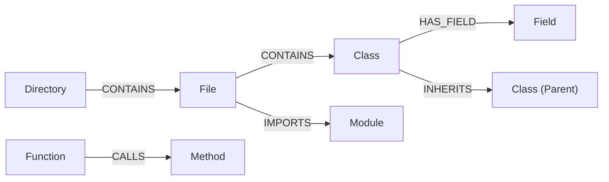

# AST Module Specification

The AST (Abstract Syntax Tree) module provides the structural foundation of Graphit Code.
It parses source files into an in-memory graph database, enabling AI agents to trace call graphs, locate definitions, and assess modification impacts using Cypher queries.

The graph is stored once per project, in the global brand directory and keyed by the
project's identity — never inside the project. Imported and Hub contexts are stored the
same way and shared between the projects that claim them. See
[Storage Layout](../architecture/storage_layout.md) for the paths and the reasoning;
`internal/store` is the only place they are composed.

---

## 🌐 Supported Languages

Graphit Code exposes **44 top-level language entries** and ships **45 index profiles: 40 through Tree-sitter and 5 through ANTLR v4**. The extra profile is the exclusive Tree-sitter `plpgsql` grammar used by embedded PostgreSQL parsing. Each profile is defined by an external YAML file—queries, export detection, self-keywords, context types, complexity, semantic labels, and comment handling are configurable without recompilation. An arbitrary new Tree-sitter language needs a compatible shared library plus YAML; a new ANTLR driver still requires contributor integration. See the user-facing [AST Grammars and Parser Extensibility](../guides/ast_extensibility.md) guide for the complete field-by-field contract.

| # | Language | Parser | Extensions | Key Extracted Entities |
|---|---|---|---|---|
| 1 | **Go** | Tree-sitter | `.go` | Function, Method, Struct, Interface, Type, Constant, Variable, Field, Parameter |
| 2 | **TypeScript** | Tree-sitter | `.ts` | Function, Method, Class, Interface, Type, Enum, Variable, Field, Parameter, Decorator |
| 3 | **TypeScript (TSX)** | Tree-sitter | `.tsx` | Function, Method, Class, Interface, Type, Enum, Variable, Field, Parameter, Decorator |
| 4 | **JavaScript** | Tree-sitter | `.js`, `.jsx`, `.mjs` | Function, Method, Class, Variable, Field, Parameter, Export |
| 5 | **Python** | Tree-sitter | `.py` | Function, Class, Variable, Parameter, Decorator |
| 6 | **Java** | Tree-sitter | `.java` | Function, Constructor, Class, Record, Annotation, Interface, Enum, Variable, Field, Parameter, Package |
| 7 | **Rust** | Tree-sitter | `.rs` | Function, Struct, Enum, Trait, Type, Constant, Variable, Field, Parameter |
| 8 | **C** | Tree-sitter | `.c`, `.h` | Function, Struct, Enum, Type, Variable, Field, Parameter |
| 9 | **C++** | Tree-sitter | `.cpp`, `.hpp`, `.cc`, `.cxx` | Function, Class, Struct, Enum, Namespace, Type, Field, Parameter |
| 10 | **C#** | Tree-sitter | `.cs` | Function, Class, Interface, Enum, Struct, Property, Namespace, Field, Parameter |
| 11 | **Kotlin** | Tree-sitter | `.kt`, `.kts` | Function, Class, Object, Variable, Field, Parameter, Package |
| 12 | **Swift** | Tree-sitter | `.swift` | Function, Class, Struct, Enum, Protocol, Variable, Field, Parameter |
| 13 | **Dart** | Tree-sitter | `.dart` | Function, Method, Class, Enum, Mixin, Extension, Field, Parameter |
| 14 | **PHP** | Tree-sitter | `.php` | Function, Method, Class, Interface, Trait, Enum, Constant, Package, Field, Parameter |
| 15 | **Ruby** | Tree-sitter | `.rb` | Function, Class, Module, Variable, Field, Parameter |
| 16 | **SQL** | Tree-sitter | `.sql` | Function, Table, Column, View, Index — plus `SELECTS` / `INSERTS` / `UPDATES` / `DELETES` / `ALTERS` edges to the tables each statement touches. **Default parser for `.sql`**; an Oracle/T-SQL project opts into its dialect with `ast.grammar` (`.sql=antlr-plsql`) |
| 17 | **XML** | Tree-sitter | `.xml`, `.xsl`, `.xslt`, `.xsd`, `.svg`, `.wsdl`, `.plist`, `.xhtml` | Element |
| 18 | **PL/SQL** (exclusive) | ANTLR v4 | `.sql`, `.pks`, `.pkb`, `.pls`, `.plb`, `.prc`, `.fnc`, `.trg`, `.typ`, `.bdy`, `.spc`, `.vw` | Function, Procedure, Package, Table, View, MaterializedView, Trigger, Type, Index, Sequence, Synonym, DBLink, Column, Parameter, Variable, Constant, Cursor, Exception, Constraint, Savepoint |
| 19 | **PostgreSQL** (exclusive) | ANTLR v4 | `.sql`, `.pgsql`, `.plpgsql`, `.pg` | Function, Procedure, Table, View, MaterializedView, Schema, Trigger, Sequence, Index, Extension, Type (domain/composite/enum/range), Column, Parameter, Constraint, Variable |
| 20 | **DB2** (exclusive) | ANTLR v4 | `.sql`, `.db2` | Function, StoredProcedure, Table, View, Trigger, Index, Sequence, Type, Schema, Alias, Tablespace, Column, Parameter, Variable |
| 21 | **T-SQL** (exclusive) | ANTLR v4 | `.sql`, `.tsql` | StoredProcedure, Function, Table, View, Trigger, Index, Sequence, Type, Schema, Column, Parameter, Variable |
| 22 | **COBOL 85** | ANTLR v4 | `.cob`, `.cbl`, `.cpy`, `.cobol` | Program, Section, Paragraph, DataItem, FileDescription, ConditionName |
| 23 | **HTML** | Tree-sitter | `.html`, `.htm` | Element, Attribute, AttributeValue, Doctype, Text — plus everything the inline `<script>` and `<style>` bodies declare (see [Embedded Language Parsing](embedded_language_parsing.md)) |
| 24 | **Bash** | Tree-sitter | `.sh`, `.bash` | Function, Variable |
| 25 | **Clojure** | Tree-sitter | `.clj`, `.cljs`, `.cljc`, `.edn` | Function, Variable, Namespace |
| 26 | **Dockerfile** | Tree-sitter | `Dockerfile`, `.dockerfile` | Stage, Instruction |
| 27 | **Elixir** | Tree-sitter | `.ex`, `.exs` | Function, Module, Variable |
| 28 | **GraphQL** | Tree-sitter | `.graphql`, `.gql` | Type, Field, Query, Mutation, Subscription |
| 29 | **Groovy** | Tree-sitter | `.groovy`, `.gradle` | Function, Class, Variable |
| 30 | **Haskell** | Tree-sitter | `.hs` | Function, Type, Class, Module |
| 31 | **HCL** | Tree-sitter | `.tf`, `.hcl` | Block, Variable |
| 32 | **JSON** | Tree-sitter | `.json`, `.jsonc` | Object, Array |
| 33 | **Julia** | Tree-sitter | `.jl` | Function, Struct, Module, Variable |
| 34 | **Lua** | Tree-sitter | `.lua` | Function, Variable |
| 35 | **Objective-C** | Tree-sitter | `.m`, `.mm` | Function, Class, Method, Protocol, Property |
| 36 | **Protocol Buffers** | Tree-sitter | `.proto` | Message, Enum, Service, RPC |
| 37 | **R** | Tree-sitter | `.r`, `.R` | Function, Variable |
| 38 | **Scala** | Tree-sitter | `.scala`, `.sc` | Function, Class, Object, Trait, Variable |
| 39 | **TOML** | Tree-sitter | `.toml` | Table, Key |
| 40 | **YAML** | Tree-sitter | `.yaml`, `.yml` | Mapping, Sequence |
| 41 | **Zig** | Tree-sitter | `.zig` | Function, Struct, Enum, Variable |
| 42 | **CSS** | Tree-sitter | `.css` | CssClass, CssId, CssElement, CssPseudoClass, CssPseudoElement, CssProperty, CssVariable, Keyframes, MediaFeature, AtRule, Attribute, Value |
| 43 | **Svelte** | Tree-sitter | `.svelte` | Element, Attribute, AttributeValue, Condition, Text, Value — plus everything `<script>` and `<style>` declare: Import/Export, Function, Class, Variable, Constant, Interface, Parameter, CssClass, CssProperty, … (see [Embedded Language Parsing](embedded_language_parsing.md)) |
| 44 | **Vue** | Tree-sitter | `.vue` | Element, Attribute, AttributeValue, Directive, Prop, EventHandler, Slot, Condition, Loop, Text, Value — plus everything `<script>` and `<style>` declare: Import/Export, Function, Class, Variable, Constant, Interface, Parameter, CssClass, CssProperty, … (see [Embedded Language Parsing](embedded_language_parsing.md)) |

> **Markdown is not on this list, and that is deliberate — but the grammar is still
> here.** No shipped query file claims `.md`, `.markdown` or `.mdx`, and extensions
> are what a query file grants, so no markdown file is discovered by the pipeline:
> not in the docs tree, and not at the root either, where `README.md`,
> `CONTRIBUTING.md` and `AGENTS.md` used to arrive as a `File` node plus a `Heading`
> node per section. Prose belongs to the knowledge wiki, which chunks, links and
> ranks it; in a code graph it is noise in every structural query.
>
> `tree-sitter-markdown` remains compiled in and registered in `nativeGrammars`, so
> it stays available to the rest of the framework and a project that *does* want
> markdown structure opts in by writing its own `markdown.yaml` into
> `ast.queries_dir` — see [YAML Query Schema](#yaml-query-schema).
> `ast.index_docs=true` is not that switch: it puts the *directory* back, and what
> returns is the structured files kept under it.
>
> **The inverse of that opt-in is a configuration key, not a deletion.** Any language
> on this list can be taken out of one project's index — or out of every index on the
> machine — with `ast.grammars_blacklist`, and a project that wants only a few of them
> names those in `ast.grammars_whitelist`. See
> [Turning a grammar off by configuration](#turning-a-grammar-off-by-configuration).

> **(exclusive) means the language is never chosen automatically.** The four SQL
> dialects above, and the tree-sitter `plpgsql` grammar behind the splice below, are
> declared `exclusive: true` in their query YAML: they are not registered for the
> extensions they list, so no file reaches them by extension and nothing falls back to
> them. A project indexes SQL with one of them by naming it —
> `ast.grammar=.sql=antlr-plsql`. Without that, `.sql` is parsed by the tree-sitter
> `SQL` grammar (row 16) and the dialect-only extensions (`.pks`, `.db2`, `.tsql`, …)
> are not indexed at all. See
> [Exclusive grammars](#exclusive-grammars--reachable-only-when-named).

> **PL/pgSQL, a splice rather than a 45th row.** PostgreSQL's ANTLR grammar parses
> `CREATE FUNCTION ... AS $$ ... $$` at the DDL level only — the dollar-quoted body is one
> opaque string constant, the same way it is opaque to PostgreSQL's own SQL parser, because the
> body's language is a run-time property named by the sibling `LANGUAGE` clause, not syntax the
> DDL grammar owns. When that clause says `plpgsql`, `internal/ast/antlr/postgresql/plpgsql_splice.go`
> re-parses the body with a real PL/pgSQL Tree-sitter grammar (`github.com/gmr/tree-sitter-postgres`,
> vendored at `internal/ast/treesitter/plpgsql/`) and splices the resulting subtree directly into
> the ANTLR `anysconst` node it came from — no separate entity, no line/name merge. Cyclomatic
> complexity for the function then walks straight into the spliced subtree, the same as any other
> nested declaration boundary. This is why `plpgsql` also appears in `nativeGrammars` and has its
> own `queries/plpgsql.yaml`: not as a language end users index directly (real PL/pgSQL is almost
> always inline inside a `.sql` file, not its own `.plpgsql` file), but so the splice has a real
> grammar and query file to route through the same machinery every other language uses.

### Cross-Language Extraction Capabilities

For every supported language, the parser extracts the following relationship data (when applicable to the language):

| Capability | Description | Languages |
|---|---|---|
| **Function Calls** | Traces which functions/methods call which others | All 45 |
| **Import Resolution** | Maps module dependencies and import chains | All except SQL dialects |
| **Class Inheritance** | `extends` / superclass relationships | JS, TS, Python, Java, C#, C++, Kotlin, Swift, Dart, PHP, Ruby |
| **Interface Implementation** | `implements` / protocol conformance | TS, Java, C#, Kotlin, PHP, Rust |
| **Field Access Tracking** | Reads and writes to class/struct fields | Go, JS, TS, Java, C#, C, C++, Kotlin, Swift, Python, Rust, PHP, Ruby |
| **Decorator / Annotation** | Attribute / annotation extraction | TS, Python, Java, C#, Kotlin, Swift, Rust, PHP |
| **Object Instantiation** | `new` expression tracking | JS, TS, Java, C#, C++, PHP |
| **Cyclomatic Complexity** | Computed for every function/method | All 45 |
| **Export Visibility** | `is_exported` flag per entity — detection strategy is configurable via the `exports` field in language YAML (see [Export Strategies](#export-strategies)) | All 45 (strategy varies by language) |
| **DML Tracking** | `SELECTS`, `INSERTS`, `UPDATES`, `DELETES`, `ALTERS`, `DROPS`, `REFERENCES` edges for SQL statements | SQL, PL/SQL, PostgreSQL, T-SQL, DB2, COBOL 85 |

---

## 🗄️ Database Architecture: LadybugDB (Icebug filesystem on-the-fly, :memory: catalog)

The AST database is backed by **LadybugDB** (`github.com/LadybugDB/go-ladybug`) with **icebug-disk** storage.
The graph lives as Parquet CSR bundles at `graph.icebug/` (`nodes_*.parquet`, `indices_*.parquet`, `indptr_*.parquet`) whose `schema.cypher` declares `storage='<abs>/graph.icebug', format='icebug-disk'` (filesystem, `s3://` for Hub). The Ladybug catalog is `:memory:` and rebuilt per connection from `schema.cypher`; no `ladybugdb` file, no `.wal`/`.shadow`, no `CHECKPOINT`, no `AtomicSwapDB`. Local and Hub share the same canonical format – publish is just `cp graph.icebug/` + rewrite `storage` URI.

### Node Schemas

The database initializes node tables with the following attributes:

| Node Label | Key Properties | Purpose |
|------------|----------------|---------|
| `File` | `path` (PK), `name`, `relative_path`, `is_dependency`, `lang`, `cluster` | Source file metadata. File text lives in the search index, not on this node. |
| `Directory` | `path` (PK), `name`, `cluster` | File system directories. |
| `Module` | `uid` (PK), `name`, `lang`, `full_import_name`, `path`, `line_number`, `end_line` | Importable library modules. |
| `Class` / `Struct` / `Record` | `uid` (PK), `name`, `path`, `line_number`, `end_line`, `cyclomatic_complexity`, `is_exported` | Complex data structures and object types. `Record` = Java records. |
| `Function` / `Method` / `Constructor` | `uid` (PK), `name`, `path`, `line_number`, `end_line`, `cyclomatic_complexity`, `is_exported` | Executable code blocks, member functions, and constructors. |
| `Procedure` / `StoredProcedure` | `uid` (PK), `name`, `path`, `line_number`, `end_line`, `is_exported` | SQL stored procedures (PL/SQL, PostgreSQL, T-SQL, DB2). |
| `Interface` / `Protocol` | `uid` (PK), `name`, `path`, `line_number`, `end_line`, `is_exported` | Abstract contracts. `Protocol` = Swift protocols. |
| `Trait` / `Mixin` | `uid` (PK), `name`, `path`, `line_number`, `end_line`, `is_exported` | Behavioral mixins. `Trait` = Rust/PHP. `Mixin` = Dart. |
| `Object` / `Annotation` | `uid` (PK), `name`, `path`, `line_number`, `end_line`, `is_exported` | `Object` = Kotlin singletons. `Annotation` = Java annotation types. |
| `Extension` | `uid` (PK), `name`, `path`, `line_number`, `end_line` | Dart extensions, PostgreSQL extensions. |
| `Field` / `Parameter` / `Variable` / `Property` | `uid` (PK), `name`, `lang`, `is_stub` | Variables, parameters, struct/class fields, and C# properties. |
| `Package` | `uid` (PK), `name`, `path`, `line_number`, `end_line` | PL/SQL packages, Java/Kotlin package declarations. |
| `Table` / `View` / `MaterializedView` | `uid` (PK), `name`, `path`, `line_number`, `end_line` | SQL database objects. |
| `Trigger` | `uid` (PK), `name`, `path`, `line_number`, `end_line` | SQL triggers. |
| `Index` / `Sequence` / `Constraint` | `uid` (PK), `name`, `path`, `line_number`, `end_line` | SQL schema objects. |
| `Column` | `uid` (PK), `name`, `path`, `line_number`, `end_line` | Table column definitions. |
| `Schema` / `Tablespace` | `uid` (PK), `name`, `path`, `line_number`, `end_line` | Database-level objects (PostgreSQL, DB2). |
| `Synonym` / `DBLink` / `Alias` | `uid` (PK), `name`, `path`, `line_number`, `end_line` | Object references and aliases (PL/SQL, DB2). |
| `Cursor` / `Exception` / `Constant` / `Savepoint` | `uid` (PK), `name`, `path`, `line_number`, `end_line` | PL/SQL declaration entities. |

### Relationship Schemas

Nodes are connected through typed relationships:



- **`CONTAINS`**: Hierarchical ownership (e.g. `Directory -> Directory`, `Directory -> File`, or `File -> Function`).
- **`IMPORTS`**: Dependency resolution. Attributes: `alias`, `full_import_name`, `imported_name`, `line_number`, `source_file`.
- **`CALLS`**: Direct function/method invocations. Attributes: `source_file`, `line_number`, `full_call_name`, `receiver_type`.
- **`HAS_PARAMETER`**: Function signatures. Connects caller entities to `Parameter` nodes.
- **`HAS_FIELD`**: Class/Struct fields. Connects definitions to `Field` nodes.
- **`READS_FIELD` / `WRITES_FIELD`**: Data access tracing. Tells which methods read or write to which fields.
- **`INHERITS` / `IMPLEMENTS`**: Class inheritance and interface implementations.
- **`SELECTS` / `INSERTS` / `UPDATES` / `DELETES`**: DML statement tracking for SQL and PL/SQL. Connects functions/procedures to the tables they operate on.
- **`ALTERS` / `DROPS`**: DDL statement tracking. Connects entities to the database objects they modify or remove.
- **`REFERENCES`**: Generic dependency reference (e.g., foreign key constraints, type references in PL/SQL).

---

## 🔀 Cypher Translation Layer

LadybugDB uses standard graph database constraints, but does not support all complex Cypher filter formats.
`internal/ast/ladybug.go` intercepts and translates Cypher queries:

1. **Label Filtering**:
   Converts standard Neo4j-style syntax `MATCH (n:File)` or `WHERE n:File` to explicitly match against the `label(n)` function:
   ```diff
   - MATCH (n:File)
   + MATCH (n) WHERE label(n) = 'File'
   ```
2. **Keyword Escaping**:
   Because labels like `File`, `Directory`, and `Module` are reserved words in LadybugDB's parser, the translator wraps them in backticks automatically:
   ```diff
   - MATCH (f:File)-[r:CONTAINS]->(fn:Function)
   + MATCH (f:`File`)-[r:CONTAINS]->(fn:`Function`)
   ```
3. **Transaction batching**:
   Applies `ON CREATE SET` translation to normal `SET` query updates.

---

## 🧭 The Canonical Traversal Planner — What It Answers, and Why It Refuses

On a canonical catalog there is no `Entity` table and no label column: **each label is its own
physical node table**, and one *logical* relationship type — `CALLS`, `CONTAINS` — is stored as
several physical member tables, one per `(type, from, to)` triple. The engine cannot fuse those
members back into one type, so a traversal naming a logical type is answered by
`internal/ast/ladybug_icebug_canonical.go`: it resolves the members from the manifest and runs
selective one-hop CSR frontiers.

This planner is the **only** route for those types. Forwarding an unplanned form to the engine
hands it to an upstream recursive plan that MEASURED enumerates the whole reachable component,
so anything the planner cannot preserve exactly **fails closed**.

### The forms it plans

```cypher
MATCH (a)-[:TYPE]->(b)      WHERE <filter on a> RETURN DISTINCT b.property [AS alias], ...
MATCH (a)-[:TYPE*1..3]->(b) WHERE <filter on a> RETURN DISTINCT b.uid
MATCH (a)-[:TYPE*]->(b)     WHERE <filter on a> RETURN count(DISTINCT b.uid)
```

One end is **filtered** and the other is **projected**; which is which follows from the RETURN.
A bare `-[:TYPE]->` is exactly one hop, `*1..N` is bounded, `*` is uncapped.

### The rules, and what each refusal says

A refusal names the rule and the form that works — it does **not** report a generic "unsupported"
message. Every rule below is one branch of `parseCanonicalTraversal`, and each has a test in
`internal/ast/ladybug_icebug_refusal_test.go`.

| The query | Why it cannot be planned | Write instead |
|---|---|---|
| `RETURN ... label(b) ...` | the label IS the physical table, and a logical type spans several, so a traversal has no label column to return | pin the label in the pattern and run one query per label: `-[:CONTAINS]->(b:Function)` |
| `RETURN b.name` (no `DISTINCT`) | the planner materializes the SET of reached nodes; it cannot reproduce one row per path | `RETURN DISTINCT b.name` |
| `RETURN DISTINCT collect(b.uid)`, arithmetic, path expressions | the RETURN is evaluated per reached node, so a richer expression answers a different question | project properties only |
| `RETURN DISTINCT a.name, b.name` | both ends projected — there is no single reached set | project one end |
| `WHERE a.name = b.name` | the two ends are resolved as independent sets and cannot be joined | filter one end at a time |
| `MATCH (a)-[:TYPE]->(b) RETURN DISTINCT b.name` with no `WHERE` | nothing anchors the traversal, so it would start from every node of that label | filter the starting end |
| `-[:TYPE*3..1]->` | inverted hop range | lower bound first |

**A refusal binds only for a logical relationship type.** A traversal naming a *physical* member
table (`-[:calls__function_function]->`) is the engine's to run exactly as written, so
`tryCanonicalBoundedTraversal` checks the type against the manifest before surfacing any rule —
including for shapes the planner cannot read at all, such as anonymous `()` endpoints.

**A query that is not a traversal falls through.** A node-only pattern runs on the mounted
tables, `label(n)` included: the restriction is about traversing a logical type, not about
labels in general. What *does* produce an error is a query that names a logical type in a shape
the planner does not recognize at all — several `MATCH` clauses, a `WITH`, a projected path —
and that message lists the planned forms rather than a rule, because no single rule was broken.

> The message these refusals replaced was one fixed sentence claiming the query was an
> unsupported **multi-hop** form, emitted for every rejection including one-hop queries whose
> real problem was a projected label or a missing `DISTINCT`. See
> Graphit Task `tsk-d18bf110142a`.

---

## 🔍 Parser Adapters & Native CGO Runtime

The engine uses a **dual-parser architecture** — Tree-sitter and ANTLR v4. The YAML `parser:` field in each language configuration determines which backend is used; Tree-sitter is the default when the field is omitted.

- **Tree-sitter**: Incremental, fast, and the default parser. Grammars are dynamically loaded as platform-native shared libraries (`.so`/`.dylib`/`.dll`) via CGO `dlopen`/`dlsym`, first from the project and then the global grammar directory. When no external library is found, shipped languages fall back to the grammar compiled into Graphit. New compatible grammars can be installed through a Hub language artifact.
- **ANTLR v4**: Full grammar parsing for complex languages. The five registered drivers can run in-process or through per-grammar sidecar binaries with length-prefixed stdin/stdout IPC and JSON tree payloads. Each distributed sidecar includes exactly one grammar, selected by Go build tags. Sidecar processes are pooled and reused across parse calls.

Both parsers are loaded **lazily** on first use — no eager loading at startup. This means startup time is constant regardless of the number of supported languages or installed grammars.

### Tree-sitter Dynamic Loading Architecture

Tree-sitter grammars are loaded dynamically at runtime:
- **`DynGrammarLoader`** (`internal/ast/treesitter_dynload.go`) resolves and loads shared libraries via CGO `dlopen`/`dlsym`.
- **Search path hierarchy**: project (`.graphit/grammars/treesitter/`) → user global (`~/.graphit/grammars/treesitter/`) → compiled native fallback for shipped languages.
- **Shipped grammars** are compiled into Graphit. The launcher extracts versioned query YAML and executables, not a third grammar-library lookup tier.
- **Additional grammars** are installed via `graphit hub install <language>`, which extracts the platform-specific binary from a `.grammar` fat archive.
- **Cache**: Loaded `sitter.Language` handles are cached in a `sync.Map` — zero allocations after first load.
- **Thread safety**: `sitter.Language` instances are read-only and shared across all worker goroutines.

### ANTLR v4 Sidecar Architecture

ANTLR grammars (PL/SQL, PostgreSQL, T-SQL, DB2, COBOL 85) can be compiled as standalone **sidecar binaries**—one per grammar. The adapter (`internal/ast/antlr_adapter.go`) communicates with sidecars through length-prefixed stdin/stdout frames carrying a JSON tree payload:
- **`SidecarDriver`** (`internal/ast/antlr_sidecar.go`) manages a pool of reusable sidecar processes.
- **Search path hierarchy**: project (`.graphit/grammars/antlr/`) → user global (`~/.graphit/grammars/antlr/`) → registered in-process driver.
- **Installation**: a Hub language artifact can install a sidecar for one of the five registered grammar names. Installing a differently named executable does not register a new driver by itself.
- **Build tags**: Each grammar is isolated behind a Go build tag (`grammar_plsql`, `grammar_postgresql`, etc.), compiled via `make grammars-antlr`.
- **Lifecycle**: sidecars are started lazily, pooled to the CPU budget, and restarted once after a process or protocol failure.

### Grammar Resolution Chain

The AST module resolves grammar binaries and language configurations using a cascading chain:

**YAML query files** (extensions, parser type, query definitions):

| Priority | Path | Managed By |
|----------|------|------------|
| 1 | `ast.queries_dir` — `.graphit/ast/queries/` by default | Project |
| 2 | `~/.graphit/ast/queries/` | User |
| 3 | `~/.graphit/runtime/<version>/ast/queries/` | Framework |

**Grammar binaries** (shared libraries and sidecar binaries):

| Priority | Path | Managed By |
|----------|------|------------|
| 1 | `.graphit/grammars/treesitter/` or `.graphit/grammars/antlr/` | Project/local installation |
| 2 | `~/.graphit/grammars/treesitter/` or `~/.graphit/grammars/antlr/` | User |

If no external Tree-sitter library is found, a shipped language can resolve through
the compiled native registry. The ANTLR backend similarly retains its registered
in-process drivers. There is no versioned-runtime grammar-binary search directory.

The project grammar-binary tier remains fully supported, but `graphit init` ignores
`**/.graphit/grammars/` because these libraries are specific to an operating system and
architecture. Do not confuse it with `.graphit/ast/queries/`: query YAMLs are textual
repository configuration and remain versionable. A grammar that must reach every checkout
should be distributed as a Hub language artifact rather than committed as a local binary.

**Key types:**

| Type | Package | Role |
|------|---------|------|
| `sitter.Language` | `sitter` | Native grammar compiled via CGO used to instantiate parsers and queries |
| `TreeSitterParser` | `ast` | Adapter that handles Tree-sitter AST queries, extraction, and context resolution |

### Concurrency Model

Under CGO, individual `sitter.Parser` instances are not thread-safe and must not be used concurrently. The engine resolves this by allocating isolated parser instances inside each concurrent worker goroutine:
- Parser instances are created dynamically when a worker processes a file.
- The underlying `sitter.Language` structures are read-only and thread-safe, so they are safely shared across all workers.
- Zero mutexes or locks are used during parsing, resulting in full parallel performance across all CPU cores.

### Tree-sitter Adapter (`internal/ast/treesitter_adapter.go`)

Bridges the Tree-sitter native CGO runtime with the indexing pipeline. For each file:
1. Resolves the static `sitter.Language` instance from the global map.
2. Creates a thread-local parser and parses the source into a syntax tree.
3. Runs all YAML-defined queries to extract entities and relationships.
4. Returns a `ParsedFile` with structured data for graph insertion.

### ANTLR Adapter (`internal/ast/antlr_adapter.go`)

Bridges the native Go ANTLR runtime with the indexing pipeline. Uses a `GrammarDriver` registry pattern to dispatch to the correct grammar. For each file:
1. Resolves the matching grammar driver(s) from the registry.
2. Invokes the driver's `Parse()` method which runs two-stage SLL→LL parsing.
3. Converts the ANTLR parse tree to the shared `TreeNode` representation.
4. Runs XPath pattern matching and extracts entities.
5. Returns a `ParsedFile` with structured data for graph insertion.

When multiple ANTLR grammars support the same extension, the adapter tries each in sequence and returns the first result that successfully extracts entities — reading the file once and sharing the buffer across the candidates.

**The SQL dialects are no longer among those candidates.** `plsql`, `postgresql`, `db2`, `tsql` and the tree-sitter `plpgsql` are declared `exclusive: true`, so they are not registered for `.sql` or for any of their own extensions and this loop never sees them. A `.sql` file resolves to `tree-sitter-sql` and stops there; the dialects are used only when `ast.grammar` binds an extension to one of them. See [Exclusive grammars](#exclusive-grammars--reachable-only-when-named).

### `ast.grammar` and the `--grammar` CLI Flag

The override map binds a file extension to one grammar by name, and it is the only
way an [exclusive grammar](#exclusive-grammars--reachable-only-when-named) is ever
used. It is read from configuration:

```json
{ "config": { "ast": { "grammar": ".sql=antlr-plsql,.pks=antlr-plsql" } } }
```

or given per command:

```bash
graphit sync --grammar .sql=antlr-plsql
graphit init --grammar .sql=antlr-plsql,.pks=antlr-plsql
```

The grammar name determines the backend automatically: `antlr-*` uses ANTLR v4, all others use tree-sitter. The parse side is propagated as `GrammarOverrides map[string]string` through `PipelineOptions` → `CompositeParser`, which dispatches to it directly with **no fallback**: an override says which grammar, not which to try first.

**The configured key and the flag do not reach the same distance.** Discovery,
the watcher and the daemon's batch router ask `HasParserForExtensionIn`, which has a
project directory and no pipeline options, so it resolves `ast.grammar` from
configuration. The `--grammar` flag is merged on top of that map for *parsing* only.
The distinction matters for an extension that no non-exclusive grammar claims: put
`.pks=antlr-plsql` in configuration and `.pks` files are discovered and parsed; pass
it only as a flag and discovery never offers the parser a file. For an extension some
grammar still claims — `.sql` — the flag alone works as it always did.

---

## 🎯 External YAML Configuration

All query patterns and language behavior settings are defined as **external YAML files** rather than hardcoded in the binary. This allows users to customize which AST entities are extracted from each language — adding new patterns, removing defaults, or completely replacing the query set — without recompiling. The language YAML also controls parser selection, export detection, self-reference keywords, context type mapping, anonymous function resolution, docstring attachment, and comment recognition.

### YAML Query Schema

Each language has a dedicated YAML file defining the query patterns used during parsing. Tree-sitter languages use S-expression patterns; ANTLR languages use XPath expressions:

```yaml
# --- Tree-sitter example (default parser) ---
language: go                    # Language name (required)
extensions: [".go"]             # File extensions to match (optional — if omitted, applies to all extensions of the language)
merge: true                     # optional: merge into the same language at the level below instead of replacing it
queries:
  - data_key: functions         # Internal category (functions, classes, imports, calls, etc.)
    graph_label: Function       # LadybugDB node label (empty = relational data like calls/heritage)
    pattern: '(function_declaration name: (identifier) @name)'
    name_capture: name          # Capture group for the entity name (defaults to "name")

  - data_key: calls             # Relation example — edges, not nodes
    type: relation              # "entity" (default) or "relation"
    relation_type: CALLS        # How the relation is routed (see Relation Routing)
    graph_label: ""             # Empty — relational data only
    pattern: '(call_expression function: (identifier) @name)'

  - data_key: goroutines        # Custom category example
    graph_label: Function
    pattern: '(go_statement (call_expression function: (identifier) @fn))'
    name_capture: fn
```

Only the capture named by `name_capture` becomes an entity. Every other capture in the pattern exists for a predicate to test, which is what the `@_`-prefixed convention signals.

```yaml
# --- Key/value example (data formats) ---
language: xml
grammar: tree-sitter-xml
extensions: [".xml"]
queries:
  - data_key: attributes
    graph_label: Attribute      # label of the key node
    pattern: '(STag (Name) @element (Attribute (Name) @name (AttValue) @value))'
    parent_capture: element     # who contains the key
    parent_label: Element
    value_capture: value        # what the key is set to
    value_label: AttributeValue
```

This yields `Element "config"` → `Attribute "env"` → `AttributeValue "prod"`, three nodes joined by two `CONTAINS` edges, plus `value: "prod"` on the `Attribute` node.

An entity spans from its name node to the end of that node's **parent**, which in a data
format is the start tag — so an XML `Element` ends before its own content begins.
`span_capture` names the capture that DELIMITS the entity instead, for a grammar whose
unit is wider than the declaration its name sits in:

```yaml
# The unit of a configuration document: named by a child, spanning the whole element.
queries:
  - data_key: steps
    graph_label: Step
    pattern: '(element (STag (Name) @_s) (content (element (STag (Name) @_n) (content (CharData) @name))) (#eq? @_s "step") (#eq? @_n "name")) @scope'
    span_capture: scope
```

Why it matters beyond the line numbers: an embedded block is attributed to the innermost
entity that **contains** it (see `docs/specs/embedded_language_parsing.md`), so a grammar
whose entities all end at their start tag has no host to offer and the SQL inside a
configuration value can only ever belong to the file. It decides the line range only —
the export verdict and the complexity score stay on the declaration itself.

```yaml
# --- ANTLR v4 example ---
language: plsql
parser: antlr4                  # Selects ANTLR backend (default: tree-sitter when omitted)
grammar: antlr-plsql            # Maps to the native grammar identifier
start_rule: sql_script           # ANTLR start rule
extensions: [".sql", ".pks", ".pkb", ".pls", ".plb", ".prc", ".fnc", ".trg", ".typ", ".bdy", ".spc", ".vw"]
queries:
  - data_key: functions
    graph_label: Function
    pattern: '//create_function_body'             # XPath syntax instead of S-expressions
    name_capture: '//create_function_body/function_name'  # XPath expression for entity name

  - data_key: dml_selects
    type: relation
    relation_type: SELECTS
    graph_label: ""
    pattern: '//select_statement//table_ref_aux'

  # Keyword guard — one grammar rule spelling two different things.
  # Oracle has no constant_declaration: a constant is a variable_declaration
  # carrying the CONSTANT keyword.
  - data_key: constants
    graph_label: Constant
    pattern: '//variable_declaration[CONSTANT]'
    name_capture: identifier
  - data_key: variables
    graph_label: Variable
    pattern: '//variable_declaration[!CONSTANT]'
    name_capture: identifier
```

**ANTLR pattern syntax:**

| Form | Meaning |
|---|---|
| `//rule` | any descendant with this rule name |
| `/rule` | direct child with this rule name |
| `//a/b` | `b` that is a direct child of any `a` descendant |
| `//a//b` | `b` anywhere under any `a` descendant |
| `//a[KEYWORD]` | `a`, only when it has `KEYWORD` as a direct terminal (case-insensitive) |
| `//a[!KEYWORD]` | `a`, only when it does not |

**Query Fields:**

| Field | Required | Description |
|---|---|---|
| `language` | ✅ | Language identifier (e.g., `go`, `python`, `plsql`) |
| `parser` | ❌ | Parser backend: `"tree-sitter"` (default) or `"antlr4"`. Determines pattern syntax and runtime |
| `grammar` | ⚠️ | Required for ANTLR. Maps to the native grammar identifier (e.g., `antlr-plsql`) |
| `start_rule` | ⚠️ | Required for ANTLR. The grammar's start rule (e.g., `sql_script`) |
| `extensions` | ❌ | File extensions filter. If omitted, applies to all extensions registered for the language |
| `exclusive` | ❌ | When `true`, this grammar is **not** registered for its own `extensions`: nothing reaches it by file extension and nothing falls back to it when another grammar came back empty. It stays reachable by NAME — an `ast.grammar` override binding an extension to it, or an `embedded` block naming its language. Default: absent, which registers the extensions as always. See [Exclusive grammars](#exclusive-grammars--reachable-only-when-named) |
| `merge` | ❌ | When `true`, this file merges into the same language declared at the level below instead of replacing it. Default: absent, which **replaces** — the file is the whole language. See [`merge: true`](#merge-true--merging-instead-of-replacing). (This key replaced `replace`, which was parsed and never honoured, and whose documented meaning here was the reverse of the actual behaviour.) |
| `queries[].data_key` | ✅ | Internal entity category. Standard keys: `functions`, `methods`, `classes`, `structs`, `interfaces`, `enums`, `types`, `traits`, `imports`, `exports`, `variables`, `constants`, `calls`, `instantiations`, `parameters`, `fields`, `field_reads`, `field_writes`, `heritage`, `implements`, `decorators`, `namespaces`, `packages`, `modules`, `tables`, `views`, `dml_selects`, `dml_inserts`, `dml_updates`, `dml_deletes` |
| `queries[].type` | ❌ | `"entity"` (default) or `"relation"`. Determines how the engine processes the extracted data. Entities become graph nodes; relations become edges (CallSites or References) |
| `queries[].relation_type` | ⚠️ | Required when `type: "relation"`. Defines how the relation is routed: `CALLS` and `INSTANTIATES` → CallSites, `DECORATOR` and `EXPORT` → special internal processing, `SELECTS` / `INSERTS` / `UPDATES` / `DELETES` / `ALTERS` / `DROPS` / `REFERENCES` → DML/DDL edges, all others (e.g. `INHERITS`, `IMPLEMENTS`, `READS_FIELD`, `WRITES_FIELD`) → References. See [Relation Routing](#relation-routing) |
| `queries[].graph_label` | ❌ | LadybugDB node label. If empty, the data is used for relationship extraction only (e.g., calls, heritage) |
| `queries[].pattern` | ✅ | Tree-sitter S-expression pattern or ANTLR XPath expression, depending on the `parser` field |
| `queries[].name_capture` | ❌ | For Tree-sitter: name of the capture group (defaults to `name`). Captures other than this one are not turned into entities. For ANTLR: a slash-separated rule path walked from the matched node, resolved exactly like `value_capture` (e.g. `identifier`, `default_value_part/expression`, `**/literal`) |
| `queries[].value_capture` | ❌ | The value the entity is set to. For Tree-sitter: a capture name. For ANTLR: a slash-separated rule path walked from the matched node, where each segment is a direct child and a `**` segment means "nearest descendant" (e.g. `default_value_part/expression`). The value becomes a node of its own — named after itself, so the search index reaches it — contained by the key, and is also written to the key's `value` property. Requires `value_label`. Ignored on `type: relation` queries |
| `queries[].value_label` | ⚠️ | Required when `value_capture` is set. Node label for the value (e.g. `AttributeValue`, `Value`, `Text`) |
| `queries[].name_reject` | ❌ | A regular expression the captured NAME must NOT match; a match records nothing — no entity, no edge. A capture position is not a guarantee about what lands in it: PL/SQL's `call_statement` is `CALL? routine_name function_argument?` with both optionals allowed absent, so a bare identifier in statement position IS a call, and `routine_name` resolves through a non-reserved keyword list of 1753 words including BEGIN, DECLARE, IF and PROCEDURE — a CLEAN parse then reads `IF` as a call to something named IF (measured: 25 thousand such edges on a real corpus). Which words can never be a name is a fact about the LANGUAGE, so it is declared here and not in Go — `end` is a keyword in PL/SQL and a fine function name in Ruby. ANCHOR IT: `^(?i)(if)$` rejects the word, `if` unanchored rejects every name containing it. A pattern that does not compile is dropped at load time with a warning |
| `queries[].span_capture` | ❌ | Tree-sitter only. Capture whose node delimits the entity, replacing the default span (name node → end of its parent). Use it when the unit is wider than the declaration holding its name: an XML element's name lives in the start tag, so without it the entity ends before its content. Decides the LINE RANGE only — export and complexity stay on the declaration. An unknown capture name resolves to nothing and the default span applies |
| `queries[].name_is_data` | ❌ | The entity's NAME is a data value, not an identifier: matched surrounding quotes come off, and blank, multi-line or over-long text is dropped instead of indexed as a name. A data format needs it because an attribute value is quoted at the source — without it the entity is called `"POST-QUERY"`, quotes included, and no query finds it. It must be declared rather than inferred, because a quoted literal deliberately does not collapse into the identifier of the same spelling. A query that declares `value_capture` or `parent_capture` already describes data and needs nothing extra |
| `queries[].parent_capture` | ❌ | Tree-sitter only. Capture holding the name of the entity that contains this one, producing a `CONTAINS` edge. Use it when `context_types` cannot resolve the parent — tree-sitter-xml `element`, tree-sitter-json `pair` and tree-sitter-html `start_tag` have no `name` field for the tree walk to read. Requires `parent_label` |
| `queries[].parent_label` | ⚠️ | Required when `parent_capture` is set. Node label of the containing entity |

A query that declares `value_capture` or `parent_capture` is describing data rather than identifiers, so its captured text is normalised: surrounding quotes are stripped (tree-sitter-xml's `AttValue`, tree-sitter-toml's `string` and tree-sitter-hcl's `string_lit` all span their delimiters), and text that is blank, multi-line or longer than 256 characters is dropped rather than indexed as a name.

### Relation Routing

When a query has `type: relation`, the `relation_type` field determines how the extracted data is routed through the engine:

| `relation_type` | Destination | Description |
|---|---|---|
| `CALLS` | `result.CallSites` | Standard function/method call edges |
| `INSTANTIATES` | `result.CallSites` | Constructor invocations — stored with a `new:` prefix on the call name |
| `DECORATOR` | Internal: `attachDecorators` | Consumed by the decorator attachment pipeline |
| `EXPORT` | Internal: `detectExports` | Consumed by the export detection pipeline |
| `SELECTS` | `result.DMLEdges` | SELECT statement → table edges (SQL/PL/SQL) |
| `INSERTS` | `result.DMLEdges` | INSERT statement → table edges |
| `UPDATES` | `result.DMLEdges` | UPDATE statement → table edges |
| `DELETES` | `result.DMLEdges` | DELETE statement → table edges |
| `ALTERS` | `result.DMLEdges` | ALTER statement → database object edges |
| `DROPS` | `result.DMLEdges` | DROP statement → database object edges |
| `REFERENCES` | `result.DMLEdges` | Generic dependency references (e.g., foreign keys, type references) |
| Any other string | `result.References` | Generic references — used for `INHERITS`, `IMPLEMENTS`, `READS_FIELD`, `WRITES_FIELD`, and any custom relation type |

> **Extensibility:** New relation types can be added via YAML without recompilation. Any `relation_type` string that doesn't match one of the special cases above is automatically routed to `result.References`. For field-access relations (e.g., `READS_FIELD`, `WRITES_FIELD`), the engine uses the entity's context to resolve the target field. DML relation types (`SELECTS` through `REFERENCES`) are available for both Tree-sitter and ANTLR-based languages, enabling full data-flow tracking in SQL-centric codebases.

### Language Configuration Fields

Beyond queries, each language YAML file can define additional fields that control how the engine processes entities for that language. All fields are optional — the engine uses sensible defaults when they are omitted. A YAML file is valid if it has either `queries` entries **or** at least one language configuration field.

```yaml
language: python
extensions: [".py"]
queries: [...]                   # Tree-sitter query patterns (see above)

# --- Language Configuration Fields (all optional) ---
exports:
  strategy: no_prefix
  config:
    prefix: "_"

self_keywords: ["self."]

context_types:
  class_definition: Class
  function_definition: Function

# Only for grammars whose container node keeps its name somewhere other than a
# `name` field — see the field table below.
context_name_paths:
  element: STag/Name
  pair: key/string_content

anon_func_types:
  - arrow_function
  - function_expression

declaration_types:
  - function_definition
  - class_definition

comment_types:
  - comment
  - block_comment

# Which of this language's graph labels get a vector, so semantic search reaches
# them. Order decides which label keeps a (path, uid) that two of them claim.
embed_labels:
  - Class
  - Function
  - Variable
  - Comment

# What counts as a decision point when scoring cyclomatic_complexity. Absent, the
# entity's complexity is the base 1 — no signal rather than a guessed one.
complexity:
  node_types: ["if_statement", "for_statement", "while_statement", "case_clause"]
  operators: ["&&", "||"]

# Named ways this language turns escaped text back into what it represents, for an
# `embedded` block to name via `normalize`.
text_normalizers:
  xml_entities:
    replace:
      "&lt;": "<"
      "&gt;": ">"
      "&amp;": "&"
    numeric_char_refs: true       # &#62; and &#x3E;

# Regions of the file written in another language. Only single-file-component
# grammars declare these — see Embedded Language Parsing.
embedded:
  - pattern: '(script_element (start_tag (attribute (attribute_name) @_a (quoted_attribute_value (attribute_value) @lang))) (raw_text) @body (#eq? @_a "lang"))'
    text_capture: body
    lang_capture: lang
    languages:
      ts: typescript
  - pattern: '(script_element (raw_text) @body)'
    text_capture: body
    default: javascript
```

**Language Configuration Fields:**

| Field | Type | Description |
|---|---|---|
| `exports` | Object | Export detection strategy configuration. Controls how the engine sets `is_exported` on each entity. See [Export Strategies](#export-strategies) |
| `self_keywords` | `string[]` | Array of self-reference keywords used for receiver type resolution during call tracking. Examples: `["this."]` for Java/JS/TS, `["self."]` for Python/Rust/Swift. Empty array for languages without self-references (Go, C) |
| `context_types` | `map[string]string` | Maps Tree-sitter node type names to graph labels for parent context resolution. Determines which AST containers provide the `context` and `context_type` properties for nested entities. Example: `class_definition: Class` causes functions inside a `class_definition` node to receive `context_type: Class` |
| `context_name_paths` | `map[string]string` | How to read a context node's name when it is **not** in a `name` field: a `/`-separated path of field names or child kinds, walked from the context node down to the node holding the text. Data-format grammars need it — tree-sitter-xml keeps an `element`'s name at `STag/Name` and tree-sitter-json a `pair`'s at `key/string_content` — and without it every entity in those languages fell back to the `File` as its context. Only keys also present in `context_types` are consulted |
| `complexity` | Object | Which parsed node kinds count as a branch when scoring `cyclomatic_complexity`, by walking the entity's own syntax subtree. **Absent means the entity's complexity is the base 1** — this language has no complexity signal yet, rather than a guessed one. See [Complexity Scoring](#complexity-scoring) |
| `anon_func_types` | `string[]` | Array of Tree-sitter node types that represent anonymous functions. Used to resolve `variable_declarator` assignments to function entities (e.g., `const fn = () => {}` becomes a Function node). Example: `["arrow_function", "function_expression"]` for JavaScript |
| `declaration_types` | `string[]` | Array of Tree-sitter node types that can have docstrings attached. The engine looks for comment nodes immediately before these declaration types and extracts the text as the entity's `docstring` property |
| `comment_types` | `string[]` | Array of Tree-sitter node types recognized as comments. Used by the docstring extraction engine. Common values: `["comment", "block_comment", "line_comment"]` |
| `embed_labels` | `string[]` | Which of **this language's** graph labels get a vector, and so are reachable by semantic search. Every entity is in the keyword index regardless — `entity_fts` indexes them all by name — so this list is only about meaning. **Order is meaningful**: one `(path, uid)` can carry two labels (a TypeScript `class Foo` beside `interface Foo`, a Table beside a same-named View) and the embedding cache is keyed without the label, so the two collide on one entry; the label listed **earlier** wins. A label naming content rather than an identifier belongs here as readily as a declaration — `Comment`'s name *is* the comment's prose, which is what semantic search is for. **Omitted means this language embeds nothing**, which is a real answer for a grammar with no prose and no bodies and rarely the intended one; `TestEveryShippedGrammarDeclaresEmbedLabels` fails when a shipped grammar is silent about it, and `TestEmbedLabelsAreLabelsTheGrammarProduces` fails when it names a label none of its queries can emit. See [Semantic and hybrid](#semantic-and-hybrid) |
| `text_normalizers` | `map[string]object` | Named ways this language turns escaped text back into what it represents, for an `embedded` block to name via `normalize`. Each: `replace` (literal → replacement) and `numeric_char_refs`. The engine knows no escaping scheme of its own; a replacement containing a line break is dropped at load time, because changing the newline count would shift every line the sub-parse reports. See [Embedded Language Parsing](embedded_language_parsing.md) |
| `embedded` | Object array | Regions of a file written in another language — the body of a single-file component's `<script>` and `<style>`, which the outer grammar hands over as one opaque text node. A block is selected by a **tree-sitter query**, the same language as `queries[].pattern`. Each entry: `pattern` (the query), `text_capture` (the capture whose node's text IS the body), `lang_capture` (the capture holding the value that selects the language), `default` (the language when `lang_capture` is absent), `languages` (captured value → language name; an allowlist — a value not listed is skipped in silence, and an explicit `{}` means "claim these bodies and map none"), and `normalize` (the name of one of this language's `text_normalizers`, run on the body before the sub-parse), and `host_labels` (the labels that count as the UNIT this block belongs to — see below), and `wrap_prefix` / `wrap_suffix` (the text a FRAGMENT needs around it to be parseable at all — see below). Blocks are tried in order and the first to match a body node claims it, which is how an optional attribute is expressed as two patterns. A block missing `pattern` or `text_capture`, or having neither `default` nor `languages`, is dropped at load time with a warning — this config fails open, so a half-written block would select nothing in silence. Declared by `vue.yaml`, `svelte.yaml` and `html.yaml`. See [Embedded Language Parsing](embedded_language_parsing.md) |


**Predicates go INSIDE the pattern's parentheses.** `(node) @cap (#eq? @cap "x")` compiles as
TWO patterns and the predicate then constrains the second one, which captures nothing — so it
filters nothing, in silence. The failure mode is an `embedded` block handing every candidate
body to the inner parser: measured on an XML tag, all three attribute values reached the
PL/SQL parser, including one planted as a decoy. Written inside — `(node @cap (#eq? @cap "x"))`
— the same predicate keeps only the intended match.

**`host_labels` says which of the host's entities are units.** An embedded block's statements
are attributed to the innermost entity that strictly contains the block, which is right when
the block is the CONTENT of something: the element carrying a value is a wrapper and the unit
is an ancestor. It is wrong when the block is an ATTRIBUTE of the very element that names the
unit — an XML-exported screen's `<Trigger Name="POST-QUERY" TriggerText="…"/>`, whose statement text has its
newlines encoded and therefore sits on the unit's own line. There "strictly contains" excludes
exactly the entity that should answer. Declaring the labels makes containment enough, and only
those labels are considered:

```yaml
embedded:
  - pattern: '(Attribute (Name) @_a (AttValue) @body (#eq? @_a "TriggerText"))'
    text_capture: body
    normalize: attr_text
    host_labels: [FormTrigger]
    default: plsql
```


**`wrap_prefix` / `wrap_suffix` make a fragment parseable.** A block does not have to hold
a compilation unit. An XML-exported screen keeps a program unit as
`PROCEDURE x(…) IS … END;`, which in PL/SQL is a DECLARATION — valid only inside a
declarative section — so on its own it parses as nothing: measured, those bodies yielded
zero entities, zero calls and zero DML, and the only thing they produced was the word
`PROCEDURE` as a call target. Wrapped, the same body yields the procedure and everything
it calls:

```yaml
embedded:
  - pattern: '(Attribute (Name) @_a (AttValue) @body (#eq? @_a "ProgramUnitText"))'
    text_capture: body
    normalize: attr_text
    wrap_prefix: 'DECLARE '
    wrap_suffix: ' BEGIN NULL; END;'
    host_labels: [FormProgramUnit]
    default: plsql
```

Which wrapping a fragment needs is knowledge of the POSITION, not of the language — the
same PL/SQL in a `.sql` file arrives with `CREATE OR REPLACE` in front and needs nothing —
which is why it is declared on the block. **Neither side may contain a line break**, and a
declaration that does is dropped at load time: every line the sub-parse reports is shifted
by the block's start row, so changing the newline count would move every entity after it.
A prefix on the first line and a suffix after the last cost columns, which nothing records.

#### Export Strategies

The `exports` field defines how the engine determines the `is_exported` flag on each entity. Seven strategies are supported:

| Strategy | Languages | Logic | Config Fields |
|---|---|---|---|
| `capitalized_name` | Go | Entity is exported if its name starts with an uppercase letter | None |
| `export_statement` | JavaScript, TypeScript | Entity is exported if it appears inside an `export` statement (matched via a `data_key: exports` query) | None |
| `modifier` | Java, C#, Rust, PHP | Entity is exported if its parent declaration contains a specific modifier keyword | `config.keyword` — the modifier to check for (e.g., `"public"`) |
| `no_prefix` | Python, Ruby, Dart | Entity is exported if its name does NOT start with a specific prefix | `config.prefix` — the private prefix (e.g., `"_"`) |
| `no_modifier` | Swift | Entity is exported if its parent declaration does NOT contain any of the specified access-control keywords | `config_list.keywords` — array of private keywords (e.g., `["private", "fileprivate"]`) |
| `no_static` | C, C++ | Entity is exported if its declaration does NOT have the `static` modifier (file-scope linkage) | None |
| `none` | SQL | No export detection — `is_exported` is always `false` | None |

**`exports` Sub-Fields:**

| Field | Type | Required | Description |
|---|---|---|---|
| `strategy` | `string` | ✅ | One of the 7 strategy names listed above |
| `config` | `map[string]string` | ❌ | Key-value pairs for strategies that need a single config value. Used by `modifier` (`keyword`) and `no_prefix` (`prefix`) |
| `config_list` | `map[string][]string` | ❌ | Key-to-list pairs for strategies that need multiple values. Used by `no_modifier` (`keywords`) |

**Examples:**

```yaml
# Go — capitalized names are exported
exports:
  strategy: capitalized_name

# Java — entities with "public" modifier are exported
exports:
  strategy: modifier
  config:
    keyword: "public"

# Python — names NOT starting with "_" are exported
exports:
  strategy: no_prefix
  config:
    prefix: "_"

# Swift — entities WITHOUT "private" or "fileprivate" are exported
exports:
  strategy: no_modifier
  config_list:
    keywords: ["private", "fileprivate"]

# C — non-static functions are exported
exports:
  strategy: no_static

# SQL — no export concept
exports:
  strategy: none
```

#### Complexity Scoring

`complexity` declares the real syntax-tree shapes that count as a decision point for a
language, so `cyclomatic_complexity` is scored by walking the entity's parsed subtree
instead of scanning its text for keywords. A nested declaration is scored on its own and
does not inflate its parent.

| Sub-field | Type | What it matches |
|---|---|---|
| `node_types` | `string[]` | **Named** node kinds — `if_statement`, `for_statement`, a switch's case clause. Each occurrence anywhere in the subtree adds one |
| `operators` | `string[]` | **Anonymous** token kinds — the literal text of a short-circuit operator, `"&&"` and `"\|\|"` — matched wherever the token appears as a leaf, however deep |
| `head_calls` | Object | For grammars where every control form is the *same* node kind, told apart only by the text of its own first named child. See below |

Two rules that decide which of the first two a boolean operator belongs in, and they are
mutually exclusive:

- List it under `operators` when the grammar spells `&&` / `||` as bare tokens — Go, C,
  Java, JavaScript, TypeScript, Rust, Ruby and PHP all do.
- List the **named node** under `node_types` when the grammar wraps the combination in one
  — Kotlin's `conjunction_expression` / `disjunction_expression`, Swift's, Dart's
  `logical_and_expression` / `logical_or_expression`. Listing it in both counts the same
  operator twice.

A chained `else if` needs no entry of its own: every grammar checked here re-emits it as
another `if` node nested in the else branch, so counting the `if` kind already counts each
link in the chain.

**`head_calls`** exists because `node_types` counts a kind on sight and has no way to ask
what its child says. In Clojure, `(if ...)`, `(when ...)` and `(cond ...)` are all a bare
`list_lit` whose first named child is a `sym_lit` reading the macro's name; in Elixir,
`if`, `case`, `cond` and `for` are all a `call`. So the node kind names the wrapper, and a
match on the child's own text is what actually counts as a branch:

```yaml
complexity:
  head_calls:
    node_type: list_lit
    names: ["if", "when", "when-not", "if-not", "and", "or"]
    pair_names: ["cond"]                # counts floor(n/2) — every child after the head is a test/result pair
    subject_pair_names: ["case"]        # counts floor((n-1)/2) — the first child is the value being matched
```

| Sub-field | Type | Description |
|---|---|---|
| `node_type` | `string` | The wrapping node kind every control form parses as |
| `names` | `string[]` | Head names that count as **one** branch each |
| `pair_names` | `string[]` | Head names counted **once per clause**, as `floor(n/2)` of the children after the head — for forms whose clauses are plain alternating children rather than a node of their own, like Clojure's `(cond t1 r1 t2 r2 …)` |
| `subject_pair_names` | `string[]` | Same, as `floor((n-1)/2)` — the first child after the head is the subject being matched, not a clause, and integer division already drops a trailing default with no test of its own |

`pair_names` and `subject_pair_names` exist only for grammars with no per-clause node.
Every other language checked here has a real one — `switch_case`,
`case_when_part_statement` — and belongs in `node_types` instead.

#### Text Normalizers

`text_normalizers` are named, declared ways to turn a language's escaped text back into the
text it represents. An `embedded` block names one via `normalize`, and **the engine knows no
escaping scheme at all** — there is no built-in entity table and no "XML mode". A grammar
that escapes differently, or a future one nobody has met, declares its own.

They exist because a block embedded in XML is almost never plain text: `<` and `&` are
markup, so `WHERE qt > 0` reaches the file as `qt &gt; 0`, and the host grammar splits the
content into `CharData` / `EntityRef` / `CharData`. Capturing the whole `content` keeps the
body intact; the normalizer makes it parseable again.

| Sub-field | Type | Description |
|---|---|---|
| `replace` | `map[string]string` | Literal text → its replacement, applied left to right |
| `numeric_char_refs` | `bool` | Decodes `&#62;` and `&#x3E;` — the open-ended half of the same scheme, which a fixed table cannot express |

**The one invariant the engine enforces: a normalizer may not change the number of
newlines.** Every line the sub-parse reports is shifted by the block's start row in the host
file, so a replacement containing a line break would move every entity after it inside the
block — trading a visible syntax error for a wrong line number, which is the failure this
whole mechanism exists to avoid. A pair whose replacement contains `\n` or `\r` is **dropped
at load time** with a warning; a numeric reference that would decode to one is left as
written. A normalizer that ends up with nothing to do, or a `normalize` naming one this
language does not declare, is dropped the same way.

Normalizing is **opt-in per block**, not per language, because escaping is a property of the
position rather than of the language alone: an XML element's content is escaped, but an HTML
`<script>`'s `raw_text` is not, even though both hosts have entities.

### Resolution Chain (3 Levels)

Query files are resolved using a cascading priority system. For each language, the **highest-priority source** that provides queries wins. The resolution order is **project → user global → runtime** — all levels are YAML-only. Everything — parser selection, extensions, queries, exports, context types — is externalized and customizable without recompilation.

```
┌─────────────────────────────────────────────────────────────────────────────┐
│  Priority 1 — Project Override                                             │
│  <ast.queries_dir>/<language>.yaml                                         │
│  .graphit/ast/queries/ unless the key says otherwise.                      │
│  Applies only to this project. Highest priority.                           │
├─────────────────────────────────────────────────────────────────────────────┤
│  Priority 2 — User Global                                                  │
│  ~/.graphit/ast/queries/<language>.yaml                                    │
│  User-editable. Applies to all projects. NEVER written by the framework.   │
├─────────────────────────────────────────────────────────────────────────────┤
│  Priority 3 — Runtime Defaults                                             │
│  ~/.graphit/runtime/<version>/ast/queries/<language>.yaml                  │
│  Managed by the framework. Extracted by the launcher during binary setup.  │
│  Overwritten on each version upgrade.                                      │
└─────────────────────────────────────────────────────────────────────────────┘
```

**Key behaviors:**
- The launcher automatically extracts all 45 default YAML files during binary setup to `~/.graphit/runtime/<version>/ast/queries/`.
- The **runtime directory is version-scoped** — each binary version gets its own clean set of defaults, so upgrades never conflict with previous versions.
- The **user global directory** (`~/.graphit/ast/queries/`) is never touched by the framework. Only the user creates/edits files there.
- The **project query directory is tracked by git** — the `.gitignore` block written by `graphit init` ignores `.graphit/runtime/` and `.graphit/grammars/`, not `.graphit/ast/queries/`, so a query override committed where it defaults reaches every other checkout. Project parser binaries under `.graphit/grammars/` remain local. See [storage_layout](../architecture/storage_layout.md#inside-a-projects-brand-directory).
- The **project directory is also configurable** — `ast.queries_dir`, relative to the project root — for a project that would rather keep its grammars beside its other tooling. See [config_module](config_module.md#the-projects-grammars-astqueries_dir).
- If a **project** has a `go.yaml`, only Go queries come from the project level; other languages still resolve normally through user → runtime.

### Turning a grammar off by configuration

The resolution chain above answers *how* a language is parsed. Two configuration
keys answer *whether* it is parsed at all:

| Key | Meaning |
|---|---|
| `ast.grammars_blacklist` | comma-separated; every grammar named here is disabled |
| `ast.grammars_whitelist` | comma-separated; when non-empty, **only** these are enabled, and the blacklist still subtracts from them |

Full semantics, precedence and the name-matching rule are in
[config_module](config_module.md#turning-grammars-off-astgrammars_blacklist-and-astgrammars_whitelist).
What matters here is where the decision is taken and what it means for the graph.

**Why a config key and not a deleted query file.** Extensions are granted by the
query file, not by the grammar — `rebuildExtTables` builds `tsExtMap` from each
resolved YAML's `extensions:` field — so removing a query file has always been the
way to take a language out of the index. That works for *this* repository, which
owns `internal/ast/queries/*.yaml`. It does not work for a consumer: the files it
would have to delete live in `~/.graphit/runtime/<version>/ast/queries/`, which the
launcher regenerates on every install. The markdown note in
[Supported Languages](#-supported-languages) is the deleted-file case; these keys
are the same decision made from the outside.

**Where it is enforced.** The extension tables (`tsExtMap`, `antlrExtMap`,
`tsGrammarMap`, `antlrGrammarMap`, `tsLangNameMap`) are process-wide and built from
the runtime and user directories with no project in the picture — one daemon
supervises many projects, so a per-project filter cannot live inside them. It lives
instead in the functions that receive a `projectDir` and answer "what parses this",
which is the set every other path already goes through:

| Function | File |
|---|---|
| `tsLangConfigFor`, `tsLangConfigByName`, `TreeSitterParser.ParseWithGrammar` | `internal/ast/treesitter_adapter.go` |
| `HasAntlrForExtensionIn`, `enabledAntlrConfigsFor`, `AntlrParser.Parse`, `AntlrParser.ParseWithGrammar` | `internal/ast/antlr_adapter.go` |
| `antlrLangConfigByName` | `internal/ast/treesitter_embedded.go` |
| `resolveQueriesForLang` | `internal/ast/query_loader.go` |

So discovery (`collectFiles`), the watcher (`internal/ast/watcher.go`) and the
daemon's batch router (`classifyBatch`) inherit the decision without knowing about
it: all three ask `HasParserForExtensionIn`, which resolves through the first two
rows. The filter itself is `internal/ast/grammar_filter.go`, cached per project
directory behind the same rate limit and staleness signature as the query
directories — so writing the key lands on a running daemon within a couple of
seconds, with no restart.

**An ANTLR extension narrows rather than disappearing.** `antlrExtMap` maps an
extension to a *list*, so blacklisting one dialect removes it from the candidate
list and leaves the extension claimed by the others. (The `.sql` dialects are no
longer such a list — they are `exclusive`, and never enter it. See below.)

**An explicit `--grammar` override does not win against it.** A disabled grammar is
not usable, full stop, and `ParseWithGrammar` says so:
`grammar disabled by configuration: <name>`. Layering it the other way was
considered and rejected — discovery would have dropped the files before the flag
was ever consulted, so the override would produce "no files matched" rather than
the parse it asked for.

**Files already in the graph are removed on the next full index.** The live set
comes from `collectFiles`, and `pruneVanished` drops every cached shard whose file
is no longer live, deleting it from both the graph and the search index. No
`--reset` is needed. In *scoped* mode (`graphit ast index --path`) the tree is
never walked, so the prune does not run and the old nodes survive until a full
index.

### Exclusive grammars — reachable only when named

`exclusive: true` in a grammar's YAML is the third answer to *whether* a language is
used, and it sits between the other two: the grammar is fully installed and fully
usable, but **only when something names it**.

| State | Reached by extension | Reached by name (`ast.grammar`, `embedded`) |
|---|---|---|
| normal | ✅ | ✅ |
| `exclusive: true` | ❌ | ✅ |
| blacklisted / not whitelisted | ❌ | ❌ (`grammar disabled by configuration`) |

**What it does, mechanically.** `rebuildExtTables` registers a query file's
`extensions:` into `tsExtMap` / `antlrExtMap` and its grammar into `tsGrammarMap` /
`antlrGrammarMap`. An exclusive file skips the first half and keeps the second, so
`HasTreeSitterForExtensionIn` and `HasAntlrForExtensionIn` never answer for it —
which takes it out of discovery, out of `CompositeParser`'s extension branch, and
out of `AntlrParser.Parse`'s candidate loop in one move. `projectTsExtMap`, the
project-level branch of `HasAntlrForExtensionIn`, and `AntlrParser.Parse`'s
project-YAML fallback apply the same rule, so a project cannot re-enter through a
side door it did not intend.

**How an exclusive grammar is asked for.** `ast.grammar` — the override map that
already existed for the `--grammar` flag — binds an extension to a grammar name:

```json
{ "config": { "ast": { "grammar": ".sql=antlr-plsql,.pks=antlr-plsql" } } }
```

`HasParserForExtensionIn` consults that map **first**: when an override binds the
extension, the answer is whether the named grammar is registered and enabled, and the
extension tables are not consulted at all. That is what makes `.pks` discoverable
again — no non-exclusive grammar claims it — and it is also what makes an override
naming an unregistered grammar claim nothing, instead of discovering files whose
parse would fail. The map is resolved per project in
`internal/ast/grammar_overrides.go`, cached behind the same staleness interval as the
grammar filter, so writing the key lands on a running daemon without a restart.

Ordering with the other two keys is unchanged: an override does not revive a
blacklisted grammar. Exclusivity is *off by default, on when named*; the blacklist is
*off, full stop*.

**Why the SQL dialects are declared exclusive.** Four ANTLR grammars claimed `.sql` —
`plsql`, `postgresql`, `db2`, `tsql` — and `CompositeParser` handed a `.sql` file to
tree-sitter first and to that list afterwards whenever tree-sitter extracted nothing.
The result was a *guess about which dialect the repository is written in*, decided by
whichever grammar happened to extract an entity first, and paid for with up to four
full ANTLR parses of a file that was often not SQL any of them understood. A
repository whose SQL is PostgreSQL does not want a PL/SQL package body read out of
it. Naming the dialect is one config line; guessing it correctly is not something the
indexer can do.

So `.sql` now resolves to `tree-sitter-sql` and stops, and the five exclusive
grammars — `plsql`, `postgresql`, `db2`, `tsql`, and the tree-sitter `plpgsql` —
together with the extensions only they claimed (`.pks`, `.pkb`, `.prc`, `.db2`,
`.tsql`, `.pgsql`, `.plpgsql`, …) are indexed only where the configuration asks for
them. **This is a behaviour change for an Oracle export indexed without
configuration: it now yields nothing until `ast.grammar` names the dialect.**

**Why a YAML flag and not a list in Go.** The same reasoning as `embed_labels`,
`comment_types` and `target_rules`: only the grammar knows what it is. A hardcoded
list of five names answers for the grammars the binary ships and answers wrongly, by
construction, for one installed from the Hub or written into `ast.queries_dir` —
silently, because its name is simply absent from the list.

### `merge: true` — merging instead of replacing

By default a level **replaces** the one below it: the winning file is the whole
language, and everything the level below said about it is gone. That is why a
project wanting one extra query had to copy the entire shipped file — and why
omitting `extensions` or `grammar` from the copy broke the language rather than
leaving it alone.

A file declaring `merge: true` at its root **merges** onto the same language at
the level below instead. It applies at every level: the user's directory over the
runtime's, the project's over both, folded in that order.

**What pairs two files is the `language` field, and nothing else** — matched
case-insensitively, like every other place a language name is used as a key.
`extensions` is *not* part of the pairing: it is one of the things inherited. So a
project file declaring `language: sql` with `extensions: [".pks"]` merges onto the
runtime's `sql` even though the two extension lists do not overlap, inheriting its
queries and grammar while narrowing which files it claims. A file whose language no
lower level declares has nothing to pair with and stands on its own — which is how a
project introduces a new language, with or without the flag.

If a single level somehow declares the same language twice, the first file wins as
the merge base, "first" being the directory's read order — alphabetical by filename.
The 45 shipped query profiles are one language per file, so this is a defined outcome
rather than a situation that arises.

```yaml
# <ast.queries_dir>/go.yaml — adds one query, changes one, keeps the rest
language: go
merge: true
queries:
  - data_key: calls          # replaces the shipped `calls` group
    graph_label: Function
    type: relation
    relation_type: CALLS
    pattern: '(call_expression function: (identifier) @name)'
  - data_key: build_tags     # a new kind of entity
    graph_label: Constant
    pattern: '((comment) @name (#match? @name "go:build"))'
```

What merging does, field by field:

| Field | Rule |
|---|---|
| `extensions`, `parser`, `grammar`, `start_rule` | declared wins; **omitted inherits** — this is what makes a partial file a working language |
| `exclusive` | declared `true` wins; **omitted inherits** — a merging file that says nothing about it does not quietly put the grammar back into extension resolution |
| `queries` | merged by `data_key`: a redeclared key replaces that whole group, new keys are added, untouched keys are inherited |
| `context_types`, `context_name_paths`, `text_normalizers` | merged key by key, the upper level winning per key |
| `self_keywords`, `declaration_types`, `comment_types`, `anon_func_types`, `embed_labels`, `exports` | declared replaces, omitted inherits — a list is a complete statement, which is also the only way to *shorten* one |
| `embedded` | the upper level's blocks go **first**, then the lower level's — order is precedence there, since the first matching block claims a body |
| `complexity` | same rule one level down: `node_types`, `operators` and `head_calls` each replace-if-declared |

A data key can legitimately appear more than once in a file — `go.yaml` captures
`calls` with two patterns — and redeclaring it replaces the whole group: the key
names one kind of entity, and half a definition of "how calls are found" is not a
thing a language can have.

`merge` itself is not inherited: each file states what it does to the level under
it, so a merging project file on top of a merging user file folds twice and the
runtime's values still reach the top.

The pairing of `embedded` and `text_normalizers` is the case this was written for,
and the two rules combine as they must — a project that embeds SQL in its own XML
dialect declares both, and the merged file is the shipped XML language plus the
dialect:

```yaml
# <ast.queries_dir>/xml.yaml
language: xml
merge: true
text_normalizers:                 # added to the language's own normalizers, by name
  mybatis_entities:
    replace: { "&lt;": "<", "&gt;": ">", "&amp;": "&" }
    numeric_char_refs: true
embedded:                         # tried BEFORE the shipped blocks
  - pattern: '(element (STag (Name) @_tag) (content) @body (#match? @_tag "^(select|insert|update|delete)$"))'
    text_capture: body
    default: sql
    normalize: mybatis_entities
```

Every XML query, `context_types`, `context_name_paths` and `complexity` entry from
the runtime file survives, because this file said nothing about them.

### Directory Structure

```
~/.graphit/
├── ast/
│   └── queries/                    ← User Global (Priority 2) — user-editable
│       └── go.yaml                 ← Custom Go queries for all projects
│
└── runtime/
    └── v1.2.3/
        └── ast/
            └── queries/            ← Runtime Defaults (Priority 3) — framework-managed
                ├── c.yaml
                ├── cpp.yaml
                ├── csharp.yaml
                ├── dart.yaml
                ├── go.yaml
                ├── java.yaml
                ├── javascript.yaml
                ├── kotlin.yaml
                ├── php.yaml
                ├── python.yaml
                ├── ruby.yaml
                ├── plsql.yaml
                ├── postgresql.yaml
                ├── tsql.yaml
                ├── db2.yaml
                ├── cobol85.yaml
                ├── html.yaml
                ├── rust.yaml
                ├── sql.yaml
                ├── swift.yaml
                ├── tsx.yaml
                ├── typescript.yaml
                └── xml.yaml

your-project/
├── .graphit/
│   ├── ast/
│   │   └── queries/                ← Project Override (Priority 1), by default.
│   │       └── go.yaml               Tracked by git — runtime/ and grammars/ are
│   │                                 ignored — so the whole team gets the query
│   └── runtime/                    ← machine state, gitignored
│
└── tooling/grammars/               ← where ast.queries_dir can point instead,
    └── go.yaml                       for grammars kept beside other tooling
```

### Implementation Details

- **Loader:** `internal/ast/query_loader.go` — handles loading, parsing, validation, and caching.
- **Launcher Extraction:** YAML files are extracted by the launcher to `~/.graphit/runtime/<version>/ast/` during binary setup — no embedded FS in the binary.
- **Thread Safety:** All caches use `sync.Map` and `sync.Once` for safe concurrent access during parallel file parsing.
- **Runtime Dir:** `brand.RuntimeDir(version)` returns `~/.graphit/runtime/<version>/` — version-scoped to avoid conflicts across upgrades.

---

## 🔄 Indexing Pipeline: Full & Incremental

The AST module supports two indexing modes to balance completeness with performance.

### Full Indexing Pipeline

Triggered on first `graphit init` or when the store is missing. The complete pipeline:

```
Source Files → File Discovery → Parse (Tree-sitter / ANTLR) → Entity Extraction → Shard Cache
             → Direct Parquet Export (graph.icebug/) → Search Tables → FTS Indexes → Vector Embedding
```

1. **File Discovery**: Walks the project directory, respecting `.gitignore` and `.astignore` rules plus three built-in exclusions — the `.graphit/` state directory, the project's own `graphit.lock.json`, and the knowledge module's documentation tree (`knowledge.docs_dir`, default `docs/`). The first two are the framework's own output; a `.json` file with a parser in front of it, describing the indexer to itself. The docs tree belongs to the wiki; set `ast.index_docs=true` to index it here as well. Because built-in patterns are applied last and gitignore semantics are last-match-wins, a `!docs/` negation in `.astignore` cannot override that — the config key is the override. Detects language via file extension, so a markdown file is out of scope before any pattern is consulted: no shipped query file claims `.md`. See [ignore_files](../guides/ignore_files.md).
2. **Parse**: Each file is parsed into a concrete syntax tree using the appropriate language grammar — Tree-sitter for most languages, ANTLR v4 for languages configured with `parser: antlr4`. The parser backend is determined by the language YAML; see [`--grammar`](#astgrammar-and-the---grammar-cli-flag) for per-extension override. Files are distributed to concurrent Go worker goroutines via a shared channel; each worker allocates its own thread-local parser instances, so parsing is lock-free across cores.
3. **Entity Extraction**: YAML-defined queries (S-expressions for Tree-sitter, XPath for ANTLR) extract structured entities (functions, classes, imports, calls, fields, DML statements, etc.) from the syntax tree.
4. **Shard Cache (`internal/ast/shard_cache.go`)**: Extracted entities and relationships for each file are written as JSON shards on disk — one nodes shard and one edges shard per file, grouped under a manifest. Repeated strings (paths, labels, languages, and edge-endpoint uids that point at a widely-referenced declaration — a popular callee, a common base class, a heavily-read field) are interned at shard adoption, corpus-wide for values that repeat across files and per-file for values that only repeat within one, so the cache does not pay one allocation per occurrence of the same string.
5. **Direct Parquet Export**: The shard cache is streamed into `graph.icebug/` — a CSR-format Parquet bundle (`nodes_*.parquet`, `indices_*.parquet`, `indptr_*.parquet`) — without ever populating an intermediate database. There is no separate "graph write" step into a running database: the bundle IS the graph, and a query opens it fresh (see [Database Architecture](#-database-architecture-ladybugdb-icebug-filesystem-on-the-fly-memory-catalog) above). Node-table generation for a given label must stay in a fixed order (it decides which table an unresolved reference's stub row lands in), but once a label's rows are collected, writing its Parquet — and every relationship-type Parquet — runs concurrently across CPU cores; none of that writing touches another label's or relationship's data. Each entity gets a unique `uid` and a `CONTAINS` edge from its parent file.
6. **Search Tables**: Entity names are split (camelCase, snake_case) and gram-expanded into `entities`, in the LanceDB sidecar beside the graph. On a full rebuild the indexes are built AFTER the bulk load, in one pass over the finished tables; on an incremental nothing is rebuilt — an appended row is searchable before it is folded into the index, which is the property this storage engine was chosen for.
7. **Trigram Index**: Entity names are decomposed into 3-character trigrams for fuzzy matching and typo tolerance.
8. **Vector Embedding**: When enabled, entity contexts are embedded via the local ONNX model (CodeRankEmbed-137M) and written to `entity_emb`, then indexed into the `vec0` table `entity_vec` keyed by the same row id.

### Incremental Indexing Pipeline

Triggered on every subsequent `graphit sync` or by the file watcher. Only processes changed files:

1. **Hash Cache (`internal/ast/hash_cache.go`)**: During setup, the pipeline scans files and stores a SHA-256 checksum hash per file.
2. **Change Detection**: Compares current file hashes against the stored cache. Only files with modified hashes enter the parse pipeline.
3. **Selective Shard Update**: Each changed file is re-parsed and its shard pair (nodes + edges) is rewritten in the shard cache; unchanged files' shards are read from disk rather than re-parsed.
4. **Partial Parquet Export**: When the number of changed-plus-deleted files is a small fraction of the corpus, `ExportDirectIncremental` rewrites only the Parquet tables the change could have touched, into a fresh `graph.icebug/` directory that then replaces the old one with a single atomic rename — never an in-place edit of the published bundle, so a reader always sees either the complete old graph or the complete new one, never a partial write. Deletions or a large-enough change fall back to a full re-export from the (still-cached, still-not-reparsed) shards.
5. **Search Index**: The `files` and `entities` rows for changed paths are rewritten IN PLACE in the LanceDB sidecar: delete by path, append, and fold the new rows into the indexes afterwards. Nothing here is O(corpus), and the fold is for LATENCY rather than correctness — measured, an appended row is found by full-text search before any fold. The sidecar is updated independently of the graph bundle, which is what keeps an incremental in the sub-second range.

### "Nothing changed" is checked against BOTH halves of the store

When no file hash moved, the pipeline skips the write and reports `N files up to date`. That
shortcut is only safe when there is something to skip **to**, and the store has two halves — the
graph bundle (`graph.icebug/`) and the search index (`search.lance/`). Each is checked before the
shortcut is taken, and each has its own repair, which replays the shard cache instead of reparsing:

| what is missing | how it is detected | what happens |
|---|---|---|
| the graph | `os.Stat` on `graph.icebug/schema.cypher` | falls through to the export, which replays the shards |
| the search index | `SearchIndexBuilt` — **counts rows** | rebuilds it from the shard cache, then returns |

**`os.Stat` cannot answer the second one.** `OpenSearchIndex` *creates* the directory it opens, so
the directory exists in exactly the broken case: a store indexed by a build that predates the
current search engine has a `search.lance/` that is present and holds nothing. Before this check,
`ast index` compared hashes, found no change, and reported success over a search that answered
nothing at all — the guard existed, but in `ast embed` rather than here, so anyone who ran only
`ast index` after changing versions got silence with no warning.

A repair reports itself rather than hiding inside the up-to-date message:
`N files up to date; search index was empty and was rebuilt from cache (0.1s)`. It is carried on
`PipelineResult.SearchIndexRebuilt` so the CLI can say which half it repaired.

This is also the cheap way to ask for either rebuild by hand: delete the graph or the index, keep
the shards, and the next `ast index` replays them.

### Performance Characteristics

| Metric | Full Index | Incremental Index |
|---|---|---|
| **Trigger** | First init, store rebuild | File change detected |
| **Scope** | All project files | Only changed files |
| **Typical Duration** | Seconds (medium projects) to minutes (large monorepos) | Milliseconds to low seconds |
| **CPU Impact** | Moderate (concurrent parsing, concurrent Parquet export) | Minimal |
| **Graph Consistency** | Full rebuild guarantees correctness | Hash-validated partial updates, atomic rename on publish |

---

## 🏷️ Cluster Tagging for Multi-Domain Monorepos

The AST module supports **logical cluster tagging** to enable filtered queries across different domains within a monorepo (e.g., Oracle SQL, XML export, Java backend, frontend TypeScript). Each indexed node receives a `cluster` property.

### Configuration Methods

#### 1. Via CLI Flags (repeatable)
```bash
# Tag entire paths with specific clusters
graphit ast index schema/ xml/ src/ \
  --cluster-path backend/=python \
  --cluster-path frontend/=javascript \
  --cluster-path shared/=typescript \
  --cluster default
```

#### 2. Via Project Config (persisted to `graphit.lock.json`)
```bash
# Set cluster map (comma-separated path=cluster pairs)
graphit config ast.cluster_map "backend/=python,frontend/=javascript,shared/=typescript"

```

`--cluster-path` persists the path mapping for subsequent runs. `--cluster` supplies the fallback
for that invocation. Current commands may preserve an `ast.cluster` field in the project lockfile,
but no resolver consumes it, so do not rely on it as a persistent default.

### How It Works

1. **Path Resolution**: Each file's relative path from the project root is matched against the cluster path map prefixes.
2. **Most Specific Match Wins**: Longer prefixes take precedence (e.g., `src/backend/` beats `src/`).
3. **Fallback**: Files not matching any prefix use the invocation's `--cluster` value, when present.
4. **Inheritance**: All entities within a file (Functions, Classes, Tables, etc.) inherit the file's cluster. Stubs (unresolved call targets) also receive the cluster.

### Querying by Cluster

```cypher
// All Oracle SQL tables
MATCH (n:Table {cluster: 'oracle'}) RETURN n.name, n.path

// All functions in the backend cluster
MATCH (n:Function {cluster: 'backend'}) RETURN n.name, n.path

// Cross-cluster analysis
MATCH (f:Function {cluster: 'backend'})-[:CALLS]->(s:Function {cluster: 'oracle'})
RETURN f.name, s.name
```

### Watcher Integration

The file watcher (`ast watch`) respects the same cluster configuration:
```bash
# Uses config from graphit.lock.json automatically
graphit ast watch

# Or override via CLI
graphit ast watch --cluster-path backend/=python --cluster-path frontend/=javascript
```

### Implementation Details

- **Pipeline Option**: `ClusterPathMap map[string]string` in `PipelineOptions`
- **Resolution Function**: `resolveClusterForPath(filePath, rootPath, clusterPathMap, defaultCluster)`
- **Cache Storage**: Cluster is stored in `parseCacheEntry.Cluster` and propagated to `FileRow[6]`
- **Graph Write**: All node types (`File`, `Directory`, entities, stubs, modules, annotations) include `cluster` column
- **Config Key**: `ast.cluster_map` (comma-separated `path=cluster` pairs)

---

## 👁️ File Watcher (`internal/ast/watcher.go`)

The AST watcher monitors source file changes to trigger automatic reindexing. It is built on `internal/fswatch`, which reports changes from the operating system's own notification API:

- **Notification-driven**: One recursive watch over the project tree; idle until something happens
- **Named paths**: A batch says exactly which files changed, so the reindex runs `RunPipelineForPaths` and skips discovery entirely
- **Filtering**: `.astignore` via `ignorer.IgnoreChecker`, applied both when registering watches and when events arrive
- **Debounce**: 500 ms of quiet before reindexing, capped at 5 s for a continuously busy tree (`DefaultWatcherConfig`)
- **Lost events**: A kernel queue overflow sets `Batch.Rescan`, and the watcher falls back to a full scan

This replaced a `git status --porcelain` poll that ran every two seconds. That poll walked the whole worktree per tick and reported a change up to ~6 s late; it also could not name the changed paths, so every detection triggered a full discovery pass. See `docs/specs/daemon_module.md` § *Filesystem Change Detection* for the mechanism and the trade-off accepted.

## 🔍 Retrieval

The search index is a **LanceDB sibling of the graph store**, the `search.lance/` directory beside
`ladybugdb`, written and read by `internal/ast/search_lance.go`. The graph database holds the graph
and nothing else; see [Storage Layout](../architecture/storage_layout.md) for which engine owns
what, and why.

**`files.source` is the only queryable copy of a file's text.** The graph's `File` table does not
carry it, so `ast source` reads from here — which is why a rebuild that fails takes source reads
down with it, and why the rebuild path returns that error instead of logging it.

Two tables, `files` and `entities`, because a file match and an entity match are different answers
and ranking them in one pile buries the entities.

### Precedence between the two passes — entities first, files after

**The two passes are ordered separately and concatenated. They are never sorted together.** A
query runs the entity pass, sorts it by its own scores, then runs the file pass, sorts that by its
own scores, and appends it. `topK` trims the result of that concatenation, so the cap is spent on
entities before any file gets it.

This is not a preference; the two scores are not on one scale. On a hybrid query the entity pass
returns the engine's **fused** score — an RRF sum of roughly `1/(60+rank)`, so hundredths — while
the file pass has to drop the vector channel, because the `files` table has no embedding column,
and returns **raw BM25 in the tens**. One sort over the concatenation puts every file above every
entity.

Measured on this project's own index (61,446 entities, 770 files), the CLI answered
`ast query --hybrid "evictOldestStaged"` with nothing but files, for a method that is indexed.
Two details are worth keeping, because both were counter-intuitive:

- **It is not an IDF effect, and the corpus sizes are a red herring.** On the keyword channel the
  same query scores the method at 156.4 and its own file at 29.6 — the entity leads by 5x. The
  scales only diverge once a vector is in play, which is a difference of KIND, not of corpus size.
- **`--top` defaults to 0, meaning "no limit"**, and the file pass runs whenever
  `len(entities) < topK || topK <= 0`. So the default CLI invocation is exactly the one that always
  runs both passes.

Normalising the two into one scale is not an option: that is the weighted fusion in Go this module
deleted, and it is the same decision as [the one text column](#one-text-column-not-seven-weighted-fields)
below. Precedence between two different kinds of answer is not a ranking policy.

`internal/ast/search_scale_test.go` holds the guards, and its fixture is five files — the
discriminator is the **vector channel**, not a large corpus.

### One text column, not seven weighted fields

The SQLite index queried seven fields separately — `name_split` 10, `docstring` 3, `etype` 2,
`path` 1 on entities; `name_split` 8, `path` 2, `source` 1 on files — and fused the passes in Go.
That does not port: the engine's full-text query takes ONE column, and rebuilding the fusion in Go
would be the Go-side search this project ruled out.

So the fields are concatenated into one `body` column and BM25 ranks it. BM25 already weights by
term rarity, which is what the manual weights approximated.

What goes into the document, and in this order: the identifier, its split form, the lowercased
variants, the entity type, the docstring, a **2+3-gram bag**, and the path last. The path is
deliberately unexpanded — it is the weakest evidence of relevance, and expanding it into grams
floods the document with directory names that match everything.

### The gram bag is the one thing Go pre-computes

Everything the engine's tokenizer can do, it does. The gram bag is the exception, and it EARNED
that by measurement: `TestSearchTuningSweep` in `internal/lancestore` measured Go's 2+3-gram
expansion against the engine's own n-gram tokenizer at several widths, and the Go expansion won.

It exists so a truncated query reaches the identifier it was cut from — `resolv` →
`resolveHubArtifact` — which BM25 over whole terms cannot do. **There is no prefix pass any more:**
LanceDB's BM25 has no wildcard operator, so the bag carries all of it. The query is expanded the
same way the document was, because a gram in the document the query never produces is dead weight
that only dilutes term statistics.

### Semantic and hybrid

The embedding is a **column of the entity**, not a separate table. So deleting the entity deletes
its vector, and the class of bug where a stale vector answers for an entity that no longer exists
cannot be expressed.

**A pure vector query carries a DISTANCE and no score.** The engine returns `_distance` and neither
score column, so `SemanticSearch` derives the similarity itself before anything reads it:

```
cosine = 1 - distance/2
```

The engine's default vector metric is **squared L2**, measured against unit vectors whose cosine to
the query is known exactly — cosine 1.0 → distance 0.0, 0.707 → 0.586, 0.5 → 1.0, 0.0 → 2.0. The
conversion is exact rather than approximate because the embedder L2-normalises every vector it
returns. No metric is configured on the index, so this is the engine's choice and not this
project's: `TestVectorMetricIsSquaredL2OnUnitVectors` exists to fail if a version bump changes it.

Until that derivation existed, **`SemanticSearch` returned nothing at all** — for every query, on
every corpus, since the port off SQLite. The confidence floor below compares against the relevance
field; a vector-only hit left that field at zero; zero is below any floor, so the first result
truncated the list to empty. The SQLite index had computed the cosine in Go and written it there,
and the port moved the query without moving the calculation. It went unnoticed because the tests
that would have caught it all skip when the ONNX runtime is unreachable, which it was for every
binary outside the launcher payload — see *Running the tests that need an embedder* below.

A hybrid query sets both channels and **the engine fuses them** with its own reciprocal-rank
fusion. Nothing is fused in Go. That is the entire reason this engine was chosen: the SQLite index
had 331 lines of Go doing RRF across seven weighted passes, and every one of them was a ranking
decision made outside the thing that owns ranking.

With no query vector the hybrid form degrades to the keyword half rather than failing — a project
whose embeddings have not been generated yet still has to be searchable.

**`_score` and `_relevance_score` are two different columns, and a hybrid row carries both.**
`_score` is the text channel's own BM25 value; `_relevance_score` is what the engine's reranker
produced from fusing the two channels. Only the second is monotone with the order the engine
returned, so only the second may be ranked by. `lancestore` exposes them as `Hit.RawScore` and
`Hit.RelevanceScore`, with `Hit.Score` carrying whichever ranks the query at hand — fused when
there was a fusion, raw otherwise.

They used to share one branch in the hit assembly, both assigning to `Hit.Score` from inside a
`for k, v := range row`. Go randomises map iteration, so the surviving value was drawn per row per
call: twenty identical queries against one unchanged index returned **two distinct scores for every
row**. Because callers sort by that field, the symptom was not a wobbly number but a wrong order —
the entity a query named by name landed anywhere in the list. `internal/lancestore/hybrid_score_columns_test.go`
pins both the stability and the agreement with the engine's order.

**One residual, deliberately not fixed.** `sortResultsDeterministic` breaks *equal* scores by
identity, which is what makes the keyword channel reproducible across rebuilds. On a hybrid query
the engine gives tied rows *distinct* RRF values — differing in the fourth decimal only because it
had to put them in some order — so the tie-break never engages, and rows that are tied on both
channels can permute between rebuilds. The top result and the result set are stable; the internal
order of indistinguishable rows is not. Recovering it would mean deciding in Go that two engine
ranks are close enough to be a tie, which is ranking policy this module does not own.

### The quality floor, and what it actually measures

`TestSearchIndexQualityFloor` is **11/11 strict plus 5/5 recall** over sixteen probes, and the
shape of that number is the point.

It used to be a flat 13/16, and that floor was **measuring tie-breaks**. Five of the sixteen probes
have no single defensible answer by the rule this project already wrote down — `config` returning
an entity literally named `Config` is at least as good as `configLoader`, and `valid` cannot choose
between `validateSchema` and `SchemaValidator`. Those five encoded which of two right answers the
old engine happened to prefer.

A session read the resulting 11/16 as a quality deficit and was one step from building a
cross-encoder to close a gap that was not there. So the ambiguous probes became recall probes —
the expected entity has to be REACHABLE — and the strict floor became all eleven of the probes
that have one answer. Truncation stays at 9/9.

### Reranking is opt-in and off by default

A cross-encoder stage exists behind `search.rerank`, with `bge-reranker-base` (MIT). It is OFF, and
the number is why: measured with real inference over real entities of this repository, it moves
**one query of sixteen** — +0.032 MRR, +0.023 nDCG@10 — for 1.04 GiB of model and 720 ms per query.

The same measurement rejected the two obvious alternatives. `ms-marco-MiniLM` is a tenth of the
size and eight times faster and made the ranking WORSE, because it is trained on natural-language
passages and an identifier with a docstring is not a passage. `jina-reranker-v2` was the first
choice on published code-retrieval benchmarks and is licensed `cc-by-nc-4.0` — non-commercial,
which disqualifies it here regardless of how it scores.

The model is fetched only when reranking was turned on AND it is not already present. See
`internal/ai/rerank_model.go`.

**The bigger finding was not about reranking at all:** fourteen of sixteen queries do not move, and
the one real gap is an answer that falls outside the candidate window, which no reranker can reach.
Widening the window is cheaper than a gigabyte of model, and it is in the backlog.

### Running the tests that need an embedder

Every test that measures the semantic or hybrid channel begins with
`ai.NewEmbeddingClientFromConfig()` and calls `t.Skip` when it fails. Two things had to be true for
it to fail, and both were true for years:

1. **The ONNX runtime was unreachable.** `findORTLibrary` looked beside the executable and on the
   loader path. The library only ever sits beside the executable *inside the launcher payload*, so a
   `go test` binary — which the toolchain puts in a temporary directory — never found it, and
   nothing set the loader path. It now also looks in the extracted payload
   (`brand.RuntimeDir(version.Version)`), which is what makes a locally built core work, and
   `make test-full` puts the Makefile's ORT cache on the loader path, which is what makes the tests run.
2. **The model was not there.** The cache is derived from `HOME`, and every test binary gets its own
   throwaway `HOME`. `make test-full` sets `<BRAND>_MODEL_CACHE` to one shared directory so the ~132 MB
   model is fetched once instead of once per package.

`make test` is the cached local unit tier and deliberately excludes AST, native databases, models,
generated parsers, coverage and race instrumentation. On Linux, `make test-full` creates a transient
user cgroup before native preparation starts. The cgroup caps CPU, memory, swap and task count; a
separate deadline bounds wall time, and the target returns the suite's actual status. If the local
isolation tools or user systemd manager are unavailable, the target fails before running the suite.
CI and release runners set `GRAPHIT_HEAVY_TEST_ISOLATED=1` to assert their existing isolation and run
the same internal full tier. `make test-race`, `make ci` and `make check` still require that assertion.
The flag is an assertion, not a sandbox, and must only be set inside an authorized hard boundary.

**What the silence was costing.** These gates were reporting success without running:

| gate | measured the first time it ran |
|---|---|
| `TestHybridSearchQualityFloor` | **0 of 11** decisive probes — the hybrid channel was returning noise |
| `TestSearchIndexSemantic` | `SemanticSearch` returned nothing, always |

Both are now green, and the hybrid channel answers 11 of 11.

A related cost that was pure waste: `NewLocalEmbeddingClient` used to call `EnsureModel` **before**
`initONNXRuntime`, so a machine without the runtime downloaded 132 MB and only then discovered it
could not use it — and nothing caches a failure, so it paid again on the next call. Measured on one
developer machine: 29 abandoned throwaway homes holding 4.3 GB, on a tmpfs. The two are now in the
other order, so the cheap local check runs first.

> **A skipping gate is worse than a missing one.** A missing test is visible in a coverage review; a
> skipping one reports `ok` and is counted as protection. If a test here needs an external
> capability, make its absence loud in CI rather than silent.

### A published context is read where it lives

A Hub AST context is **mounted**, not downloaded. The graph is icebug on object storage and the
search index is a LanceDB directory beside it; installing writes a local catalog and a `search.uri`,
and neither carries data. See `internal/ast/icebug_transfer.go` for the mechanism and for the two
format gaps that were accepted — multi-hop traversal, and the label fold that makes
`MATCH (n:Function)` into `MATCH (n:Entity {label:'Function'})` against a mounted context.
