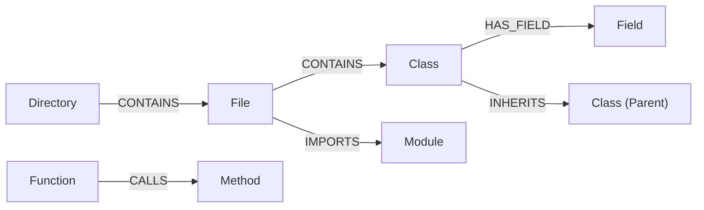

# AST Module Specification

The AST (Abstract Syntax Tree) module provides the structural foundation of Graphit Code.
It parses source files into an in-memory graph database, enabling AI agents to trace call graphs, locate definitions, and assess modification impacts using Cypher queries.

---

## 🌐 Supported Languages

Graphit Code supports **16 programming languages** via Tree-sitter parsers. Each language has dedicated query patterns that extract specific structural entities from source files.

| # | Language | Extensions | Key Extracted Entities |
|---|---|---|---|
| 1 | **Go** | `.go` | Function, Method, Struct, Interface, Type, Constant, Variable, Field, Parameter |
| 2 | **TypeScript** | `.ts` | Function, Class, Interface, Type, Enum, Variable, Field, Parameter, Decorator |
| 3 | **TypeScript (TSX)** | `.tsx` | Function, Class, Interface, Type, Enum, Variable, Field, Parameter, Decorator |
| 4 | **JavaScript** | `.js`, `.jsx`, `.mjs` | Function, Class, Variable, Field, Parameter, Export |
| 5 | **Python** | `.py` | Function, Class, Variable, Parameter, Decorator |
| 6 | **Java** | `.java` | Function (Method + Constructor), Class, Interface, Enum, Variable, Field, Parameter, Package, Annotation |
| 7 | **Rust** | `.rs` | Function, Struct, Enum, Trait, Type, Constant, Variable, Field, Parameter, Attribute |
| 8 | **C** | `.c`, `.h` | Function, Struct, Enum, Type, Variable, Field, Parameter |
| 9 | **C++** | `.cpp`, `.hpp`, `.cc`, `.cxx` | Function, Class, Struct, Enum, Namespace, Type, Field, Parameter |
| 10 | **C#** | `.cs` | Function (Method), Class, Interface, Enum, Struct, Property, Namespace, Field, Parameter, Attribute |
| 11 | **Kotlin** | `.kt`, `.kts` | Function, Class, Interface, Enum, Variable, Field, Parameter, Package, Annotation |
| 12 | **Swift** | `.swift` | Function, Class, Struct, Enum, Protocol (Interface), Variable, Field, Parameter |
| 13 | **Dart** | `.dart` | Function, Method, Class, Enum, Mixin (Interface), Variable, Field, Parameter |
| 14 | **PHP** | `.php` | Function, Method, Class, Interface, Trait, Enum, Constant, Namespace (Package), Field, Parameter, Attribute |
| 15 | **Ruby** | `.rb` | Function, Class, Module, Variable, Field, Parameter |
| 16 | **SQL** | `.sql` | Function, Table, View |

### Cross-Language Extraction Capabilities

For every supported language, the parser extracts the following relationship data (when applicable to the language):

| Capability | Description | Languages |
|---|---|---|
| **Function Calls** | Traces which functions/methods call which others | All 16 |
| **Import Resolution** | Maps module dependencies and import chains | All except SQL |
| **Class Inheritance** | `extends` / superclass relationships | JS, TS, Python, Java, C#, C++, Kotlin, Swift, Dart, PHP, Ruby |
| **Interface Implementation** | `implements` / protocol conformance | TS, Java, C#, Kotlin, PHP, Rust |
| **Field Access Tracking** | Reads and writes to class/struct fields | Go, JS, TS, Java, C#, C, C++, Kotlin, Swift, Python, Rust, PHP, Ruby |
| **Decorator / Annotation** | Attribute / annotation extraction | TS, Python, Java, C#, Kotlin, Swift, Rust, PHP |
| **Object Instantiation** | `new` expression tracking | JS, TS, Java, C#, C++, PHP |
| **Cyclomatic Complexity** | Computed for every function/method | All 16 |
| **Export Visibility** | `is_exported` flag per entity | Go, JS, TS |

---

## 🗄️ Database Architecture: LadybugDB

The AST database is backed by **LadybugDB**, an embedded graph database from the `github.com/LadybugDB/go-ladybug` library.
It stores files, folders, and language entities as graph nodes, and import/calls/parent-child relations as edges.

### Node Schemas

The database initializes node tables with the following attributes:

| Node Label | Key Properties | Purpose |
|------------|----------------|---------|
| `File` | `path` (PK), `name`, `relative_path`, `is_dependency`, `lang`, `cluster`, `source` | Source file metadata and full raw source. |
| `Directory` | `path` (PK), `name`, `cluster` | File system directories. |
| `Module` | `uid` (PK), `name`, `lang`, `full_import_name`, `path`, `line_number`, `end_line` | Importable library modules. |
| `Class` / `Struct` | `uid` (PK), `name`, `path`, `line_number`, `end_line`, `cyclomatic_complexity`, `is_exported` | Complex data structures and object types. |
| `Function` / `Method` | `uid` (PK), `name`, `path`, `line_number`, `end_line`, `cyclomatic_complexity`, `is_exported`, `entry_point_score` | Executable code blocks and member functions. |
| `Interface` | `uid` (PK), `name`, `path`, `line_number`, `end_line`, `is_exported` | Abstract contracts. |
| `Field` / `Parameter` / `Variable` | `uid` (PK), `name`, `lang`, `is_stub` | Variables, parameters, and struct/class fields. |

### Relationship Schemas

Nodes are connected through typed relationships:



- **`CONTAINS`**: Hierarchical ownership (e.g. `Directory -> Directory`, `Directory -> File`, or `File -> Function`).
- **`IMPORTS`**: Dependency resolution. Attributes: `alias`, `full_import_name`, `imported_name`, `line_number`, `source_file`.
- **`CALLS`**: Direct function/method invocations. Attributes: `source_file`, `line_number`, `full_call_name`, `receiver_type`.
- **`HAS_PARAMETER`**: Function signatures. Connects caller entities to `Parameter` nodes.
- **`HAS_FIELD`**: Class/Struct fields. Connects definitions to `Field` nodes.
- **`READS_FIELD` / `WRITES_FIELD`**: Data access tracing. Tells which methods read or write to which fields.
- **`INHERITS` / `IMPLEMENTS`**: Class inheritance and interface implementations.

---

## 🔀 Cypher Translation Layer

LadybugDB uses standard graph database constraints, but does not support all complex Cypher filter formats.
`internal/ast/ladybug.go` intercepts and translates Cypher queries:

1. **Label Filtering**:
   Converts standard Neo4j-style syntax `MATCH (n:File)` or `WHERE n:File` to explicitly match against the `label(n)` function:
   ```diff
   - MATCH (n:File)
   + MATCH (n) WHERE label(n) = 'File'
   ```
2. **Keyword Escaping**:
   Because labels like `File`, `Directory`, and `Module` are reserved words in LadybugDB's parser, the translator wraps them in backticks automatically:
   ```diff
   - MATCH (f:File)-[r:CONTAINS]->(fn:Function)
   + MATCH (f:`File`)-[r:CONTAINS]->(fn:`Function`)
   ```
3. **Transaction batching**:
   Applies `ON CREATE SET` translation to normal `SET` query updates.

---

## 🔍 Parser Adapters & Compilation

The engine supports multiple language parsers to build the tree:

### Tree-sitter Adapters (`internal/ast/treesitter_adapter.go`)
Used to parse mainstream languages (like Go, Dart, TypeScript, JavaScript) into the AST database.
It compiles nodes by analyzing variables, structure, and functions matching the target language rules.

---

## 🔄 Indexing Pipeline: Full & Incremental

The AST module supports two indexing modes to balance completeness with performance.

### Full Indexing Pipeline

Triggered on first `graphit init` or when the database is missing/corrupted. The complete pipeline:

```
Source Files → File Discovery → Tree-sitter Parse → Entity Extraction → Graph Write → FTS5 Index → Trigram Index → Vector Embedding
```

1. **File Discovery**: Walks the project directory, respecting `.gitignore` and `.astignore` rules. Detects language via file extension.
2. **Tree-sitter Parse**: Each file is parsed into a concrete syntax tree using the appropriate language grammar.
3. **Entity Extraction**: Tree-sitter queries extract structured entities (functions, classes, imports, calls, fields, etc.) from the syntax tree.
4. **Graph Write**: Extracted entities are written as nodes and relationships into LadybugDB. Each entity gets a unique `uid` and is linked to its parent file via `CONTAINS` edges.
5. **FTS5 Index**: Entity names are split (camelCase, snake_case) and indexed in SQLite FTS5 for multi-pass full-text search.
6. **Trigram Index**: Entity names are decomposed into 3-character trigrams for fuzzy matching and typo tolerance.
7. **Vector Embedding**: When enabled, entity contexts are embedded via the local ONNX model (CodeRankEmbed-137M) and stored in SQLite-vec for semantic search.

### Incremental Indexing Pipeline

Triggered on every subsequent `graphit sync` or by the file watcher. Only processes changed files:

1. **Hash Cache (`internal/ast/hash_cache.go`)**: During setup, the pipeline scans files and stores a SHA-256 checksum hash per file.
2. **Change Detection**: Compares current file hashes against the stored cache. Only files with modified hashes enter the parse pipeline.
3. **Selective Graph Update**: For each changed file, the pipeline:
   - Removes all existing nodes and edges belonging to that file from LadybugDB.
   - Re-parses the file via Tree-sitter.
   - Re-writes the extracted entities and relationships.
   - Updates the FTS5, trigram, and vector indices for affected entities.
4. **Thread-Safe Batching**: Files are queued into concurrent Go worker pools. Workers parse files in parallel, pushing results to a single-threaded SQLite writer connection to avoid database write contention.
5. **Shard Cache (`internal/ast/shard_cache.go`)**: Parsed AST results are cached as JSON shards on disk, enabling fast rebuilds without re-parsing unchanged files.

### Performance Characteristics

| Metric | Full Index | Incremental Index |
|---|---|---|
| **Trigger** | First init, database rebuild | File change detected |
| **Scope** | All project files | Only changed files |
| **Typical Duration** | Seconds (medium projects) to minutes (large monorepos) | Milliseconds to low seconds |
| **CPU Impact** | Moderate (concurrent workers) | Minimal |
| **Graph Consistency** | Full rebuild guarantees correctness | Hash-validated partial updates |

---

## 👁️ File Watcher (`internal/ast/watcher.go`)

The AST watcher monitors source file changes to trigger automatic reindexing. It uses **git-based polling** instead of filesystem notifications (`fsnotify`):

- **Polling**: Runs `git status --porcelain -unormal` + `git rev-parse HEAD` every 2 seconds
- **Combined state hash**: `SHA256(HEAD_commit + status_output)` — detects both uncommitted edits and committed changes between polls
- **Filtering**: Applies `.gitignore` (via git) and `.astignore` (via `ignorer.IgnoreChecker`)
- **Debounce**: 500ms after last detected change before triggering reindex
- **Zero file descriptors**: No inotify/kqueue watches needed, avoiding resource exhaustion on large projects

## 🔍 Search Engines: Hybrid RRF & Trigram FTS

The AST query engine features a multi-pass hybrid retrieval pipeline (`internal/ast/fts_sqlite.go` / `internal/ast/query.go`) to resolve natural language and code identifiers to exact structural entities and files:

### 1. Multi-Pass FTS5 Search
For lexical matching, the search index splits complex code identifiers (e.g., camelCase, PascalCase, snake_case) into separate words and executes multiple query passes using SQLite's FTS5 engine:
- **Phrase Pass**: Searches for the exact raw query string in quotes.
- **AND Pass**: Requires all query tokens to be present.
- **OR Pass**: Matches documents containing any query tokens.
- **Prefix Pass**: Appends a wildcard (`*`) to all query tokens to match partial prefixes.

### 2. SQLite Trigram Matching
To resolve typos and support robust substring matching in entity names, the engine leverages a SQLite trigram index:
- Splits code identifiers into three-character sequences.
- Performs fast trigram lookups on the `entity_trigram` table.

### 3. Semantic Vector Search
When vector embeddings are enabled and synchronized, the engine performs a semantic vector search:
- Computes high-dimensional embeddings for queries using the model manager.
- Performs cosine similarity lookup using the SQLite-vec extension on the `entity_vec` table.

### 4. Reciprocal Rank Fusion (RRF)
To unify rankings across all lexical passes, trigram lookups, and semantic search streams, the engine fuses scores using Reciprocal Rank Fusion:
```go
RRF_Score(d) = sum( weight / (k + rank_i(d)) )
```
(where `k` is a constant, default 60, and each pass uses a custom weight).
This ensures exact lexical hits rank highly, while semantic and fuzzy matches boost relevant candidates when the exact name isn't matched.
