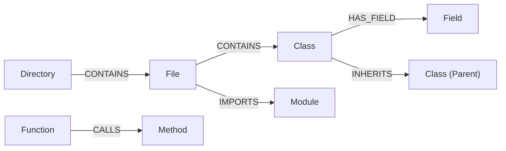

# AST Module Specification

The AST (Abstract Syntax Tree) module provides the structural foundation of Graphit Code.
It parses source files into an in-memory graph database, enabling AI agents to trace call graphs, locate definitions, and assess modification impacts using Cypher queries.

---

## 🗄️ Database Architecture: LadybugDB

The AST database is backed by **LadybugDB**, an embedded graph database from the `github.com/LadybugDB/go-ladybug` library.
It stores files, folders, and language entities as graph nodes, and import/calls/parent-child relations as edges.

### Node Schemas

The database initializes node tables with the following attributes:

| Node Label | Key Properties | Purpose |
|------------|----------------|---------|
| `File` | `path` (PK), `name`, `relative_path`, `is_dependency`, `lang`, `cluster`, `source` | Source file metadata and full raw source. |
| `Directory` | `path` (PK), `name`, `cluster` | File system directories. |
| `Module` | `uid` (PK), `name`, `lang`, `full_import_name`, `path`, `line_number`, `end_line` | Importable library modules. |
| `Class` / `Struct` | `uid` (PK), `name`, `path`, `line_number`, `end_line`, `cyclomatic_complexity`, `is_exported` | Complex data structures and object types. |
| `Function` / `Method` | `uid` (PK), `name`, `path`, `line_number`, `end_line`, `cyclomatic_complexity`, `is_exported`, `entry_point_score` | Executable code blocks and member functions. |
| `Interface` | `uid` (PK), `name`, `path`, `line_number`, `end_line`, `is_exported` | Abstract contracts. |
| `Field` / `Parameter` / `Variable` | `uid` (PK), `name`, `lang`, `is_stub` | Variables, parameters, and struct/class fields. |

### Relationship Schemas

Nodes are connected through typed relationships:



- **`CONTAINS`**: Hierarchical ownership (e.g. `Directory -> Directory`, `Directory -> File`, or `File -> Function`).
- **`IMPORTS`**: Dependency resolution. Attributes: `alias`, `full_import_name`, `imported_name`, `line_number`, `source_file`.
- **`CALLS`**: Direct function/method invocations. Attributes: `source_file`, `line_number`, `full_call_name`, `receiver_type`.
- **`HAS_PARAMETER`**: Function signatures. Connects caller entities to `Parameter` nodes.
- **`HAS_FIELD`**: Class/Struct fields. Connects definitions to `Field` nodes.
- **`READS_FIELD` / `WRITES_FIELD`**: Data access tracing. Tells which methods read or write to which fields.
- **`INHERITS` / `IMPLEMENTS`**: Class inheritance and interface implementations.

---

## 🔀 Cypher Translation Layer

LadybugDB uses standard graph database constraints, but does not support all complex Cypher filter formats.
`internal/ast/ladybug.go` intercepts and translates Cypher queries:

1. **Label Filtering**:
   Converts standard Neo4j-style syntax `MATCH (n:File)` or `WHERE n:File` to explicitly match against the `label(n)` function:
   ```diff
   - MATCH (n:File)
   + MATCH (n) WHERE label(n) = 'File'
   ```
2. **Keyword Escaping**:
   Because labels like `File`, `Directory`, and `Module` are reserved words in LadybugDB's parser, the translator wraps them in backticks automatically:
   ```diff
   - MATCH (f:File)-[r:CONTAINS]->(fn:Function)
   + MATCH (f:`File`)-[r:CONTAINS]->(fn:`Function`)
   ```
3. **Transaction batching**:
   Applies `ON CREATE SET` translation to normal `SET` query updates.

---

## 🔍 Parser Adapters & Compilation

The engine supports multiple language parsers to build the tree:

### 1. Tree-sitter Adapters (`internal/ast/treesitter_adapter.go`)
Used to parse mainstream languages (like Go, Dart, TypeScript, JavaScript) into the AST database.
It compiles nodes by analyzing variables, structure, and functions matching the target language rules.

### 2. ANTLR Adapters
Graphit Code includes parser support for enterprise databases and legacy systems.
It compiles grammars using an ANTLR Java wrapper:
- **PL/SQL Grammar**: Parses Oracle PL/SQL packages, procedures, triggers, columns, tables, and selects/updates/deletes DML actions.
- **NiFi Grammar**: Indexes Apache NiFi configurations.
- **Oracle Forms & Reports**: Parses Oracle Forms `.fmt` and `.rex` code.

---

## 🔄 Incremental Indexing Pipeline

To index massive codebases without consuming heavy CPU cycles, `internal/ast/pipeline.go` implements an **Incremental Rebuild** routine:

1. **Hash Cache (`internal/ast/hash_cache.go`)**:
   During setup, the pipeline scans files and stores a SHA256 checksum hash.
2. **Parse Cache**:
   If a file's hash matches the database's `content_hash`, parsing is skipped, preserving existing nodes.
3. **Thread-Safe Batching**:
   Files are queued into worker pools. Go workers process files concurrently, pushing results to a single-threaded SQLite writer connection to avoid database write contention.
