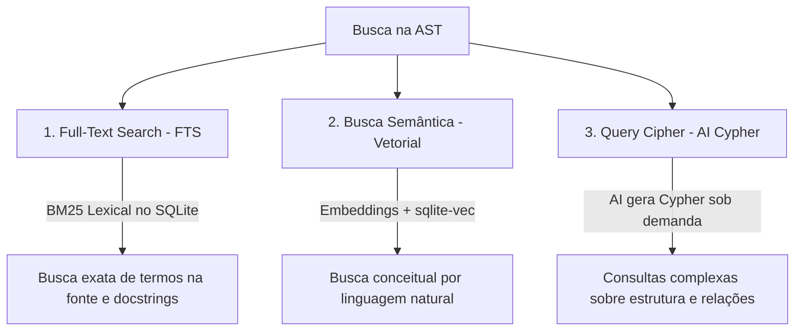

# Especificação do Módulo AST

O módulo AST (`internal/ast`) constrói um **Grafo de Conhecimento de Código Fonte**. Ele analisa a sintaxe do projeto usando parsers gramaticais rígidos e mapeia todos os componentes de software em um banco de dados de grafos consultável por IA e desenvolvedores.

---

## 🌳 Ingestão e Parsers Tree-Sitter

Ao executar `graphit ast index`, o sistema realiza uma varredura de arquivos no repositório de código do projeto.
* **Detecção de Linguagem:** O módulo analisa extensões de arquivos e cabeçalhos para mapear parsers específicos.
* **Tree-Sitter:** Utiliza a biblioteca Tree-sitter para analisar o código e gerar a árvore de sintaxe concreta (CST/AST). Isso permite extrair funções, classes, imports, structs, chamadas de métodos, comentários de documentação (docstrings) e variáveis de forma totalmente determinística.
* **Incrementalidade:** Cada arquivo indexado possui seu hash guardado em cache. O monitor (`ast watcher`) observa edições de arquivos e re-parseia de forma incremental apenas o arquivo modificado, atualizando seus nós e arestas no banco de dados em milissegundos.

---

## 📊 Modelo de Grafo no LadybugDB

O grafo AST mapeia os componentes como **Nós** conectados por **Relacionamentos**.

### 1. Rótulos de Nós (Node Labels)
* `File`: O arquivo físico contendo código fonte.
* `Directory`: Diretórios do sistema de arquivos.
* `Module`: Pacotes e imports reutilizáveis.
* `Class` / `Struct` / `Interface` / `Enum`: Definições de tipos.
* `Function` / `Procedure` / `Macro`: Definições de rotinas executáveis.
* `Variable` / `Constant`: Atribuições de variáveis locais e globais.
* `Parameter` / `Field` / `Column`: Componentes atômicos de métodos e tabelas.

### 2. Tipos de Relacionamentos (Relationships)
* `CONTAINS`: Mapeia a hierarquia de posse física (ex: `Directory -[:CONTAINS]-> File` ou `Class -[:CONTAINS]-> Function`).
* `IMPORTS`: Indica dependência de arquivos ou módulos externos (ex: `File -[:IMPORTS]-> Module`).
* `CALLS`: Mapeia a chamada de execução entre rotinas (ex: `Function A -[:CALLS]-> Function B`), permitindo traçar cadeias de chamadas (call-chains) recursivamente.
* `INHERITS` / `IMPLEMENTS`: Relações de herança e polimorfismo de classes/interfaces.
* `READS_FIELD` / `WRITES_FIELD`: Acesso de rotinas sobre propriedades de tipos.

---

## 🔍 Possibilidades de Busca na AST

O Graphit Code oferece três formas distintas e complementares de pesquisar o grafo AST:

### 1. Busca Textual (Full-Text Search - FTS)
Pesquisa por palavras-chave exatas usando o motor FTS5 embutido no SQLite.
* Realiza consultas lexicais ultra-rápidas no código-fonte indexado e comentários de documentação (`docstrings`).
* Retorna resultados ordenados pelo score BM25.

### 2. Busca Semântica (Busca Vetorial)
Permite buscar componentes do código usando consultas conceituais em linguagem natural (ex: *"pesquise onde validamos tokens de autenticação"*).
* Requer a geração prévia de embeddings (`graphit ast embed`).
* Utiliza a extensão CGO `sqlite-vec` para rodar buscas KNN locais por similaridade de cosseno sobre os vetores de 768 dimensões gerados pela IA.

### 3. Query Cipher (AI Cypher translation)
A funcionalidade mais avançada do motor de AST. Ela traduz perguntas em linguagem natural em consultas formais de banco de dados de grafos na linguagem **Cypher**, executando-as em tempo real sobre o LadybugDB.
* **Expansão de Palavras-Chave:** A IA expande a pergunta em sinônimos comuns no código.
* **Pré-Pesquisa de Identidade:** O sistema busca entidades candidatas no banco local que correspondam aos sinônimos identificados.
* **Geração de Cypher:** A IA recebe a especificação de esquema do LadybugDB e as entidades candidatas, gerando uma consulta Cypher em uma única linha livre de alucinações (ex: `MATCH (f:Function)-[r:CALLS]->(t:Function {name: 'validate'}) RETURN f, r, t`).
* A consulta é executada no banco de grafos local e retorna estruturas completas para visualização em tabela ou grafo 3D.

---

## 👥 Agrupamento por Cluster (Microserviços)

O parâmetro `--cluster <name>` adiciona uma tag de agrupamento a todos os nós gerados durante a indexação de um determinado diretório ou projeto.
* Em empresas contendo dezenas de microserviços ou bibliotecas acopladas, o desenvolvedor pode associar clusters lógicos a cada repositório.
* Isso possibilita responder a consultas de dependência global entre sistemas diferentes de forma automatizada e colaborativa (ex: mapear quais funções do microserviço *A* chamam APIs documentadas no microserviço *B*).

---
*Próximo passo recomendado:* Conheça o [[wiki_module]] para buscas e chat sobre documentação.
