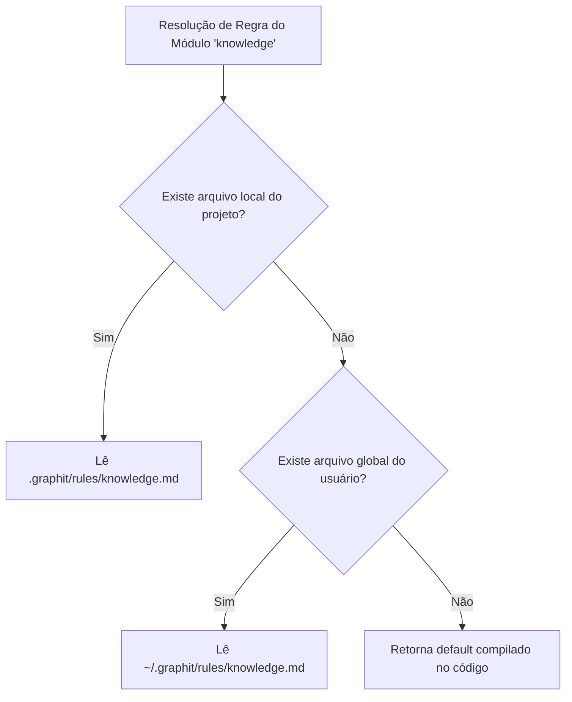

# Customização de Marca (Brand Customization)

O Graphit Code foi estruturado para suportar **customização dinâmica de identidade visual e de ambiente (White-labeling / Rebranding)**. O pacote `internal/brand` centraliza toda a lógica de nomenclatura de arquivos, prefixos e chaves, garantindo que o compilador e as dependências se adaptem automaticamente a qualquer alteração de marca.

---

## 🏷️ Mapeamento Dinâmico de Identidade

A alteração do valor da variável `Brand` no código fonte (ou via injeção de constantes na compilação com a flag `-ldflags`) atualiza dinamicamente as seguintes propriedades de sistema:

| Nome da Função | Padrão Resolvido | Descrição |
|---|---|---|
| `Brand` | `graphit` | Identificador básico da marca. |
| `DisplayName` | `Graphit Code: AI Harness...` | Nome completo de exibição do utilitário de sistema. |
| `DotDir()` | `.graphit` | Nome do diretório oculto de dados na raiz do projeto e no home do usuário. |
| `LockFileName()` | `graphit.lock.json` | Nome do arquivo de lock gerado no projeto. |
| `HookMarker()` | `# graphit-managed-hook` | Assinatura inserida em arquivos de hook do Git gerenciados. |
| `IgnoreMarker()` | `GRAPHIT AUTOGENERATED IGNORER` | Marcador de bloco gerado no `.gitignore`. |
| `ManagedBlockMarker()` | `GRAPHIT MANAGED BLOCK` | Marcador de bloco injetado em arquivos de regras da IDE. |
| `BinName()` | `graphit` | Nome do executável CLI para sistemas UNIX. |
| `EnvPrefix()` | `GRAPHIT` | Prefixo usado para leitura de variáveis de ambiente do sistema. |
| `MCPServerName(mod)` | `graphit-code-mcp` | Identificador do servidor MCP exposto para IDEs. |
| `PrinterPrefix(mod)` | `graphit:module` | Cabeçalho usado na formatação de saída colorida do console CLI. |

---

## 🛠️ Resolução Dinâmica de Regras e Skills de Módulos

Ao orquestrar o comportamento do agente de IA nas IDEs, o sistema permite customizar as diretivas operacionais dos módulos do Graphit Code. O pacote `brand` resolve as regras buscando em ordem de precedência em arquivos Markdown:

### Exemplo de Fluxo:
1. **Regra de Módulo (`ResolveModuleRule`):** Busca as regras arquiteturais do módulo `knowledge` em `<project>/.graphit/rules/knowledge.md` e, caso não exista, busca em `~/.graphit/rules/knowledge.md` antes de apelar para as regras de fábrica.
2. **Skill de Módulo (`ResolveModuleSkill`):** Busca as instruções operacionais de skills do módulo, resolvendo caminhos no padrão `knowledge_skill.md`.
3. **Substituição de Espaços Reservados (Placeholders):** O sistema substitui marcadores internos de placeholders (`{{_GRAPHIT_DEFAULT_RULE_CONTENT_}}`) pelo conteúdo default, permitindo que o usuário adicione apenas regras incrementais sem precisar reescrever as regras nativas de fábrica.

---
*Próximo passo recomendado:* Conheça o [[hub_collaboration]] para compartilhamento de artefatos.
