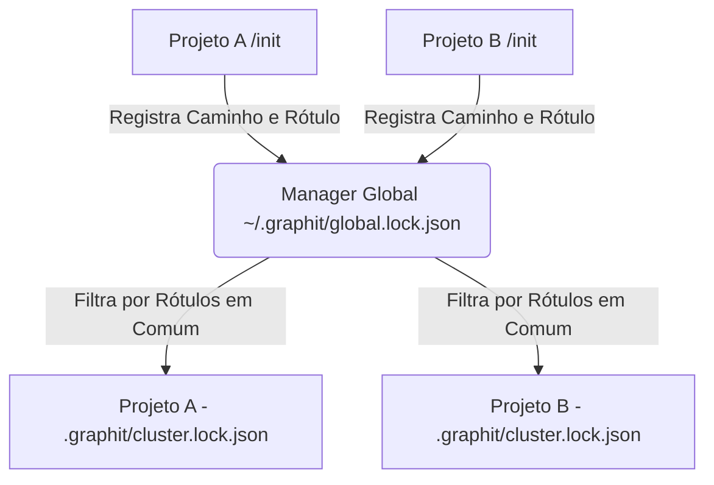

# Agrupamento em Cluster de Microserviços

O Graphit Code foi desenhado para escalar de ambientes com um único desenvolvedor trabalhando de forma isolada para **grandes ecossistemas empresariais compostos por múltiplos microserviços**. A funcionalidade de **Clustering** resolve o desafio de descoberta de dependências e regras cruzadas de forma autônoma.

---

## 🏷️ Gerenciamento de Labels de Cluster

O comando `graphit cluster` permite rotular o projeto atual com marcadores lógicos que descrevem sua função na topologia de software da empresa.

**Exemplos de comandos:**
```bash
# Define o time de desenvolvimento dono do projeto
graphit cluster team backend

# Define o domínio funcional de negócios
graphit cluster domain payments
```

Estes rótulos de cluster são salvos localmente e registrados no gerenciador global de projetos da sua máquina.

---

## 🔍 Registro Global de Projetos e `cluster.lock.json`

O ecossistema mantém o controle de todos os projetos de desenvolvimento ativos de forma descentralizada:



1. **O Manager Global (`global.lock.json`):**
   O `GlobalLockManager` gerencia o arquivo central `~/.graphit/global.lock.json`. Toda vez que um projeto roda `graphit init`, o daemon registra o caminho absoluto do diretório físico do projeto associado ao seu UUID e seus rótulos de cluster.
2. **Auto-Descoberta de Irmãos (Sibling Projects):**
   A chamada `SyncProjectLock` lê o mapa global do usuário, encontra todos os outros projetos registrados que compartilham pelo menos um par chave/valor de cluster com o projeto atual e gera o arquivo local `.graphit/cluster.lock.json`.
3. **Mapeamento no Lockfile do Projeto:**
   O arquivo `cluster.lock.json` passa a catalogar as propriedades de todos os projetos irmãos ativos (caminho absoluto do diretório, nome, descrição, etc.).

---

## 👥 Colaboração em Ambientes Corporativos de Microserviços

A existência de projetos vizinhos auto-descobertos em `cluster.lock.json` permite uma série de superpoderes colaborativos integrados:

### 1. Escrita de Código Guiada por Relações Cruzadas
Quando um desenvolvedor está editando o código do *Projeto A* e precisa chamar um serviço HTTP exposto pelo *Projeto B*, a IA (orquestrada via MCP) lê o arquivo `.graphit/cluster.lock.json` para saber o caminho físico do *Projeto B* no disco local. Ela então consegue navegar e analisar as rotas, DTOs e assinaturas de métodos do projeto vizinho em tempo real, gerando a chamada do serviço de forma 100% precisa.

### 2. Busca Global em Ecossistemas
Durante consultas interativas ou sessões de chat, o desenvolvedor pode acionar buscas globais abrangendo o cluster inteiro:
```bash
# Busca documentações de autenticação no projeto local e nos microserviços irmãos de mesmo cluster
graphit wiki search "como é validado o token JWT?" --wiki project,memory,auth-service
```
O motor de busca mapeia o identificador `auth-service` para o diretório físico listado no `cluster.lock.json` e realiza o parsing da documentação do serviço irmão de forma totalmente transparente para o usuário.

---
*Próximo passo recomendado:* Conheça a [[ui_interface]] para visualização do grafo de cluster e AST.
