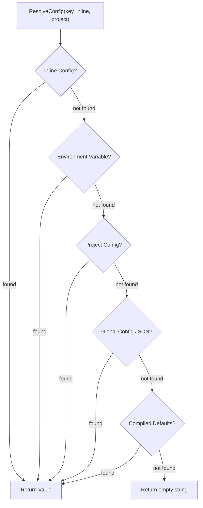

# Config Module Specification

The `internal/config` package implements a layered configuration system that resolves settings from multiple sources in a strict precedence order. It provides a unified interface for all Graphit modules to read configuration values without knowing their origin.

---

## ⚙️ Architecture

Configuration is stored as a flat `ConfigMap` (`map[string]any`) that supports one level of nesting via dot-notation keys (e.g., `hub.bucket`, `modules.ast`). Values flow through a resolution chain where the first non-empty match wins.



### Resolution Order

1. **Inline config** — Passed directly by the caller (e.g., lockfile config section).
2. **Environment variables** — Derived from the key: `GRAPHIT_<UPPER_DOT_TO_UNDERSCORE>` (e.g., key `hub.bucket` → `GRAPHIT_HUB_BUCKET`).
3. **Project config** — Stored in the project lockfile's `config` section.
4. **Global config** — Stored in `~/.graphit/config.json`, or in the directory named by
   `GRAPHIT_GLOBAL_DIR` when it is set — see below.
5. **Compiled defaults** — Baked into the binary at build time via `-ldflags`.

---

## The one setting that is not a config key

**`GRAPHIT_GLOBAL_DIR` — the location of the global brand directory — is read from the
environment only. `graphit config` cannot set it, and it does not pass through
`ResolveConfig`.**

The reason is structural, not a gap: the global config file lives *inside* the global
directory (`AppDir()` → `<global>/config.json`). A key naming that directory could only
be read after the directory had already been located, so the resolution chain above can
never be the layer that answers "where is the chain's own storage". The environment is
the only layer that resolves before the filesystem does.

Two consequences worth stating plainly:

- **It is read in `internal/brand`, not here.** `brand.GlobalDir()` calls
  `os.Getenv(brand.EnvVar("GLOBAL_DIR"))` directly. Routing it through this package
  would be an import cycle — `internal/config` imports `internal/brand`.
- **`GRAPHIT_GLOBAL_DIR` is therefore *not* the env layer of a `global_dir` key.** The
  step-2 mapping (`key` → `GRAPHIT_<KEY>`) is a coincidence of naming here; there is no
  `global_dir` key to set in a lockfile, in `config.json`, or in the compiled defaults,
  and setting one has no effect. `graphit config` accepts unknown keys silently, so a
  `graphit config global_dir /some/path` reports success and changes nothing.

Full behaviour — precedence, the white-label name, relative values, and what moves with
it — is in [Storage Layout](../architecture/storage_layout.md#moving-it-graphit_global_dir).

---

## 🧩 Key Types & Interfaces

### `ConfigMap`

```go
type ConfigMap = map[string]any
```

A type alias for `map[string]any`. Supports flat keys (`"ide"`) and one-level nested maps (`"hub" → {"repo": "..."}`) accessed via dot notation.

### `CompiledDefaults`

```go
var CompiledDefaults string
```

A package-level variable populated at build time via Go's `-ldflags` mechanism. It is a comma-separated string of `key=value` pairs:

```
ide=claude,hub.bucket=team-graphit,hub.region=us-east-1
```

Parsed lazily by `getCompiledDefaults()` using `sync.Once` to ensure it is processed exactly once.

---

## 📋 Configuration Keys

### Top-Level Keys

| Key | Description | Default |
|---|---|---|
| `ide` | Target IDE adapter (claude, cursor, gemini, antigravity, codex, opencode, kiro) | `claude` |
| `cli` | CLI tool command name | Derived from IDE |

### Nested Keys

| Key | Description | Default |
|---|---|---|
| `hub.bucket` | S3 bucket that stores the Hub registry and published artifacts | (compiled default) |
| `hub.region` | AWS/S3 region | (compiled default) |
| `hub.endpoint` | Optional S3-compatible endpoint, such as MinIO | AWS default endpoint |
| `hub.prefix` | Key prefix inside the Hub bucket | (compiled default) |
| `hub.access_key_id` | Optional explicit S3 access key; active only with `hub.secret_access_key` | AWS credential-provider chain |
| `hub.secret_access_key` | Optional explicit S3 secret key; active only with `hub.access_key_id` | AWS credential-provider chain |
| `hub.icebug.reverse_edges` | Whether AST artifacts publish a separate reverse CSR for every relationship type. Only explicit `false` disables it. | `true` |
| `ui.host` | Address on which the unified UI server listens | `127.0.0.1` |
| `ui.allowed_origins` | Comma-separated exact CORS origins; configured values replace the localhost default allowlist | localhost loopback origins |
| `knowledge.docs_dir` | Relative path to the project documentation directory. Set to `.` to index the whole project. | `docs` |
| `knowledge.include_readme` | Whether the project root's README is indexed into the wiki on top of `knowledge.docs_dir` | `true` |
| `knowledge.extensions` | Comma-separated list of file extensions to index (e.g., `md,yaml,json,proto`). The `.` prefix is optional. | `md,markdown,mdx,txt,adoc,rst,puml,plantuml,yaml,yml,json,proto,graphql,gql,wsdl,xml` |
| `ast.index_source` | Whether to store file source in the AST graph | `true` |
| `ast.index_docs` | Whether the AST pipeline indexes `knowledge.docs_dir`. Off, because the docs tree belongs to the knowledge wiki. | `false` |
| `ast.queries_dir` | Relative path to the directory holding the project's own grammar query files. The default is tracked by git, so this is only needed to keep grammars elsewhere. | `.graphit/ast/queries` |
| `ast.grammar` | Comma-separated `.ext=grammar-name` pairs binding a file extension to one grammar. The only way an `exclusive` grammar — the SQL dialects — is ever used. | (empty — no override) |
| `ast.grammars_blacklist` | Comma-separated grammars the AST index must **not** use. Their files are not discovered, not parsed, and their queries do not resolve. | (empty — nothing disabled) |
| `ast.grammars_whitelist` | Comma-separated grammars the AST index may use, exclusively. Empty means every grammar; non-empty disables everything it does not name. The blacklist still applies on top. | (empty — every grammar) |
| `ast.cluster_map` | Comma-separated `path=cluster` pairs for cluster tagging by directory prefix. Example: `backend/=python,frontend/=javascript,shared/=typescript`. Persisted when using `--cluster-path` CLI flag. | (empty — no per-path clusters) |
| `ast.cluster` | Default cluster name for files not matching any `ast.cluster_map` prefix. | (empty — no default cluster) |
| `task.prefix` | Namespace for authoritative Task LanceDB tables, nested under `hub.prefix` when S3 is configured. | `tasks` |
| `dream.reports_dir` | Relative path to the dream reports vault. Move it under `docs/` to commit reports as a matter of course. | `.graphit/runtime/dream` |
| `dream.idle_timeout` | Inactivity in **seconds** before a dream cycle starts | `7200` (2 hours) |
| `dream.max_duration` | Hard limit in **seconds** on one dream session; `0` means unlimited | `28800` (8 hours) |
| `daemon.activity_window` | Go duration string; how recently a project must have changed to stay supervised. `0` disables parking. | `30m` |
| `modules.<name>` | Enable/disable a module (`true`/`false`) | Enabled for core, disabled for opt-in |

### Hub S3 credentials

Interactive `graphit setup` asks for an optional access-key/secret-key pair after
the Hub bucket settings. A complete pair is written to the **global** config so it
is available to every project on that machine. The secret prompt does not echo on
an interactive terminal, and `graphit config list` and `graphit config get
hub.secret_access_key` redact it.

If either prompt is blank, setup removes any previously configured explicit pair
and leaves authentication to the AWS credential-provider chain (environment,
shared profile, workload/instance role, and the providers supported by the SDK).
A partial pair is never used: all S3 consumers receive the configured credentials
only when both keys resolve non-empty. This applies to the AWS client, LanceDB's
object-store options, and LadybugDB remote access.

The global config is written with owner-only file permissions (`0600`), but the
explicit secret is plain text on disk, not encrypted. Prefer the provider chain
and short-lived role credentials when the deployment supports them. A configured
static pair is deliberately not combined with an unrelated `AWS_SESSION_TOKEN`;
session tokens continue to work when they come from the provider-chain path.

```bash
# non-interactive equivalent; --global is important for machine-wide credentials
graphit config --global hub.access_key_id AKIAEXAMPLE
graphit config --global --secret hub.secret_access_key

# return to the provider chain
graphit config --global --unset hub.access_key_id
graphit config --global --unset hub.secret_access_key
```

### Feature and process modules: `modules.agent`, `modules.daemon_ui`

Both follow the ordinary `modules.<name>` convention, so each gets an environment variable and both
config layers for free.

**`modules.agent`** gates every feature that needs a coding-agent CLI installed on the machine — not
an API key, not an embedding model, but a binary the framework shells out to. It is ON by default.

| Disabled feature | Route |
|---|---|
| Natural-language Cypher in the AST explorer | `POST /api/generate-cypher` |
| AI search in the knowledge explorer | `POST /api/wiki/ai-search` |
| AI search in the memory explorer | the same route — one component over one endpoint |
| Live search | `/api/live/*`, which is not registered at all when the module is off |

Each of those reaches `ai.NewClientFromConfig`, which only ever returns a CLI resolved from `PATH`.
There is no HTTP fallback behind it, so without a binary they cannot degrade — only fail. The flag is
the operator saying "there is no agent here and there will not be one", which is exactly the position
a container image is in.

It deliberately does **not** cover anything running on local ONNX embeddings or on the graph alone:
`GET /api/search` (BM25 + vector hybrid), `GET /api/wiki/search` (BM25), and every Cypher, graph,
complexity and dead-code route keep working, as does the whole MCP tool surface.

The UI reads the same flag, injected into the page by the server as `window.__AGENT_FEATURES__`
rather than fetched, and does not render the controls. Injection rather than a request is the point:
the UI must never offer a feature it cannot deliver, not even for the one frame before a capability
response arrives.

**`modules.daemon_ui`** makes the daemon serve the unified UI for as long as it runs, as one of its
supervised global modules. It is **opt-in** — listed in `OptInModules` beside `dream` — because on a
workstation the UI is something you start with `graphit ui` and close when you are done, and a
background process silently holding port 8080 is not what anyone asks the daemon for. A container is
the case it exists for: there one process must both own the MCP server and serve the UI, and it is
PID 1.

### The daemon's MCP listener: `mcp.host` and `mcp.port`

| Key | Default | Meaning |
|---|---|---|
| `mcp.host` | `127.0.0.1` | The interface the daemon's MCP server binds |
| `mcp.port` | `0` | The port, or `0` for a kernel-assigned one |

Both defaults reproduce exactly what the daemon did before these keys existed. The endpoint is
authenticated by a bearer key, but a key is not a reason to publish a port: the stdio proxy every IDE
uses reaches it over loopback.

A container needs the opposite of an ephemeral port — one known before the process starts, so it can
be declared in the image and mapped on the host. The chosen port is published to
`<DaemonDir>/mcp.port` either way, and the bearer key to `<DaemonDir>/mcp.key` (mode `0600`),
regenerated on every daemon start.

An unparseable or out-of-range `mcp.port` falls back to `0` rather than failing the daemon. That is
deliberate: in a container the daemon is PID 1, so refusing to start over a typo in one key would
take the indexers and both servers down with it instead of producing a diagnostic.

### Secret keys: environment-supplied and redacted

Three keys hold a credential, and they are declared in one place — `config.SecretConfigKeys`:

| Key | Environment variable |
|---|---|
| `hub.secret_access_key` | `GRAPHIT_HUB_SECRET_ACCESS_KEY` |
| `ai.embedding.api_key` | `GRAPHIT_AI_EMBEDDING_API_KEY` |
| `ai.rerank.api_key` | `GRAPHIT_AI_RERANK_API_KEY` |

Two properties follow from that list rather than from anything remembered per call site:

- **Every one of them resolves from its environment variable**, through the ordinary
  `ResolveConfig` chain, where the environment outranks both the project lockfile and the global
  config file. This is what lets a container or a pipeline supply a credential without writing it
  to disk — and an *empty* variable is skipped rather than treated as an answer, so declaring the
  variables empty for discoverability does not blank a stored value.
- **Every one of them is redacted** by `graphit config get` and `graphit config --list`, because
  `IsSecretConfigKey` is derived from the list. This is the gap it closed: redaction previously
  knew about `hub.secret_access_key` alone, so the two AI provider keys — which `setup` stores —
  were printed in clear.

`hub.access_key_id` is deliberately **not** on the list. An access key ID is an identifier, not a
secret; AWS treats only the other half of the pair as confidential, and redacting it would hide the
value an operator most often needs to read back when working out which credentials a machine is
using. `ConfigEnvVar(key)` returns the variable name for any key, so help text and documentation
name it instead of spelling out the rule and drifting from it — and secrets use the same derivation
as every other key rather than a scheme of their own.

The AI providers additionally accept their own native variables when the Graphit key is unset —
`OPENAI_API_KEY`, `COHERE_API_KEY`, `VOYAGE_API_KEY`, `GOOGLE_API_KEY` / `GEMINI_API_KEY`.

### Unified UI network access: `ui.host` and `ui.allowed_origins`

The unified UI server binds to `127.0.0.1` by default. `ui.host` can publish it on
another interface or every IPv4 interface. Like every normal config key, a
project value overrides a global value, and `GRAPHIT_UI_HOST` overrides both.

`ui.allowed_origins` is a comma-separated list of exact browser origins. When the
key is absent or empty, the secure default remains unchanged: empty/same-origin
requests and `http://localhost`, `http://127.0.0.1`, and `http://[::1]` (with
optional ports) are accepted. Once configured, the list **replaces** that default;
add any localhost origin explicitly if it must remain available. `*` explicitly
allows every origin and should only be used when exposing the project data behind
another trusted access-control boundary.

```bash
# apply to every project on this machine
graphit config --global ui.host 0.0.0.0
graphit config --global ui.allowed_origins https://graph.example.com

# override for the current project
graphit config ui.host 127.0.0.1
graphit config ui.allowed_origins http://localhost:5173,https://preview.example.com
```

The unified page uses the same-origin `/api` path, so a browser connecting through
a remote hostname or reverse proxy does not try to call its own `localhost`.
The server has no authentication: CORS limits browser reads but is not a network
authorization boundary. A server bound to `0.0.0.0` must be protected by network
policy or an authenticated reverse proxy. See the complete
[S3 and UI network operator guide](../guides/s3-and-ui-network.md).

### The documentation tree: `knowledge.docs_dir`

```go
const DefaultDocsDir = "docs"

func ResolveDocsDir(inlineCfg, projectCfg ConfigMap) string
```

`knowledge.docs_dir` is the single fact three modules read, and it decides more
than which directory the wiki walks:

| Consumer | What it does with the value |
|---|---|
| Knowledge indexer | walks it, and reports every source path relative to the **project root**, not to this directory |
| AST indexer | *excludes* it, unless `ast.index_docs` is `true` |
| Daemon watcher | routes a changed file under it to the wiki rather than to the code graph |

This default was `.` — the whole project — until it was changed to `docs`. The old
value made the wiki index every indexable file in the repository: vendored
markdown, generated JSON, IDE adapter directories, anything the ignore file did
not happen to name. A project whose documentation lives elsewhere now says so:

```bash
# this project keeps documentation in documentation/
graphit config knowledge.docs_dir documentation

# nested paths work, and are matched exactly — documentation/other/ stays out
graphit config knowledge.docs_dir documentation/wiki

# restore the old behaviour: index the whole project
graphit config knowledge.docs_dir .

# for every project on this machine
graphit config --global knowledge.docs_dir documentation

# one command only
GRAPHIT_KNOWLEDGE_DOCS_DIR=documentation graphit knowledge index
```

`graphit knowledge index <path>` bypasses the key altogether: an explicit path is
taken literally and indexed wholesale, README rule included or not.

### The root README: `knowledge.include_readme`

```go
func ResolveKnowledgeIncludeReadme(inlineCfg, projectCfg ConfigMap) bool
```

The project root's README is indexed into the wiki **whatever `knowledge.docs_dir`
says**, because it is by convention not inside the docs tree and it is the one page
a reader reaches for first. Scoping the wiki to `docs/` without this would have
dropped the front page of every project.

The name is not a fixed string: `knowledge.RootReadme` reads the root directory
and takes the first file whose base name is `readme` (any casing) with an
extension `knowledge.extensions` accepts — `README.md`, `readme.markdown`,
`README.rst`, `README.adoc`. A `README.pdf` is not a document this pipeline can
chunk, so it is not one it picks up.

```bash
# index the docs tree alone
graphit config knowledge.include_readme false
```

Only the **root** README is in scope. A `README.md` one directory down is an
ordinary file: in the wiki if it is under the docs tree, in the code graph
otherwise.

### The docs tree in the code graph: `ast.index_docs`

```go
func ResolveAstIndexDocs(inlineCfg, projectCfg ConfigMap) bool
```

The AST pipeline has parsers for markdown, YAML, JSON and XML, so before this key
existed it indexed the documentation tree as well as the wiki did — a `File` node
per page and a `Heading` node per section, in a graph meant for code. It is off by
default and the docs tree is excluded.

```bash
# put the docs tree back in the code graph
graphit config ast.index_docs true
```

**This is the override, and `.astignore` is not an alternative to it.** The
exclusion is injected as a default ignore pattern, and default patterns are
applied last, which under gitignore's last-match-wins ordering makes them the
highest-priority patterns in the checker — a `!docs/` line in `.astignore` cannot
outrank one. See [ignore_files](../guides/ignore_files.md).

Two configurations produce no exclusion at all, because excluding them would be
wrong rather than merely opinionated:

- `knowledge.docs_dir` is `.` — the docs tree is the project, so the pattern would
  exclude everything and the graph would come out empty.
- the path escapes the project (absolute, or starting with `..`) — the ignore
  checker matches project-relative paths, so no pattern could describe it.

A scoped index (`graphit ast index --path internal/auth`) resolves configuration
from the path it was given, so it sees no project lockfile and applies no
exclusion. That is deliberate: an explicit path is an explicit request, and
`graphit ast index --path docs` indexes the docs tree.

### Cluster Tagging for Monorepos: `ast.cluster_map` and `ast.cluster`

```go
func ResolveClusterPathMap(inlineCfg, projectCfg ConfigMap) map[string]string
func ResolveClusterDefault(inlineCfg, projectCfg ConfigMap) string
```

The AST module supports **logical cluster tagging** to enable filtered queries across different domains within a monorepo (e.g., Oracle SQL, XML export, Java backend, frontend TypeScript). Each indexed node receives a `cluster` property.

**Configuration:**
```bash
# Set cluster map (comma-separated path=cluster pairs, paths are directory prefixes)
graphit config ast.cluster_map "backend/=python,frontend/=javascript,shared/=typescript"

# Set default cluster for unmatched paths
graphit config ast.cluster default-cluster
```

**How it works:**
- Paths are directory prefixes (trailing slash optional). `schema/` matches `schema/table.sql`.
- Most specific (longest) prefix wins when multiple match.
- Files not matching any prefix use `ast.cluster` default (if set).
- When using `graphit ast index --cluster-path` or `graphit ast watch --cluster-path`, the mapping is automatically persisted to `graphit.lock.json`.

**Querying:**
```cypher
// All Oracle SQL tables
MATCH (n:Table {cluster: 'oracle'}) RETURN n.name, n.path

// Cross-cluster calls
MATCH (f:Function {cluster: 'backend'})-[:CALLS]->(s:Function {cluster: 'oracle'})
RETURN f.name, s.name
```

### The project's grammars: `ast.queries_dir`

```go
func DefaultASTQueriesDir() string
func ResolveASTQueriesDir(inlineCfg, projectCfg ConfigMap) string
```

A project overrides a grammar by dropping a query YAML into its own queries
directory, which the resolution chain reads before the user's and the runtime's.
That directory was fixed at `.graphit/ast/queries`, and `graphit init` ignored
`.graphit/` wholesale — so the one kind of customization that belongs to the
repository rather than to the machine lived in the one directory the repository
does not track. The next clone, and every other developer, silently got the
shipped grammar back.

Both halves of that were fixed, and the second one made the first optional. Machine
state and generated output inside the brand directory moved into `.graphit/runtime/`;
the generated `.gitignore` also names `.graphit/grammars/` for platform-specific
parser binaries. The **default query location** remains tracked, and a committed query
override reaches every checkout with no configuration at all. See
[Storage Layout](../architecture/storage_layout.md#inside-a-projects-brand-directory).

The key remains for a project that would rather keep its grammars beside its other
tooling:

```bash
# grammars the whole team gets, versioned with the code
graphit config ast.queries_dir tooling/grammars

# for every project on this machine
graphit config --global ast.queries_dir tooling/grammars

# one command only
GRAPHIT_AST_QUERIES_DIR=tooling/grammars graphit ast index
```

The value is a path relative to the project root, and it **replaces** the default
rather than adding to it: a project has one grammar directory, and two would mean
two answers for the same language with no rule to choose between them. Files left
under `.graphit/ast/queries` after the key is set are not read.

### Turning grammars off: `ast.grammars_blacklist` and `ast.grammars_whitelist`

```go
func ResolveASTGrammarsBlacklist(inlineCfg, projectCfg ConfigMap) string
func ResolveASTGrammarsWhitelist(inlineCfg, projectCfg ConfigMap) string
```

Both keys are comma-separated lists of grammar names, and together they decide
which languages exist for the AST index:

| The configuration | What is enabled |
|---|---|
| neither key set | every registered language — the default |
| `ast.grammars_blacklist=yaml,css` | everything **except** those two |
| `ast.grammars_whitelist=go,sql` | **only** those two |
| whitelist `go,sql` + blacklist `sql` | only `go` — a name in both loses |

```bash
# stop indexing YAML in this project
graphit config ast.grammars_blacklist yaml

# …on this machine, for every project
graphit config --global ast.grammars_blacklist yaml

# …for one command only
GRAPHIT_AST_GRAMMARS_BLACKLIST=yaml graphit ast index
graphit ast index -c ast.grammars_blacklist=yaml

# index nothing but Go and SQL
graphit config ast.grammars_whitelist go,sql
```

**What the names match.** A grammar query file carries both a `language:` and a
`grammar:`, and the two are frequently different — `language: yaml` with
`grammar: tree-sitter-yaml`, `language: plsql` with `grammar: antlr-plsql`. An
entry matches, case-insensitively and after trimming whitespace, if it equals
**any** of three names: the language, the grammar, or the grammar without its
`tree-sitter-` / `antlr-` prefix. So `yaml` and `tree-sitter-yaml` both disable
the same language, which is what someone writing the list means.

**An unknown name is inert.** `ast.grammars_blacklist=cobol` on a machine with no
COBOL grammar disables nothing and reports nothing. This is deliberate: the lists
are read on every lookup, in processes that may not have a grammar pack installed
yet, and rejecting an unknown name would turn "not installed here" into a hard
failure of the whole index. The cost is that a typo is silent — see
[the troubleshooting entry](../guides/troubleshooting.md).

**Why this is not `.astignore`.** That file excludes *paths*; these keys exclude a
*language*, which cuts across paths. And it is not removing a query file either:
the shipped ones live in the installed runtime directory, which is regenerated on
every install and is not a consumer's to edit. See
[the AST module](ast_module.md#turning-a-grammar-off-by-configuration) for where
the keys are enforced and what happens to nodes already in the graph.

### Binding an extension to one grammar: `ast.grammar`

```go
func ResolveGrammarOverrides(inlineCfg, projectCfg ConfigMap) map[string]string
func ParseGrammarOverrides(val string) map[string]string
func MergeGrammarOverrides(base, priority map[string]string) map[string]string
```

Comma-separated `.ext=grammar-name` pairs. The extension gets a leading dot if the
value omits one, and the grammar name selects the backend on its own: `antlr-*` is
ANTLR v4, anything else tree-sitter.

```bash
# this project's .sql is Oracle, and its package files are PL/SQL too
graphit config ast.grammar ".sql=antlr-plsql,.pks=antlr-plsql,.pkb=antlr-plsql"

# …on this machine, for every project
graphit config --global ast.grammar ".sql=antlr-tsql"

# …for one command only
graphit ast index --grammar .sql=antlr-postgresql
```

**It selects rather than reorders.** A bound extension is parsed by the named grammar
and by nothing else — there is no fallback to whatever the extension tables would have
chosen, which is the whole point of stating it.

**It is what makes an exclusive grammar usable.** `plsql`, `postgresql`, `db2`, `tsql`
and `plpgsql` declare `exclusive: true` in their query YAML, so they claim no
extensions at all. Without an entry here, `.sql` is parsed by the tree-sitter `sql`
grammar and `.pks` / `.db2` / `.tsql` are not indexed at all. See
[Exclusive grammars](ast_module.md#exclusive-grammars--reachable-only-when-named).

**It does not revive a disabled grammar.** `ast.grammars_blacklist` and
`ast.grammars_whitelist` are checked after this key: a grammar they exclude stays
excluded, and the files bound to it are not discovered. Exclusivity means *off by
default, on when named*; the blacklist means *off*.

**The configured key reaches further than the `--grammar` flag.** File discovery, the
watcher and the daemon's batch router decide what to offer the parser from the project
configuration alone — they have no command line. The flag is merged on top for parsing
only. So for an extension that no other grammar claims, the key is what makes its files
visible; the flag alone would leave the parser with nothing to parse.

### Shared task tables: `task.prefix`

```go
func ResolveTaskPrefix(inlineCfg, projectCfg ConfigMap) string
```

The Task module stores backlog and active/history state in one authoritative LanceDB
database — see [Task Module](task_module.md). The default namespace is `tasks`. With
S3 configured, it is nested under the Hub prefix and project identity:

```bash
graphit config task.prefix engineering/tasks
graphit config --global task.prefix shared/tasks
GRAPHIT_TASK_PREFIX=ci/tasks graphit task list
```

Prefix values are slash-normalized. Normal configuration precedence applies: inline,
environment, project lockfile, global config, then default. The key changes the table
location; it does not create a repository directory, replica, or migration workflow.

### Reading project config without the hub

```go
func LoadProjectConfig(projectDir string) ConfigMap
```

Reads the `config` object out of a project's lockfile. This duplicates a sliver of
`hub.LoadLockfile` on purpose: `hub` imports `ast`, so `ast` cannot import `hub`,
and the AST side needs project configuration to decide whether the docs tree is
its business. A missing or malformed lockfile resolves to `nil`, which
`ResolveConfig` treats as "nothing set here" and falls through. Anything richer
about a lockfile still belongs to the hub package.

### Module System

Modules are either **always-on** or **opt-in**:

- **Always-on** (`AllModuleNames`): `knowledge`, `ast`, `hub`, `memory`, `improvements`
- **Opt-in** (`OptInModules`): `dream`

`IsModuleDisabled(module, inline, project)` resolves the `modules.<name>` config key. If the value is `"false"`, the module is disabled. If `"true"`, it is enabled. For opt-in modules, the default is disabled (returns `true`).

---

## 🔧 CRUD Operations

### Reading

```go
func GetConfigValue(cfg ConfigMap, dotKey string) (string, bool)
```

Splits `dotKey` at the first `.` to resolve nested maps. Returns the string value and whether it was found.

### Writing

```go
func SetConfigValue(cfg ConfigMap, dotKey, value string)
```

Creates nested map structure if needed. For flat keys, sets directly on the map.

### Deleting

```go
func UnsetConfigValue(cfg ConfigMap, dotKey string)
```

Removes the key. For nested keys, also cleans up empty parent sections.

### Listing

```go
func ListConfigEntries(cfg ConfigMap) [][2]string
```

Returns all key-value pairs as sorted `[key, value]` tuples. Nested maps are flattened to dot-notation keys.

---

## 🌐 Global Config

Stored at `~/.graphit/config.json`. The `AppDir()` function resolves `~/.graphit/` and creates it with mode `0o700`.

| Function | Description |
|---|---|
| `LoadGlobalConfig()` | Load and parse JSON. Returns empty `ConfigMap` if file does not exist. |
| `SaveGlobalConfig(cfg)` | Serialize to indented JSON. Removes empty nested sections. File mode `0o600`. |
| `GetGlobalConfigValue(key)` | Load → get → return `(value, found, error)`. |
| `SetGlobalConfigValue(key, value)` | Load → set → save. |
| `UnsetGlobalConfigValue(key)` | Load → unset → save. |

---

## 🎯 IDE & CLI Resolution

### IDE Resolution

```go
func ResolveIDE(flagValue string, inlineCfg, projectCfg ConfigMap) string
```

Priority: flag → `ResolveConfig("ide", ...)` → `config.FallbackIDE`, which is `"opencode"`.

```go
func ResolveProjectIDE(flagValue string, inlineCfg, projectCfg ConfigMap, lockfileIDEs []string) string
```

Extended resolution that also considers:
1. Flag value
2. Inline config `ide` key
3. Project config `ide` key
4. **Ambient IDE** (env var `GRAPHIT_IDE` → global config → compiled defaults)
5. **Lockfile IDEs list**: If the ambient IDE matches a registered IDE, use it. Otherwise, use the first registered IDE.

### CLI Resolution

```go
func ResolveCLI(flagValue string, inlineCfg, projectCfg ConfigMap, resolvedIDE string) string
```

Priority: flag → `ResolveConfig("cli", ...)` → `CLIForIDE(resolvedIDE)` → `config.FallbackCLI`, which is `"opencode"`.

The `CLIForIDE()` mapping:

| IDE | CLI |
|---|---|
| `antigravity` | `agy` |
| `gemini`, `gemini-code` | `gemini` |
| `claude`, `claude-code` | `claude` |
| `cursor` | `cursor-agent` |
| `codex` | `codex` |
| `opencode` | `opencode` |
| `kiro` | `kiro-cli` |

### Effective default IDE and CLI chains

The values described by setup as the **default IDE** and **default CLI** are not
display-only preferences: they participate in runtime resolution and in executable
fallback discovery.

- `DefaultIDE()` calls `ResolveIDE("", nil, nil)`. With no inline or project maps in
  that call, the effective order is `GRAPHIT_IDE` → global `ide` → compiled `ide` →
  `config.FallbackIDE`.
- `DefaultCLI()` calls `ResolveCLI("", nil, nil, DefaultIDE())`. Its effective order is
  `GRAPHIT_CLI` → global `cli` → compiled `cli` → CLI mapped from the fully resolved
  default IDE → `config.FallbackCLI`.
- Interactive setup uses `DefaultIDE()` and `DefaultCLI()` as the prompt defaults and
  persists the accepted values as global `ide` and `cli`, respectively.

**The two fallbacks are named constants, not literals.** `config.FallbackIDE` and
`config.FallbackCLI` are both `"opencode"`, and they are constants because this value is read at
the bottom of five different resolution paths — `ResolveIDE`, `resolveAmbientIDE`, `ResolveCLI`,
the unified UI server, and `CLIForIDE`'s pairing. As separate string literals they could be changed
one at a time, and the result would not fail: the paths would simply disagree about what the default
is, which nothing reports. `TestFallbackIDEAndCLIAgree` pins the invariant that `FallbackCLI` is the
CLI `CLIForIDE` pairs with `FallbackIDE`.

AI CLI discovery adds one more layer after configuration resolution. `NewClientFromConfig()`
first honors the legacy/specific global `ai.cli` key; when absent, it passes `DefaultCLI()`
to `tryFallbackCLI()`. Executable lookup then tries, in order:

1. the resolved/configured default CLI;
2. the CLI mapped from the resolved default IDE, when distinct;
3. the built-in provider/default candidate list, skipping duplicates.

Each candidate is checked with `exec.LookPath`; therefore, a configured default that is not
installed does not stop resolution — lookup continues through the remaining candidates.
Resolution fails only when no candidate exists in `PATH`.

The build injects `CompiledDefaults` through the Make variable `COMPILE_CONFIG`; there are no
separate `DEFAULT_IDE` or `DEFAULT_CLI` Make variables. A white-label build that wants these
compiled layers must include them explicitly, for example
`COMPILE_CONFIG='ide=cursor,cli=cursor-agent'`. Without those entries, the global values,
IDE-to-CLI mapping, and terminal fallbacks above still apply.

---

## 🔗 Hub S3 Resolution

Hub artifacts and shared memories use one resolved S3 configuration. There is no
`hub.repo` or `memory.repo` configuration key.

| Function | Description |
|---|---|
| `ResolveHubBucket(inline, project)` | Resolve `hub.bucket` through the standard chain. |
| `ResolveHubRegion(inline, project)` | Resolve `hub.region` through the standard chain. |
| `ResolveHubEndpoint(inline, project)` | Resolve `hub.endpoint` through the standard chain. |
| `ResolveHubPrefix(inline, project)` | Resolve and normalize `hub.prefix`. |
| `ResolveHubAccessKeyID(inline, project)` | Resolve the optional access key. |
| `ResolveHubSecretAccessKey(inline, project)` | Resolve the optional secret. |
| `ResolveHubS3(inline, project)` | Return the complete `S3Config`; static credentials are active only as a pair. |
| `HubS3Config()` | Resolve S3 configuration without inline/project overrides. |
| `SetGlobalS3Credentials(access, secret)` | Persist a complete global pair or remove both keys. |
| `IsSecretConfigKey(key)` | Identify values that CLI output must redact; derived from `SecretConfigKeys`. |
| `ConfigEnvVar(key)` | The environment variable that supplies a key. **The** derivation — `ResolveConfig` calls it, and anything that needs to name a variable calls it rather than rebuilding the rule. |
| `AgentFeaturesEnabled(inline, project)` | Whether the agent-CLI-dependent features may be offered. |
| `DaemonServesUI(inline, project)` | Whether the daemon should run the unified UI itself. |
| `ResolveMCPHost` / `ResolveMCPPort` | The daemon's MCP bind address. |
| `SecretConfigKeys` | The canonical list of credential keys. |
| `SecretConfigEnvVars()` | The environment variable for each secret key, in `SecretConfigKeys` order; derived with `ConfigEnvVar`. |

The object-key contract is documented in
[Hub S3 Object Layout](hub-s3-object-layout.md).

---

## 🏁 Setup Detection

```go
func IsSetupDone() bool
```

Returns `true` if `~/.graphit/config.json` exists. Used by the CLI to determine if the initial setup wizard needs to run.

---

## 🚨 Error Handling

- **Missing global config file** — `LoadGlobalConfig()` returns an empty `ConfigMap` (not an error). This allows first-run scenarios to work without setup.
- **JSON parse errors** — Wrapped with `"parsing global config: %w"` for actionable error messages.
- **Missing keys** — `GetConfigValue()` returns `("", false)`. Callers use the boolean to distinguish "not set" from "empty".
- **Thread safety** — `CompiledDefaults` parsing uses `sync.Once` to prevent race conditions during concurrent access.

---

## 📦 Dependencies

### Internal

| Package | Usage |
|---|---|
| `internal/brand` | `DotDir()` for the application directory name, `EnvPrefix()` for environment variable prefixes. |

### External

| Package | Usage |
|---|---|
| `encoding/json` | Global config file serialization/deserialization. |
| `sync` | `sync.Once` for compiled defaults lazy initialization. |
