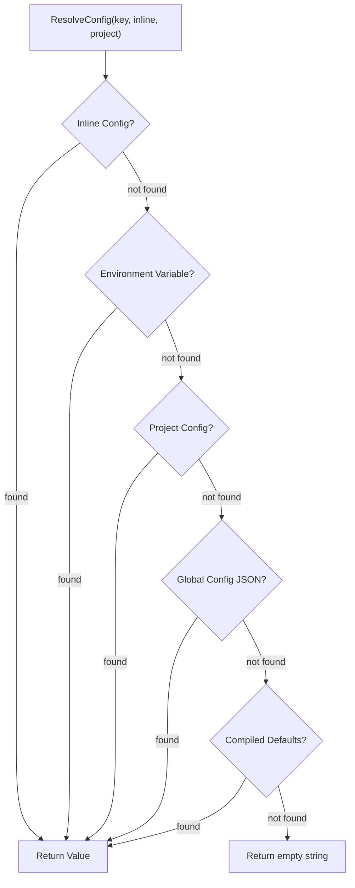

# Config Module Specification

The `internal/config` package implements a layered configuration system that resolves settings from multiple sources in a strict precedence order. It provides a unified interface for all Graphit modules to read configuration values without knowing their origin.

---

## ⚙️ Architecture

Configuration is stored as a flat `ConfigMap` (`map[string]any`) that supports one level of nesting via dot-notation keys (e.g., `hub.repo`, `modules.ast`). Values flow through a resolution chain where the first non-empty match wins.



### Resolution Order

1. **Inline config** — Passed directly by the caller (e.g., lockfile config section).
2. **Environment variables** — Derived from the key: `GRAPHIT_<UPPER_DOT_TO_UNDERSCORE>` (e.g., key `hub.repo` → `GRAPHIT_HUB_REPO`).
3. **Project config** — Stored in the project lockfile's `config` section.
4. **Global config** — Stored in `~/.graphit/config.json`.
5. **Compiled defaults** — Baked into the binary at build time via `-ldflags`.

---

## 🧩 Key Types & Interfaces

### `ConfigMap`

```go
type ConfigMap = map[string]any
```

A type alias for `map[string]any`. Supports flat keys (`"ide"`) and one-level nested maps (`"hub" → {"repo": "..."}`) accessed via dot notation.

### `CompiledDefaults`

```go
var CompiledDefaults string
```

A package-level variable populated at build time via Go's `-ldflags` mechanism. It is a comma-separated string of `key=value` pairs:

```
ide=claude,hub.repo=github.com/org/hub,memory.repo=github.com/org/memory
```

Parsed lazily by `getCompiledDefaults()` using `sync.Once` to ensure it is processed exactly once.

---

## 📋 Configuration Keys

### Top-Level Keys

| Key | Description | Default |
|---|---|---|
| `ide` | Target IDE adapter (claude, cursor, gemini, antigravity, codex, opencode, kiro) | `claude` |
| `cli` | CLI tool command name | Derived from IDE |

### Nested Keys

| Key | Description | Default |
|---|---|---|
| `hub.repo` | Git repository URL for the Hub registry | (compiled default) |
| `memory.repo` | Git repository URL for memory storage | (compiled default) |
| `knowledge.docs_dir` | Relative path to the project documentation directory | `.` |
| `knowledge.extensions` | Comma-separated list of file extensions to index (e.g., `md,yaml,json,proto`). The `.` prefix is optional. | `md,markdown,mdx,txt,adoc,rst,puml,plantuml,yaml,yml,json,proto,graphql,gql,wsdl,xml` |
| `ast.index_source` | Whether to store file source in the AST graph | `true` |
| `modules.<name>` | Enable/disable a module (`true`/`false`) | Enabled for core, disabled for opt-in |

### Module System

Modules are either **always-on** or **opt-in**:

- **Always-on** (`AllModuleNames`): `knowledge`, `ast`, `hub`, `memory`, `improvements`
- **Opt-in** (`OptInModules`): `dream`

`IsModuleDisabled(module, inline, project)` resolves the `modules.<name>` config key. If the value is `"false"`, the module is disabled. If `"true"`, it is enabled. For opt-in modules, the default is disabled (returns `true`).

---

## 🔧 CRUD Operations

### Reading

```go
func GetConfigValue(cfg ConfigMap, dotKey string) (string, bool)
```

Splits `dotKey` at the first `.` to resolve nested maps. Returns the string value and whether it was found.

### Writing

```go
func SetConfigValue(cfg ConfigMap, dotKey, value string)
```

Creates nested map structure if needed. For flat keys, sets directly on the map.

### Deleting

```go
func UnsetConfigValue(cfg ConfigMap, dotKey string)
```

Removes the key. For nested keys, also cleans up empty parent sections.

### Listing

```go
func ListConfigEntries(cfg ConfigMap) [][2]string
```

Returns all key-value pairs as sorted `[key, value]` tuples. Nested maps are flattened to dot-notation keys.

---

## 🌐 Global Config

Stored at `~/.graphit/config.json`. The `AppDir()` function resolves `~/.graphit/` and creates it with mode `0o700`.

| Function | Description |
|---|---|
| `LoadGlobalConfig()` | Load and parse JSON. Returns empty `ConfigMap` if file does not exist. |
| `SaveGlobalConfig(cfg)` | Serialize to indented JSON. Removes empty nested sections. File mode `0o600`. |
| `GetGlobalConfigValue(key)` | Load → get → return `(value, found, error)`. |
| `SetGlobalConfigValue(key, value)` | Load → set → save. |
| `UnsetGlobalConfigValue(key)` | Load → unset → save. |

---

## 🎯 IDE & CLI Resolution

### IDE Resolution

```go
func ResolveIDE(flagValue string, inlineCfg, projectCfg ConfigMap) string
```

Priority: flag → `ResolveConfig("ide", ...)` → fallback `"claude"`.

```go
func ResolveProjectIDE(flagValue string, inlineCfg, projectCfg ConfigMap, lockfileIDEs []string) string
```

Extended resolution that also considers:
1. Flag value
2. Inline config `ide` key
3. Project config `ide` key
4. **Ambient IDE** (env var `GRAPHIT_IDE` → global config → compiled defaults)
5. **Lockfile IDEs list**: If the ambient IDE matches a registered IDE, use it. Otherwise, use the first registered IDE.

### CLI Resolution

```go
func ResolveCLI(flagValue string, inlineCfg, projectCfg ConfigMap, resolvedIDE string) string
```

Priority: flag → `ResolveConfig("cli", ...)` → `CLIForIDE(resolvedIDE)` → fallback `"claude"`.

The `CLIForIDE()` mapping:

| IDE | CLI |
|---|---|
| `antigravity` | `agy` |
| `gemini`, `gemini-code` | `gemini` |
| `claude`, `claude-code` | `claude` |
| `cursor` | `cursor-agent` |
| `codex` | `codex` |
| `opencode` | `opencode` |
| `kiro` | `kiro-cli` |

---

## 🔗 Hub & Memory Repository Paths

| Function | Description |
|---|---|
| `ResolveHubRepo(inline, project)` | Resolve `hub.repo` via the standard chain. |
| `HubRepoURL()` | Convenience: resolve with no inline/project config. |
| `HubRepoDirPath()` | Returns `~/.graphit/hub`. |
| `HubDirForRepo(repoURL)` | Returns `~/.graphit/hub/<sanitized_name>`. |
| `ResolveMemoryRepo(inline, project)` | Resolve `memory.repo` via the standard chain. |
| `MemoryRepoURL()` | Convenience: resolve with no inline/project config. |
| `MemoryRepoDirPath()` | Returns `~/.graphit/memory`. |

The `sanitizeRepoName()` function strips protocol prefixes (`https://`, `ssh://`, `git://`), `@` user prefixes, `.git` suffixes, and replaces `:`, `/`, `\` with `_`.

---

## 🏁 Setup Detection

```go
func IsSetupDone() bool
```

Returns `true` if `~/.graphit/config.json` exists. Used by the CLI to determine if the initial setup wizard needs to run.

---

## 🚨 Error Handling

- **Missing global config file** — `LoadGlobalConfig()` returns an empty `ConfigMap` (not an error). This allows first-run scenarios to work without setup.
- **JSON parse errors** — Wrapped with `"parsing global config: %w"` for actionable error messages.
- **Missing keys** — `GetConfigValue()` returns `("", false)`. Callers use the boolean to distinguish "not set" from "empty".
- **Thread safety** — `CompiledDefaults` parsing uses `sync.Once` to prevent race conditions during concurrent access.

---

## 📦 Dependencies

### Internal

| Package | Usage |
|---|---|
| `internal/brand` | `DotDir()` for the application directory name, `EnvPrefix()` for environment variable prefixes. |

### External

| Package | Usage |
|---|---|
| `encoding/json` | Global config file serialization/deserialization. |
| `sync` | `sync.Once` for compiled defaults lazy initialization. |
