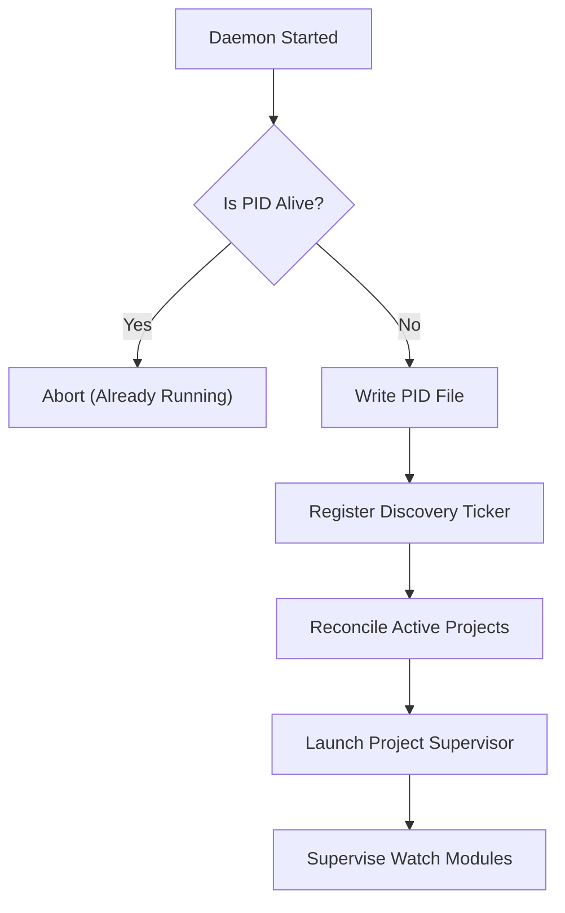

# Daemon Module Specification

The Daemon module runs a persistent, background supervisor process.
It discovers managed projects, keeps resources loaded (like the ONNX model client), runs background task loops, and performs maintenance routines.

---

## ⚙️ Background Daemon Lifecycle

The daemon is designed to run as a single instance per machine, verified using a global PID lockfile (`~/.graphit/daemon/daemon.pid`).



### 1. Project Discovery & Handoff

Every 30 seconds (`DiscoveryInterval`) the discovery loop calls `ListActiveProjects()`
against the Global Lock Manager, which reads `~/.graphit/global.lock.json`.

> **`ListActiveProjects()` is misleadingly named.** It filters only by *the lockfile still
> exists on disk* — it does no activity filtering of its own. Deciding what is active is
> the daemon's job, below.

A registered project is in one of three states, and `reconcileProjects` moves it between
them on every tick:

| State | Meaning |
|---|---|
| **Supervised** | A `ProjectSupervisor` is running: filesystem watch, embedding loop, dream runner |
| **Parked** | Registered and known, but nothing is running for it |
| **Gone** | No longer returned by discovery — the supervisor is stopped and both entries dropped |

#### Parking: registered is not the same as supervised

Supervising every registered project forever meant a developer who had accumulated
dozens of them over time paid for an inotify watch tree, an embedding loop and a dream
runner on each, indefinitely. Parking bounds that to the projects actually being worked
on.

- **Supervised → parked** when `ProjectSupervisor.IdleFor()` exceeds the activity window.
  The idle clock is *pushed*, not polled: modules implementing `ActivityReporter` call
  `Touch()` as they observe changes, and `SyncModule` does so on every `fswatch` batch —
  even a batch with nothing reindexable in it. Demotion therefore costs no disk walk.
- **Parked or newly discovered → supervised** when `dream.LastModifiedTime(dir)` shows a
  change inside the window. This is the one direction that does walk the tree, because a
  parked project has no watch to report activity from. A walk that fails defaults to
  *active*, so a project is never parked on account of the probe itself failing.

#### Configuration

`daemon.activity_window` — a Go duration string, default `30m`. Setting it to `0`
disables parking entirely: every registered project stays supervised for as long as it
stays registered, which is the pre-parking behaviour. An unset or invalid value falls
back to the default.

The window is resolved **once**, at daemon start (`runDaemonCore`), not per reconcile
tick — re-resolving would read `~/.graphit/config.json` every 30 seconds. A `Daemon`
built directly, as the tests do, gets a zero window and therefore never parks.

### 2. Project Supervisors
Each active project has an isolated supervisor thread monitoring watch modules:
- **`SyncModule`**: Holds one recursive filesystem watch over the project tree (`internal/fswatch`) and reindexes what each batch names. Debounces 1 second of quiet, capped at 5 seconds for a continuously busy tree.
  - **AST graph** (LadybugDB) — incremental pipeline over the exact changed paths (`ast.RunPipelineForPaths`), which skips discovery entirely
  - **Knowledge wiki** — recompiles from the configurable docs directory (`knowledge.docs_dir`, default `docs`) plus the root README (`knowledge.include_readme`), assembled by `knowledge.ScopeFor`. A project with a README and no docs tree yet still gets a wiki; only when neither exists does the reindex return without running the pipeline.
  - **One watch, two ignore files.** The watch covers the *union* of what the AST and the wiki care about; each consumer then applies its own file (`.astignore`, `.wikiignore`) to what arrives. Building the watch from the AST checker alone used to let `.astignore` silently decide whether the wiki heard anything — putting `docs/` in `.astignore` meant editing a document rebuilt nothing.
  - **Routing** (`classifyBatch`): AST ownership follows the extension and nothing else, exactly as a full scan decides it — which now means the docs tree is excluded, because `ast.index_docs` is off and the exclusion is part of the AST ignore checker both paths use. Knowledge ownership needs the path to be under the docs directory — or to be one of the documents the scope names explicitly, which is how the root README reaches the wiki — *and* to carry an extension the wiki indexes. Location alone cannot decide it, since `knowledge.docs_dir` can be set to `.`. The two are independent, not alternatives: `.md`, `.yaml`, `.json` and `.xml` set both, and with `ast.index_docs=true` a document under `docs/` sets both again.
  - **Activity reporting**: every batch touches the supervisor's idle clock (`ActivityReporter`), even a batch with nothing reindexable in it — any change under the tree counts as the project being worked on.
  - Reads per-project config from the project lockfile (inline → env → project → global → compiled defaults)
- **`EmbeddingModule`**: Triggers every 2 minutes. It scans files for modified AST nodes, generates high-dimensional embeddings, and writes them into the vector column of the local LadybugDB store.
- **`DreamModule`**: Initiates background agent routines during processor idle periods, mining conversation patterns and generating skills, memories, and integration artifacts.

#### Cross-Pipeline Resource Gate

`sysutil.CPUBudget()` sizes the Go parse-worker pool, LadybugDB's native thread pool
and the ONNX intra-op pool — but it is a budget for **one** pipeline, and the daemon
runs one supervisor per active project inside a single process. Three active projects
therefore claimed three times the machine, plus a LadybugDB buffer pool per open
query connection. (The graph export itself no longer opens a LadybugDB handle at
all — it writes `graph.icebug/`'s Parquet tables directly from the shard cache; see
[AST Module Specification](ast_module.md#-indexing-pipeline-full--incremental). What
this gate still bounds on the export side is the Go worker pool the export's own
concurrent Parquet writers draw from, which is sized off the same `CPUBudget()`.)

`sysutil.AcquireHeavy(ctx)` is the missing half of that budget: a process-wide
semaphore that every CPU-saturating job takes before it starts.

| Call site | What it gates |
|---|---|
| `SyncModule.handleBatch` | The AST and knowledge reindexes for one batch — one slot for the whole batch, not one per indexer |
| `ast.RunEmbeddingLoop` | Each embedding cycle plus the DB rebuild that a productive one triggers |

Capacity is **1** by construction, not by conservatism: `CPUBudget` already hands a
single pipeline as much of the machine as it may have, so a second concurrent slot is
by definition oversubscription. `GRAPHIT_HEAVY_SLOTS` raises it (clamped to the CPU
budget) for an operator who would rather trade peak memory for throughput.

Serializing does not make the set of jobs finish later — these are batch jobs, so it
makes each one finish sooner, without thrashing, and caps peak RSS at what a single
pipeline needs. A batch with nothing to reindex returns before touching the gate, so
an idle supervisor never queues behind a busy one.

A cancelled wait returns `ctx.Err()` with a nil release and the caller skips the work:
a supervisor being parked must not keep queueing for a slot to do work nobody is
waiting on.

**Scope limit.** The gate is per-process. It governs the daemon's own supervisors, not
a `graphit sync` running in a separate process — that collision is bounded by the
`.graphit/runtime/sync.lock` file lock and the git-hook debounce instead. Nothing yet
coordinates the daemon against a concurrent CLI sync.

### 3. Global Modules
Modules that run once per daemon (not per-project):
- **`EmbedServer`**: Shared ONNX embedding model server for vector search.

### 4. Filesystem Change Detection

Every watcher in the daemon — `SyncModule` and the standalone
`ast.Watcher` — is built on `internal/fswatch`, which reports changes from the operating
system's own notification API (`fsnotify`: inotify on Linux, kqueue on BSD/macOS,
`ReadDirectoryChangesW` on Windows).

An earlier design polled `git status --porcelain` on a timer and hashed the result
together with `git rev-parse HEAD`. It was replaced because the poll cost a full worktree
walk per tick per project and detected a change up to ~6 s late, while notifications are
near-instant and idle-free. The decisive gain is not latency, though: a notification
**names the exact paths that changed**, which lets the indexer skip discovery altogether
(`ast.RunPipelineForPaths`) — measured at ~350 ms of a ~1.07 s incremental on a
35k-file repository.

#### Batching

Raw events are coalesced into a `fswatch.Batch`:

| Field | Meaning |
|---|---|
| `Changed` | Absolute paths created or modified |
| `Removed` | Absolute paths deleted or renamed away |
| `Rescan` | The kernel event queue overflowed. `Changed`/`Removed` are only a partial picture and the consumer must fall back to a full scan |

A batch is emitted after `Debounce` of quiet, so a save-storm or a branch checkout
collapses into one reindex. `MaxDebounce` caps how long a continuously busy tree may
defer that batch. Package defaults are 400 ms and 3 s; each module sets its own.

#### Ignore rules apply at two levels

An ignored directory never gets a watch registered at all, and any event that slips
through for an ignored path is dropped. The first half is what keeps the inotify budget
sane — on Linux every watched directory costs a watch. `.git` is never watched: it churns
constantly and holds nothing that is indexed.

`ShouldDescend` re-includes a directory that ignore rules reject when a negation pattern
(`!`) targets something inside it.

#### Edge cases the watcher handles

- **A newly created directory** is watched *and* scanned, because files written into it
  between the `mkdir` and the watch landing would otherwise be missed entirely.
- **Exhausting the watch limit** is reported as such. The raw error is `no space left on
  device`, which sends people looking at disk usage; the wrapper says to raise
  `fs.inotify.max_user_watches` (and `fs.inotify.max_user_instances`) instead.
- **An unreadable subtree** is skipped rather than aborting the whole watch.

#### Trade-off accepted

The old poll used zero file descriptors and got `.gitignore` for free from git. The
watcher spends one watch per directory and has to apply ignore rules itself — in exchange
for near-instant detection, no periodic worktree walk, and the path list that makes
incremental indexing possible. Custom ignore files (`.astignore`, `.wikiignore`) are now
honoured directly rather than as a second filter after git's.

---

## 📅 OS-Level Schedulers

To keep the service alive without consuming high system resources, Graphit Code hooks into user-scoped, privilege-free system schedulers:

### 1. Linux (Crontab)
Registers a cron entry in the user's crontab:
```cron
* * * * * /usr/local/bin/graphit daemon > /dev/null 2>&1
```
*Verification*: Checked using `crontab -l`. If the daemon is already running, the child command terminates immediately.

### 2. macOS (LaunchAgent)
Generates a LaunchAgent plist configuration file under `~/Library/LaunchAgents/com.graphit.daemon.plist`:
- Configured with `RunAtLoad = true` to start the daemon on user login.
- Sets up standard output redirect logs to `~/.graphit/daemon/daemon.log`.

### 3. Windows (Task Scheduler)
Uses `schtasks` commands to create a user-scoped XML task trigger.
It schedules execution to repeat every 1 minute under user execution rights.

---

## 🔄 Binary Upgrade & Replacement Spawn

When a user upgrades their CLI tool via `self-update`, the running daemon must be replaced without interrupting database read calls.

1. **Stamp Checking**:
   The daemon regularly parses `~/.graphit/daemon/launcher.stamp` (the SHA256 checksum of the core executable binary).
2. **Replacement Action**:
   If the stamp value differs, the daemon knows that a new binary version has been installed:
   - It removes the current `daemon.pid` file.
   - It spawns a new replacing daemon process.
   - It invokes a graceful shutdown sequence for the old daemon, stopping child project supervisors.
3. **Port handoff**:
   The old daemon frees occupied ports (e.g. standard SSE embedding server connections) to allow the replacing instance to bind cleanly.

---

## 🔐 SSH Error Handling

Git operations use `BatchMode=yes` via `GIT_SSH_COMMAND` to prevent SSH from hanging on interactive prompts (unknown hosts, password requests).

When an SSH host key verification fails, the `wrapSSHError` function in `internal/git/cli_backend.go` intercepts the error and returns an actionable message:
```
SSH host key verification failed for "github.com".
Verify the host manually:
  ssh -T git@github.com
Then retry the operation.
```

This prevents the daemon from hanging indefinitely on first-time connections to unknown hosts.
