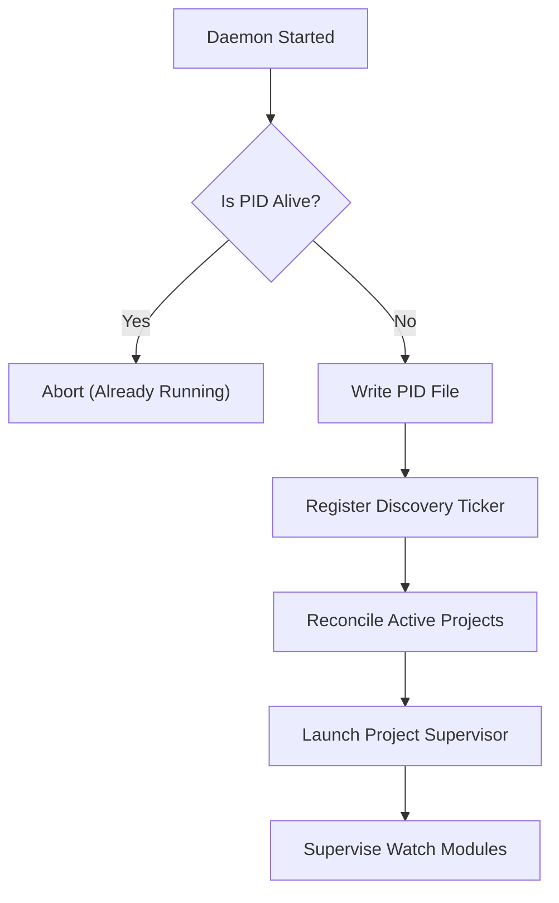

# Daemon Module Specification

The Daemon module runs a persistent, background supervisor process.
It discovers managed projects, keeps resources loaded (like the ONNX model client), runs background task loops, and performs maintenance routines.

---

## ⚙️ Background Daemon Lifecycle

The daemon is designed to run as a single instance per machine, verified using a global PID lockfile (`~/.graphit/daemon/daemon.pid`).



### 1. Project Discovery & Handoff
Every 30 seconds, the discovery loop calls `ListActiveProjects()` against the Global Lock Manager.
It tracks sibling services, launches dedicated `ProjectSupervisor` threads for newly discovered locations, and stops supervisors for deleted paths.

### 2. Project Supervisors
Each active project has an isolated supervisor thread monitoring watch modules:
- **`SyncModule`**: Polls `git status --porcelain -unormal` + `git rev-parse HEAD` every 5 seconds. If the combined hash changes (uncommitted edits OR new commits), it debounces 1 second then reindexes:
  - **AST graph** (LadybugDB) — full incremental pipeline
  - **Knowledge wiki** — recompiles from configurable docs directory (`knowledge.docs_dir`)
  - Respects `.gitignore` (via git) and `.astignore` (via `ignorer.IgnoreChecker`)
  - Reads per-project config from the project lockfile (inline → env → project → global → compiled defaults)
- **`EmbeddingModule`**: Triggers every 2 minutes. It scans files for modified AST nodes, generates high-dimensional embeddings, and indexes them into the local SQLite vector database.
- **`DreamModule`**: Initiates background agent routines during processor idle periods, mining conversation patterns and generating skills, memories, and integration artifacts.

### 3. Global Modules
Modules that run once per daemon (not per-project):
- **`MemorySyncModule`**: Watches all active memory git worktrees (`~/.graphit/memory-wt/`) every 10 seconds. Detects changes via `git status` + `git rev-parse HEAD` combined hash. When memory raw files change (project or user scope), recompiles the corresponding memory wiki via `memory.RunCycle`.
- **`EmbedServer`**: Shared ONNX embedding model server for vector search.

### 4. Git-Based Change Detection
All watchers use a combined state hash instead of filesystem notifications:
```
hash = SHA256(git_rev_parse_HEAD + "\n" + git_status_porcelain)
```
This captures both uncommitted changes AND committed-then-cleaned changes between polls, avoiding the race condition where a commit between two polls makes `git status` appear clean both times.

Advantages over `fsnotify`:
- Zero file descriptors (no per-directory inotify watches)
- Automatically respects `.gitignore`
- Works across all OS platforms identically
- No file descriptor exhaustion on large projects

---

## 📅 OS-Level Schedulers

To keep the service alive without consuming high system resources, Graphit Code hooks into user-scoped, privilege-free system schedulers:

### 1. Linux (Crontab)
Registers a cron entry in the user's crontab:
```cron
* * * * * /usr/local/bin/graphit daemon > /dev/null 2>&1
```
*Verification*: Checked using `crontab -l`. If the daemon is already running, the child command terminates immediately.

### 2. macOS (LaunchAgent)
Generates a LaunchAgent plist configuration file under `~/Library/LaunchAgents/com.graphit.daemon.plist`:
- Configured with `RunAtLoad = true` to start the daemon on user login.
- Sets up standard output redirect logs to `~/.graphit/daemon/daemon.log`.

### 3. Windows (Task Scheduler)
Uses `schtasks` commands to create a user-scoped XML task trigger.
It schedules execution to repeat every 1 minute under user execution rights.

---

## 🔄 Binary Upgrade & Replacement Spawn

When a user upgrades their CLI tool via `self-update`, the running daemon must be replaced without interrupting database read calls.

1. **Stamp Checking**:
   The daemon regularly parses `~/.graphit/daemon/launcher.stamp` (the SHA256 checksum of the core executable binary).
2. **Replacement Action**:
   If the stamp value differs, the daemon knows that a new binary version has been installed:
   - It removes the current `daemon.pid` file.
   - It spawns a new replacing daemon process.
   - It invokes a graceful shutdown sequence for the old daemon, stopping child project supervisors.
3. **Port handoff**:
   The old daemon frees occupied ports (e.g. standard SSE embedding server connections) to allow the replacing instance to bind cleanly.

---

## 🔐 SSH Error Handling

Git operations use `BatchMode=yes` via `GIT_SSH_COMMAND` to prevent SSH from hanging on interactive prompts (unknown hosts, password requests).

When an SSH host key verification fails, the `wrapSSHError` function in `internal/git/cli_backend.go` intercepts the error and returns an actionable message:
```
SSH host key verification failed for "github.com".
Verify the host manually:
  ssh -T git@github.com
Then retry the operation.
```

This prevents the daemon from hanging indefinitely on first-time connections to unknown hosts.
