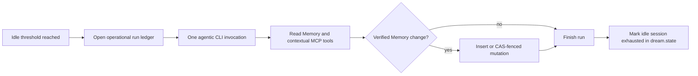

# Dream Module Specification

Dream is an idle-triggered, autonomous maintenance pass over Graphit Memory. It does not mine
conversation files, generate skills, edit rules or commands, change source code, or publish a
narrative report. The selected coding-agent CLI performs the semantic work itself through MCP;
Go supplies the execution boundary, storage invariants, and operational bookkeeping.

## Contract at a glance

One eligible idle session performs exactly one `ai.StreamClient.CompleteStream` call with:

- the project as `WorkDir` so the CLI can discover its existing Graphit MCP configuration;
- `AllowTools: true` and `PersistSession: false`;
- the `dream-memory-v1` capability profile;
- native CLI tool permissions where available, leaving the CLI's own state writable, with an
  explicitly documented unprotected fallback for the remaining known CLIs;
- a run identifier propagated as `GRAPHIT_DREAM_RUN_ID` and `GRAPHIT_UNIT_ID` provenance.

The agent reads Memory and supporting project context, decides whether consolidation is needed, and
invokes the Memory tools directly. Its final prose is discarded. The durable semantic result is the
Memory table and its revision history; a separate LanceDB table stores only bounded operational
metadata about the run.

## Responsibilities

| Source | Responsibility |
|---|---|
| `internal/dream/dream.go` | Idle/session state, one-shot execution, request policy, event counters, and deep sleep |
| `internal/dream/prompt.go` | Memory-only decision contract presented to the agent |
| `internal/dream/run_ledger.go` | Operational LanceDB record without prompt, output, or memory bodies |
| `internal/ai/capability_policy.go` | Native CLI tool policy where available, known-CLI fallback, and scoped MCP bearer |
| `internal/mcpstdio/server.go` | Exact Dream MCP tool allowlist |
| `internal/memory/memory.go` and `table.go` | Revisions, archive-before-delete, compare-and-swap, and relationship projection |

The manual `graphit memory consolidate` command retains its deterministic Go analysis/apply flow.
That explicit terminal workflow is separate from Dream and is not called by the Dream runner.

## Idle sessions and state

The daemon checks project modification times while ignoring `.git` and `.graphit`. A run starts when
Dream is enabled, the project has been idle for `dream.idle_timeout`, no run is active, and the
current idle session is not exhausted. `dream.max_duration` bounds the invocation.

The state file is `.graphit/runtime/dream/dream.state`. Its important fields are:

| Field | Meaning |
|---|---|
| `current_session_id` | ULID identifying the idle session |
| `last_user_mod_time` | Latest source modification observed by the most recent tick |
| `session_mod_watermark` | Source modification that opened the current idle session |
| `dreaming` / `dream_started_at` | Whether a run is active and when it began |
| `last_dream_at` / `sleeping_since` | Last completion and current idle interval |
| `exhausted` | A successful consolidation already completed for this idle session |

A successful run sets `exhausted` in the state file; it never creates an `.exhausted` sentinel.
New source activity rotates the session and clears exhaustion. A failed run does not exhaust the
session, so a later tick can retry.

## Agent authority

### Read tools

The profile exposes selected read-only tools from Memory, Task/session, Knowledge/Wiki, AST, Hub,
and References. These sources let the agent verify whether a memory is duplicated, incomplete,
obsolete, contradicted, or missing. The allowlist is exact: adding a new MCP tool elsewhere does not
make it available to Dream automatically.

### Memory mutations

Only these mutations are registered:

- `graphit_memory_insert`
- `graphit_memory_update`
- `graphit_memory_delete`
- `graphit_memory_promote`
- `graphit_memory_demote`

Insertion is allowed when verified, durable, non-sensitive knowledge is absent. The agent searches
first to avoid widening the store with a duplicate. Existing-memory mutations require
`expected_revision` or `expected_content_hash` under the Dream profile. A stale observation fails;
the agent must reread and reassess instead of applying an old decision.

The Dream MCP profile does not permit marking or unmarking mandatory memory, or mutating Task,
Knowledge, Wiki, AST, Hub, or References. The Dream instruction also forbids configuration and
file edits, but this is not technically enforced for CLIs lacking native tool restrictions.

### Consolidation invariants

- Preserve every unique durable fact before deleting a duplicate; update the survivor first.
- Prefer one complete survivor over overlapping fragments.
- Preserve classification, importance, mandatory status, provenance, and explicit relationships
  unless the requested operation intentionally changes the permitted importance flag.
- Archive the current revision before delete. If archival fails, deletion does not run.
- Update/delete/promote/demote compare the live revision/hash with the agent's observation.
- Every successful rewrite remains in the revision chain and records the Dream run as `updated_by`.
- Never persist secrets, credentials, personal/sensitive data, transient impressions, or
  unconfirmed speculation.

The Memory service, not the prompt, enforces compare-and-swap, archival, table shape, and index
maintenance. The agent owns semantic judgment and performs the tool calls itself.

## CLI tool permissions and MCP enforcement

Dream does not wrap the whole CLI process in an OS sandbox. This preserves each CLI's normal
cache, session, and authentication writes on Windows, macOS, and Linux. Where supported, it
restricts the **tools available to the agent** through the CLI's own controls. The current launch
matrix is:

| CLI | Native Dream policy | Status |
|---|---|---|
| Claude Code | `--restricted --tools Read,Glob,Grep` | Enabled; project MCP discovery remains required |
| Gemini CLI | `--approval-mode default --policy <temporary TOML> --allowed-mcp-server-names graphit-code-stdio-mcp`; default deny, allow read tools and Graphit MCP | Enabled; temporary policy removed after the run |
| Codex CLI | `--sandbox read-only --ask-for-approval never` | Enabled; this is Codex's control over model-generated commands, not a wrapper around the CLI process |
| OpenCode | `OPENCODE_CONFIG_CONTENT` with default-deny tool permissions, read tools and Graphit MCP allowed | Enabled |
| Kimi Code | `--agent-file <temporary YAML>` selecting only read-only built-in tools; MCP loads separately | Enabled from documented CLI contract; authenticated runtime not tested here |
| Antigravity, Qwen | No compatible per-run native restriction verified | Run without a native write restriction; project-file writes are possible |
| Grok, Cursor Agent, Kiro CLI, Copilot | No compatible per-run native restriction verified; no structured tool telemetry | Run without native write restriction; ledger status is `completed_unobserved` on successful exit |
| Custom CLI | No known Graphit adapter contract | Rejected |

Configured `ai.agent_args` are never appended to Dream. All eleven known CLI adapters can be
selected. A non-installed or older CLI may reject a documented native option; that launch fails
rather than silently dropping that option. For CLIs without a verified native option, Graphit
passes no extra restriction flags. In those cases, the prompt asks for Memory-only behavior but
cannot prevent the agent's own file or command tools from modifying the project. The matrix above
is verified by argument/configuration tests, not by authenticated end-to-end runs of every provider.

The child receives a filtered environment: runtime/config paths on Windows, macOS and Linux,
proxy and certificate settings, and known model-provider credentials; Broker access tokens
and arbitrary parent variables are not inherited. Before launch, Graphit derives an HMAC-authenticated bearer bound to
`dream-memory-v1`. The local MCP proxy refuses to fall back to the daemon master key when a Dream
profile is active but its bearer is missing. The daemon verifies the bearer and overwrites any
client-supplied profile header, so a forged header or direct HTTP call with the scoped bearer cannot
widen the Graphit MCP catalog. Memory changes cross this boundary through service invariants.

Native CLI permissions are **not process isolation**. The CLI still runs as the same OS user and
can in principle read that user's daemon key file or other credentials outside its model-invoked
tools. The operator accepted this trust limit; Dream must not be described as an adversarial
credential or filesystem boundary. If a descendant strips both Dream environment variables, no
namespace marker remains to identify it; the proxy may behave as an ordinary client. Restrict
access to the local account accordingly.

CLI authentication, model access, and native discovery of the already-synchronized Graphit MCP
server remain host responsibilities. For structured CLIs, Dream rejects a prose-only turn with no
observed tool calls. For CLIs without structured tool telemetry, a successful process exit records
`completed_unobserved`; its zero counters mean **unknown**, not proof that no tools or Memory
mutations ran. The semantic result must be inspected in Memory. No model prose is saved as a result.

## Persistence and observability

### Canonical semantic state

Memory lives in the authoritative LanceDB tables under the configured project/user scope, including
archived revisions. Dream does not write a second semantic plan or result document.

### Operational run ledger

`dream_runs` is a physical Dream-module table shared by all Dream users and agents for one project.
Without configured S3, every open resolves `brand.GlobalDir()` dynamically through `store.Root()`
and uses `dream/dreams/<project_id>` below the returned root. This is the default for a local
provider and the fallback when Broker S3 is disabled. An explicitly configured S3 bucket on a
local provider instead selects the remote store, as in Task and Memory. Dream neither knows nor
duplicates the brand's environment/default-directory rule.

The remote table lives at `v2/projects/<project_id>/dream`. Broker and OIDC-with-S3/STS request
credentials on the fly with `scope=project`, the project ID, and `module=dream`; these credentials
stay in memory and are refreshed by the normal S3 resolver. A credential-resolution error fails
the operation rather than silently switching to a local table.

Each invocation generates a globally unique ULID `run_id`. Local writers serialize refresh-plus-merge
through the store's cross-process lifecycle lock; S3 writers refresh and use conditional commit
retry across hosts. Concurrent table creation is likewise tolerated. Distinct runs therefore remain
independent instead of replacing one another. One row per run stores:

- run, project, Agent, and CLI identifiers;
- start/finish timestamps and `running`, `completed`, `completed_unobserved`, or `failed` status;
- observed tool-call and Memory-mutation-attempt counts (zero under `completed_unobserved` means
  unavailable telemetry, not confirmed zero calls);
- target Memory IDs observed in structured mutation events;
- a bounded error summary.

These counters describe observed attempts, not proof that every mutation committed; Memory remains
the authority for mutation outcome. The table has no prompt, model output, report, memory body,
user identity, credential, or machine-specific project path. Failure
to open or start the ledger is fail-closed: no agent invocation occurs without its operational record.

Dream exposes status and the latest operational run, not a report catalogue. Runs do not create
Markdown reports, deep-sleep sentinels, or a last-seen marker.

## Failure behavior

| Condition | Result |
|---|---|
| No streaming/agentic client | Fail before model execution; ledger status becomes `failed` |
| Capability policy cannot be enforced | Fail before CLI execution |
| Agent/tool error or timeout | Preserve completed Memory commits and finish the ledger as `failed` |
| Structured agent returns prose without any tool call | Reject the run as failed; do not mark the idle session exhausted |
| CAS mismatch | No target mutation; agent must reread if time remains |
| Archive failure before delete | Live memory remains; delete is aborted |
| Final ledger write failure | Return an error rather than claiming an unrecorded success |

## Verification

The focused contract is covered by tests in `internal/dream`, `internal/ai`, `internal/mcpstdio`,
`internal/memory`, and `internal/lancestore`. They assert one agentic call, exact request policy,
zero result artifacts, the new state path, state-only exhaustion, all known CLI keys, an exact MCP
allowlist, mandatory preconditions, stale-write rejection, archive-before-delete, provider-aware
Dream storage, concurrent independent writers, and absence of narrative fields from the run ledger.
