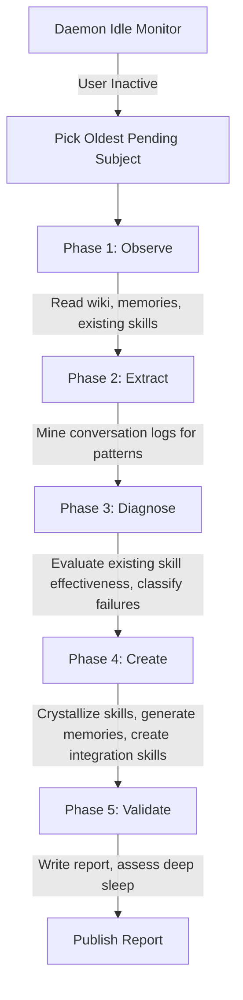

# Dream Module Specification

The Dream module provides the engine for autonomous, idle-triggered skill generation and knowledge mining.
It allows local LLM agents to run in the background when the developer is away, mining past conversation logs for recurring patterns, evaluating existing skill effectiveness, crystallizing new skills and integration patterns, and generating memories for undocumented knowledge.

---

## ⚙️ Core Architecture

The Dream module operates directly in the project directory, reading conversation transcripts, existing skills, memories, and wiki content to produce new artifacts. It does not modify source code.

### 1. Inactivity Monitoring
The daemon periodically checks for user activity by scanning the modification times of files in the project directory, skipping the `.git` and `.graphit` directories.
If the elapsed time since the last modified file is greater than `IdleTimeout`, a dream cycle is triggered.

### 2. Five-Phase Dream Cycle
A session-specific ULID is generated. The dream agent then executes five phases:

1. **Observe** — Reads the project wiki, existing memories, installed skills, rules, and commands to build a full picture of the current knowledge state.
2. **Extract** — Mines conversation log transcripts (JSONL) for recurring patterns, corrections, and undocumented conventions.
3. **Diagnose** — Evaluates existing skill effectiveness by analyzing usage signals, classifies failures using root cause categories.
4. **Create** — Crystallizes new skills, generates memories for undocumented knowledge, and creates integration skills for external developers.
5. **Validate** — Writes a detailed session report and assesses whether to enter deep sleep.

---

## 📋 Memory and Subject Selection Flow

The AI agent does not work at random.
It is guided by priority subjects and prior project memories:

### 1. Subjects Queue
Developers can write custom instructions or request skill generation tasks for future idle periods by placing markdown files in:
`.<brand>/dream/subjects/<slug>.md`

- **Pending**: A subject is pending if it does not have a corresponding `<slug>.done.md` results file.
- **Selection**: The Dream module picks the oldest pending subject. If no subjects are pending, it runs general conversation mining and skill effectiveness evaluation.
- **Reporting**: When a subject is completed, a `<slug>.done.md` file containing the outcome is written to the subjects directory.

### 2. State and Deep Sleep (Exhaustion)
The execution state is saved globally in `.<brand>/daemon/dream.state`.
If a dream cycle completes and no further patterns can be extracted or skills improved, or if the agent creates an `<id>.exhausted` file, the state is marked as `Exhausted: true`.
The module enters a deep sleep state to conserve resources and CPU usage.
It remains in deep sleep until new user activity (a newer file edit) is detected in the repository.

---

## 🔍 Conversation Mining Flow

The Dream module parses conversation transcripts stored as JSONL files to extract actionable patterns:

### 1. Transcript Parsing
Conversation logs are read from the project's conversation history directory. Each JSONL line contains a turn with role, content, tool calls, and timestamps.

### 2. Pattern Extraction
The agent identifies recurring themes across conversations:
- **Repeated instructions** — The same guidance given multiple times indicates an uncodified convention.
- **Corrections** — User corrections to agent behavior suggest missing or incorrect rules.
- **Multi-step workflows** — Complex sequences repeated across sessions are candidates for skill crystallization.
- **Undocumented decisions** — Architectural choices explained in conversation but absent from project memories.

### 3. Semantic Clustering
Extracted patterns are semantically clustered to group related observations. Clusters with high recurrence scores are prioritized for skill or memory generation.

---

## 🛠️ Skill Crystallization Protocol

Inspired by the Voyager ever-growing skill library approach, the Dream module builds a continuously expanding library of reusable skills:

### 1. Skill Identification
Patterns extracted from conversations are evaluated for skill candidacy. A pattern qualifies if it:
- Recurs across multiple conversations
- Involves a multi-step workflow
- Addresses a domain-specific task not covered by existing skills

### 2. Skill Generation
New skills are generated following the Hub artifact format. The module uses `graphit hub type-path` to resolve the correct artifact structure and writes skills to the project's `.agents/skills/` directory.

### 3. Skill Library Growth
Each dream cycle adds to the skill library without removing existing skills. Skills are versioned and tagged with provenance metadata linking back to the source conversations.

---

## 🔄 Self-Healing Loop

The Dream module continuously evaluates and improves existing skills using a 4-phase loop:

### 1. Observe
Read the current state of all installed skills, rules, and commands. Collect usage signals from conversation logs (was the skill triggered? was the output accepted or corrected?).

### 2. Evaluate
Score each skill on effectiveness metrics: trigger accuracy, output acceptance rate, and correction frequency.

### 3. Diagnose
Classify skill failures using root cause categories:

| Root Cause | Description |
|---|---|
| `UNCLEAR_INSTRUCTION` | The skill's instructions are ambiguous or confusing to the agent |
| `MISSING_STEP` | A required step is omitted from the skill workflow |
| `WRONG_TRIGGER` | The skill's activation triggers do not match actual usage patterns |
| `MISSING_EXAMPLE` | The skill lacks concrete examples for edge cases |
| `STALE_CONTENT` | The skill references outdated APIs, patterns, or conventions |
| `INCOMPLETE_COVERAGE` | The skill does not handle all variants of the task it targets |

### 4. Update
Apply targeted fixes to diagnosed skills: rewrite unclear sections, add missing steps, adjust triggers, insert examples, or update stale references.

---

## 🔗 Integration Skill Generation

The Dream module can create skills designed for external developers integrating with the project:

### 1. Public API Analysis
The module scans exported functions, types, and endpoints in the AST graph to identify the project's public interface.

### 2. Integration Pattern Discovery
By analyzing how external consumers use the project (from conversation logs, documentation, and hub artifacts), the module identifies common integration patterns.

### 3. Skill Creation
Integration skills are generated with:
- Setup and installation instructions
- Authentication and configuration steps
- Common usage patterns with code examples
- Error handling guidance
- Migration notes for breaking changes

---

## 🧠 Memory Generation

The Dream module extracts undocumented knowledge from conversations and codifies it as persistent memories:

### 1. Convention Extraction
Implicit coding standards, naming conventions, and architectural preferences mentioned in conversations are captured as `convention` memories.

### 2. Decision Capture
Architectural decisions explained in conversation but absent from the memory store are captured as `decision` memories with full rationale.

### 3. Correction Persistence
User corrections to agent behavior that were not previously memorized are captured as `correction` memories to prevent recurrence.

---

## 🔐 Memory Corruption Prevention

To ensure memory integrity during autonomous operation, the Dream module implements safeguards:

### 1. Versioning
Every memory modification includes a version tag and timestamp. The dream report records the before/after state of any updated memory.

### 2. Deduplication
Before inserting a new memory, the module searches for semantically similar existing memories using the memory search API. Duplicate candidates are flagged in the report rather than blindly inserted.

### 3. Audit Trail
All memory operations (inserts, updates, deletes) performed during a dream session are recorded in the session report with full justification. This provides a complete audit trail for human review.

---

## 🛠️ Configuration and Parameter Keys

The Dream module is configured under the `dream` section of the project `graphit.lock.json` file:

| Config Key | Type | Description | Default |
|---|---|---|---|
| `dream.idle_timeout` | Integer | Inactivity timeout in seconds before starting a dream cycle. | `7200` (2 hours) |
| `dream.max_duration` | Integer | Hard limit in seconds on the duration of an AI dream session. | `28800` (8 hours) |

---

## 📂 Directories and Output Artifacts

All outputs generated by the Dream module are stored in the local project workspace:

- **State File**: `.<brand>/daemon/dream.state` tracks ULID, mod times, dreaming state, and deep sleep.
- **Reports Vault**: `.<brand>/dream/<session_ulid>.md` contains the markdown session report.
- **Subjects Queue**: `.<brand>/dream/subjects/` contains pending `.md` subjects and completed `.done.md` subjects.
