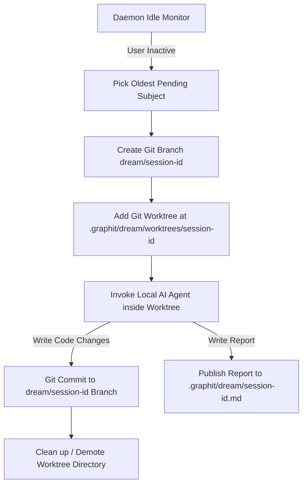

# Dream Module Specification

The Dream module provides the engine for autonomous, idle-triggered code improvements.
It allows local LLM agents to run in the background when the developer is away, analyzing the codebase structure, solving registered developer issues (subjects), and committing clean refactoring patches safely using git worktrees.

---

## ⚙️ Core Architecture and Worktree Isolation

To prevent concurrent modifications or locking issues in the developer's active working directory, the Dream module runs all AI operations in an isolated git worktree:

### 1. Inactivity Monitoring
The daemon periodically checks for user activity by scanning the modification times of files in the project directory, skipping the `.git` and `.graphit` directories.
If the elapsed time since the last modified file is greater than `IdleTimeout`, a dream cycle is triggered.

### 2. Isolated Workspace Compilation
A session-specific ULID is generated.
A new git branch named `dream/<session_ulid>` is created from the active branch.
A new git worktree is spawned under:
`.<brand>/dream/worktrees/<session_ulid>`

The AI agent executes commands and code updates exclusively inside this directory.

### 3. Automatic Commit & Authorship
Once the agent finishes editing the codebase, the changes are automatically added and committed.
The commit has a unique format:
- **Message**: `dream(<session_ulid>): autonomous reflection and improvement`
- **Author**: `Graphit Code Dream <dream@graphit>`

---

## 📋 Memory and Subject Selection Flow

The AI agent does not work at random.
It is guided by priority subjects and prior project memories:

### 1. Subjects Queue
Developers can write custom instructions or request refactoring tasks for future idle periods by placing markdown files in:
`.<brand>/dream/subjects/<slug>.md`

- **Pending**: A subject is pending if it does not have a corresponding `<slug>.done.md` results file.
- **Selection**: The Dream module picks the oldest pending subject. If no subjects are pending, it runs general codebase refactoring analysis using the rules defined in the `improvements` module.
- **Reporting**: When a subject is completed, a `<slug>.done.md` file containing the outcome is written to the subjects directory.

### 2. State and Deep Sleep (Exhaustion)
The execution state is saved globally in `.<brand>/daemon/dream.state`.
If a dream cycle completes and no further improvements can be made, or if the agent creates an `<id>.exhausted` file, the state is marked as `Exhausted: true`.
The module enters a deep sleep state to conserve resources and CPU usage.
It remains in deep sleep until new user activity (a newer file edit) is detected in the repository.

---

## 🛠️ Configuration and Parameter Keys

The Dream module is configured under the `dream` section of the project `graphit.lock.json` file:

| Config Key | Type | Description | Default |
|---|---|---|---|
| `dream.idle_timeout` | Integer | Inactivity timeout in seconds before starting a dream cycle. | `7200` (2 hours) |
| `dream.max_duration` | Integer | Hard limit in seconds on the duration of an AI dream session. | `28800` (8 hours) |

---

## 📂 Directories and Output Artifacts

All outputs generated by the Dream module are stored in the local project workspace:

- **State File**: `.<brand>/daemon/dream.state` tracks ULID, mod times, dreaming state, and deep sleep.
- **Reports Vault**: `.<brand>/dream/<session_ulid>.md` contains the markdown session report.
- **Subjects Queue**: `.<brand>/dream/subjects/` contains pending `.md` subjects and completed `.done.md` subjects.
- **Temporary Worktrees**: `.<brand>/dream/worktrees/<session_ulid>/` contains the checked-out isolated branch.
