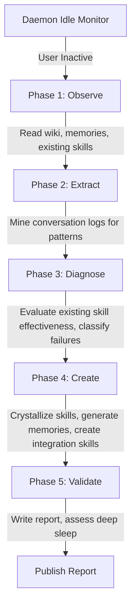

# Dream Module Specification

The Dream module provides the engine for autonomous, idle-triggered skill generation and knowledge mining.
It allows local LLM agents to run in the background when the developer is away, mining past conversation logs for recurring patterns, evaluating existing skill effectiveness, crystallizing new skills and integration patterns, and generating memories for undocumented knowledge.

---

## ⚙️ Core Architecture

The Dream module operates directly in the project directory, reading conversation transcripts, existing skills, memories, and wiki content to produce new artifacts. It does not modify source code.

| File | Responsibility |
|---|---|
| `internal/dream/dream.go` | The `Runner`: idle monitoring, session state, deep sleep, config resolution, memory consolidation, report ownership |
| `internal/dream/prompt.go` | Builds the knowledge-improvement prompt, consolidation briefing, and report envelope |
| `internal/dream/reports.go` | The reports vault: locating, listing, and marking reports as read |
| `internal/memory/consolidate.go` | Analysis: turns the memory corpus into a consolidation plan |
| `internal/memory/consolidate_apply.go` | Application: executes a plan under the invariants, and reports what it did |

The agent runs through `ai.StreamClient.CompleteStream` with `AllowTools: true` and
`WorkDir` set to the project — not through `ai.Client.Complete`. `Complete` carries a
preamble forbidding file edits and shell commands, which is correct for an analytical
call and fatal for a session whose every deliverable is a file: obeying it produces
an essay describing artifacts that were never created, and nothing downstream can
tell that apart from success. `WorkDir` matters for the same reason it does in live
search — an agent CLI discovers its rules, skills and MCP servers from the working
directory, which for the daemon is not the project.

`reports.go` is the single owner of the vault. Its API — `ReportsDir`, `ListReports`,
`ReportsSince`, `LoadLastSeen`, `MarkReportsSeen` — is what the CLI, the MCP tools and the UI
server call. `ListReports` returns reports newest-first and treats a missing directory as "the
module has never run" rather than an error, so no caller re-sorts or pre-checks existence.

### 0. Session identity
The session id has the form `20060102T150405-abcd` — a sortable timestamp plus two
random bytes, so a directory listing of reports reads chronologically. It is **not** a
ULID, though the state field, its JSON tag, the parameters and this specification all
called it one until the names were corrected.

### 1. Inactivity Monitoring
The daemon periodically checks for user activity by scanning the modification times of files in the project directory, skipping the `.git` and `.graphit` directories.
If the elapsed time since the last modified file is greater than `IdleTimeout`, a dream cycle is triggered.

### 2. Five-Phase Dream Cycle
A session id is generated or resumed. The dream agent then executes five phases:

1. **Observe** — Reads the project wiki, existing memories, installed skills, rules, and commands to build a full picture of the current knowledge state.
2. **Extract** — Mines conversation log transcripts (JSONL) for recurring patterns, corrections, and undocumented conventions.
3. **Diagnose** — Evaluates existing skill effectiveness by analyzing usage signals, classifies failures using root cause categories.
4. **Create** — Crystallizes new skills, generates memories for undocumented knowledge, and creates integration skills for external developers.
5. **Validate** — Writes a detailed session report and assesses whether to enter deep sleep.

---

## 🧹 Memory Consolidation — the guaranteed half

Before the agent runs, the runner sanitises the memory store. This is the one part
of a dream session whose outcome does not depend on the agent, and the split is
deliberate.

| Step | Where | What it does |
|---|---|---|
| Analyse | `internal/memory.RunConsolidation` | Sends the corpus to the AI and returns a **plan**. Writes nothing. |
| Apply | `internal/memory.ApplyConsolidation` | Executes the plan through `MemoryService`, enforcing the invariants below. |
| Report | `ConsolidationOutcome.Markdown` | Every action applied, refused or failed, with its reason. |

The analysis returns JSON (`duplicates`, `contradictions`, `suggestions`) and nothing
else is accepted — an unparseable answer is an error that sets `AIFailed`, which the
report states outright. There is deliberately no second, looser parser: one would
turn a malformed answer into a partially-understood plan applied against real
memories, and would make an unusable analysis indistinguishable from a clean corpus.

The corpus is batched by character budget, so a store that outgrows one context window
still gets analysed rather than silently truncated. Every ID the model returns is
checked against the real corpus; an invented one produces no action.

### Invariants, enforced in Go

The model proposes. The apply step decides, and refuses anything it cannot do
safely:

- **Content is never dropped.** A memory is only removed as part of an action that
  carried its content into a survivor. When the analysis supplies no merged text,
  the union of the originals is written verbatim under provenance headings rather
  than the action being skipped or a summary invented.
- **Importance is never lost.** If any member of a merged group was important, the
  survivor is important — the analysis picks the survivor for content reasons and
  has no reason to preserve this.
- **Classification is never lost.** The survivor keeps the most specific type in the
  group: `correction` > `convention` > `decision` > `tension` > `skill` > `fact`.
- **An important memory is never deleted by a suggestion.** Importance was set by a
  human, or by an agent acting for one. Removing it is possible only through a merge
  or resolution, where its content survives elsewhere.
- **The store is never emptied.** The last remaining memory in a scope is never
  deleted.
- **The survivor is written before the others are removed.** Reversed, a failure
  between the two steps loses the content; in this order the worst case is a
  duplicate that survives to the next cycle.
- **Refusals are reported.** A plan reduced to nothing must not look like a clean
  corpus.

Staleness is detected deterministically (unrevised for more than 90 days, skipping
important memories) and always proposes *review*, never deletion — age is evidence
that a memory has not been revised, not that it is wrong. With no replacement
content proposed, it surfaces in the report as a refusal for an agent with context
to resolve.

Every mutation goes through `MemoryService`, so each one is a commit on the memory
branch and the wiki is reindexed. Writing the worktree directly — which an earlier
implementation did — leaves git and the search index describing a store that no
longer exists.

### What the agent does instead

The agent receives a briefing of what the runner already did, including each
refusal, so it neither redoes the work nor reports it as its own. It may **update** a
memory to resolve something the runner declined; it must not delete one. Deletion
happens only where the content is carried forward first.

Opportunistic sanitisation is the agent's job in every session, not just this one:
the memory skill instructs agents to fold duplicates, resolve contradictions and
correct outdated memories at the moment they read them, because an agent holding the
task context knows which memory misled it and a background pass does not.

## 📋 Knowledge Improvement Flow

The agent is guided by project knowledge, memories, conversation history, existing agent artifacts,
and prior Dream reports. It never reads or consumes the task backlog.

### 1. Knowledge Inputs

- Project wiki and architecture documentation
- Persistent memories and their consolidation outcomes
- Conversation transcripts containing recurring patterns and corrections
- Existing skills, rules, commands, and integration artifacts
- Prior Dream reports, used to avoid repeating exhausted investigations

Dream produces knowledge artifacts and a session report. Task execution belongs to explicit task
workflows outside this module.

### 2. State and Deep Sleep (Exhaustion)
The execution state is saved globally in `.<brand>/daemon/dream.state`.
If a dream cycle completes and no further patterns can be extracted or skills improved, or if the agent creates an `<id>.exhausted` file, the state is marked as `Exhausted: true`.
The module enters a deep sleep state to conserve resources and CPU usage.
It remains in deep sleep until new user activity (a newer file edit) is detected in the repository.

Waking up depends on two state fields that must not be conflated:

| Field | Meaning | Changes when |
|---|---|---|
| `last_user_mod_time` | newest file mtime observed | every tick |
| `session_mod_watermark` | the mtime that opened the current session | only on session rotation |

"Has the developer done something since?" can only be asked of the watermark. These
were one field, and `tick` overwrote it before `resolveSessionID` compared against
it — so the comparison was mtime against itself, always false. The session never
rotated, and because `Exhausted` is cleared only on rotation, the first deep sleep
was permanent for the life of the project, contradicting the paragraph above.

### 3. Report ownership
The agent writes the report itself when it can. The runner fingerprints the report
path before and after the agent runs: if the file changed, the agent's version is
kept and the consolidation audit is appended to it; otherwise the runner writes a
wrapper around the agent's answer. Both instructions used to be live at once, with
the runner unconditionally overwriting whatever the agent had written.

If the agent step fails, the runner still writes a report recording the consolidation
that already happened — those changes are real, and there is no other record of them.

---

## 🔍 Conversation Mining Flow

The Dream module parses conversation transcripts stored as JSONL files to extract actionable patterns:

### 1. Transcript Parsing
Conversation logs are read from the project's conversation history directory. Each JSONL line contains a turn with role, content, tool calls, and timestamps.

### 2. Pattern Extraction
The agent identifies recurring themes across conversations:
- **Repeated instructions** — The same guidance given multiple times indicates an uncodified convention.
- **Corrections** — User corrections to agent behavior suggest missing or incorrect rules.
- **Multi-step workflows** — Complex sequences repeated across sessions are candidates for skill crystallization.
- **Undocumented decisions** — Architectural choices explained in conversation but absent from project memories.

### 3. Semantic Clustering
Extracted patterns are semantically clustered to group related observations. Clusters with high recurrence scores are prioritized for skill or memory generation.

---

## 🛠️ Skill Crystallization Protocol

Inspired by the Voyager ever-growing skill library approach, the Dream module builds a continuously expanding library of reusable skills:

### 1. Skill Identification
Patterns extracted from conversations are evaluated for skill candidacy. A pattern qualifies if it:
- Recurs across multiple conversations
- Involves a multi-step workflow
- Addresses a domain-specific task not covered by existing skills

### 2. Skill Generation
New skills are generated following the Hub artifact format. The module uses `graphit hub type-path` to resolve the correct artifact structure and writes skills to the project's `.agents/skills/` directory.

### 3. Skill Library Growth
Each dream cycle adds to the skill library without removing existing skills. Skills are versioned and tagged with provenance metadata linking back to the source conversations.

---

## 🔄 Self-Healing Loop

The Dream module continuously evaluates and improves existing skills using a 4-phase loop:

### 1. Observe
Read the current state of all installed skills, rules, and commands. Collect usage signals from conversation logs (was the skill triggered? was the output accepted or corrected?).

### 2. Evaluate
Score each skill on effectiveness metrics: trigger accuracy, output acceptance rate, and correction frequency.

### 3. Diagnose
Classify skill failures using root cause categories:

| Root Cause | Description |
|---|---|
| `UNCLEAR_INSTRUCTION` | The skill's instructions are ambiguous or confusing to the agent |
| `MISSING_STEP` | A required step is omitted from the skill workflow |
| `WRONG_TRIGGER` | The skill's activation triggers do not match actual usage patterns |
| `MISSING_EXAMPLE` | The skill lacks concrete examples for edge cases |
| `STALE_CONTENT` | The skill references outdated APIs, patterns, or conventions |
| `INCOMPLETE_COVERAGE` | The skill does not handle all variants of the task it targets |

### 4. Update
Apply targeted fixes to diagnosed skills: rewrite unclear sections, add missing steps, adjust triggers, insert examples, or update stale references.

---

## 🔗 Integration Skill Generation

The Dream module can create skills designed for external developers integrating with the project:

### 1. Public API Analysis
The module scans exported functions, types, and endpoints in the AST graph to identify the project's public interface.

### 2. Integration Pattern Discovery
By analyzing how external consumers use the project (from conversation logs, documentation, and hub artifacts), the module identifies common integration patterns.

### 3. Skill Creation
Integration skills are generated with:
- Setup and installation instructions
- Authentication and configuration steps
- Common usage patterns with code examples
- Error handling guidance
- Migration notes for breaking changes

---

## 🧠 Memory Generation

The Dream module extracts undocumented knowledge from conversations and codifies it as persistent memories:

### 1. Convention Extraction
Implicit coding standards, naming conventions, and architectural preferences mentioned in conversations are captured as `convention` memories.

### 2. Decision Capture
Architectural decisions explained in conversation but absent from the memory store are captured as `decision` memories with full rationale.

### 3. Correction Persistence
User corrections to agent behavior that were not previously memorized are captured as `correction` memories to prevent recurrence.

---

## 🔐 Memory Corruption Prevention

Two different mechanisms protect the store, and it matters which is which.

**The consolidation step is constrained in code.** Its invariants are listed under
[Memory Consolidation](#-memory-consolidation--the-guaranteed-half) and enforced by
`ApplyConsolidation`, not requested in a prompt. That is the point: the model behind
the analysis is a CLI whose output format is not guaranteed, so the guarantees live
on the side that applies the changes.

**The agent is constrained by instruction**, because nothing else can constrain a
tool-using agent:

### 1. Updating over replacing
An agent correcting a memory updates it in place. Delete-then-insert loses the id,
the importance flag and the tags, and has a window where the knowledge exists
nowhere.

### 2. Deduplication before insertion
Before creating a memory, the agent searches for an existing one on the topic. If one
exists but is incomplete or now wrong, it extends or corrects that memory instead of
adding a second beside it.

### 3. Audit trail
Every memory operation the runner performed is in the session report with its reason,
including the ones it refused. Operations the agent performs are reported under
**Memories Created**.

---

## 🛠️ Configuration and Parameter Keys

The Dream module is configured under the `dream` section of the project `graphit.lock.json` file:

| Config Key | Type | Description | Default |
|---|---|---|---|
| `dream.idle_timeout` | Integer | Inactivity timeout in seconds before starting a dream cycle. | `7200` (2 hours) |
| `dream.max_duration` | Integer | Hard limit in seconds on the duration of an AI dream session. | `28800` (8 hours) |
| `dream.reports_dir` | String | Directory holding the reports vault, relative to the project root. | `.<brand>/runtime/dream` |

The agent session also depends on two keys outside the `dream` section, because they
belong to the AI client rather than to this module:

| Config Key | Description |
|---|---|
| `ai.cli` | Which agent CLI to run. Without it, the first candidate found on `PATH` wins. |
| `ai.agent_args` | Extra arguments passed **only** to agentic runs, typically the flag that lets the CLI edit files unattended. `ai.agent_args.<binary>` overrides it per CLI. |

`ai.agent_args` is operator-configured rather than a built-in table on purpose: the
flag that grants workspace write differs per CLI, changes between releases, and
carries real blast radius. A wrong guess either fails to parse or hands the agent
more authority than intended.

Without it, some CLIs will still refuse to write files. The session then produces
prose instead of artifacts — the runner logs a warning when the agent finishes
without using a single tool, and the memory consolidation still applies, because it
does not depend on the agent.

---

## 📂 Directories and Output Artifacts

All outputs generated by the Dream module are stored in the local project workspace:

- **State File**: `.<brand>/runtime/daemon/dream.state` tracks the session id, mod times, dreaming state, and deep sleep.
- **Reports Vault**: `.<brand>/runtime/dream/<session_id>.md` contains the markdown session report.
- **Deep Sleep Sentinel**: `.<brand>/runtime/dream/<session_id>.exhausted` marks a cycle as complete.
- **Last-Seen Marker**: `.<brand>/runtime/dream/dream_last_seen.json` records when reports were last read.

`internal/dream/reports.go` owns the reports vault, sentinel, and last-seen paths through
`ReportsDir`, `ListReports`, `ReportsSince`, `LoadLastSeen`, and `MarkReportsSeen`. The CLI,
the MCP tools, prompts, and the UI server use that resolver rather than reconstructing the
path. Daemon state is separate and resolves under `runtime/daemon/`.

### Why reports default to `.graphit/runtime/dream/` while the backlog is versioned

The task backlog lives in the documentation tree so items are versioned and reviewable — see
[Task Backlog](backlog.md). The reports vault defaults to runtime
storage because of what the directory holds:

| Artifact | Nature |
|---|---|
| `<session_id>.md` | Generated narrative output — verbose, one per session, unbounded over time |
| `<session_id>.exhausted` | Daemon state |
| `dream_last_seen.json` | **Per-developer reading state** |

The backlog is *intent*: a human or agent decided this work should happen, so committing it is
exactly right. A report is *output*, and the other two files are machine state.

The generated `.gitignore` ignores `.graphit/runtime/`, so reports, sentinels, and
per-developer read state cannot accidentally appear in a commit. See
[Storage Layout](../architecture/storage_layout.md#inside-a-projects-brand-directory).

Two things to know if you configure a versioned reports directory:

- **`dream_last_seen.json` should not be.** It records which reports *this developer* has read
  and is rewritten every time anyone runs `graphit dream reports`, so versioning it means one
  developer's reading position overwriting another's, with a conflict on every read.
- **Reports are verbose by nature.** Committing every session adds real review noise; picking
  the ones worth keeping is the point of leaving the choice open.

A project that wants the vault somewhere else — under `docs/`, to be committed as a matter of
course — has `dream.reports_dir`, which follows the `backlog.dir` pattern.
Existing files under the former `.graphit/dream/` default are neither moved nor deleted;
temporarily set `dream.reports_dir` to that path to read or migrate them explicitly.
