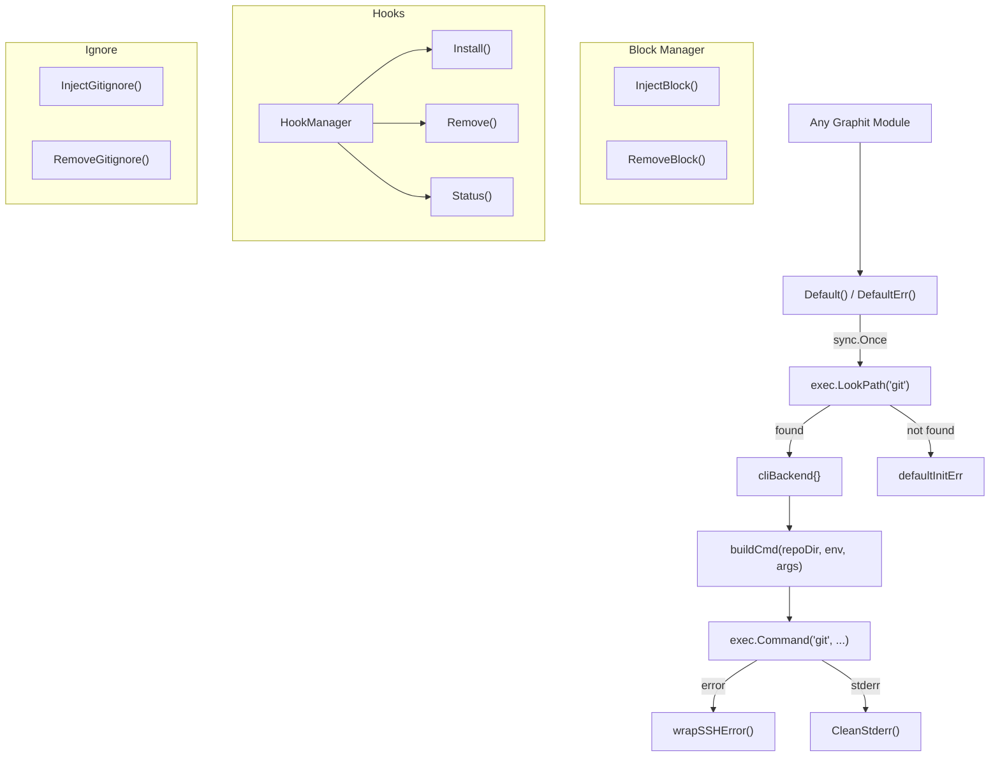

# Git Module Specification

The `internal/git` package provides a Git abstraction layer for all Graphit operations that interact with Git repositories. It implements a singleton CLI backend pattern, SSH error wrapping, content block injection/removal, git hook management, and gitignore management.

---

## ⚙️ Architecture

The module is structured around a `Git` interface with a single concrete implementation (`cliBackend`) that shells out to the system `git` binary. A package-level singleton ensures a single, lazy-initialized instance shared across the application.



---

## 🧩 Key Types & Interfaces

### `Git` Interface

```go
type Git interface {
    Run(repoDir string, args ...string) error
    RunOutput(repoDir string, args ...string) (string, error)
    RunSilent(repoDir string, args ...string) string
    RunWithStdin(repoDir string, data []byte, args ...string) (string, error)
    RunWithEnv(repoDir string, env map[string]string, args ...string) error
    RunOutputWithEnv(repoDir string, env map[string]string, args ...string) (string, error)
    RunGlobal(args ...string) error
    RunGlobalOutput(args ...string) (string, error)
}
```

All methods accept a `repoDir` parameter which is translated to `git -C <repoDir>`. An empty `repoDir` runs git in the current working directory.

| Method | Returns | Description |
|---|---|---|
| `Run` | `error` | Execute git with combined stdout+stderr. Returns wrapped error on failure. |
| `RunOutput` | `(string, error)` | Execute git and return trimmed stdout. Stderr captured separately. |
| `RunSilent` | `string` | Execute git silently, swallowing errors. Returns trimmed stdout. |
| `RunWithStdin` | `(string, error)` | Execute git with piped stdin data. |
| `RunWithEnv` | `error` | Execute git with additional environment variables. |
| `RunOutputWithEnv` | `(string, error)` | Execute git with env and return output. |
| `RunGlobal` | `error` | Execute git without a repo directory (delegates to `Run("")`). |
| `RunGlobalOutput` | `(string, error)` | Execute git globally and return output. |

### `cliBackend`

```go
type cliBackend struct{}
```

The sole concrete implementation. Contains no state — all configuration is resolved per-command.

---

## 🔄 Singleton Pattern

### `Default() Git`

Returns the singleton `Git` instance. Uses `sync.Once` to:
1. Call `exec.LookPath("git")` to verify the `git` binary exists in PATH.
2. If found, create a `&cliBackend{}` and store it as `defaultInstance`.
3. If not found, store the error in `defaultInitErr` and leave `defaultInstance` as `nil`.

**Returns `nil`** if git is not available. Callers that cannot tolerate a nil instance should use `DefaultErr()`.

### `DefaultErr() (Git, error)`

Returns both the singleton instance and any initialization error. Forces `Default()` to run first (if it has not already), then returns `(defaultInstance, defaultInitErr)`.

### Thread Safety

Both functions are safe for concurrent use. `sync.Once` guarantees the initialization runs exactly once regardless of how many goroutines call it simultaneously.

---

## 🛠️ Command Execution

### `buildCmd(repoDir string, env map[string]string, args ...string) *exec.Cmd`

1. If `repoDir` is non-empty, prepends `-C repoDir` to the args.
2. Creates `exec.Command("git", fullArgs...)`.
3. Sets `GIT_SSH_COMMAND=ssh -o BatchMode=yes` unless the caller has already set `GIT_SSH_COMMAND` in their environment.
4. Merges any caller-provided env vars via `MapToEnv()`.

The `BatchMode=yes` SSH option prevents interactive prompts (password requests, host key confirmations) that would hang headless processes like the daemon.

---

## 🔐 SSH Error Handling

### `wrapSSHError(err error, stderr string) error`

Intercepts git errors where stderr contains SSH host key verification failures. Detection triggers:
- `"host key verification failed"`
- `"no matching host key"`
- `"known_hosts"`

When detected, appends an actionable remediation message:

```
the remote host is not in your known_hosts file.
  Verify the host manually:  ssh -T git@github.com
  Once verified, retry the operation.
```

### `extractHost(stderr string) string`

Scans stderr lines for tokens containing `@` (e.g., `git@github.com`) to provide a specific host in the remediation message. Falls back to a generic `git@<hostname>` placeholder.

---

## 📝 Stderr Handling

### `CleanStderr(raw string) string`

Filters and normalizes git stderr output to produce actionable error messages:

1. Strips empty lines.
2. Removes **progress lines** (lines containing transfer progress like `"Counting objects:"`, `"Compressing objects:"`, `"Receiving objects:"`, `"Resolving deltas:"`, and `"remote: ..."` prefixed progress).
3. If no meaningful lines remain, returns the last non-empty line from the raw output.
4. If more than 3 meaningful lines remain, keeps only the last 3.
5. Joins lines with `"; "`.

Returns `"(no stderr output)"` if raw is empty, or `"(git returned no useful error details)"` if only progress lines were found.

### `IsProgressLine(line string) bool`

Returns `true` if the line matches any of the recognized progress keywords:
`Counting objects:`, `Compressing objects:`, `Receiving objects:`, `Resolving deltas:`, `remote: Counting`, `remote: Compressing`, `remote: Total`.

### `MapToEnv(m map[string]string) []string`

Converts a `map[string]string` to `[]string` of `"KEY=VALUE"` entries suitable for `exec.Cmd.Env`.

---

## 📦 Block Manager

The block manager provides idempotent injection and removal of delimited content blocks within files. It is used by hooks, gitignore management, and IDE rule installation.

### Block Styles

| Style | Start | End | End Prefix | End Suffix |
|---|---|---|---|---|
| `ShellBlockStyle` | `# --- ` | ` ---` | `# --- END ` | ` ---` |
| `HTMLBlockStyle` | `<!-- ` | ` -->` | `<!-- END ` | ` -->` |

A block with marker `"FOO"` in shell style looks like:
```sh
# --- FOO ---
...content...
# --- END FOO ---
```

### `InjectBlock(filePath, content, marker, shebang string) error`

Injects a content block into a file:

1. Reads existing file content (creates file if missing).
2. If a block with the same marker already exists, **replaces it in-place** preserving surrounding newlines.
3. If no existing block, **appends** the block to the end of the file.
4. Normalizes excessive blank lines (3+ consecutive newlines → 2).
5. If the file only contained a shell shebang before injection, replaces the content entirely.
6. If `shebang` is non-empty, sets file permissions to `0755` (executable).

### `RemoveBlock(filePath, marker string, deleteIfEmpty bool) (bool, error)`

Removes a block from a file:

1. Reads the file; returns `(false, nil)` if file does not exist.
2. Strips the block using regex matching.
3. If `deleteIfEmpty` is `true` and the remaining content is only a shell shebang (or empty), **deletes the file entirely**.
4. Otherwise, writes the cleaned content back.
5. Returns `(true, nil)` if the file was modified.

### `InjectBlockStyled` / `RemoveBlockStyled`

Generic versions that accept a `BlockStyle` parameter, enabling both shell and HTML block formats.

---

## 🪝 Hooks

### `HookManager`

```go
type HookManager struct {
    projectDir string
    hooksDir   string
}
```

Manages Graphit's git hooks. Created via `NewHookManager(projectDir)`, which resolves the hooks directory by examining `.git` (supports regular repos and worktrees where `.git` is a file pointing to the actual git directory).

### Managed Hooks

| Hook | Purpose |
|---|---|
| `post-commit` | Runs `graphit sync` silently in the background after each commit. |
| `pre-push` | Runs `graphit sync` silently in the background before pushes. |
| `post-merge` | Runs `graphit sync` silently in the background after merges. |

### Hook Script Template

Each hook script:
1. Checks if the `graphit` binary exists in PATH (`command -v graphit`).
2. If available, runs `graphit sync --debounce 60s </dev/null >/dev/null 2>&1 &` (backgrounded, detached from stdio).
3. If the binary is not found, exits silently (`exit 0`).

### Hook Debouncing

The three managed hooks fire on events that routinely arrive together over a tree
that changed once — commit, then push, then (on the far side of a pull) merge. Each
one used to trigger a full Phase 1 reindex, so a routine commit-and-push paid for two
concurrent reindexes on top of whatever the daemon was already doing about the same
file writes.

`hookDebounce` (`internal/git/hooks.go`) is the window passed to `graphit sync
--debounce`. The sync command reads `.graphit/runtime/sync.stamp` and returns immediately when
a previous sync finished inside the window. A missing or unparseable stamp reads as
"no idea" and runs the sync, so the debounce can only ever suppress work it can prove
is redundant.

The window is one of two independent guards; the other is the
`.graphit/runtime/sync.lock` file lock, which stops two syncs that overlap rather
than merely follow each other.
See `docs/specs/daemon_module.md` for the in-process counterpart.

### `Install(_ bool) error`

1. Verifies `.git` exists (skips non-git directories).
2. Creates the hooks directory if needed.
3. For each hook type, reads the existing hook file.
4. **Skips files with non-shell shebangs** (e.g., Python, Ruby hooks) to avoid breaking third-party hook managers.
5. Injects the Graphit block via `InjectBlock()`.

### `Remove() error`

Removes the Graphit block from all managed hooks. If the hook file contains only the shebang after removal, deletes it entirely.

### `Status() map[HookType]string`

Returns the installation status for each hook: `"not installed"`, `"installed (graphit)"`, or `"installed (third-party)"`.

---

## 🚫 Ignore Patterns

### `InjectGitignore(targetPath, content string) error`

Injects a content block into `.gitignore` using the brand's ignore marker. Used by
`graphit init` — both the CLI command and the `graphit_init` MCP tool — to keep the
project's runtime directory out of the repository.

### `RemoveGitignore(targetPath string) (bool, error)`

Removes the Graphit block from `.gitignore`. Unlike hooks, does **not** delete the file if empty (`deleteIfEmpty: false`).

### The generated `.gitignore` block

The content is not this module's to invent: it comes from `brand.GitignoreContent()`,
and contains the complete ownership policy for generated and machine-local project data.

```gitignore
# --- GRAPHIT AUTOGENERATED IGNORER ---
**/.graphit/runtime/
**/.graphit/grammars/
# --- END GRAPHIT AUTOGENERATED IGNORER ---
```

Two entries are sufficient because the brand directory is **split by ownership** rather
than ignored wholesale — see
[Storage Layout](../architecture/storage_layout.md#inside-a-projects-brand-directory).
Generated output and state live under `brand.RuntimeSubdir()`. Project-local parser
libraries live under `grammars/` and are ignored because they are platform-specific
binaries. Query YAMLs under `ast/queries/` and source overrides under `rules/` remain
repository-owned and versionable.

The block used to be `.graphit/`, which took the project's grammar overrides and rule
overrides down with the caches. Carving those back out with negations is not
possible: gitignore cannot re-include anything beneath an excluded directory, so a
`!/.graphit/ast/queries/` line under `.graphit/` is never even consulted. Doing it
properly took six lines that re-included each level in turn. Naming the two machine-local
subdirectories reaches the intended outcome without ordering rules or negations.

**The `**/` prefix is load-bearing.** A pattern with a separator in the middle is
anchored to the directory of the `.gitignore` that declares it, so a bare
`.graphit/runtime/` would ignore this project's machine state while exposing that of
every nested checkout, sub-project and test fixture below it. The prefix restores the
any-depth matching that the old trailing-slash-only pattern had for free.

`internal/brand` owns the content because the block is a naming and ownership contract:
the brand directory, its runtime subdirectory, and its project-local grammar tree. Nothing
above `brand` has to be consulted to produce it, and callers cannot maintain divergent
lists.

`InjectGitignore` runs at `graphit init` and nowhere else, so an existing checkout
keeps the block it was given until `graphit init` runs again. The injection is
idempotent and replaces the marked block in place.

---

## 📦 Dependencies

### Internal

| Package | Usage |
|---|---|
| `internal/brand` | Brand name for block markers, binary name for hook scripts, ignore marker, display name for comments. |

### External

| Package | Usage |
|---|---|
| `os/exec` | `LookPath` for git discovery, `Command` for command execution. |
| `sync` | `sync.Once` for singleton initialization. |
| `regexp` | Block detection and replacement in the block manager. |
