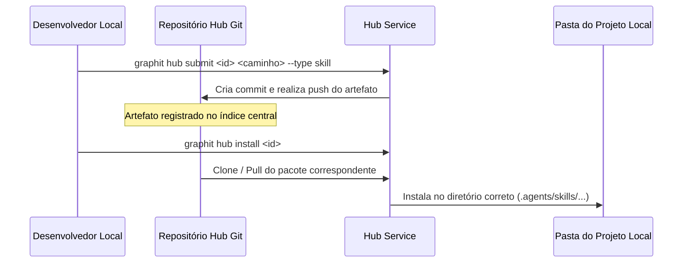

# O Hub de Colaboração (Hub Module)

O **Hub de Colaboração** (`internal/hub`) é o mecanismo pelo qual desenvolvedores compartilham regras de projeto, skills de agentes, esquemas de banco de dados e documentações contextuais. Seu propósito central é criar um repositório determinístico para que a IA consiga entender sistemas e dependências de terceiros.

---

## 📦 Tipos de Artefatos Suportados

O Hub atua como um gerenciador de pacotes descentralizado para arquivos que guiam e enriquecem o ecossistema do agente:

* `rule` (Regra): Diretivas que formatam a resposta da IA (ex: diretiva proibindo chamadas de banco diretas nos handlers).
* `agent` (Agente): Definição de personas ou subagentes configurados para atuar em domínios específicos.
* `skill` (Habilidade): Pastas contendo códigos de execução e prompts especializados (ex: scripts para debugar vazamento de memória).
* `command` (Comando): Implementações de novos comandos de barra (slash commands) no terminal de chat.
* `mcp` (Servidor MCP): Configurações de servidores de contexto externos compatíveis com Model Context Protocol.
* `knowledge` (Conhecimento): Dumps estruturados de wikis (coleções de arquivos Markdown).
* `ast` (AST Schema): Esquemas e relacionamentos do banco de grafos exportados (gerados como Parquet via `EXPORT DATABASE`), permitindo que a IA conheça as dependências de um projeto sem ter acesso direto ao código fonte original deste.

---

## 🔄 Fluxo de Colaboração Descentralizado

O Hub funciona sob uma infraestrutura Git descentralizada, sincronizada via a URL configurada no campo `hub.repo` do usuário.



### 1. Publicação de Conhecimento (`hub submit`)
Quando um time desenvolve uma biblioteca de utilitários interna ou microserviço, ele executa:
```bash
graphit hub submit my-team/auth-client ./docs --type knowledge --version 1.0.0
```
Isso encapsula o conteúdo e o publica no repositório compartilhado do Hub. 

### 2. Instalação e Reutilização (`hub install`)
Outro time que precisa integrar-se com esse cliente de autenticação instala a documentação:
```bash
graphit hub install my-team/auth-client
```
A IA desse projeto passa a ler a wiki do cliente de autenticação de forma determinística, sabendo exatamente quais parâmetros e endpoints chamar.

---

## 🔗 Atalho de Desenvolvimento Local (`hub link` e `hub unlink`)

Para otimizar o desenvolvimento iterativo local e testes entre múltiplos repositórios na mesma máquina de trabalho, o Hub oferece a funcionalidade de **Vinculação Direta (Simlinks)**.

Ao executar:
```bash
graphit hub link my-library --path ../my-library --type knowledge
```
O Graphit Code não realiza download do Hub. Em vez disso:
1. Ele cria um link simbólico direto (`symlink`) na pasta local `.graphit/knowledge/my-library` apontando para o diretório físico `../my-library/.graphit/knowledge/project`.
2. Isso possibilita que qualquer atualização de documentação feita em `../my-library` reflita instantaneamente no motor de busca do seu projeto atual, eliminando a necessidade de republicações constantes durante o ciclo de desenvolvimento.

---
*Próximo passo recomendado:* Conheça o ecossistema de microserviços e [[cluster_microservices]].
