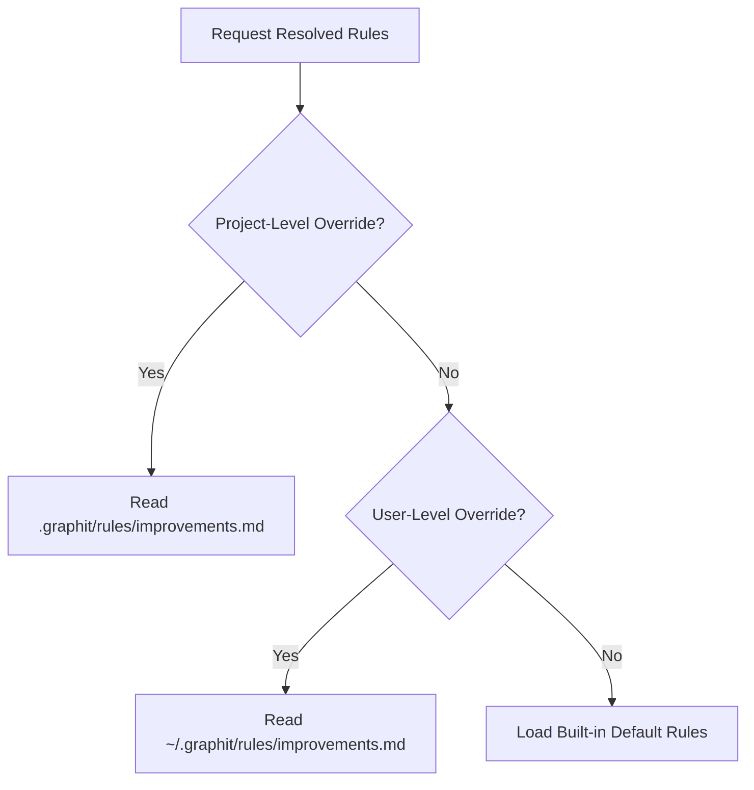

# Improvements Module Specification

The Improvements module provides the analytical rules and post-task reflection protocols that govern how AI agents analyze, review, and refactor code.
It ensures that on-demand agent revisions conform to strict engineering standards (the Dream module now focuses on skill generation rather than code improvements).

---

## 🏗️ Architecture and Resolution Order

Custom rules allow teams to enforce specific style guides, design patterns, or database limitations.
The Improvements module resolves rules dynamically on every execution using a prioritized resolution order:

### 1. Project-Local Override
The system checks if a customized rule file exists at:
`.graphit/rules/improvements.md`

If found, it takes highest precedence, allowing repository-specific guidelines.

### 2. User-Local Global Override
If no project-level override exists, the system checks:
`~/.graphit/rules/improvements.md`

This allows individual developers to carry their preferences across different projects.

### 3. Compiled-in Defaults
If neither file exists, the module falls back to the built-in default ruleset, which defines general Clean Code, Cloud Readiness, and Observability guidelines.

---

## 📋 Engineering Analysis Rules

The standard methodology covers six key pillars:

### 1. Clean Code
- **DRY / YAGNI / KISS**: Eliminate duplicate logic, avoid over-engineering, and keep solutions simple.
- **Naming Conventions**: Enforce descriptive, self-documenting symbol names.
- **Error Handling**: Require robust error wrapping, stack preservation, and prevention of ignored error signals.

### 2. Security
- **Injection Prevention**: Validate data inputs and query parameters (SQL, Shell, Command).
- **Data Exposure**: Block leakages of credentials, API keys, or personally identifiable information (PII) in logs or stdout.
- **Authentication & Cryptography**: Validate token mechanisms and use secure, modern hashing algorithms.

### 3. Concurrency and Idempotency
- **Race Prevention**: Protect shared memory states with mutexes, channels, or atomic operations.
- **Resource Management**: Prevent goroutine or file descriptor leaks using timely defer statements.
- **Replay Safety**: Ensure operations (e.g., event delivery, database updates) are idempotent and safe to repeat.

### 4. Cloud Readiness (Twelve-Factor App)
- **Configuration**: Enforce strict separation of configuration settings (environment variables) from application code.
- **Stateless Processes**: Keep processes stateless to enable horizontal scaling.
- **Disposability**: Optimize processes for fast startup and graceful shutdown.

### 5. Observability (MELT + OTel)
- **Log Structures**: Log events with structured key-value pairs (JSON format).
- **Metrics & Traces**: Standardize transaction tracing and request propagation using OpenTelemetry.
- **Correlation**: Require request ID or span ID propagation across microservices.

### 6. Decision Validation Gate
- **Decision Compliance**: Before making a code modification, the agent must check the memory repository and respect past ADR decisions.
- **Tension Management**: Explicitly document conflicts or trade-offs if a past decision must be changed.

---

## 🔄 Post-Task Reflection Phase

Every code modification triggers a mandatory reflection process:

1. **Convention Extraction**: The agent reflects on the changes made to identify recurring patterns or preferences.
2. **Memory Staging**: Extracted preferences are stored as project or user memories using the `memory` package.
3. **Hub Staging & Codification**: Staged improvements, templates, or instructions are codified as local artifacts (such as custom `skills`, `rules`, `commands`, or `workflows`) inside the project's `.agents/` directory. These local artifacts can then be shared with the team via standard Git version control, or explicitly registered/submitted to the Hub repository using CLI commands if collaborative reuse across projects is desired.
