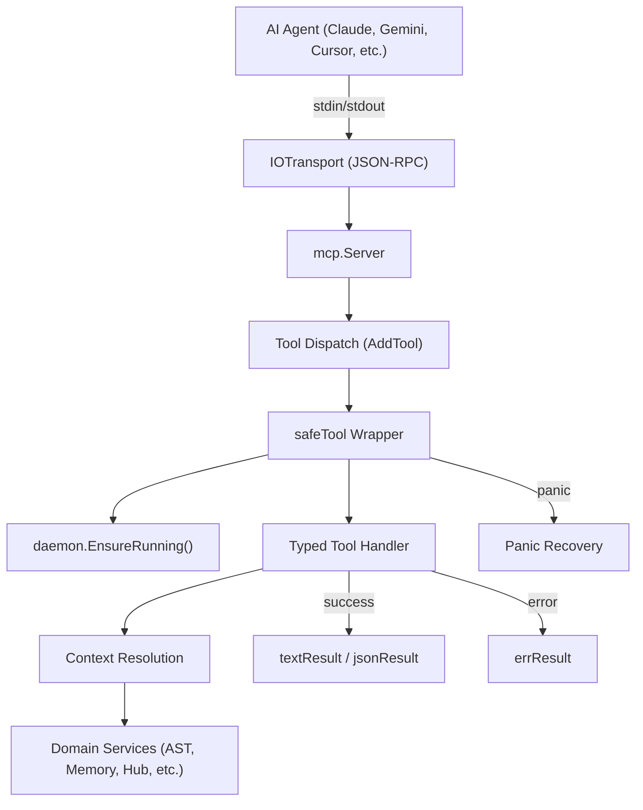

# MCP Stdio Module Specification

The `internal/mcpstdio` package implements the Model Context Protocol (MCP) server that exposes Graphit's capabilities to AI coding assistants over a JSON-RPC stdio transport. It is the primary integration point between external AI agents and the Graphit toolchain.

---

## ⚙️ Architecture

The server communicates over stdin/stdout using the MCP JSON-RPC protocol. It registers typed tool handlers that are dispatched by the underlying `go-sdk/mcp` framework.



### Server Startup

1. `NewServer()` creates an `mcp.Server` instance with the branded server name (`graphit-code-stdio`) and the current `version.Version`.
2. Tool groups are registered in order: Lifecycle → AST → Knowledge → Memory → Hub → Wiki → Dream → Daemon → Cluster → Improvements.
3. `Serve(ctx)` mutes CLI output via `output.Mute()`, redirects Go's `log` to stderr, then constructs a decoupled `IOTransport` using `io.NopCloser(os.Stdin)` and a `nopWriteCloser{os.Stdout}` to prevent interference from `os.Stdout` reassignment.

### Transport Decoupling

The server deliberately avoids the SDK's `StdioTransport` helper, which hardcodes `os.Stdin`/`os.Stdout`. Instead, it captures explicit reader/writer references at startup, so even if another package reassigns `os.Stdout`, the JSON-RPC transport is unaffected.

---

## 🧩 Key Types & Interfaces

### Core Helpers

| Type / Function | Description |
|---|---|
| `safeTool(handler)` | Generic wrapper adding panic recovery and background daemon auto-start to every typed tool handler. |
| `textResult(text string)` | Returns a `CallToolResult` with a single `TextContent` payload. |
| `errResult(err error)` | Returns the error directly to the MCP framework for standard error rendering. |
| `jsonResult(v any)` | Marshals `v` as indented JSON and returns it as `TextContent`. |
| `toonResult(v any)` | Formats `v` using `toon.FormatAny()` (reflection-based TOON) and returns it as `TextContent`. Used when `ai_optimized` is `true`. |
| `nopWriteCloser` | Wraps an `io.Writer` with a no-op `Close()` for the transport. |

### Input Structs

Every tool defines a typed input struct with `json` and `jsonschema` tags. The `json` tags control deserialization from JSON-RPC params. The `jsonschema` tags provide human-readable descriptions that AI agents use for parameter discovery.

Example pattern:
```go
type syncInput struct {
    ProjectDir  string `json:"project_dir" jsonschema:"Project directory to sync (required)"`
    IDE         string `json:"ide,omitempty" jsonschema:"Target IDE"`
    AiOptimized bool   `json:"ai_optimized,omitempty" jsonschema:"MANDATORY for AI agents. Set to true to get compact TOON format instead of verbose JSON"`
}
```

> All tools returning structured JSON data include an `AiOptimized bool` field. When set to `true`, the handler returns `toonResult(v)` instead of `jsonResult(v)`, producing compact TOON (Token-Optimized Object Notation) output that reduces token consumption by ~60-80%.

---

## 🔧 Tool Registration

Tools are registered via `mcp.AddTool(server, toolDefinition, handlerFunc)`. Each tool group has a dedicated `register*Tools(server *mcp.Server)` function.

### The `safeTool` Wrapper

Every handler is wrapped with `safeTool()`, which:

1. **Recovers from panics** — catches `recover()` in a deferred function and converts it to a structured error (`"internal error (panic): %v"`).
2. **Ensures the daemon is running** — calls `daemon.EnsureRunning()` before every tool invocation, mirroring the CLI's behavior. Failures are logged to stderr but do not block the tool.

### Naming Convention

Tool names use `brand.MCPToolName(group, action)` which produces names like `graphit_ast_query`, `graphit_memory_insert`, etc. Tools with a single action omit the action suffix (e.g., `graphit_init`, `graphit_sync`, `graphit_version`).

---

## 🗺️ Request Context Resolution

### `resolveProjectDir(projectDir string)`
- Validates the `project_dir` parameter is non-empty.
- Converts it to an absolute path via `filepath.Abs()`.
- Verifies the directory exists via `os.Stat()`.
- Returns a clear error message if validation fails.

### `withProjectDir(projectDir string, fn func() error)`
- Saves the current working directory.
- Changes to `projectDir` before calling `fn()`.
- Restores the original working directory via `defer`.
- Used by tools that need domain services to resolve relative paths from the project root.

### `openASTDB` / `openASTDBReadWrite`
- Changes to the project directory.
- Resolves the LadybugDB config (default or named context).
- Opens the AST graph database in read-only or read-write mode.
- Returns an actionable error if no database exists.

### `newMemorySvc(userScope bool, projectDir string)`
- Creates a `MemoryService` scoped to either `project` (using the lockfile project ID) or `user` (using a git-derived user hash).
- Initializes the memory store and ensures directory structure exists.

### `loadProjectConfig(projectDir string)` / `loadProjectLockInfo(projectDir string)`
- Loads the project lockfile from `<projectDir>/<lockFileName>`.
- Extracts the `Config` map and/or `IDEs` list for config resolution.

### `resolveIDEFromProject(ide, projectDir string)`
- Combines the IDE flag, inline config, project config, and lockfile IDEs to determine the active IDE via `config.ResolveProjectIDE()`.

### `sanitizeContextName(name string)`
- Prevents path traversal by stripping directory components via `filepath.Base()`.
- Rejects `.`, `..`, and names containing path separators.

---

## 📂 Tool Categories

### 1. Lifecycle Tools (`tools_lifecycle.go`)

| Tool | Description |
|---|---|
| `graphit_mandates` | Resolve dynamic mandates from global config/rule overrides and framework defaults; takes no parameters and reads no lockfile. |
| `graphit_init` | Initialize a new project: create lockfile, generate ULID, set up gitignore, register in global lock. |
| `graphit_sync` | Full sync: reindex AST, rebuild knowledge wiki, run memory cycle, sync hub, install IDE rules. |
| `graphit_update` | Update all installed hub artifacts to latest versions and refresh IDE rules. |
| `graphit_remove` | Uninstall Graphit: remove hooks, gitignore entries, hub artifacts, and IDE rules. |
| `graphit_config_set` | Set a config key (project-local via lockfile or global via JSON). |
| `graphit_config_get` | Retrieve a config key value. |
| `graphit_config_unset` | Remove a config key. |
| `graphit_config_list` | List all config entries as JSON. |
| `graphit_version` | Return the current CLI/server version string. |

### 2. AST Tools (`tools_ast.go`)

| Tool | Description |
|---|---|
| `graphit_ast_index` | Index project files into the AST code graph database. Supports workers, reset, reindex, cluster labels, and no-source mode. |
| `graphit_ast_query` | Execute a Cypher query against the AST graph. Supports `ai_optimized` output formatting and named contexts. |
| `graphit_ast_query_ai` | Convert a natural language question to Cypher via AI, execute, and return results. Supports `ai_optimized`. |
| `graphit_ast_schema` | Return graph schema: node labels, properties, and relationship types. |
| `graphit_ast_install` | Import another local repository as a named AST context. |
| `graphit_ast_remove` | Remove an imported context or clear the main project graph. |
| `graphit_ast_list` | List all imported AST contexts and their paths. |
| `graphit_ast_source` | Retrieve source code with head/tail, line ranges, entity extraction, and pattern search with context lines. |
| `graphit_ast_export` | Export the AST database in Obsidian markdown or archive bundle format. |
| `graphit_ast_embed` | Run the embedding cycle to precompute/update semantic embeddings. |
| `graphit_ast_search` | Hybrid search combining BM25 full-text and semantic vector search via Reciprocal Rank Fusion. Modes: `hybrid`, `fts`, `semantic`. |

### 3. Knowledge Tools (`tools_knowledge.go`)

| Tool | Description |
|---|---|
| `graphit_knowledge_index` | Index docs/ into the knowledge graph and regenerate the wiki. |
| `graphit_knowledge_query` | AI-powered retrieval search of the project knowledge wiki. |
| `graphit_knowledge_search` | BM25 keyword search across the knowledge wiki. |
| `graphit_knowledge_schema` | Show the knowledge graph schema and wiki directory info. |
| `graphit_knowledge_lint` | Audit the wiki for structural issues. Supports deep AI analysis and auto-fix. |
| `graphit_knowledge_remove` | Remove an imported context or clear local knowledge. |
| `graphit_knowledge_sync` | Rebuild the local project wiki from docs. |
| `graphit_knowledge_list` | List all articles in the local knowledge wiki. |

### 4. Memory Tools (`tools_memory.go`)

| Tool | Description |
|---|---|
| `graphit_memory_insert` | Add a new memory with type, scope, tags, importance, and mandatory status. |
| `graphit_memory_update` | Update title or content of an existing memory. |
| `graphit_memory_delete` | Delete a memory by ID. |
| `graphit_memory_list` | List all memories in project or user scope. |
| `graphit_memory_search` | Ranked search across the compiled LanceDB memory wiki; can exclude mandatory rows already loaded. |
| `graphit_memory_mandatory` | Return every mandatory live memory with full content and no search query. |
| `graphit_memory_mark_mandatory` | Require unconditional session-start recall for one memory. |
| `graphit_memory_unmark_mandatory` | Remove that requirement when it no longer applies. |
| `graphit_memory_important` | List all memories marked as important. |
| `graphit_memory_promote` | Promote a memory to important status. |
| `graphit_memory_demote` | Demote a memory from important status. |
| `graphit_memory_index` | Regenerate the semantic wiki index of memory store. |
| `graphit_memory_schema` | Show the memory graph schema. |
| `graphit_memory_remove` | Remove a memory context sync connection. |
| `graphit_memory_sync` | Sync memories from an external context. |

### 5. Hub Tools (`tools_hub.go`)

| Tool | Description |
|---|---|
| `graphit_hub_list` | List available artifacts in the Hub registry, optionally filtered by type. |
| `graphit_hub_search` | Search the Hub by name, ID, or description. |
| `graphit_hub_show` | Show detailed information about a specific artifact. |
| `graphit_hub_install` | Install an artifact into the project. Supports version pinning (`@version`) and IDE targeting. |
| `graphit_hub_uninstall` | Remove an installed artifact. |
| `graphit_hub_update` | Update one or all installed artifacts. |
| `graphit_hub_submit` | Publish a local artifact to the Hub. Defaults: version `1.0.0`, type `rule`. |
| `graphit_hub_link` | Link a local project's artifacts via symlinks. |
| `graphit_hub_unlink` | Remove a linked artifact. |
| `graphit_hub_projects` | List registered projects in the global lock. |

### 6. Wiki Tools (`tools_wiki.go`)

| Tool | Description |
|---|---|
| `graphit_wiki_search` | Search across multiple wiki sources (project, memory, hub knowledge) using AI-powered retrieval. Returns a session ID for follow-up. |
| `graphit_wiki_chat` | Continue a wiki chat session started by `wiki_search`. |
| `graphit_wiki_sessions` | List or delete wiki chat sessions. |

### 7. Dream Tools (`tools_dream.go`)

| Tool | Description |
|---|---|
| `graphit_dream_status` | Show status (dreaming/standby/deep sleep/inactive), daemon info, report count, and config. |
| `graphit_dream_reports` | List dream session reports. Supports filtering by new-only or all. Tracks last-viewed timestamp. |

Both delegate to `internal/dream` (`ListReports`, `ReportsSince`, `LoadLastSeen`,
`MarkReportsSeen`) rather than walking the reports directory here. That scanner used to be
copied into this package, the CLI and the UI server; it now has one owner.

Task control is registered independently through Task tools. Dream never consumes or executes
tasks; deterministic ownership belongs to the Task module.

### 8. Daemon Tools (`tools_daemon.go`)

| Tool | Description |
|---|---|
| `graphit_daemon_status` | Check daemon status: PID, uptime, scheduler status, last 10 log lines. |
| `graphit_daemon_stop` | Stop the daemon: sends SIGTERM, waits 10s, falls back to SIGKILL. |

### 9. Cluster Tools (`tools_cluster.go`)

| Tool | Description |
|---|---|
| `graphit_cluster_set` | Set a cluster label (`key=value`) for ecosystem grouping. |
| `graphit_cluster_get` | Get a specific label or all labels for the project. |
| `graphit_cluster_unset` | Remove a cluster label. |
| `graphit_cluster_projects` | List all projects in the same cluster, optionally filtered by label key. |

### 10. Task Tools (`tools_task.go`)

| Tool | Description |
|---|---|
| `graphit_task_search`, `graphit_task_get`, `graphit_task_list` | Discover and retrieve current/prior work, audit history, checks, comments, dependencies, and subtasks. |
| `graphit_task_batch` | Run up to 100 ordered mutations with an explicit result for every item while reusing the normal lifecycle gates. |
| `graphit_task_create` | Idempotently create a robust task specification in shared LanceDB tables. |
| `graphit_task_claim`, `graphit_task_heartbeat`, `graphit_task_release` | Own and transfer work through leases and fencing tokens. |
| `graphit_task_progress`, `graphit_task_comment_add` | Preserve resumable checkpoints and typed findings. |
| `graphit_task_check` | Record acceptance/test pass or failure with evidence. |
| `graphit_task_flag`, `graphit_task_unflag` | Gate completion with a recorded reason and resolve the gate. |
| `graphit_task_dependency_add`, `graphit_task_dependency_remove` | Maintain cycle-checked ordering edges. |
| `graphit_task_complete` | Complete only after flags, checks, and subtasks satisfy deterministic gates. |
| `graphit_task_cancel`, `graphit_task_remove` | Cancel with durable history or hard-remove certainly obsolete, unreferenced work with exact-ID confirmation. |

---

## 🚨 Error Handling

### Error Patterns

1. **`errResult(err)`** — Standard error return. Passes the error to the MCP framework, which renders it as a JSON-RPC error response.
2. **Panic recovery** — `safeTool` catches panics and converts them to errors with `"internal error (panic): %v"`.
3. **Validation errors** — Input validation (missing `project_dir`, invalid context names, non-existent directories) returns descriptive errors with actionable messages.
4. **Service initialization errors** — When domain services fail (e.g., missing AST database), the error includes remediation hints like `"index first with: graphit ast index"`.

### SSH Error Wrapping

Git operations use `BatchMode=yes` via `GIT_SSH_COMMAND` to prevent SSH from hanging on interactive prompts. The `wrapSSHError()` function in `internal/git/cli_backend.go` detects host key verification failures and appends actionable remediation instructions.

---

## 📦 Dependencies

### Internal

| Package | Usage |
|---|---|
| `internal/ast` | AST graph database operations, pipeline, embeddings, source retrieval. |
| `internal/brand` | Tool naming, directory conventions, lockfile names. |
| `internal/config` | Configuration resolution, module enable/disable, IDE/CLI resolution. |
| `internal/daemon` | Background daemon management, PID file, ensure running. |
| `internal/dream` | Dream module state, reports, configuration. |
| `internal/task` | Shared LanceDB task lifecycle, claims, checks, comments, dependencies, and hooks. |
| `internal/hub` | Hub registry, artifact management, lockfile operations, global lock. |
| `internal/knowledge` | Knowledge indexing pipeline, wiki management. |
| `internal/memory` | Memory service, scoping, wiki, consolidation, GC. |
| `internal/output` | Output muting for MCP mode. |
| `internal/version` | Version string for server identity. |
| `internal/wiki` | Wiki search, BM25, lint operations. |
| `internal/toon` | Generic TOON (Token-Optimized Object Notation) formatter using reflection for `ai_optimized` output. |
| `internal/wikisvc` | Multi-wiki search service. |
| `internal/chat` | Chat session management for wiki sessions. |
| `internal/ai` | AI client for query generation and embeddings. |

### External

| Package | Usage |
|---|---|
| `github.com/modelcontextprotocol/go-sdk/mcp` | MCP server framework, tool registration, JSON-RPC transport. |
| `github.com/oklog/ulid/v2` | ULID generation for project identity. |
