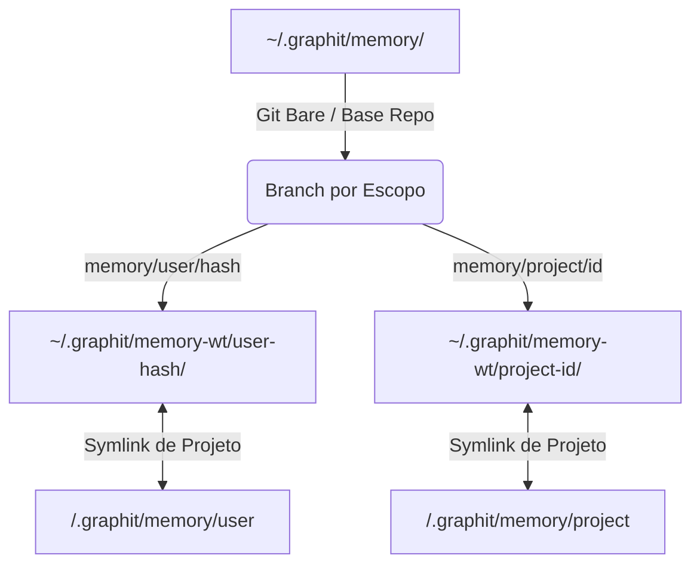

# Especificação do Módulo de Memória

O módulo de memória (`internal/memory`) gerencia o acúmulo progressivo de conhecimento, regras de codificação, decisões arquiteturais e correções de erros. Ele funciona como a memória de longo prazo do agente de IA e do desenvolvedor.

---

## 🗂️ Escopos de Memória

As memórias são segmentadas em três escopos de visibilidade distintos:

1. **User (Usuário):**
   Memórias associadas ao desenvolvedor individual. São identificadas pelo hash do e-mail do Git do usuário (ex: `memory/user/a1b2c3d4`). Útil para guardar preferências pessoais de escrita de código, atalhos de terminal e correções de erros que o usuário costuma cometer.
2. **Project (Projeto):**
   Memórias vinculadas ao projeto específico (ex: `memory/project/99eed612`). Compartilhado por todos os desenvolvedores que trabalham no repositório. Focado em decisões do projeto, arquitetura adotada e regras de design.
3. **Context (Contexto):**
   Memórias temporárias ou associadas a contextos específicos de importação de terceiros, utilizadas para orquestrações avançadas.

---

## 🏷️ Tipos de Memória

Para estruturar o aprendizado da IA, cada memória deve possuir um tipo específico:

* `convention` (Convenção): Padrões de escrita adotados pelo time (ex: *"Sempre utilizar o padrão RFC3339 para timestamps em logs"*).
* `correction` (Correção): Uma instrução gerada após a identificação de um erro cometido pela IA no passado (ex: *"Não tente usar o comando X no MacOS, utilize Y"*).
* `decision` (Decisão): Registros de decisões arquiteturais relevantes tomadas pelo time ou agente.
* `tension` (Tensão): Registro de conflitos, acoplamentos ruins ou débitos técnicos no código que exigem atenção.
* `fact` (Fato): Informações factuais estáticas sobre o ecossistema.
* `skill` (Habilidade): Conhecimento operacional sobre processos ou comandos.

---

## 💾 Persistência em Markdown + YAML

As memórias são salvas fisicamente em arquivos Markdown contendo um cabeçalho YAML estruturado:

```markdown
---
id: 01HXYZ1234...
title: Padrão de Erros nas APIs de Pagamento
scope: project
scope_id: proj_payments_v2
type: convention
important: true
created_at: 2026-05-26T00:00:00Z
updated_at: 2026-05-26T00:00:00Z
tags: [memory, project, payments, convention]
---

# Padrão de Erros nas APIs de Pagamento

As APIs localizadas sob o diretório `internal/payment` devem sempre retornar respostas de erro encapsuladas na struct `PaymentError` para garantir compatibilidade com o frontend.
```

* **Priorização:** Memórias salvas com a propriedade `important: true` geram nomes de arquivos diferenciados (ex: `01HXYZ..._important.md`) e são carregadas prioritariamente no contexto inicial da IA.

---

## 🌲 Gerenciamento de Git Worktrees e Isolamento

Para garantir isolamento absoluto entre projetos e evitar conflitos de merge em escritas concorrentes, o módulo implementa o gerenciamento de repositórios baseado em **Git Worktrees**:



1. **Repositório Git Base:** O Graphit Code inicializa um repositório Git local em `~/.graphit/memory/`.
2. **Worktrees Dinâmicos:** Ao interagir com uma memória de um escopo, o sistema cria dinamicamente uma pasta de trabalho (Worktree) isolada em `~/.graphit/memory-wt/` apontando para a branch Git correspondente (ex: `memory/user/a1b2c3d4`).
3. **Symlinks no Projeto:** A pasta do projeto local vincula atalhos simbólicos (symlinks) apontando para essas pastas de worktree globais. Assim, a IDE e o indexador de conhecimento conseguem ler as memórias em tempo real como se estivessem dentro da pasta do projeto.
4. **Push Assíncrono em Background:** Quando uma memória é salva, atualizada ou excluída:
   * As alterações são commitadas localmente no worktree.
   * Se um repositório remoto estiver configurado em `memory.repo`, o sistema dispara uma rotina assíncrona em uma goroutine paralela para realizar o `git push` em segundo plano, evitando travar o terminal do desenvolvedor.
5. **Local-First Fallback:** Se `memory.repo` estiver vazio, nenhuma operação de rede é tentada, e as memórias permanecem salvas localmente com segurança no git embarcado.

---
*Próximo passo recomendado:* Conheça as ferramentas e endpoints expostos no [[mcp_server]].
