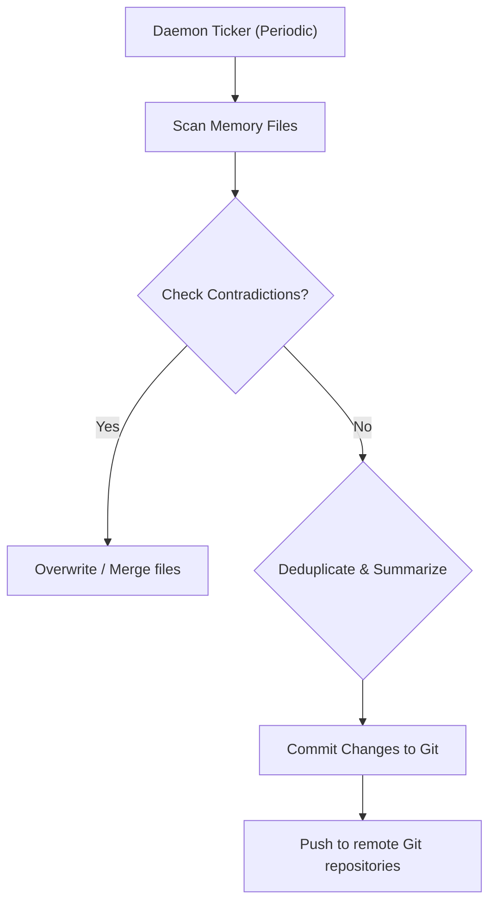

# Memory Module Specification

The Memory module manages persistent, progressive memories for AI agents.
It captures preferences, corrections, design decisions, and skills, ensuring that agents learn from past iterations and do not repeat identical mistakes across sessions.

---

## 🗃️ Dual-Scope Git Storage

Memory is split into two scopes, isolated as markdown files inside a hidden directory under the workspace:

```
workspace/
└── .graphit/
    └── memory/
        ├── project/              # Shared Project Memory
        │   ├── index.md          # Index catalog
        │   └── ALWAYS_run_make_ci.md
        └── user/                 # Personal User Memory
            ├── index.md          # Index catalog
            └── prefer_tabs.md
```

### 1. Project Memory
- **Location**: `.graphit/memory/project/`
- **Scope**: Team-wide.
- **Backend**: Commits are pushed to a shared central Git repository.
- **Use Case**: Encodes database schemas, architectural patterns, test workflows, and team-specific code invariants.

### 2. User Memory
- **Location**: `.graphit/memory/user/`
- **Scope**: User-specific.
- **Backend**: Local to the machine, or pushed to a private personal repository.
- **Use Case**: Encodes local environment setups, API keys configuration preferences, and personal editor commands.

---

## 🃏 Memory Card Structure

Every memory card is a markdown file containing structured YAML frontmatter:

```yaml
---
title: "NEVER_write_output_directly_to_stdout"
type: "correction"
tags: ["logging", "output"]
created_at: 2026-05-29T20:00:00Z
updated_at: 2026-05-29T20:00:00Z
important: true
---

# NEVER Write Output Directly to stdout

## What
The domain layer must never write directly to stdout or stderr.

## Why
Writing directly to system outputs breaks context rendering in IDE extensions and CLI adapters.

## How
Redirect all command and domain operations through the `internal/output` package printer.

## Impact
Enables clean JSON formatting and progressive loader spinners across all interfaces.
```

The body must conform to the **What/Why/How/Impact** template to ensure that instructions are clear and actionable for LLM agents.

---

## 🔄 Memory Cycle & Consolidation Pipeline

To prevent memory bloat, `internal/memory/consolidate.go` runs background optimization tasks:



### 1. Deduplication
If multiple similar corrections are logged (e.g. repeated user prompts about writing logs), the consolidation pipeline merges them into a single, comprehensive convention card.

### 2. Contradiction Resolution
If a new convention contradicts an older memory, the pipeline overrides the stale record, updates the `updated_at` attribute, and logs a note inside `log.md`.

### 3. Git Push
To ensure sync reliability without interrupting user workflow, commits are pushed asynchronously.
The CLI calls `memory.WaitForPendingPushes()` on exit to ensure that background Git pushes finish before the shell command terminates.
