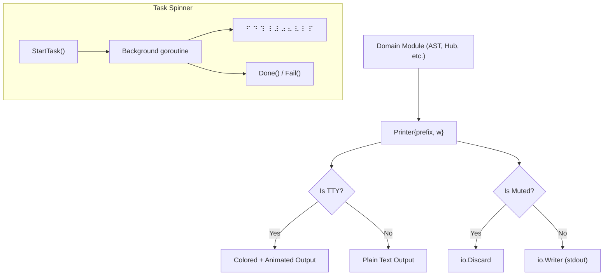

# Output Module Specification

The `internal/output` package implements the decoupled view/output layer for all Graphit CLI output. It enforces the convention that **domain modules never write directly to `os.Stdout` or `os.Stderr`** — all user-facing output flows through the `Printer` abstraction, which can be muted, redirected, or replaced.

---

## ⚙️ Architecture

The module follows a strict separation between domain logic and presentation. Domain modules create a `Printer` instance and call semantic methods (e.g., `Success`, `Error`, `Step`) rather than raw `fmt.Println`. This enables:

- **MCP mode**: All output is silenced via `Mute()` since communication happens via JSON-RPC.
- **Non-TTY mode**: Colors are automatically disabled; spinners degrade to static text.
- **Writer redirection**: Output can be redirected to any `io.Writer` via `WithWriter()`.



---

## 🧩 Key Types & Interfaces

### `Printer`

```go
type Printer struct {
    prefix string
    w      io.Writer
}
```

The central output abstraction. Created via `NewPrinter(prefix)` where `prefix` is a module-scoped label (e.g., `"ast"`, `"hub"`, `"memory"`). The prefix is rendered as a dim tag `[prefix]` before each line.

If `muted` is `true` at creation time, the writer is set to `io.Discard`, silencing all output.

### `Task`

```go
type Task struct {
    p      *Printer
    msg    string
    mu     sync.Mutex
    done   bool
    stopCh chan struct{}
}
```

Represents an in-progress operation with an animated spinner. Thread-safe via `sync.Mutex`. The spinner runs in a background goroutine at 80ms intervals.

---

## 🎨 Unicode Symbols

| Constant | Symbol | Usage |
|---|---|---|
| `SymbolOK` | `✓` | Success messages |
| `SymbolError` | `✗` | Error messages |
| `SymbolWarn` | `!` | Warning messages |
| `SymbolStep` | `›` | Step/detail lines |
| `SymbolRunning` | `◦` | In-progress messages |
| `SymbolDivider` | `─` | Horizontal dividers |
| `SymbolBullet` | `•` | List items |

---

## 🎨 Color System

Colors are defined as package-level `*color.Color` instances from the `fatih/color` library:

| Variable | Color | Usage |
|---|---|---|
| `green` | Green + Bold | Success messages, completed tasks |
| `red` | Red + Bold | Error messages, failed tasks |
| `yellow` | Yellow + Bold | Warning messages |
| `cyan` | Cyan | Running/in-progress messages, spinners |
| `magenta` | Magenta | Detail values, counts |
| `bold` | Bold | Headers |
| `dim` | HiBlack | Tags, step prefixes, dividers, key labels |

### TTY Detection

On package initialization, `term.IsTerminal(os.Stdout.Fd())` determines if stdout is a terminal. If not:
- `color.NoColor` is set to `true`, disabling all ANSI color codes.
- Spinner animations are replaced with static progress lines.

---

## 📋 Printer Methods

### Semantic Output

| Method | Symbol | Color | Description |
|---|---|---|---|
| `Info(msg, args...)` | — | — | General information line |
| `Success(msg, args...)` | `✓` | Green | Operation completed successfully |
| `Error(msg, args...)` | `✗` | Red | Operation failed |
| `Warn(msg, args...)` | `!` | Yellow | Non-fatal warning |
| `Running(msg, args...)` | `◦` | Cyan | Operation in progress (static) |

### Structured Output

| Method | Description |
|---|---|
| `Step(msg, args...)` | Indented step line with dim `›` prefix |
| `StepOK(msg, args...)` | Step with green `✓` |
| `StepError(msg, args...)` | Step with red `✗` |
| `StepWarn(msg, args...)` | Step with yellow `!` |
| `Detail(key, value)` | Key-value pair with dim key and magenta value |
| `KeyValue(key, value)` | Left-aligned key (14-char pad) with value |
| `Count(label, n)` | Pluralized count (e.g., `3 files`) |
| `ListItem(msg, args...)` | Bulleted list item with `•` |

### Layout

| Method | Description |
|---|---|
| `Header(msg, args...)` | Bold text preceded by a blank line |
| `Divider()` | 48-character horizontal line using `─` |
| `Blank()` | Empty line |
| `Data(content)` | Raw content without prefix or formatting |

### Table

```go
func (p *Printer) Table(headers [2]string, rows [][2]string)
```

Renders a two-column table with:
- Auto-calculated left column width based on content.
- Horizontal divider lines above, between header and body, and below.
- Bold headers.

---

## ⏳ Task Spinner

### `StartTask(msg string, args ...any) *Task`

Starts an animated spinner for long-running operations:

- **TTY mode**: Spawns a background goroutine that cycles through Braille spinner frames (`⠋ ⠙ ⠹ ⠸ ⠼ ⠴ ⠦ ⠧ ⠇ ⠏`) at 80ms intervals, overwriting the current line via `\r\033[K`.
- **Non-TTY mode**: Prints a single static `Running` line immediately (no animation).

### `Update(msg string, args ...any)`

Updates the spinner message while the task is running. Thread-safe.

### `Done(msg string, args ...any)`

Marks the task as completed:
1. Acquires the mutex and sets `done = true`.
2. Closes `stopCh` to terminate the spinner goroutine.
3. Clears the spinner line (TTY only).
4. Prints a green `✓` success line.
5. Subsequent calls are no-ops.

### `Fail(msg string, args ...any)`

Marks the task as failed:
1. Same lifecycle as `Done()` but prints a red `✗` error line.

---

## 🔇 Muting

### `Mute()`

Sets the global `muted` flag to `true` and disables colors (`color.NoColor = true`). All `NewPrinter()` calls after this point create printers writing to `io.Discard`.

Used by the MCP server (`mcpstdio.Serve`) to prevent CLI output from interfering with JSON-RPC communication over stdout.

### `Unmute()`

Clears the muted flag. Does **not** re-enable colors (they remain disabled).

### `IsMuted() bool`

Returns the current muted state.

---

## 🚨 Fatal & Interrupt Handling

### `Fatal(msg string, args ...any)`

Prints a red error message to **`os.Stderr`** (bypassing the Printer's writer) and calls `os.Exit(1)`. This is the only function that writes to stderr directly.

### `Interrupted()`

Handles SIGINT gracefully:
- If muted, exits silently with code 130.
- Otherwise, prints `"! Interrupted."` in yellow to stdout and exits with code 130.

---

## 🔧 Writer Redirection

### `WithWriter(w io.Writer) *Printer`

Creates a new `Printer` with the same prefix but a different writer. The original printer is not modified (immutable pattern). Used for:
- Writing to test buffers in unit tests.
- Redirecting output to files or custom writers.

---

## 📦 Dependencies

### External

| Package | Usage |
|---|---|
| `github.com/fatih/color` | ANSI color and bold formatting. |
| `golang.org/x/term` | TTY detection via `IsTerminal()`. |

### Standard Library

| Package | Usage |
|---|---|
| `io` | `io.Writer`, `io.Discard` for muted output. |
| `sync` | `sync.Mutex` for thread-safe task spinner. |
| `unicode/utf8` | Column width calculation for table formatting. |
