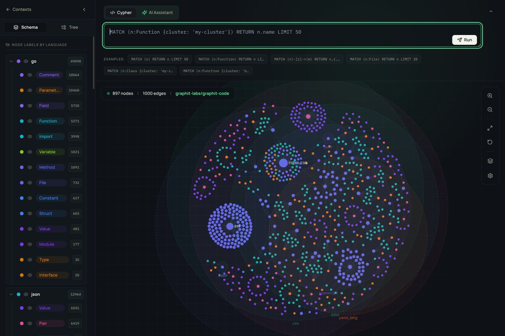
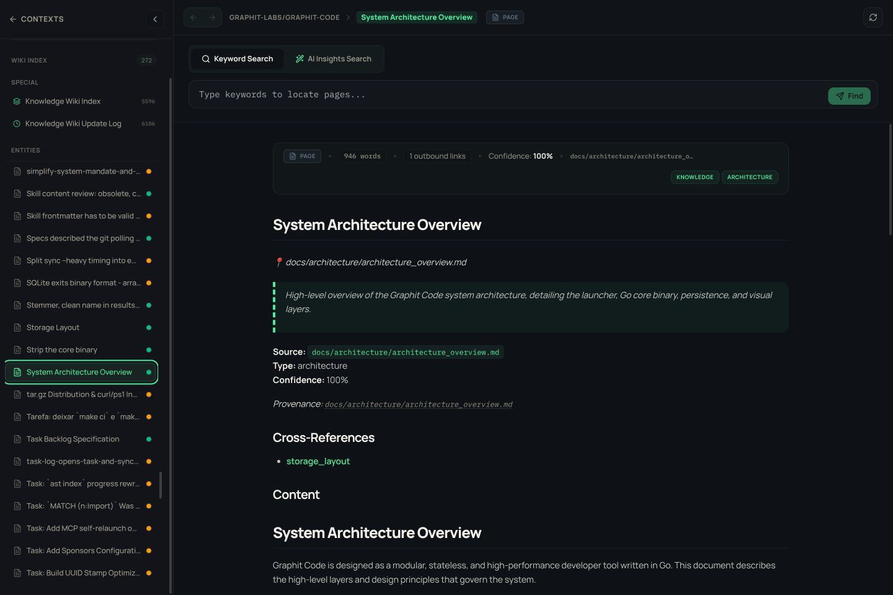
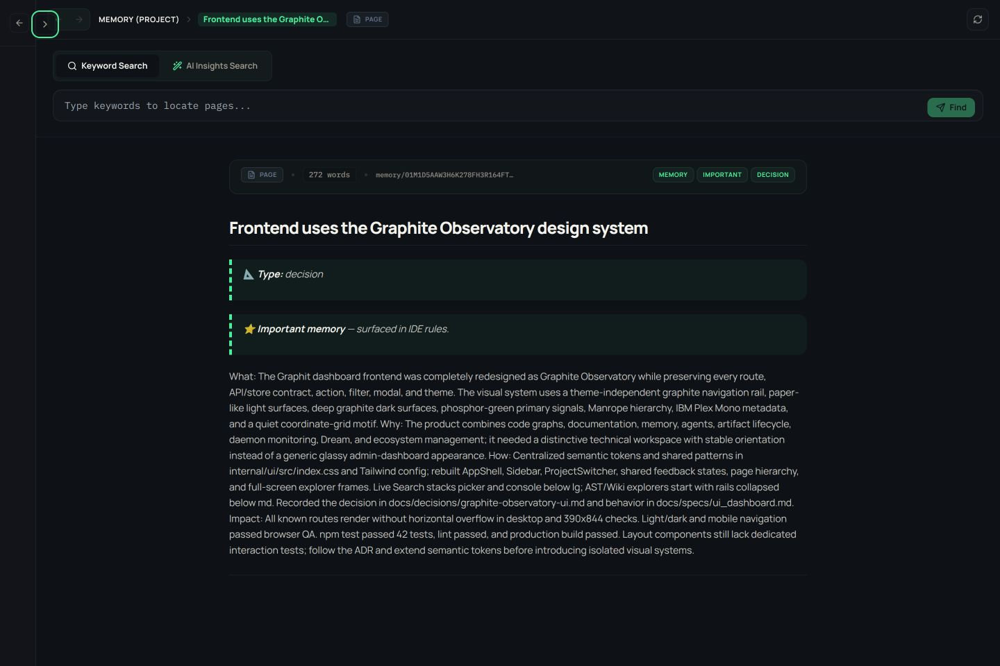

# UI Dashboard Specification

The Graphit Observatory is the embedded web interface for Graphit Code. It presents the same project, context, registry, daemon, knowledge, memory, and AST state exposed by the CLI and MCP tools.

## Scope

The UI provides:

- workspace and IDE selection;
- Hub registry, local artifacts, and publication workflows;
- project and imported knowledge explorers;
- project, user, and imported memory explorers;
- project and imported AST explorers;
- a project Task explorer with complete lifecycle and audit detail;
- live multi-source agent sessions;
- daemon, Dream, and ecosystem status.

It does not add authentication, replace network controls, or maintain an independent copy of domain data.

## Frontend architecture

The SPA lives in `internal/ui/`.

| Concern | Implementation |
|---|---|
| Build | Vite |
| UI | React + TypeScript |
| Styling | Tailwind CSS plus semantic CSS tokens |
| State | Zustand stores with selective persistence |
| HTTP | Axios-based API modules |
| Markdown | Rendered wiki and memory pages with navigable references |
| Graph | D3 force simulation and canvas rendering |
| Packaging | Production assets embedded into the Go binary |

`npm run build` writes `internal/ui/dist/`. The Go UI server embeds that output and serves it with same-origin API routes.

## Visual system

Graphit Observatory uses:

- a theme-independent graphite navigation rail;
- paper-like neutral workspace surfaces in light mode;
- deep graphite workspace surfaces in dark mode;
- phosphor green for primary signals and mint for secondary technical states;
- Manrope for hierarchy and IBM Plex Mono for technical metadata;
- a low-contrast coordinate grid and restrained instrument framing;
- the product `brand-glyph` as the favicon and primary identity mark.

Semantic tokens define meaning across both themes. New features extend existing tokens instead of introducing route-specific palettes.

## Responsive contract

- Below `md`, global navigation becomes a modal drawer with every route, workspace/IDE control, filter, and theme action preserved.
- Below `lg`, Live Search stacks its artifact picker and session console.
- AST and wiki rails may collapse so the canvas or document remains usable on narrow screens.
- Full-screen explorers must not introduce horizontal page overflow.
- Keyboard focus remains visible.
- Motion honors `prefers-reduced-motion`.
- Loading and toast states communicate status without removing the underlying route context.

## Workspace identity

The app store loads registered projects from `GET /api/global-projects` and persists the selected project directory under the `graphit-app-state` browser key.

Every project-scoped request must use the active project directory or context. Because the selection survives browser sessions, explorer screens must display the active project clearly enough for a user to verify it before interpreting data.

Switching projects updates:

- project name and identity;
- Knowledge, AST, Memory, and Task navigation entries;
- Hub target context;
- explorer API parameters;
- ecosystem and system views that depend on project scope.

## Main experiences

### AST Explorer

The AST Explorer contains:

- a schema rail grouped by language and entity type;
- friendly relationship filters;
- Cypher and AI-assisted query modes;
- example queries;
- a two- or three-dimensional graph canvas;
- zoom, fit, reset, physics, and layer controls;
- node details and source navigation.

User-facing relationship names are resolved dynamically from the active project or context's `graph.icebug/icebug.json` manifest. `CanonicalRelGroup.Type` is the public name used by the translator, schema rail, filters, and canvas. Physical edge-table names are internal Icebug storage details and must not cross the explorer API boundary.

The mapping is scoped to `project_dir` or imported context; the frontend must not maintain a global hard-coded relationship map.

### Knowledge and Memory Explorers

Both explorers share a document workspace:

- an index rail;
- back and forward navigation;
- keyword and AI-assisted search modes;
- source-backed page rendering;
- metadata chips;
- provenance and cross-reference navigation;
- a refresh action.

Knowledge shows maintained project or imported documentation. Memory shows project, user, or imported memory scopes. Search results are page titles; selecting a title loads the page content.

### Task Explorer

The Task Explorer uses the lightweight `GET /api/tasks` catalogue for paginated discovery. Its
server-side text and lifecycle filters show status, priority, flags, and dependency blocks without
transferring checks or audit history for every task. Selecting a task loads the exact versioned
export document and presents its robust specification, current ownership/progress, checks and
evidence, dependencies, subtasks, typed
comments, lifecycle events, immutable specification revisions, and raw JSON. Users can download
either the complete project document or the selected task/subtask document.

The frontend never reconstructs authoritative Task state. Catalogue summaries and derived readiness
fields come from the Task service, while detail arrays come from the shared export service. Query,
status, project, and page size are bound into opaque cursors; stale responses are discarded when
the view changes.

`GET /api/tasks` accepts `project_dir`, `query`, `status`, `page_size`, and `cursor`. It returns a
bounded `results` array and `next_cursor`; page size defaults to 20 and is capped by the shared API
pagination limit. A cursor from another query, status, project, or page size returns `400`.

`GET /api/tasks/export` accepts `project_dir` and `id` as query parameters. `project_dir` defaults
to the server's active project; omitting `id` returns the complete project document, while an exact
`id` returns that task and its recursive subtasks. A missing task returns `404`; an unavailable Task
module also returns `404`; invalid project resolution returns `400`.

Successful responses use this versioned envelope:

```json
{
  "schema_version": 1,
  "project_id": "project-ulid",
  "task_id": "tsk-abcd",
  "tasks": [],
  "dependencies": [],
  "checks": [],
  "events": [],
  "comments": [],
  "spec_revisions": []
}
```

`task_id` is omitted for a project-wide export. The API never returns fencing tokens or
`task_control` scheduler rows.

### Hub

The Hub routes present:

- registry browsing and filters;
- project-installed artifacts;
- artifact details and version metadata;
- install, update, uninstall, and publish actions where supported.

Remote operations depend on configured Hub storage and credentials.

### Live Search

Live Search lets the user choose compatible artifacts, select a target IDE, enter a prompt, and observe a streamed agent run inside an ephemeral project. Recent sessions and execution status remain visible without mixing them into persistent project stores.

### System views

- **Daemon** exposes process status and recent operational information.
- **Dream** exposes configuration and session/report state.
- **Ecosystem** lists registered projects, labels, and active project identity.

## Go server boundary

`internal/uiserver/`:

- serves the embedded SPA;
- resolves the active project and imported contexts;
- exposes JSON handlers for AST, wiki, memory, Task, Hub, live search, daemon, Dream, and ecosystem operations;
- applies one UI host and exact-origin CORS configuration;
- returns domain-friendly names rather than storage implementation names.

The built-in UI host is the IPv4 loopback address. The frontend uses same-origin `/api` URLs so it continues to work behind a correctly configured reverse proxy.

The server has no authentication. CORS limits browser origins but does not authorize non-browser clients. See [S3 Credentials and UI Network Configuration](../guides/s3-and-ui-network.md).

## Error and loading behavior

- Requests increment and decrement a shared loading counter.
- The global working indicator remains visible while at least one request is active.
- Route-level empty and error states explain what is missing and provide a relevant retry or navigation action.
- Switching projects must not render stale data as if it belongs to the new project.
- A failed context load retains enough route identity for the user to recover.

## Acceptance criteria

- Every documented route is reachable from desktop and mobile navigation.
- Light and dark modes preserve the same semantic hierarchy.
- The active project is visible on project-scoped surfaces.
- AST relationship names match the active manifest's friendly names.
- Screenshot and public documentation examples use the current Graphit Observatory UI.
- The production bundle builds with `npm run build`.
- Task discovery uses a bounded paginated catalogue; exact detail and explicit JSON download consume the canonical complete export contract.
- The embedded server serves the SPA and same-origin API calls.
- The default network configuration remains local; documentation does not present CORS as authentication.

## Reference captures






