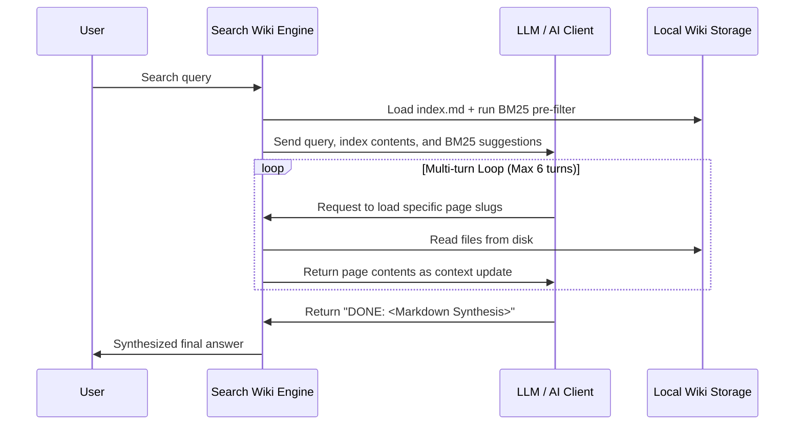

# Wiki Module Specification

The Wiki module converts raw documentation files into a structured, agent-navigable knowledge base.
Instead of relying solely on black-box vector databases, it builds an interconnected Obsidian-style markdown wiki graph.
This format enables AI agents to explore technical manuals through deterministic backlinks and fuzzy cross-references.

---

## 📂 Obsidian Wiki Compilation

On synchronization (`graphit sync`), the indexer pipeline scans the project's documentation tree — `knowledge.docs_dir`, which defaults to `docs` — plus the project root's README.
The set of file extensions to index is configurable via `knowledge.extensions` (comma-separated, e.g., `md,yaml,json,proto`). By default, it indexes 16 extensions covering markdown, structured data, schema, and spec formats.

It compiles these files into a structured wiki in the global brand directory —
`~/.graphit/wiki/knowledge/project/<project-id>/` — which is the one place every wiki
tool opens for that project. An imported context compiles to
`~/.graphit/wiki/knowledge/context/<name>/`. Nothing is written into the project; see
[Storage Layout](../architecture/storage_layout.md):

- **`index.md`**: The entry point.
  Lists all indexed pages, computed community clusters, "God Nodes" (the most connected documents), and global network metrics.
- **`log.md`**: An updates timeline tracking modified files.
- **Wikilink Parsing**:
  The indexer parses legacy Obsidian-style double-bracket page references.
  It registers references as edges in a temporary graph to analyze connections.

### Indexed Scope

The walk is scoped, but the paths it reports are not. `knowledge.WikiScope` names
what under the root is read; the root itself stays the **project directory**, so
every path the wiki records — the `source:` field on a page, the `.manifest.json`
entry, the process-cache key — is relative to the project root.

```go
type WikiScope struct {
    Subdir     string   // the only directory walked; "" or "." walks everything
    ExtraFiles []string // single documents outside Subdir, relative to the root
}

func ScopeFor(projectDir string, inlineCfg, projectCfg config.ConfigMap) WikiScope
```

A scope names **one** tree. It briefly also carried a whitelist of sibling directories,
for a single caller: the live search compiling the several documentation sets a user had
selected into one wiki. That compile no longer exists — a knowledge context now arrives
already compiled and is read where it was installed — so the whitelist went with it. See
[Live search sessions own nothing](../tasks/an-ephemeral-session-owns-no-store.md).

`ScopeFor` assembles it from configuration: `Subdir` is `knowledge.docs_dir`, and
`ExtraFiles` holds the root README unless `knowledge.include_readme` is `false`.

| Key | Effect | Default |
|---|---|---|
| `knowledge.docs_dir` | the directory walked; `.` walks the whole project | `docs` |
| `knowledge.include_readme` | whether the root README is indexed on top of it | `true` |

Why the root is the project and not the docs directory — the alternative was tried
and is wrong in two ways:

- **Paths would not resolve.** Handing `docs/` in as the root reports a spec as
  `specs/config_module.md`, a path relative to nowhere the reader is standing.
- **Ignore files would silently stop working.** `.gitignore` and `.wikiignore` are
  collected upward and each is scoped to its own directory, relative to the root.
  With `docs/` as the root, the project's own `.gitignore` and `.wikiignore` sit one
  level *above* it, `domainForFile` gives them the domain `..`, and every pattern in
  them matches nothing — so a project with a custom `docs_dir` had its root ignore
  files silently inert.

Collection therefore starts at the **docs tree** while resolving against the
**project** (`NewKnowledgeIgnoreCheckerIn`). That combination is what makes both
levels work at once: a root-level pattern applies from the root, and a
`.wikiignore` kept inside the docs tree applies within the docs tree. Passing the
project as the start directory as well would have read only the root one. Both are
registered as `StatPreCheck` watch files, so editing either invalidates the
fast-path that would otherwise skip the rebuild.

Collection only ever walks upward, so an ignore file deeper than the docs tree —
`docs/specs/.wikiignore` — is not read. That is true of the AST side as well and
was true before this change.

A `Subdir` that does not exist is not an error: it yields no sources, and
`ExtraFiles` are still indexed. That is what makes a project with a README and no
`docs/` yet produce a one-page wiki rather than an empty one.

Documents found by the walk and named in `ExtraFiles` are de-duplicated by path,
so `knowledge.docs_dir=.` — where the walk already finds the README — indexes it
once, not twice.

An **imported context** passes the zero `WikiScope`: its extracted docs tree
already *is* the root, so there is nothing to narrow.

### Multi-Format Rendering

The pipeline treats file types differently based on their content nature:

| File Type | Splitting | Content Rendering |
|---|---|---|
| Markdown (`.md`, `.markdown`, `.mdx`) | Split by `## H2` headers into parent/child pages | Rendered as native markdown |
| Structured data (`.yaml`, `.json`, `.graphql`, `.xml`) | Kept as a single page | Wrapped in a fenced code block with syntax highlighting (e.g., ` ```yaml `) |
| Other formats (`.proto`, `.rst`, `.txt`, etc.) | Kept as a single page | Wrapped in a plain fenced code block (` ``` `) |

Only languages supported by the UI renderer (Prism) receive language tags. Unsupported languages render as plain monospaced text.

## 🗂️ Process Cache: one file per source file

`internal/wiki/process_cache.go` holds the processed chunks and the embedding vectors of
every source document, keyed by content hash. When a document has not changed, its
chunks and vectors are reused rather than re-derived — and re-deriving a vector means
running the ONNX embedding model, which is the expensive half of a sync.

**The cache is the source of truth; `index.lance/` is always rebuilt from it.**

Every file in the cache belongs to exactly one source document:

```
shards/<relPath>.wiki.json   processed chunks — complete enough to rebuild a WikiChunk
shards/<relPath>.emb.json    embedding vectors (content_hash → base64 blob)
shards/<relPath>.meta.json   hash, mtime, size, slug, outgoing cross-refs
watch/<name>.json            stat of a non-source file whose change invalidates the wiki
```

### Why there is no shared index file

This used to keep one `manifest.json` with an entry per source document, which is the
obvious design and the wrong one here: a memory scope's cache travels in a git branch
that **every developer on a team pushes to**. Two people compiling independently produce
two divergent versions of that single file, git cannot merge JSON, and the rebase the
memory store depends on fails on every concurrent push.

Per-file sidecars remove the shared write target entirely — two people adding different
memories add different files, which git merges without being asked. The index is rebuilt
by walking the shard tree on open, one pass over a few hundred small files.

### The shard is a COMPLETE chunk

`CachedChunk` carries every field of a `WikiChunk` that cannot be derived from the cache
key or the body: title, body, summary, doc type, breadcrumb, cross-refs, **cluster,
confidence, updated date and importance**. Derived rather than stored: `Source` is the
cache key, `Slug` is in the sidecar (one per file, not one per chunk), and `WordCount` is
counted from the body.

That completeness is a requirement, not a convenience: it is what lets
`wiki.BuildDBFromCache(dir)` build a search index **with no source document anywhere on
the machine**, which is how a published knowledge context is installed. A field left out
of `CachedChunk` is silently lost on such an install.

The corpus-level fields — slug and community — are only knowable after the whole corpus
has been processed, so they are recorded separately by `StoreDerived`, which writes
nothing when every value already matches. Without that guard the cache would stop being
incremental: `StoreDerived` is called for every document on every run.

### The index itself (`index.lance/`)

`index.lance/` is a **LanceDB** dataset directory, written and read by
`internal/wiki/store.go`. **Four** tables:

| Table | Holds |
|---|---|
| `chunks` | one row per chunk: the page, its search document, and its vector as a COLUMN |
| `xrefs` | cross-references, as `source_slug` → `target_slug` |
| `sync_log` | the sync timeline, bounded at 50 entries |
| `meta` | persistent counters that survive a rebuild |

**There is no `chunk_emb`, and its absence is the design.** The embedding is a column of the
chunk, so deleting the chunk deletes its vector and the class of bug where a stale vector answers
for a page that no longer exists cannot be expressed. The old shape had a second table plus a
`vec0` index whose rowid *was* `chunks.id` — three places for one fact to be in, and two of them
able to disagree.

The indexes are inside the directory and DO travel, which is the other change: a published wiki is
copied rather than converted, and the consumer neither rebuilds nor downloads it.

It was a LadybugDB store for three days in 2026-08-16..19, and a SQLite one until 2026-08-23. What
brought it out of the graph engine is that liblbug does not maintain a full-text index on insert,
so every write had to drop and recreate all seven — see
[Storage Layout](../architecture/storage_layout.md).

Four things about the shape are worth knowing:

**Cross-references are rows, not edges.** A wiki link may point at a page that does not exist — a
reference written before its target, or a page since deleted. Anything requiring both
endpoints would silently drop exactly the dangling links a docs lint exists to report. `FindXRefs`
walks them in Go, with a visited set. This has now survived a round trip through TWO storage
engines unchanged, which is the best evidence the reasoning was about the data and not the storage.

**`Rebuild` drops and rewrites.** Under SQLite it wrote a fresh database and renamed it over the
live one, forced by `sqlite-vec`'s inability to reclaim a deleted row's space. Here a write produces
a new immutable version of the dataset, so there is no log to checkpoint and no `-wal`/`-shm` to
clean up after: what is on disk after a write is the whole truth, and a copy of the directory is a
valid dataset.

**The sync log is the ONE table that survives a rebuild**, because it is the history *of* rebuilds.
Clearing it on every rebuild would leave it permanently one entry long, which reads as "this wiki
has only ever synced once".

**A vector index needs 256 rows to train.** Below that floor it is skipped and semantic search
answers by scanning. A wiki with fewer than 256 pages therefore has no vector index, and that is
correct rather than broken.

### A published wiki is read where it lives

A knowledge artifact is **mounted**, not downloaded: the engine queries the objects on S3 and no
page file is ever transferred. Two consequences that surprise:

- **the page text comes from the index**, because there is no `.md` on disk. It is the same text —
  the wiki compiles one chunk per document, so `chunks.body` is the page rather than a slice of it;
- **a read must not go through a write path.** `EnsureTable` creates, and creating is refused on a
  published store, so a mounted wiki once answered every query with "read-only". A mounted
  artifact's tables exist by definition; they are OPENED.

A **memory** wiki is deliberately never mounted. It is read-and-write and multi-writer, so it
carries its source and is compiled locally. The distinction is mutability, not file format.

### Staleness Tracking

A `.manifest.json` file (local, git-ignored) persists SHA-256 content hashes of source files across syncs.
It is the knowledge module's own file (`internal/knowledge/staleness.go`) and is unrelated
to the process cache above — for a while both existed side by side under confusingly
similar names, and only this one remains.
When a source file changes, the corresponding wiki page is marked as stale in its frontmatter (`stale_since`, `stale_reason`).
Staleness propagates transitively: if page A references page B, and B's source changes, A is also marked stale.

### Breadcrumbs & ToC

Each split child page includes a breadcrumb trail (e.g., `> Parent > Section`) and a link back to its parent page, enabling hierarchical navigation in the wiki explorer.

### Reading Frontmatter

Titles, summaries and content hashes are read out of a document's leading `---` block by
`internal/wiki/helpers.go`:

| Function | Returns |
|---|---|
| `FrontmatterBlock(content)` | the block's text without the delimiters; `ok=false` when the document does not open with one |
| `FrontmatterField(content, field)` | one scalar field, parsed as YAML; `ok=false` when the block is absent, does not parse, or the field is missing, null or not a scalar |
| `ReadFrontmatterField(path, field)` | the same, for a file on disk |

`FrontmatterField` returns the **scalar's literal text**, taken from a `yaml.Node` rather than
from a typed unmarshal. That is what makes quoting and escaping the parser's problem — a
single-quoted value with a doubled apostrophe, or a double-quoted one containing `\"`, arrives
as the author wrote it — while keeping YAML's type resolution out of the way, so a content hash
that happens to be all digits stays the string it was.

`ExtractTitle` and `ExtractSummary` (`internal/wiki/docutil.go`) try this first and **fall back
to a line scan** when it returns `ok=false`. The fallback is not redundancy for its own sake:
wiki pages themselves are still written with hand-assembled frontmatter, so a title containing
`": "` produces a block that does not parse, and the scan is what keeps such a page readable.

Summaries are capped at 200 characters, counted in **runes**, so a multi-byte character is
never cut in half.

---

## 🧮 Community Detection & Clustering

To help agents navigate complex, nested documentation topologies, `internal/wiki/engine.go` implements graph partitioning algorithms:

### 1. Label Propagation Algorithm (LPA)
LPA is a fast, linear-time algorithm used to cluster documents by iteratively assigning each node the label that appears most frequently among its neighbors:
- **Heuristic**: Shuffles nodes at each iteration and re-evaluates adjacent tags.
- **Termination**: Stops when no node changes its label, or when a maximum iteration limit (default 50) is reached.

### 2. Louvain Algorithm
Louvain optimizes the modularity score (a metric indicating the density of connections within communities compared to connections between communities):
- **Phase 1**: Iteratively moves nodes between communities to maximize modularity gains.
- **Phase 2**: Collapses nodes of the same community into super-nodes, forming a new hierarchical graph.
- **Assignment**: Writes a `community = <id>` property and a cohesion ratio to the graph database.

---

## 🔍 Search Engine: Lexical BM25 & Trigram Link Resolution

The Wiki search engine uses a lexical retrieval model combined with a spelling-tolerant page link resolver:

### 1. BM25 Pre-Filtering (`internal/wiki/bm25.go`)
An implementation of the Okapi BM25 TF-IDF ranking algorithm.
It calculates document relevance based on term frequency and document length normalization:
```go
score += idf * (tf * (k1 + 1)) / (tf + k1 * (1 - b + b * dl / avg_dl))
```
**Stopwords filtering**: Removes generic English articles and prepositions (e.g. *the, an, that, with*).
This lexical search runs as a pre-filtering pass when a query is received to initialize the AI discovery loop with relevant page references.

### 2. Trigram Fuzzy Link Resolution
To resolve typos or spelling discrepancies in page link requests made by the user or the LLM agent, `internal/wiki/search.go` implements trigram similarity:
- Splits words into sets of three-letter character sequences (trigrams).
- Computes the Jaccard similarity coefficient:
  ```go
  similarity = len(intersection(trigrams_A, trigrams_B)) / len(union(trigrams_A, trigrams_B))
  ```
- If the similarity coefficient is above `0.65`, the engine fuzzy-resolves the page request to the closest matching document filename.

---

## 🤖 AI-Agent Self-Discovery Loop

To find relevant answers, the `SearchWiki` function drives a multi-turn agent interaction loop (up to a maximum of 6 turns):



1. **Intake**:
   The engine initializes the context with `index.md` and the top BM25 results.
2. **Evaluation**:
   The AI client reads the context. If it needs details, it outputs a list of target page names.
3. **Execution**:
   The search engine reads the requested files from disk, appends them to the context, and invokes the AI client again.
4. **Synthesis**:
   Once the AI client has sufficient context, it responds with a synthesized Markdown document including inline page citations.
