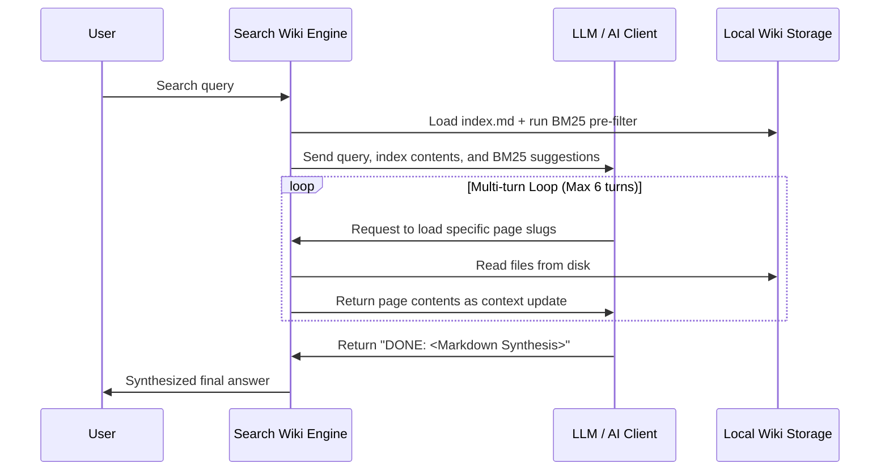

# Wiki Module Specification

The Wiki module converts raw documentation files into a structured, agent-navigable knowledge base.
Instead of relying solely on black-box vector databases, it builds an interconnected Obsidian-style markdown wiki graph.
This format enables AI agents to explore technical manuals through deterministic backlinks and fuzzy cross-references.

---

## 📂 Obsidian Wiki Compilation

On synchronization (`graphit sync`), the indexer pipeline scans markdown files inside the project's documentation folder (e.g. `docs/`).
It compiles these files into a structured wiki path (default: `.graphit/knowledge/project/`):

- **`index.md`**: The entry point.
  It lists all indexed pages, computed community clusters, "God Nodes" (the most connected documents), and global network metrics.
- **`log.md`**: An updates timeline tracking modified files.
- **Wikilink Parsing**:
  The indexer parses Obsidian-style double brackets `[[Target_Page]]`.
  It registers references as edges in a temporary graph to analyze connections.

---

## 🧮 Community Detection & Clustering

To help agents navigate complex, nested documentation topologies, `internal/wiki/engine.go` implements graph partitioning algorithms:

### 1. Label Propagation Algorithm (LPA)
LPA is a fast, linear-time algorithm used to cluster documents by iteratively assigning each node the label that appears most frequently among its neighbors:
- **Heuristic**: Shuffles nodes at each iteration and re-evaluates adjacent tags.
- **Termination**: Stops when no node changes its label, or when a maximum iteration limit (default 50) is reached.

### 2. Louvain Algorithm
Louvain optimizes the modularity score (a metric indicating the density of connections within communities compared to connections between communities):
- **Phase 1**: Iteratively moves nodes between communities to maximize modularity gains.
- **Phase 2**: Collapses nodes of the same community into super-nodes, forming a new hierarchical graph.
- **Assignment**: Writes a `community = <id>` property and a cohesion ratio to the graph database.

---

## 🔍 Search Engines: Hybrid RRF & Trigram Fuzzy Resolution

The Wiki search engine uses a hybrid retrieval model:

### 1. BM25 Search (`internal/wiki/bm25.go`)
An implementation of the Okapi BM25 TF-IDF ranking function.
It calculates document relevance based on term frequency and document length normalization:
```go
score += idf * (tf * (k1 + 1)) / (tf + k1 * (1 - b + b * dl / avg_dl))
```
**Stopwords filtering**: Removes generic English articles and prepositions (e.g. *the, an, that, with*).

### 2. Trigram Fuzzy Resolution
To resolve typos or spelling discrepancies in page links, `internal/wiki/search.go` implements trigram similarity:
- Splits words into sets of three-letter character sequences (trigrams).
- Computes Jaccard similarity:
  ```go
  similarity = len(intersection(trigrams_A, trigrams_B)) / len(union(trigrams_A, trigrams_B))
  ```
- If similarity is above `0.65`, it fuzzy-resolves the page name.

### 3. Reciprocal Rank Fusion (RRF)
RRF combines search results from the lexical BM25 index and the semantic vector embeddings:
- Re-ranks documents based on their reciprocal position in each individual rank list:
  ```go
  RRF_Score(d) = sum( 1 / (k + rank_i(d)) )
  ```
  (where `k` is a constant, default 60).

---

## 🤖 AI-Agent Self-Discovery Loop

To find relevant answers, the `SearchWiki` function drives a multi-turn agent interaction loop (up to a maximum of 6 turns):



1. **Intake**:
   The engine initializes the context with `index.md` and the top BM25 results.
2. **Evaluation**:
   The AI client reads the context. If it needs details, it outputs a list of target page names.
3. **Execution**:
   The search engine reads the requested files from disk, appends them to the context, and invokes the AI client again.
4. **Synthesis**:
   Once the AI client has sufficient context, it responds with a synthesized Markdown document including inline citations (e.g. `[[Page_Name]]`).
