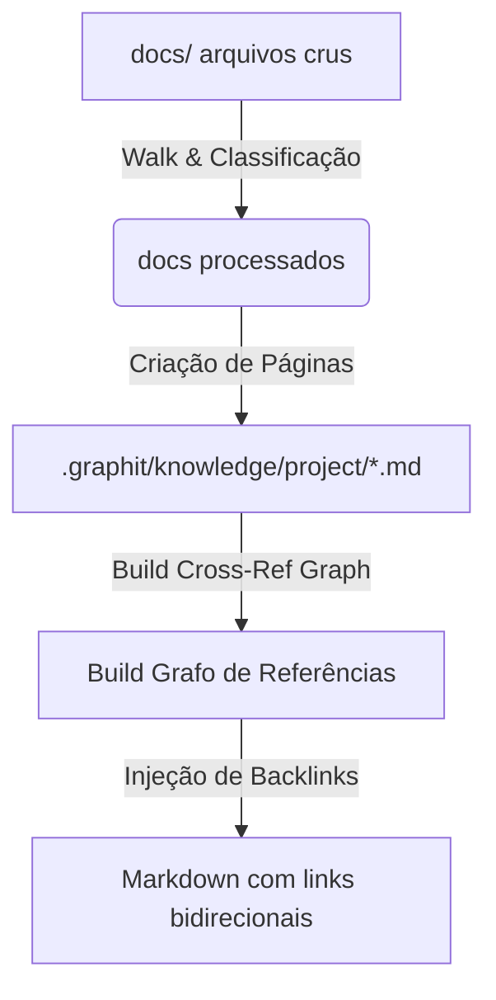
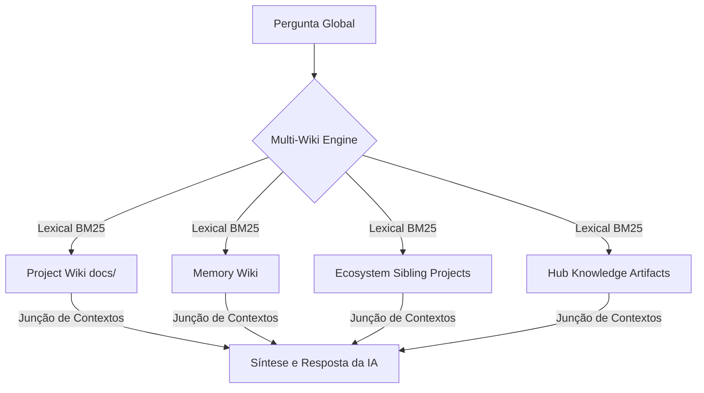

# Especificação do Módulo Wiki

O módulo Wiki (`internal/wiki` e `internal/knowledge`) atua como o motor de documentação e busca contextual do Graphit Code. Ele indexa a pasta `docs/` em uma base Obsidian estruturada e fornece um motor de chat inteligente capaz de varrer múltiplas wikis simultaneamente.

---

## 🏗️ Geração da Wiki e Backlinks

Ao executar `graphit knowledge index`, o pipeline lê a pasta `docs/` e gera arquivos Markdown otimizados para consumo por LLMs na pasta `.graphit/knowledge/project/`.

### 1. Classificação e Cálculo de Confiança
* **Extensões Suportadas:** `.md`, `.markdown`, `.mdx`, `.txt`, `.adoc`, `.rst`, `.puml`, `.plantuml`, `.yaml`, `.yml`, `.json`, `.proto`, `.graphql`, `.gql`, `.wsdl`, `.xml`.
* **Classificação por Tipo:** Os arquivos são categorizados com base em sua extensão ou caminho em: `grpc`, `graphql`, `soap`, `rest`, `async`, `decision`, `specification`, `guide`, `api`, `readme`, `changelog`, `architecture` ou `document`.
* **Cálculo de Confiança (Confidence Score):** Uma pontuação de 0.0 a 1.0 baseada em riqueza de metadados, título válido, tamanho do corpo, presença de sumário e presença de links cruzados. Páginas com baixa confiança (<0.50) alertam a IA sobre possíveis lacunas de informação.

### 2. Geração de Links Cruzados e Backlinks
* O sistema identifica links do tipo `[ [Page_Name] ]` no texto de cada documento.
* Com base nessas conexões, constrói um **Grafo de Referências Cruzadas**.
* O motor então percorre o grafo injetando dinamicamente um bloco contendo backlinks no final de cada arquivo Markdown gerado. Isso permite buscas reversas instantâneas (descobrir *"quais especificações fazem referência a esta decisão arquitetural"* sem precisar realizar buscas de texto completo custosas).

---

## 🔍 Busca Progressiva Multi-Turn (Progessive Reading)

A busca no chat do Wiki (`SearchWiki`) implementa uma estratégia de leitura em múltiplas etapas (multi-turn agentic retrieval), em vez de fazer uma única chamada estática:

1. **Apresentação do Índice:** O sistema entrega a página `index.md` (que cataloga todos os documentos por tipo e sumário) como o contexto inicial para a IA.
2. **Ciclo de Consulta Ativa (Até 6 Turnos):**
   * A IA lê a pergunta do usuário e o índice.
   * A IA responde solicitando quais páginas específicas deseja ler (até 5 páginas por turno, ex: `setup_guide` e `security_privacy`).
   * O motor de busca carrega o texto completo dessas páginas na memória física e as anexa ao prompt histórico.
   * A IA avalia se o contexto acumulado é suficiente. Se não for, ela solicita mais páginas.
3. **Síntese Final:** Ao obter todas as páginas necessárias (ou atingir o limite de 6 turnos), a IA emite a tag `DONE:` seguida de um documento Markdown abrangente com citações diretas no formato `[ [Page_Name] ]`.

---

## 🌐 Busca Multi-Wiki Global (Diferentes Contextos)

O Graphit Code permite realizar buscas integradas cruzando múltiplos escopos (`SearchMultiWiki`), mapeando contextos isolados sob demanda:

### Contextos Suportados na Busca Global:
1. **project:** A wiki de especificações locais (`docs/`).
2. **memory:** A wiki contendo as memórias históricas de atrito, decisões e convenções acumuladas.
3. **Ecosystem Projects (Microserviços):** Projetos vizinhos cadastrados no `global.lock.json` através do label de cluster. O motor de busca resolve o caminho físico desses projetos e varre suas respectivas pastas de documentação local.
4. **Hub Knowledge Artifacts:** Documentações compartilhadas por terceiros no Hub (ex: `team-platform@latest`). Se não estiverem locais, o Graphit Code faz o download assíncrono temporário do artefato de documentação para incluí-lo na resposta.

---

## 💬 Sessões de Chat Wiki

Cada busca global cria ou continua uma sessão de chat persistente (`internal/chat`).
* As mensagens da sessão são mantidas no diretório de dados do usuário em subpastas associadas ao hash do diretório do projeto.
* O comando de terminal `graphit wiki chat --continue` reabre a última conversa, restaurando todo o escopo de wikis carregado e permitindo perguntas de acompanhamento sobre as documentações indexadas.

---
*Próximo passo recomendado:* Conheça as propriedades e escopos do [[memory_module]].
