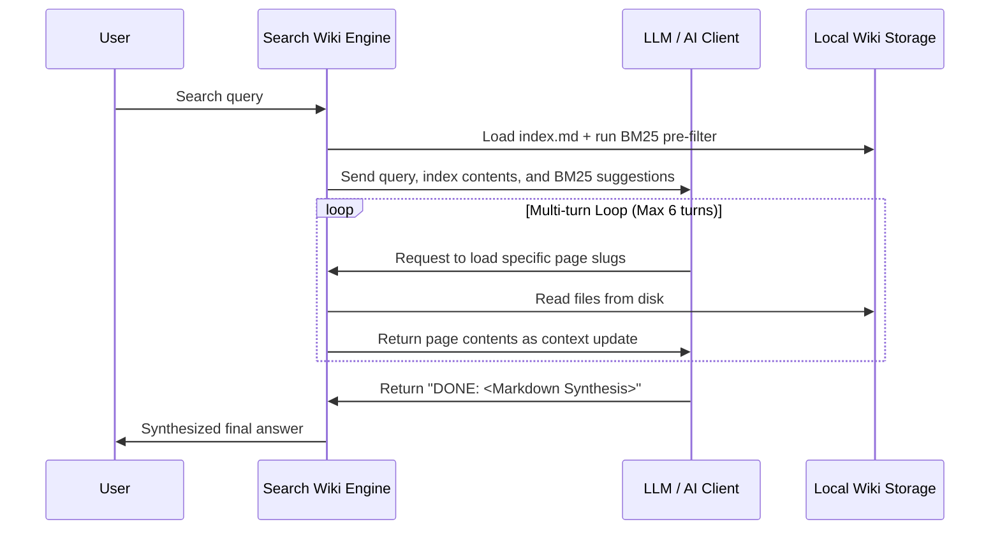

# Wiki Module Specification

The Wiki module compiles documentation and memory records into a structured, agent-navigable
LanceDB store. Page content, metadata, embeddings, cross-references, and sync history are tables in
one `index.lance/` directory; rendered Markdown is an output format, not a second store.

---

## 📂 Wiki compilation

On synchronization (`graphit sync`), the indexer pipeline scans the project's documentation tree — `knowledge.docs_dir`, which defaults to `docs` — plus the project root's README.
The set of file extensions to index is configurable via `knowledge.extensions` (comma-separated, e.g., `md,yaml,json,proto`). By default, it indexes 16 extensions covering markdown, structured data, schema, and spec formats.

It compiles these files into a wiki in the global brand directory —
`~/.graphit/wiki/knowledge/project/<project-id>/` — which is the one place every wiki
tool opens for that project. A versioned Hub knowledge artifact is mounted directly from its
`s3://` prefix and is not downloaded or recompiled by the consumer. Nothing is written into the project; see
[Storage Layout](../architecture/storage_layout.md):

- **`index.lance/`**: the complete queryable artifact.
- **Virtual `index.md` and `log.md` views**: rendered from the `chunks` and `sync_log` tables when
  a caller requests or exports them; they are not persisted beside the store.
- **Wikilink Parsing**:
  The indexer parses legacy Obsidian-style double-bracket page references.
  It registers references as edges in a temporary graph to analyze connections.

### Indexed Scope

The walk is scoped, but the paths it reports are not. `knowledge.WikiScope` names
what under the root is read; the root itself stays the **project directory**, so
every `source` path stored in the table is relative to the project root.

```go
type WikiScope struct {
    Subdir     string   // the only directory walked; "" or "." walks everything
    ExtraFiles []string // single documents outside Subdir, relative to the root
}

func ScopeFor(projectDir string, inlineCfg, projectCfg config.ConfigMap) WikiScope
```

A scope names **one** tree. It briefly also carried a whitelist of sibling directories,
for a single caller: the live search compiling the several documentation sets a user had
selected into one wiki. That compile no longer exists — a knowledge context now arrives
already compiled and is read where it was installed — so the whitelist went with it. See
Graphit Task `tsk-976ef4e8973d` records why live search sessions own no store.

`ScopeFor` assembles it from configuration: `Subdir` is `knowledge.docs_dir`, and
`ExtraFiles` holds the root README unless `knowledge.include_readme` is `false`.

| Key | Effect | Default |
|---|---|---|
| `knowledge.docs_dir` | the directory walked; `.` walks the whole project | `docs` |
| `knowledge.include_readme` | whether the root README is indexed on top of it | `true` |

Why the root is the project and not the docs directory — the alternative was tried
and is wrong in two ways:

- **Paths would not resolve.** Handing `docs/` in as the root reports a spec as
  `specs/config_module.md`, a path relative to nowhere the reader is standing.
- **Ignore files would silently stop working.** `.gitignore` and `.wikiignore` are
  collected upward and each is scoped to its own directory, relative to the root.
  With `docs/` as the root, the project's own `.gitignore` and `.wikiignore` sit one
  level *above* it, `domainForFile` gives them the domain `..`, and every pattern in
  them matches nothing — so a project with a custom `docs_dir` had its root ignore
  files silently inert.

Collection therefore starts at the **docs tree** while resolving against the
**project** (`NewKnowledgeIgnoreCheckerIn`). That combination is what makes both
levels work at once: a root-level pattern applies from the root, and a
`.wikiignore` kept inside the docs tree applies within the docs tree. Passing the
project as the start directory as well would have read only the root one. The source tree is
enumerated and hashed on sync. `FastPathCheck` compares the resulting slug/hash projection with the
`chunks` table, so edits, additions, deletions, and ignore-file changes cannot be hidden by a
sidecar cache.

Collection only ever walks upward, so an ignore file deeper than the docs tree —
`docs/specs/.wikiignore` — is not read. That is true of the AST side as well and
was true before this change.

A `Subdir` that does not exist is not an error: it yields no sources, and
`ExtraFiles` are still indexed. That is what makes a project with a README and no
`docs/` yet produce a one-page wiki rather than an empty one.

Documents found by the walk and named in `ExtraFiles` are de-duplicated by path,
so `knowledge.docs_dir=.` — where the walk already finds the README — indexes it
once, not twice.

### Multi-Format Rendering

The pipeline treats file types differently based on their content nature:

| File Type | Splitting | Content Rendering |
|---|---|---|
| Markdown (`.md`, `.markdown`, `.mdx`) | One row per document | Stored as authored |
| Structured data (`.yaml`, `.json`, `.graphql`, `.xml`) | One row per document | Stored as authored |
| Other formats (`.proto`, `.rst`, `.txt`, etc.) | One row per document | Stored as authored |

The document is the unit for every format. This keeps one stable slug and one row per source and
prevents empty heading fragments from entering retrieval.

### The store (`index.lance/`)

`index.lance/` is a **LanceDB** dataset directory, written and read by
`internal/wiki/store.go`. **Four** tables:

| Table | Holds |
|---|---|
| `chunks` | one row per page: canonical body, compact metadata search terms, exact tags, relevance flags, and embedding columns |
| `xrefs` | cross-references, as `source_slug` → `target_slug` |
| `sync_log` | the sync timeline; readers return at most the configured recent window |
| `meta` | maintenance timestamps and store metadata |

**There is no `chunk_emb`, and its absence is the design.** The embedding is a column of the
chunk, so deleting the chunk deletes its vector and the class of bug where a stale vector answers
for a page that no longer exists cannot be expressed. The old shape had a second table plus a
`vec0` index whose rowid *was* `chunks.id` — three places for one fact to be in, and two of them
able to disagree.

The indexes are inside the directory and DO travel, which is the other change: a published wiki is
copied rather than converted, and the consumer neither rebuilds nor downloads it.

It was a LadybugDB store for three days in 2026-08-16..19, and a SQLite one until 2026-08-23. What
brought it out of the graph engine is that liblbug does not maintain a full-text index on insert,
so every write had to drop and recreate all seven — see
[Storage Layout](../architecture/storage_layout.md).

Four things about the shape are worth knowing:

**Cross-references are rows, not edges.** A wiki link may point at a page that does not exist — a
reference written before its target, or a page since deleted. Anything requiring both
endpoints would silently drop exactly the dangling links a docs lint exists to report. `FindXRefs`
walks them in Go, with a visited set. This has now survived a round trip through TWO storage
engines unchanged, which is the best evidence the reasoning was about the data and not the storage.

**`Sync` is row-incremental.** It compares the desired corpus with the current table by slug,
deletes only rows that disappeared, and upserts only rows whose compiled value changed. An
unchanged row keeps its embedding. Cross-reference sources are updated by the same delta rule.
New rows are folded into existing indexes, and compaction/version pruning run on a maintenance
schedule rather than on every sync.

**Body is stored once.** Full-text indexes target `body` and `search_terms` separately. The latter
contains title, slug, summary, breadcrumb, type, tags, and their grams, but never repeats the body.
Queries run once per column and deterministic reciprocal-rank fusion combines the two rankings. Tags
are persisted as authored producer metadata and are consumed by page, export, and UI readers rather
than reconstructed later.

**The sync log is append-only history.** Incremental writes never drop it; catalogue and export
surfaces read its newest entries directly from the table.

**A vector index needs 256 rows to train.** Below that floor it is skipped and semantic search
answers by scanning. A wiki with fewer than 256 pages therefore has no vector index, and that is
correct rather than broken.

### A published wiki is read where it lives

A knowledge artifact is **mounted**, not downloaded: the engine queries the objects on S3 and no
page file is ever transferred. Two consequences that surprise:

- **the page text comes from the index**, because there is no `.md` on disk. It is the same text —
  the wiki compiles one chunk per document, so `chunks.body` is the page rather than a slice of it;
- **a read must not go through a write path.** `EnsureTable` creates, and creating is refused on a
  published store, so a mounted wiki once answered every query with "read-only". A mounted
  artifact's tables exist by definition; they are OPENED.

The authoritative URI is below
`v2/projects/<publisher-ulid>/artifacts/knowledge/<artifact-id>/<version>/index.lance/`.
The project lockfile selects the artifact and version, but it does not prove current permission.
Graphit revalidates the subject's project grant before creating or reopening the mount; an
authorization-backend failure fails closed rather than using cached discovery state.

A **memory** wiki is deliberately never published as a versioned knowledge artifact. Its source
table is read-and-write and multi-writer; each machine compiles the local query projection for the
scope it uses. The distinction is mutability, not file format.

### Staleness Tracking

The previous source/path/hash projection is derived from the current `chunks` rows; no manifest
sidecar exists. When a source file changes, the corresponding row is marked through the
`stale_since` and `stale_reason` columns.
Staleness propagates transitively: if page A references page B, and B's source changes, A is also marked stale.

### Breadcrumbs & ToC

Each knowledge row carries its source path as a breadcrumb, so file and directory terms participate
in retrieval without splitting a document into synthetic child pages.

### Reading Frontmatter

Titles, summaries and content hashes are read out of a document's leading `---` block by
`internal/wiki/helpers.go`:

| Function | Returns |
|---|---|
| `FrontmatterBlock(content)` | the block's text without the delimiters; `ok=false` when the document does not open with one |
| `FrontmatterField(content, field)` | one scalar field, parsed as YAML; `ok=false` when the block is absent, does not parse, or the field is missing, null or not a scalar |
| `ReadFrontmatterField(path, field)` | the same, for a file on disk |

`FrontmatterField` returns the **scalar's literal text**, taken from a `yaml.Node` rather than
from a typed unmarshal. That is what makes quoting and escaping the parser's problem — a
single-quoted value with a doubled apostrophe, or a double-quoted one containing `\"`, arrives
as the author wrote it — while keeping YAML's type resolution out of the way, so a content hash
that happens to be all digits stays the string it was.

`ExtractTitle` and `ExtractSummary` (`internal/wiki/docutil.go`) try this first and **fall back
to a line scan** when it returns `ok=false`, so malformed or absent source frontmatter does not
make a document unreadable.

Summaries are capped at 200 characters, counted in **runes**, so a multi-byte character is
never cut in half.

---

## 🧮 Community Detection & Clustering

To help agents navigate complex, nested documentation topologies, `internal/wiki/engine.go` implements graph partitioning algorithms:

### 1. Label Propagation Algorithm (LPA)
LPA is a fast, linear-time algorithm used to cluster documents by iteratively assigning each node the label that appears most frequently among its neighbors:
- **Heuristic**: Shuffles nodes at each iteration and re-evaluates adjacent tags.
- **Termination**: Stops when no node changes its label, or when a maximum iteration limit (default 50) is reached.

### 2. Louvain Algorithm
Louvain optimizes the modularity score (a metric indicating the density of connections within communities compared to connections between communities):
- **Phase 1**: Iteratively moves nodes between communities to maximize modularity gains.
- **Phase 2**: Collapses nodes of the same community into super-nodes, forming a new hierarchical graph.
- **Assignment**: Writes a `community = <id>` property and a cohesion ratio to the graph database.

---

## 🔍 Search Engine: Lexical BM25 & Trigram Link Resolution

The Wiki search engine uses a lexical retrieval model combined with a spelling-tolerant page link resolver:

### 1. BM25 Pre-Filtering (`internal/wiki/bm25.go`)
An implementation of the Okapi BM25 TF-IDF ranking algorithm.
It calculates document relevance based on term frequency and document length normalization:
```go
score += idf * (tf * (k1 + 1)) / (tf + k1 * (1 - b + b * dl / avg_dl))
```
**Stopwords filtering**: Removes generic English articles and prepositions (e.g. *the, an, that, with*).
This lexical search runs as a pre-filtering pass when a query is received to initialize the AI discovery loop with relevant page references.

### 2. Trigram Fuzzy Link Resolution
To resolve typos or spelling discrepancies in page link requests made by the user or the LLM agent, `internal/wiki/search.go` implements trigram similarity:
- Splits words into sets of three-letter character sequences (trigrams).
- Computes the Jaccard similarity coefficient:
  ```go
  similarity = len(intersection(trigrams_A, trigrams_B)) / len(union(trigrams_A, trigrams_B))
  ```
- If the similarity coefficient is above `0.65`, the engine fuzzy-resolves the page request to the closest matching document filename.

---

## 🤖 AI-Agent Self-Discovery Loop

To find relevant answers, the `SearchWiki` function drives a multi-turn agent interaction loop (up to a maximum of 6 turns):



1. **Intake**:
   The engine initializes the context with `index.md` and the top BM25 results.
2. **Evaluation**:
   The AI client reads the context. If it needs details, it outputs a list of target page names.
3. **Execution**:
   The search engine reads the requested files from disk, appends them to the context, and invokes the AI client again.
4. **Synthesis**:
   Once the AI client has sufficient context, it responds with a synthesized Markdown document including inline page citations.
